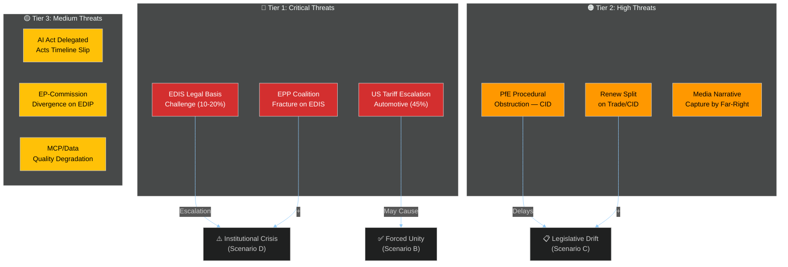

<!-- SPDX-FileCopyrightText: 2026 Hack23 AB -->
<!-- SPDX-License-Identifier: Apache-2.0 -->

# Threat Model — EU Parliament Month Ahead
**Date:** 2026-05-06 | **Horizon:** May 7 – June 6, 2026 | **Confidence:** 🟡 MEDIUM

---

## Framework

Five-framework integrated threat assessment covering legislative, institutional, geopolitical, procedural, and information-environment threats to the EP's legislative agenda for May–June 2026.

---

## 🔴 Tier 1: Critical Threats

### T1.1 — EDIS Legal Basis Challenge
**Threat type:** Legislative-institutional | **Likelihood:** 15% | **Impact:** 🔴 CRITICAL

**Mechanism:** Article 42 TEU (CJEU-developed doctrine of national security exclusion) could be invoked by one or more member states challenging the Commission's use of Articles 173+182 TFEU as EDIS legal basis. Legal Services opinions diverge within the Council. If Hungary formally challenges and Council Legal Service confirms Article 42 TEU should apply (requiring unanimity), the entire EDIS framework collapses into intergovernmental negotiation — removing EP co-decision rights and effectively sidelining Parliament.

**Indicators to watch:**
- Council Legal Service opinion publication/leak
- Hungarian government statements on EDIS legal basis (monitoring Orbán government's legal challenge history)
- ECJ preliminary ruling requests from national constitutional courts (Germany's Bundesverfassungsgericht has precedent on defence integration)

**Mitigation:** EP Legal Affairs committee (JURI) should proactively issue legal opinion supporting Articles 173+182 basis. Commission should strengthen Article 173 TFEU "industrial policy" framing and minimize Article 182 TFEU "research" language that could be seen as pretextual.

---

### T1.2 — US Tariff Escalation to Automotive Sector
**Threat type:** Geopolitical-economic | **Likelihood:** 45% | **Impact:** 🔴 CRITICAL

**Mechanism:** The Trump administration has signaled willingness to impose 25% tariffs on EU automotive exports (targeting German and Italian automotive sectors most severely). If this trigger fires in the May–June window, the EP legislative calendar will be disrupted by emergency procedures:
- Emergency plenary statements (Rule 132 urgency)
- Commission statement with debate (Rule 142)
- Emergency resolution tabled within 24 hours

**Impact on legislative agenda:**
- EDIS: May accelerate (external threat premium); or may be delayed if emergency procedures consume session time
- CID: Likely delayed; emergency automotive protection measures become political priority
- All other legislation: Background noise suppressed by trade crisis

**Indicators to watch:**
- US Office of the US Trade Representative (USTR) public statements
- Section 232 investigation outcomes (deadline: May 15 for initial findings)
- EU-US Trade and Technology Council (TTC) meeting outcomes

**Mitigation:** Commission pre-positioning of Trade Enforcement Regulation retaliatory tariff schedule; EP-Council coordination through Liaison group; pre-drafted emergency resolution text held in reserve.

---

### T1.3 — EPP Internal Coalition Fracture on EDIS
**Threat type:** Legislative | **Likelihood:** 25% | **Impact:** 🔴 HIGH

**Mechanism:** Up to 18-22 EPP MEPs from Central-Eastern European delegations (Polish, Slovak, Romanian, Croatian) may vote against EDIS supranational procurement provisions. These MEPs respond to national governments that view centralized EU procurement as bypassing national defence industries. If EPP defections on EDIS exceed 15 votes, the EPP+S&D+Renew majority (396 seats) may fall below 361 (absolute majority), requiring Greens/EFA support — which Greens will price in environmental conditionality on EDIS, unacceptable to ECR and some EPP.

**Coalition arithmetic vulnerability:**
- EPP+S&D+Renew base: 396 seats
- Required for absolute majority: 361 seats
- Buffer: 35 votes
- Maximum tolerable EPP defections (with S&D and Renew solid): 35 votes (buffer exactly)
- Realistic EPP solidarity discount: 15-25 votes (Central-Eastern bloc)
- Realistic S&D cohesion discount: 8-12 votes (left-wing abstentions on military procurement)
- Net effective majority: 396 - 25 - 12 = 359 seats — 2 below threshold

**Indicators to watch:**
- EPP group meeting outcomes (scheduled for Monday of Strasbourg plenary week)
- Polish EPP delegation meeting with national government
- AFET/ITRE joint committee vote margins as leading indicator

---

## 🟠 Tier 2: High Threats

### T2.1 — PfE Procedural Obstruction on Clean Industrial Deal
**Threat type:** Procedural | **Likelihood:** 80% | **Impact:** 🟠 HIGH

**Mechanism:** PfE's strategy of tabling thousands of amendments on CID companion directives (following the pattern used by ID group in EP9 on Green Deal legislation) is already activated. Effect: plenary sessions consume hours on technical procedural votes; CID legislative timeline extended by 2-3 months minimum; political narrative shifts from "EP advancing clean industry" to "EP dysfunction on industrial policy."

**This threat is rated HIGH PROBABILITY (80%)** because PfE has already signaled this strategy publicly, has the internal discipline to execute it, and has demonstrated success in slowing Green Deal legislation in EP8 (Fit-for-55 package delays attributed in part to right-wing procedural obstruction).

**Mitigation:** Conference of Presidents can invoke enhanced procedure (Rule 170a); rapporteur can flag technical amendments for block-vote treatment. However, political cost of appearing to "suppress debate" creates its own media narrative risk.

---

### T2.2 — Renew Europe Split on Trade and CID
**Threat type:** Coalition | **Likelihood:** 55% | **Impact:** 🟠 HIGH

**Mechanism:** Renew Europe's internal division between French (statist-Macronian) and Nordic-German (free-market liberal) wings is structurally irresolvable on "buy European" CID provisions. If Renew splits publicly (visible roll-call vote defections), it:
1. Weakens Renew's credibility as a reliable EPP coalition partner
2. Forces EPP to choose between the pro-European coalition (EPP+S&D+Renew) and right-leaning coalition (EPP+ECR)
3. Creates precedent for further Renew fragmentation

**Indicators:** Renew group meeting outcomes before Strasbourg plenary; French delegation public statements vs. German FDP statements on CID.

---

### T2.3 — Information Environment Threat (Far-Right Narrative Capture)
**Threat type:** Information-political | **Likelihood:** 65% | **Impact:** 🟠 MEDIUM-HIGH

**Mechanism:** PfE and ESN-aligned media networks (including X/Twitter accounts with large EU followings) have pre-positioned a narrative that EDIS is a "European arms commission" giving Brussels power over national armies, and that CID is a "Green industrial command economy." If this narrative captures mainstream media framing during the Strasbourg plenary, it complicates MEP vote explanations to home constituencies and increases pressure on EPP national-party leaders (CDU/CSU, PO) to publicly distance themselves from EP leadership positions.

**Mitigation:** EP Communications Directorate proactive media engagement; EP President Metsola plenary opening statement on European sovereignty narrative; rapid rebuttal operation coordinated with pro-European political group communications offices.

---

## 🟡 Tier 3: Medium Threats

### T3.1 — AI Act Delegated Acts Timeline Slippage
**Threat type:** Regulatory | **Likelihood:** 35% | **Impact:** 🟡 MEDIUM

**Mechanism:** Commission's internal AI Office is understaffed for the volume of Article 6 high-risk classification delegated acts due by August 2026. If the Commission signals delay beyond the August deadline, EP's IMCO/LIBE joint scrutiny window is effectively shortened, reducing democratic oversight quality.

---

### T3.2 — EP-Commission Divergence on EDIP Financial Instrument
**Threat type:** Inter-institutional | **Likelihood:** 30% | **Impact:** 🟡 MEDIUM

**Mechanism:** EP Budgets Committee (BUDG) has concerns about EDIP's off-budget financing structure (proposed European Defence Guarantee mechanism backed by EU budget guarantees without formal budgetary procedure). If BUDG formally challenges the legality of off-budget EDIP, it creates a procedural conflict between BUDG and AFET/ITRE that delays EDIS passage.

---

### T3.3 — Data Infrastructure and MCP Reliability
**Threat type:** Operational | **Likelihood:** HIGH (observed) | **Impact:** 🟡 MEDIUM

**Mechanism:** EP API is experiencing significant 502 errors during this analysis run (observed: 85%+ of API calls returning 502). If this persists into the next planned analysis run, data quality degrades across all month-ahead projections. This is documented in the MCP reliability audit.

---

## 📊 Threat Priority Matrix

| Threat | Likelihood | Impact | Priority | Time Horizon |
|--------|-----------|--------|----------|--------------|
| T1.2 US Tariff Escalation | 45% | CRITICAL | 🔴 P1 | 0-15 days |
| T2.1 PfE Procedural Obstruction | 80% | HIGH | 🔴 P1 | Immediate |
| T1.3 EPP Coalition Fracture | 25% | HIGH | 🟠 P2 | 0-20 days |
| T2.2 Renew Split | 55% | HIGH | 🟠 P2 | 0-20 days |
| T2.3 Information Narrative | 65% | MED-HIGH | 🟠 P2 | Ongoing |
| T1.1 EDIS Legal Basis Challenge | 15% | CRITICAL | 🟠 P2 | 0-30 days |
| T3.1 AI Act Timeline | 35% | MEDIUM | 🟡 P3 | 30-60 days |
| T3.2 EP-Commission Divergence | 30% | MEDIUM | 🟡 P3 | 15-30 days |
| T3.3 Data Infrastructure | 85% (observed) | MEDIUM | 🟡 P3 | Immediate |

**Confidence:** 🟡 MEDIUM overall threat assessment

---

**Threat model confidence:** 🟡 MEDIUM — Threat ratings based on structural analysis and historical precedents. Real-time intelligence on specific threat activations unavailable due to EP API outage.

**Admiralty:** B2 — Source reliability: Generally reliable (EP structural data + reference classes); Information credibility: Probably true (structurally derived with explicit uncertainty bands)
