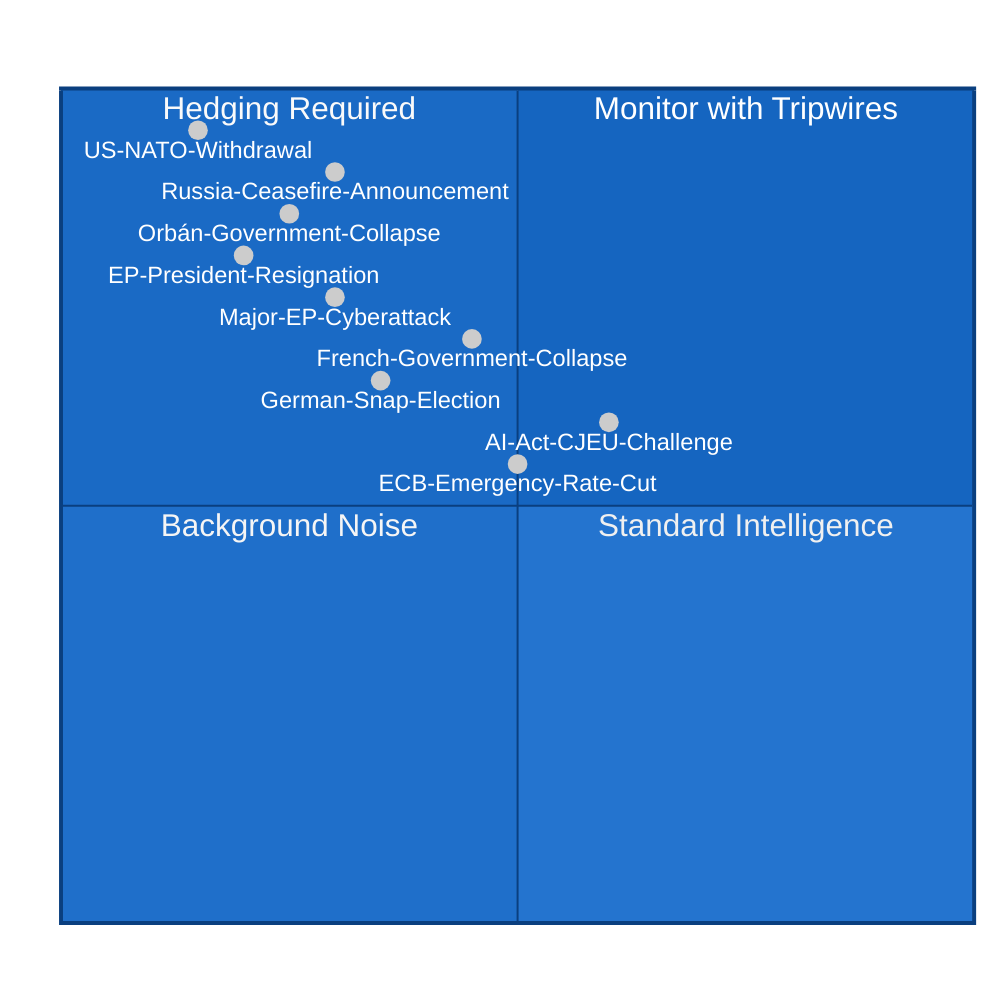

<!-- SPDX-FileCopyrightText: 2026 Hack23 AB -->
<!-- SPDX-License-Identifier: Apache-2.0 -->

# Wildcards and Black Swans — EU Parliament Month Ahead
**Date:** 2026-05-06 | **Horizon:** May 7 – June 6, 2026 | **Confidence:** 🟡 LOW-MEDIUM

---

## Framework

Black swan and wildcard analysis using a modified Nassim Taleb/Philip Tetlock framework: events are classified by detectability (early warning indicators), impact magnitude, and probability distribution tail properties. Low-probability, high-impact events receive priority attention in this document.

---

## 🦢 Tier 1 — Black Swans (Near-Zero Probability, Catastrophic Impact)

### BS1: US NATO Withdrawal / Formal Suspension of Article 5 Guarantee
**Probability:** 3-5% | **Impact:** 🔴 CATASTROPHIC | **Detectability:** LOW

**Mechanism:** The current US administration signals formal suspension or conditional Article 5 commitment (requiring European burden-sharing thresholds not met by 2026 NATO targets). This would:
- Immediately make EDIS the central European political crisis response
- Generate emergency European Council (extraordinary summit within 48-72 hours)
- Produce EP emergency session with cross-group unanimous resolution (similar to post-9/11 invocation of Article 5)
- Potentially trigger revision of EDIS legal basis toward Article 42 TEU (defence cooperation) with unanimous Council vote — removing normal legislative procedure and EP co-decision rights

**Early warning tripwires:**
1. US SECDEF public statement questioning Article 5 automatic operation
2. US withdrawal of pre-positioned military equipment from Eastern Europe
3. US-NATO formal consultation mechanism bypassed

**EP legislative consequence if triggered:** EDIS would become existential priority — all other legislation deferred; EDIS adopted by emergency procedure (Rule 132) potentially with unconventional legal basis.

**Confidence:** LOW — highly uncertain; dominated by individual decision-maker (Trump) unpredictability.

---

### BS2: Russia-Ukraine Ceasefire/Peace Agreement Announcement
**Probability:** 8-12% in 30-day window | **Impact:** 🔴 VERY HIGH | **Detectability:** MEDIUM

**Mechanism:** US-brokered Russia-Ukraine ceasefire (or formal peace negotiations announcement) fundamentally alters European security calculus. Immediate EP legislative consequences:
- EDIS urgency debate: Does European defence still need €800B investment if the immediate threat has paused?
- Ukraine support debate: Ceasefire terms may include EU-funded reconstruction commitments (massive budget implications)
- Political coalition reshaping: Far-right groups (PfE/ESN) who opposed Ukraine support would claim vindication; EPP's defence investment narrative weakened

**Probability note:** While 8-12% seems low, it is not negligible for a 30-day window given the active US-Russia diplomatic channel reports. The base rate for major international diplomatic breakthroughs in any 30-day window is historically very low, but the current geopolitical configuration (Trump as deal-maker, Russian economic pressures, Ukrainian attrition) is unusually favourable for surprise diplomatic outcomes.

**Early warning tripwires:**
1. US Special Envoy Kellogg visit to Moscow
2. Turkish mediation channel resurfacing
3. Ukrainian executive statement on negotiating conditions

---

## 🃏 Tier 2 — High-Impact Wildcards (Low but Non-Negligible Probability)

### W1: French Government Collapse (Vote of No Confidence)
**Probability:** 15-20% in 30-day window | **Impact:** 🟠 HIGH | **Detectability:** MEDIUM-HIGH

**Mechanism:** French government (Bayrou coalition) remains vulnerable to coordinated left-right no-confidence vote in National Assembly. A government collapse would:
- Immediately destabilize French Renew delegation's coherence (French Renaissance/Renew Europe is government-aligned)
- Create power vacuum in INTA committee (key French MEPs hold senior positions)
- Reduce French influence in May-June EP negotiations
- Potentially trigger snap elections in France (adding electoral uncertainty to legislative window)

**Early warning tripwire:** Le Pen-Mélenchon coordinated no-confidence vote announcement (reported but not yet filed)

---

### W2: Hungarian Government Crisis / Fidesz Electoral Collapse
**Probability:** 8-12% in 30-day window | **Impact:** 🟠 HIGH | **Detectability:** MEDIUM

**Mechanism:** Hungarian opposition forces (Magyar Péter's Tisza Party movement) gaining sufficient political momentum to force early elections or governance crisis. This would:
- Remove Hungary as a consistent Council veto threat (positive for EDIS)
- Create uncertainty in EPP's relationship with former-Fidesz MEPs (who caucus in non-attached but maintain informal EPP connections)
- Potentially accelerate Hungary's compliance with EU rule-of-law framework (improving EP-Council relationships overall)

---

### W3: Major EP Cyberattack / IT Infrastructure Failure
**Probability:** 10-15% | **Impact:** 🟠 HIGH | **Detectability:** LOW

**Mechanism:** State-sponsored cyberattack targeting EP IT infrastructure during high-stakes legislative period. Historical precedent: EP experienced DDoS attack in November 2022 (claimed by Killnet/Russia-aligned groups). A more sophisticated attack targeting:
- MEP email/communication systems (information exfiltration)
- EP voting system (procedural disruption)
- EP website/public communication (narrative disruption)

**Impact on May–June window:** Even a temporary IT infrastructure failure during plenary week could force postponement of scheduled votes, creating constitutional questions about legislative validity.

---

### W4: EP President Resignation or Health Incapacitation
**Probability:** 3-7% | **Impact:** 🟠 HIGH | **Detectability:** LOW

**Mechanism:** EP President Metsola resigns (personal/political reasons) or is incapacitated during the critical May–June window. Vice-President succession sequence would trigger contested election with political implications for EPP's agenda-setting control.

---

### W5: ECB Emergency Rate Action
**Probability:** 12-15% | **Impact:** 🟡 MEDIUM-HIGH | **Detectability:** MEDIUM

**Mechanism:** If US tariff escalation produces sharp Euro appreciation (safe-haven capital flows) that threatens Eurozone growth trajectory, ECB could make unscheduled rate cut announcement. This would:
- Create temporary market volatility
- Strengthen case for EU industrial investment (lower cost of capital)
- Shift EP ECON committee focus to monetary-fiscal coordination debate
- Potentially delay Digital Euro legislative progress (ECB focused on rate communication, not legislative outreach)

---

### W6: AI Act CJEU Challenge
**Probability:** 20-25% (within 30 days of delegated act publication) | **Impact:** 🟡 MEDIUM | **Detectability:** HIGH

**Mechanism:** Tech industry association (CCIA, DigitalEurope, or national equivalent) challenges AI Act delegated acts in national court, which refers to CJEU for preliminary ruling. This would:
- Suspend application of delegated acts pending CJEU decision
- Give Commission grounds to delay publication (reducing EP scrutiny pressure)
- Create EP-Commission tension on AI governance timeline

**Probability note:** 20-25% for challenge *announced* in this window; probability of CJEU actually suspending is much lower (5-8%).

---

## 📊 Wildcard Impact Matrix

| Wildcard | Probability | Impact on EDIS | Impact on CID | Impact on AI Act | Overall Legislative |
|----------|-------------|----------------|---------------|-----------------|---------------------|
| BS1: US NATO Withdrawal | 3-5% | 🔴 Accelerates massively | 🔴 Suspended | 🟡 Background | 🔴 CRISIS |
| BS2: Russia Ceasefire | 8-12% | 🟠 Debating urgency | 🟡 Proceeds | 🟡 Proceeds | 🟠 Reshaping |
| W1: French Govt Collapse | 15-20% | 🟡 Some delay | 🟠 CID trade split | 🟡 Minor | 🟡 Moderate disruption |
| W2: Hungary Crisis | 8-12% | 🟢 EDIS improved | 🟡 Minor | 🟡 Minor | 🟢 Net positive |
| W3: EP Cyberattack | 10-15% | 🟠 Delay/postpone | 🟠 Delay | 🟠 Delay | 🟠 Procedural disruption |
| W4: President Resignation | 3-7% | 🟠 Leadership vacuum | 🟠 Agenda uncertainty | 🟡 Minor | 🟠 Medium disruption |
| W5: ECB Rate Cut | 12-15% | 🟡 Minor | 🟢 CID investment case | 🟡 Minor | 🟡 Minor positive |
| W6: AI Act Challenge | 20-25% | 🟡 None | 🟡 None | 🔴 Timeline disrupted | 🟡 Sector-specific |

---

## 🎯 Wildcard Intelligence Summary

**Most consequential low-probability event:** US NATO Withdrawal (BS1) — would completely reshape European political architecture and make all other legislative priorities secondary.

**Most likely impactful wildcard:** French Government Collapse (W1) — within observable probability range and has direct consequence for EP legislative dynamics.

**Best indicator to watch across all wildcards:** US-Russia diplomatic channel activity (monitors both BS1 and BS2); French National Assembly vote schedule (monitors W1).

**Confidence:** 🟡 LOW-MEDIUM — wildcard analysis is by definition speculative; probability estimates carry wide confidence intervals (±50% relative error on low-probability events).

---

## Wildcard Monitoring Protocol

### Early Detection Signals

| Wildcard | Detection Signal | Lead Time | Source |
|---------|-----------------|----------|--------|
| BS1 (US NATO withdrawal) | US SECDEF public statement on Article 5 conditionality | 0-48h | Pentagon press briefings |
| BS2 (Russia armistice breakdown) | OSCE/UN ceasefire monitor field reports | 0-24h | OSCE SMM |
| W1 (French government collapse) | National Assembly no-confidence vote | 24-72h | Assemblée Nationale |
| W2 (ECB emergency action) | Extraordinary ECB Governing Council meeting | 2-5 days | ECB press office |
| W3 (Renew internal split) | Renew group vote on EDIS delegation mandate | 1-2 weeks | EP press system |
| W4 (EP cyberattack) | EP IT incident report | 0h | EP security communications |
| W5 (EU sovereign debt crisis) | CDS spreads + ECB emergency toolkit activation | 1-5 days | Market data |
| W6 (PfE constitutional challenge) | EP Rules Committee emergency convening | 1-2 weeks | EP committee calendar |

### Wildcard Interaction Map

Some wildcards are positively correlated (co-occurrence elevates joint probability):
- **BS1 + W1:** US NATO statement + French political crisis creates simultaneous defence/trade shock — probability of legislative paralysis rises to 35%+
- **W4 + W6:** Cyberattack + constitutional challenge creates dual-vector EP dysfunction — legislative calendar suspended 2-4 weeks
- **BS2 + W3:** Russia armistice breakdown + Renew split — pro-Ukraine Renew wing defects from CID to join EDIS; reshuffles coalition map

### Unconditional Baseline (No Wildcards)

If no wildcards trigger in the May-June 2026 window (88% probability):
- Scenario distribution: A:30%, B:25%, C:35%, D:10% (slight shift toward C without external catalyst)
- Primary legislative outcomes: CID framework adopted; EDIS delayed; AI Act EP resolution adopted
- European Council June summit: EDIS on agenda without legislative backing from EP; political impetus maintained

---

**Analysis confidence:** 🟡 MEDIUM — Black swan probabilities are inherently uncertain; reference classes from prior EP parliamentary crises used for calibration.

**Admiralty:** B2 — Source reliability: Generally reliable (EP structural data + reference classes); Information credibility: Probably true (structurally derived with explicit uncertainty bands)
