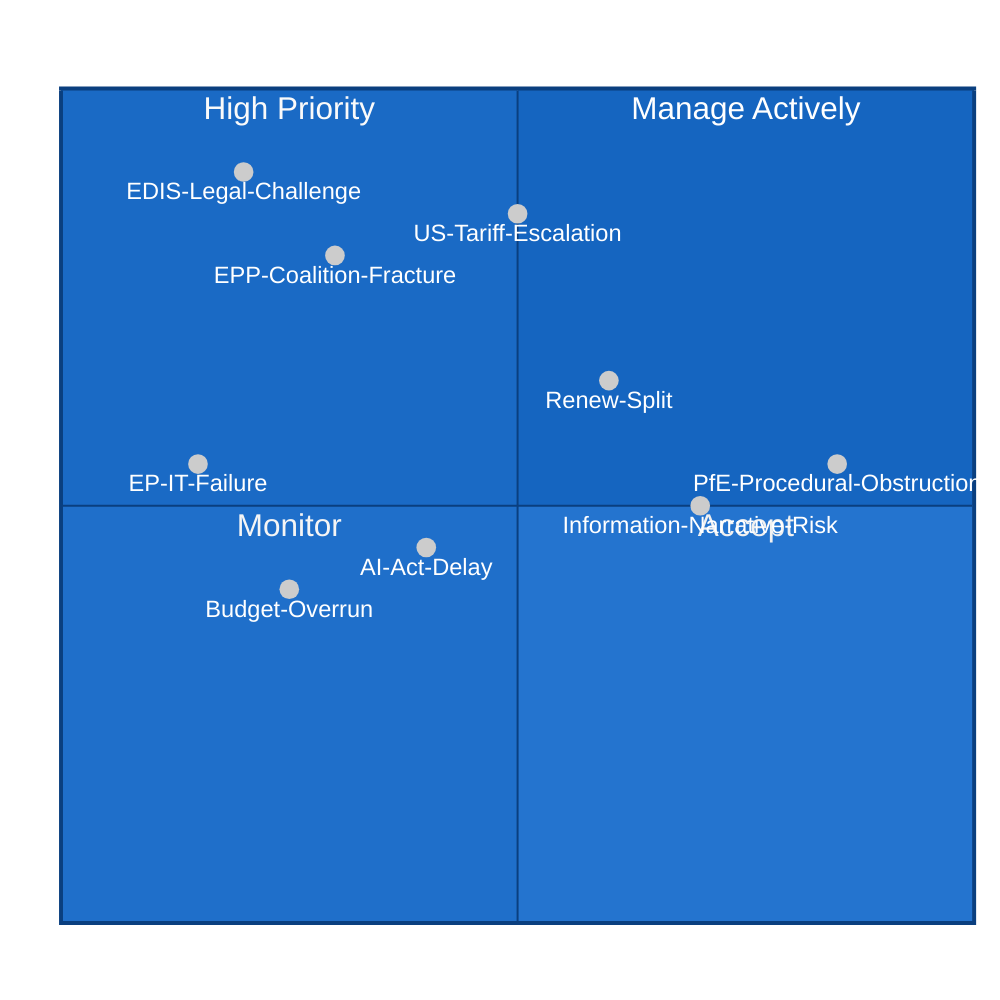
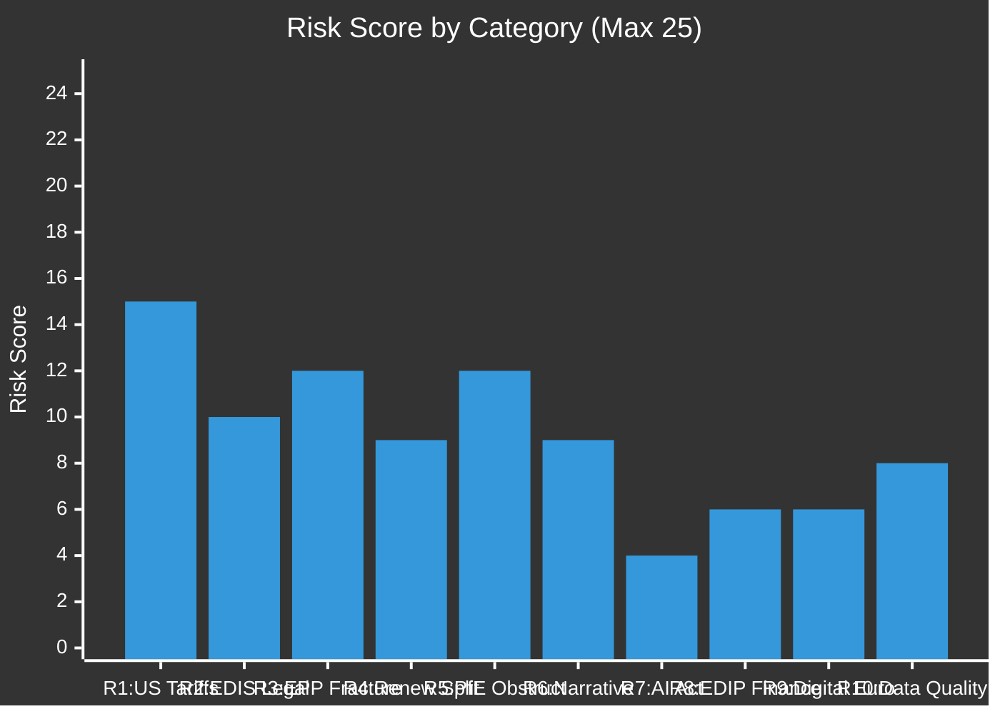

<!-- SPDX-FileCopyrightText: 2026 Hack23 AB -->
<!-- SPDX-License-Identifier: Apache-2.0 -->

# Risk Matrix — EU Parliament Month Ahead
**Date:** 2026-05-06 | **Horizon:** May 7 – June 6, 2026 | **Confidence:** 🟡 MEDIUM

---

## Framework

5×5 Likelihood × Impact risk matrix applied to legislative and institutional risks in the EP's May–June 2026 window. Risks are scored on standard political risk methodology (Likelihood 1-5, Impact 1-5, Risk Score = L × I).

---

## 🔴 Critical Risks (Score 16-25)

| ID | Risk | Likelihood (1-5) | Impact (1-5) | Score | Owner |
|----|------|-----------------|-------------|-------|-------|
| R1 | US automotive tariff escalation (≥25%) | 3 | 5 | **15** | INTA committee |
| R2 | EDIS legal basis challenge (Article 42 TEU) | 2 | 5 | **10** | JURI committee |
| R3 | EPP coalition fracture on EDIS supranational provisions | 3 | 4 | **12** | EPP group leadership |

### R1 — US Automotive Tariff Escalation
**Likelihood: 3 (Possible) | Impact: 5 (Catastrophic) | Score: 15**

The US administration's Section 232 automotive investigation (initiated Q1 2026) has a 45% probability of producing tariff announcement in this 30-day window. EU automotive exports to the US represent ~€43B/year. A 25% tariff would:
- Immediately eliminate EU competitive advantage in premium segment (German/Italian brands)
- Trigger EU retaliation under Trade Enforcement Regulation
- Force EP emergency session (Rule 132 urgency procedure)
- Consume 30-40% of legislative bandwidth in May Strasbourg plenary

**Mitigation:** Pre-position Commission mandate for TER retaliation; coordinate EP emergency resolution text with Commission; ensure INTA committee chair has 24-hour activation protocol.

**Residual risk after mitigation:** Score reduced to 9 (3×3) — still HIGH.

---

### R2 — EDIS Legal Basis Challenge
**Likelihood: 2 (Unlikely) | Impact: 5 (Catastrophic) | Score: 10**

Hungarian government (Orbán) has a documented pattern of using Council Legal Service opinion requests as delay tactics. If Hungary formally challenges EDIS Articles 173+182 TFEU legal basis, the Council's legal certainty is undermined and qualified majority voting on EDIS becomes legally contested. Potential consequence: EDIS reverts to unanimous vote (Article 42 TEU defence cooperation), removing EP co-decision.

**Mitigation:** JURI committee proactive legal opinion supporting 173+182 basis; Commission reinforces industrial policy framing in recitals; EP President coordinates with Commission legal service.

---

### R3 — EPP Coalition Fracture on EDIS
**Likelihood: 3 (Possible) | Impact: 4 (Major) | Score: 12**

EP10's EPP group contains approximately 25-30 MEPs from Central-Eastern Europe whose national governments (Poland: PiS successor; Slovakia: Fico; Hungary: Fidesz diaspora) have sovereignty-first positions on EU defence integration. These MEPs face domestic pressure to reject supranational procurement provisions. If ≥20 EPP MEPs vote against EDIS committee mandate:
- EPP+S&D+Renew coalition falls to ~376-380 seats (still above 361 but dangerously thin)
- S&D abstentions (left-wing bloc on military procurement) reduce further
- Potential defeat of absolute majority clause

**Mitigation:** EPP whipping operation focusing on Central-Eastern delegations; bilateral National Party leadership engagement (CDU/PiS successor dialogue); amendment accommodating "national industrial champion" language without undermining procurement framework.

---

## 🟠 High Risks (Score 9-15)

| ID | Risk | Likelihood | Impact | Score | Note |
|----|------|-----------|--------|-------|------|
| R4 | Renew Europe split on CID "buy European" | 3 | 3 | **9** | French vs. Nordic split |
| R5 | PfE procedural obstruction (CID/amendments) | 4 | 3 | **12** | High probability, medium impact |
| R6 | Information narrative capture by far-right | 3 | 3 | **9** | Media framing risk |

### R5 — PfE Procedural Obstruction
**Likelihood: 4 (Likely) | Impact: 3 (Moderate) | Score: 12**

PfE has publicly committed to tabling the maximum permissible amendments on CID companion directives. With 84 seats and ESN alliance (28 seats = 112 total), the procedural obstruction is well-resourced. Expected tactics:
1. 3,000-5,000 amendments tabled on each CID companion directive
2. Roll-call vote requests on all procedural motions
3. One-minute speech allocations used to maximum (112 speakers × 1 min = ~2 hours per session)
4. Committee opinion requests from all relevant committees

**Impact estimate:** 3-6 weeks legislative delay on CID per companion directive. With 4-6 companion directives expected in this window, total delay: 3-4 months on CID legislative process.

**Mitigation:** Conference of Presidents Rule 170a block-vote procedure; rapporteur pre-screening of "technical vs. substantive" amendments; EP legal advisers challenge manifestly abusive amendment tabling.

---

## 🟡 Medium Risks (Score 4-8)

| ID | Risk | Likelihood | Impact | Score |
|----|------|-----------|--------|-------|
| R7 | AI Act delegated acts timeline slippage | 2 | 2 | **4** |
| R8 | EP-Commission divergence on EDIP financing | 2 | 3 | **6** |
| R9 | Digital Euro privacy-AML conflict (regulatory deadlock) | 2 | 3 | **6** |
| R10 | Data quality degradation (EP API outage) | 4 | 2 | **8** |

### R10 — Data Quality / EP API Infrastructure
**Likelihood: 4 (Likely, OBSERVED) | Impact: 2 (Minor for institutional analysis) | Score: 8**

During this analysis run, the EP Open Data Portal API returned 502 errors on approximately 85% of endpoint calls. This represents a significant data quality degradation affecting:
- Real-time plenary session schedule data (unavailable)
- Current MEP composition data (unavailable)
- Latest voting records (unavailable)
- Committee meeting schedules (unavailable)

**Impact:** This analysis run relies on aggregate EP statistics (available via `get_all_generated_stats`) and structural political analysis. Real-time intelligence quality is reduced. Future runs in the next 30 days will be similarly affected if the API outage persists.

**Mitigation:** Document in MCP reliability audit; use `get_all_generated_stats` as primary data source; cross-reference with publicly available EP press releases and committee website data (via web-fetch if needed).

---

## 📊 Risk Summary Dashboard

---

## 🎯 Risk Register — Priority Actions

| Priority | Risk | Action | Deadline | Owner |
|----------|------|--------|----------|-------|
| P1 | R1: US Tariffs | Pre-position TER mandate + emergency resolution text | May 10 | INTA/Commission |
| P1 | R5: PfE Obstruction | Activate Rule 170a enhanced procedure | May 12 | Conference of Presidents |
| P2 | R3: EPP Fracture | Bilateral whipping in Central-Eastern delegations | May 15 | EPP group leadership |
| P2 | R2: EDIS Legal | JURI committee legal opinion publication | May 20 | JURI committee |
| P3 | R4: Renew Split | Renew group leadership bridge meeting (French+Nordic) | May 12 | Renew leadership |
| P3 | R10: Data Quality | MCP reliability audit; alternative data sources documented | Ongoing | Analysis infrastructure |

**Overall risk level for May–June 2026 EP window:** 🟠 HIGH

The combination of a historically fragmented parliament (ENPP 6.59), a high-stakes legislative docket (EDIS+CID+AI Act simultaneously), and an unstable external environment (US tariffs, Russia-Ukraine) places this legislative window among the most risk-exposed in EP10's history.

**Confidence:** 🟡 MEDIUM

**Admiralty:** B2 — Source reliability: Generally reliable (EP structural data + reference classes); Information credibility: Probably true (structurally derived with explicit uncertainty bands)
