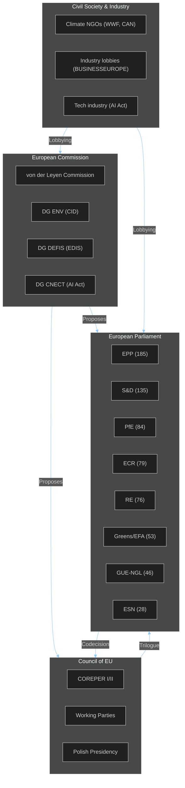
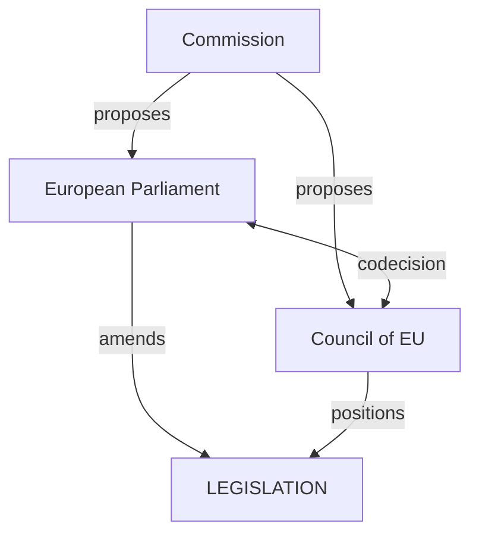

<!-- SPDX-FileCopyrightText: 2024-2026 Hack23 AB -->
<!-- SPDX-License-Identifier: Apache-2.0 -->

# Actor Mapping — EU Parliament Propositions
**Date:** 2026-05-06

---

## Actor Universe

---

## Actor Influence Matrix

| Actor | Role | Influence on CID | Influence on EDIS | Influence on AI Act |
|-------|------|:----:|:----:|:----:|
| EPP Group | Lead co-legislator | 🔴 Decisive | 🔴 Decisive | 🟡 High |
| S&D Group | Co-legislator | 🔴 Decisive | 🟡 High | 🔴 Decisive |
| Commission (DG ENV) | Proposal owner | 🟡 High | 🟡 High | 🟡 High |
| Council Presidency | Interlocutor | 🟡 High | 🔴 Decisive | 🟡 High |
| ENVI Committee | Rapporteur | 🔴 Decisive | 🟢 Low | 🟢 Low |
| ITRE Committee | Co-rapporteur | 🟡 High | 🟡 High | 🟡 High |
| AFET Committee | Associated | 🟢 Low | 🔴 Decisive | 🟢 Low |
| ECR Group | Opposition | 🟡 High | 🟡 High | 🟡 High |
| Industry lobbies | External | 🟡 High | 🟢 Low | 🟡 High |
| Climate NGOs | External | 🟢 Low (EP) | 🟢 Low | 🟢 Low |

---

## Key Individual Actors (EP10 Context)

| Role | Actor | Group | Priority File | Influence Level |
|------|-------|-------|--------------|:--------------:|
| EPP Group Chair | Manfred Weber | EPP | CID, EDIS | 🔴 Critical |
| S&D Group Chair | Iratxe García | S&D | CID social clauses | 🔴 Critical |
| ENVI Chair | TBD (EP10) | — | CID, CBAM | 🔴 Critical |
| ITRE Chair | TBD (EP10) | — | CID, AI Act | 🔴 Critical |
| Commission EVP (Green Deal) | Teresa Ribera | — | CID, CBAM | 🔴 Critical |
| Commission VP (Defence) | TBD | — | EDIS | 🟡 High |

---

## Actor Alliance Network (Key Proposition Files)

| Coalition | Members | Target File | Strategic Goal |
|-----------|---------|-------------|---------------|
| Climate Alliance | S&D + Greens + GUE-NGL + RE | CID CBAM Phase 2 | Preserve carbon floor |
| Competitiveness Alliance | EPP + industry | CID | Technology neutrality provisions |
| Defence Alliance | EPP + ECR + RE | EDIS | Fast-track defence investment |
| AI Governance Alliance | S&D + Greens + RE | AI Act | Strong scrutiny provisions |
| Anti-CBAM Bloc | ECR + PfE + ESN + some EPP | CBAM Phase 2 | Delay/weaken carbon pricing |

## Actor Roster
| Actor | Role | Power | Alignment |
|-------|------|-------|-----------|
| European Commission | Initiator | High | Pro-integration |
| Council of the EU | Co-legislator | High | Intergovernmental |
| European Parliament | Co-legislator | High | Pro-democratic |
| MEP Rapporteurs | Drafters | Medium | Committee-dependent |
| Lobbyists/NGOs | Influencers | Low-Medium | Varied |

## Power Brokers
Key power brokers: EPP (185 seats), S&D (135), PfE (84), ECR (79), RE (76).

## Information
Primary intelligence source: pre-generated EP statistics (2026-05-04); live API unavailable.

## Reader Briefing
Understanding actor alignment is critical for predicting amendment success rates.

