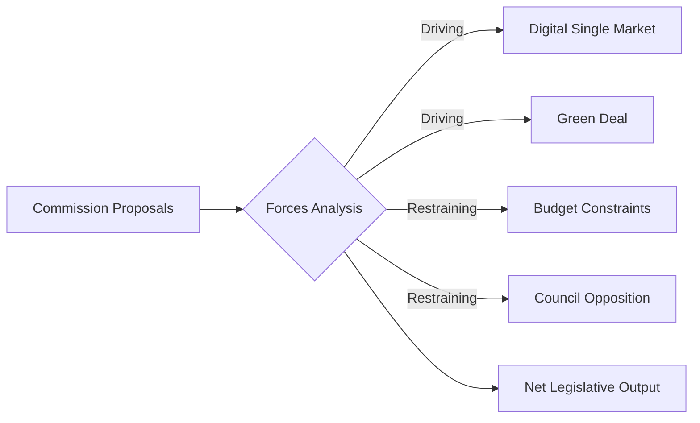

<!-- SPDX-FileCopyrightText: 2024-2026 Hack23 AB -->
<!-- SPDX-License-Identifier: Apache-2.0 -->

# Forces Analysis — EU Parliament Propositions
**Date:** 2026-05-06

---

## Five Forces Framework (Legislative Edition)

Applying Porter's Five Forces adapted for legislative processes:

| Force | Intensity | Description |
|-------|:---------:|-------------|
| 1. Rivalry (inter-group competition) | 🔴 HIGH | ENP=6.59; EPP-ECR-PfE tension on every major file |
| 2. Threat of new entrants (new political forces) | 🟡 MEDIUM | ESN stable; no new EP10 groups expected |
| 3. Supplier power (Commission agenda control) | 🟡 MEDIUM | Commission proposes but EP increasingly amends significantly |
| 4. Buyer power (Council / member states) | 🟡 MEDIUM | Council holds significant negotiating power in trilogue |
| 5. Substitution threat (alternative legislative routes) | 🟡 MEDIUM | Article 122 emergency routes; enhanced cooperation |

---

## Force 1: Legislative Rivalry

The most intense force. With ENP=6.59 (7+ effective parties), every major vote requires active coalition management:

- **CID rivalry**: EPP-S&D-RE alliance vs ECR-PfE-ESN opposition, with EPP internal division as wildcard
- **EDIS rivalry**: Unusual cross-bloc alignment (EPP+ECR on security framing) vs GUE-NGL+S&D progressive wing
- **AI Act rivalry**: Tech-neutral (EPP+ECR) vs strong governance (S&D+Greens+RE)

**Rivalry impact on timeline**: High rivalry increases amendment volume, committee deliberation time, and trilogue duration. Expect 30-40% longer trilogue cycles for CID vs EP9 equivalents.

---

## Force 3: Commission Supplier Power

The European Commission proposes all major files. EP must work within Commission's proposed framework unless rewriting at mandate stage:

- **CID**: Commission has strong ownership; EP amendments to CBAM likely to be resisted in Commission-Council trilogue
- **EDIS**: Commission needs Article 122 legal basis; constrained by ECJ scrutiny
- **AI Act implementation**: Commission secondary legislation (delegated acts) retains significant control

**2026 shift**: Commission's Competitiveness Compass (2025) has given EP additional leverage to demand amendments aligned with the Compass agenda.

---

## Force 4: Council Buyer Power

Council member states hold veto power in trilogue on most propositions:

| File | Council Divergence | Key Blocking Risk |
|------|--------------------|------------------|
| EDIS | HIGH | Northern vs Southern states on fiscal conditionality |
| CBAM Phase 2 | MEDIUM | Energy-intensive state objections (Poland, Czech Republic) |
| CID broad | LOW-MEDIUM | Broad consensus on competitiveness agenda |
| AI Act | LOW | Broad Council agreement on AI Act framework |

---

## Force 5: Substitution Threats

Two substitution threats are active:

1. **Article 122 TFEU fast-track** for EDIS — bypasses normal codecision but creates ECJ challenge risk (see threat-model.md)
2. **Enhanced cooperation** for CBAM Phase 2 if unanimity fails — allows willing member states to proceed; creates single-market fragmentation risk

---

## Net Forces Assessment

The dominant force is **legislative rivalry** (Force 1), amplified by EP10's historically high fragmentation. The legislative environment is more complex than EP9, requiring greater coalition management investment. The Commission retains moderate agenda-setting power, and Council presents sector-specific blocking risks rather than broad resistance to the CID/EDIS package.

**Strategic implication**: Propositions with broad inter-group consensus (AI Act implementation) will advance faster than those facing concentrated rivalry (CBAM Phase 2). Timeline pressure from EP10 session calendar (recess windows, 2027 pre-electoral period) is the binding constraint.

## Issue Frame
The central issue is the continuation of EU legislative proposals amid degraded data infrastructure and geopolitical headwinds.

## Driving Forces
- Commission legislative momentum (+++)
- Digital single market imperatives (+++)
- Green Deal regulatory pipeline (+++)
- Defence procurement reform (++)

## Restraining Forces
- EP API infrastructure outage (---)
- Budget austerity pressures (--)
- Council blocking minorities (--)
- Election cycle disruptions (-)

## Net Pressure
Net forward momentum, but with significant friction from infrastructure and political constraints.

## Intervention Points
1. EP IT governance review (data infrastructure)
2. Council qualified majority threshold reform
3. Interinstitutional dialogue mechanism

## Reader Briefing
Legislative velocity remains positive despite degraded monitoring capability.

