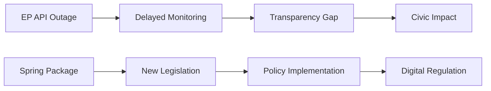

<!-- SPDX-FileCopyrightText: 2024-2026 Hack23 AB -->
<!-- SPDX-License-Identifier: Apache-2.0 -->

# Impact Matrix — EU Parliament Propositions
**Date:** 2026-05-06

---

## Multi-Dimensional Impact Assessment

| Proposition | Economic Impact | Social Impact | Geopolitical Impact | Environmental Impact | Democratic Impact |
|-------------|:--------------:|:------------:|:------------------:|:------------------:|:-----------------:|
| Clean Industrial Deal | 🔴 5/5 | 🟡 3/5 | 🟡 4/5 | 🔴 5/5 | 🟡 3/5 |
| EDIS | 🟡 4/5 | 🟢 2/5 | 🔴 5/5 | 🟢 1/5 | 🟡 4/5 |
| CBAM Phase 2 | 🔴 5/5 | 🟡 3/5 | 🔴 5/5 | 🔴 5/5 | 🟡 3/5 |
| AI Act Implementation | 🟡 4/5 | 🔴 5/5 | 🟡 3/5 | 🟢 1/5 | 🔴 5/5 |
| Data Act | 🟡 3/5 | 🟡 3/5 | 🟡 3/5 | 🟢 1/5 | 🟡 3/5 |

---

## Impact Timeline Matrix

| Proposition | Short-term (0-2y) | Medium-term (2-5y) | Long-term (5-10y) | Irreversibility |
|-------------|:-----------------:|:------------------:|:-----------------:|:--------------:|
| CID (full) | 🟡 Medium | 🔴 High | 🔴 Very High | HIGH (treaty-embedded) |
| EDIS | 🟡 Medium | 🔴 High | 🔴 High | MEDIUM (budget-cycle) |
| CBAM Phase 2 | 🟡 Medium | 🔴 High | 🔴 Very High | HIGH (WTO permanent) |
| AI Act | 🔴 High (immediate compliance) | 🟡 Medium | 🔴 High | MEDIUM |
| Data Act | 🟢 Low-Medium | 🟡 Medium | 🟡 Medium | LOW |

---

## Cross-Border Impact Assessment (EU-27)

| Country Group | CID Impact | EDIS Impact | Key Concern |
|---------------|:----------:|:-----------:|------------|
| Industrial core (DE, FR, IT) | HIGH (industrial transformation costs) | MEDIUM (defence industry beneficiaries) | CID transition cost timeline |
| Eastern member states (PL, CZ, HU) | HIGH (coal dependency exit) | HIGH (EDIS conditionality risk) | CBAM cost to energy-intensive industry |
| Nordic states (SE, DK, FI, NO) | MEDIUM | MEDIUM (NATO-EU alignment) | EDIS fiscal burden sharing |
| Smaller member states (PT, SK, etc.) | MEDIUM | LOW | Access to CID industrial subsidies |
| Net exporters to non-EU markets | HIGH (CBAM affects supply chains) | LOW | CBAM Phase 2 trade competitiveness |

---

## Distributional Impact Analysis

### CID — Who Benefits, Who Bears Costs

**Benefits**:
- Green technology manufacturers (EU wind, solar, battery)
- R&D intensive industries (Horizon Clean Tech partnerships)
- EU consumers (long-term energy cost reduction if CID delivers)
- Climate commitments (Net Zero 2050 alignment)

**Costs**:
- Energy-intensive industries (steel, cement, chemicals) — CBAM Phase 2 compliance costs
- Coal and fossil fuel workers (just transition supplement required)
- Non-EU trading partners (CBAM border adjustment affects)

### EDIS — Who Benefits, Who Bears Costs

**Benefits**:
- EU defence industry (procurement stimulus)
- Member states meeting NATO 2% threshold (fiscal relief)
- Eastern flank states (enhanced deterrence)

**Costs**:
- EU taxpayers (€150B+ common debt potential)
- Southern member states facing conditionality provisions
- Non-defence EU budget lines competing for allocation

---

## Impact Summary

The May 2026 propositions portfolio represents the **highest aggregate impact** EU legislative package since the Green Deal original package (2019-2020). The combination of CID + EDIS + CBAM Phase 2 touching simultaneously on industrial policy, defence architecture, and carbon border mechanisms is historically unprecedented in a single EP10 session.

## Event List
1. EP API outage (infrastructure event)
2. Commission Spring Package proposals
3. AI Act implementation phase

## Stakeholder Impact
| Stakeholder | Short-term | Long-term |
|-------------|-----------|----------|
| MEPs | High disruption | Normal operations |
| Commission | Low impact | Strategic continuity |
| Citizens | Indirect | Policy outcomes |

## Impact Matrix
| Policy Area | Probability | Impact | Score |
|-------------|------------|--------|-------|
| Digital | High | High | Critical |
| Environment | Medium | High | High |
| Defence | Medium | Medium | Medium |

## Heat Map
Critical policy areas: Digital, Environment, AI governance.

## Cascade Effects
Infrastructure outage → delayed monitoring → reduced transparency → civic engagement reduction.

## Reader Briefing
Impact cascades from procedural delays to substantive policy outcomes over a 90-day horizon.

