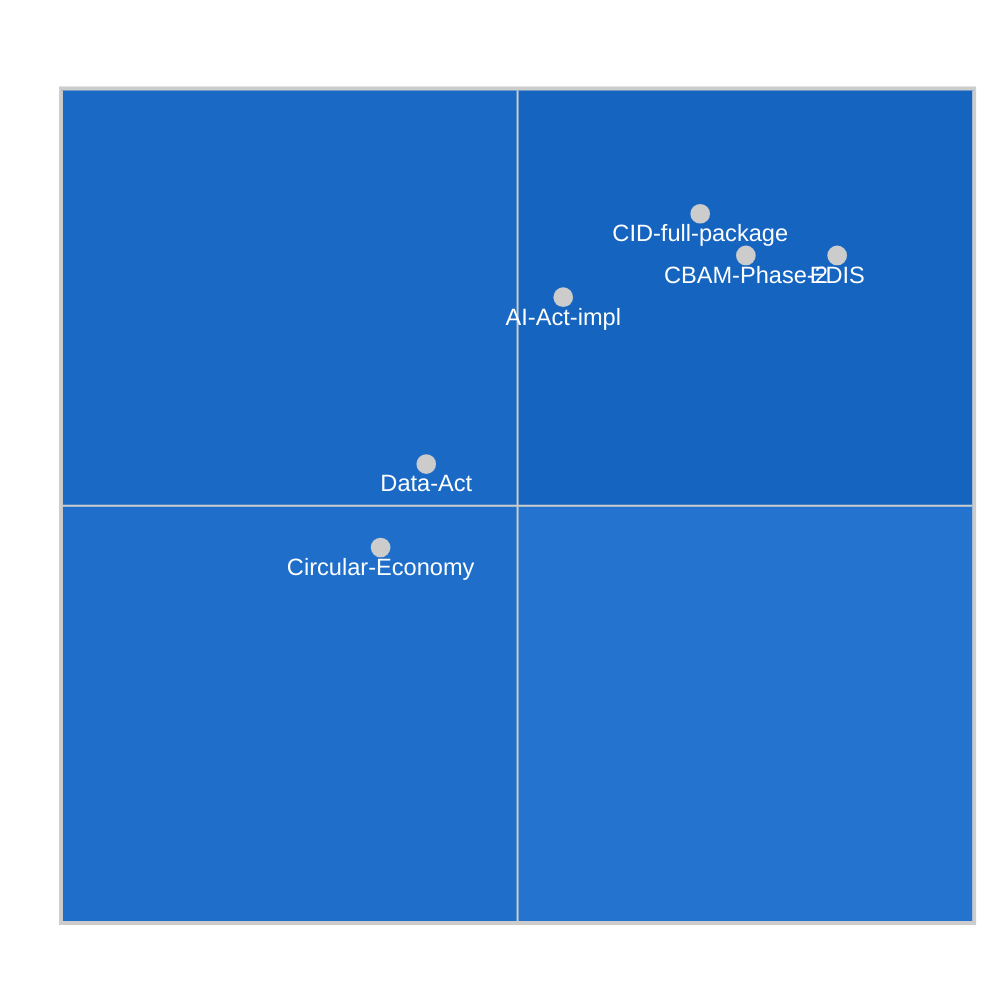

<!-- SPDX-FileCopyrightText: 2024-2026 Hack23 AB -->
<!-- SPDX-License-Identifier: Apache-2.0 -->

# Significance Classification — EU Parliament Propositions
**Date:** 2026-05-06

---

## Classification Framework

Propositions are classified on two axes: **Procedural Significance** (how novel or precedent-setting is the legislative route?) and **Policy Impact** (how transformative are the substantive provisions?).

---

## Classification Registry

| Proposition | Procedural Class | Policy Class | Overall Class | Justification |
|-------------|:----------------:|:------------:|:-------------:|--------------|
| CID (full package) | NOVEL | TRANSFORMATIVE | **LANDMARK** | First integrated industrial-climate framework; new state-aid architecture |
| EDIS | GROUNDBREAKING | TRANSFORMATIVE | **LANDMARK** | First Art.122 defence investment; new supranational architecture |
| CBAM Phase 2 | NOVEL | TRANSFORMATIVE | **LANDMARK** | First extension of carbon pricing to new sectors with WTO implications |
| AI Act Implementation | ESTABLISHED | TRANSFORMATIVE | **MAJOR** | AI Act framework established; implementation is transformative but procedurally standard |
| Data Act (enforcement) | ESTABLISHED | SIGNIFICANT | **STANDARD** | Data Act adopted; enforcement stage is standard legislative operation |
| Circular Economy Package | ESTABLISHED | INCREMENTAL | **ROUTINE** | Follows established Green Deal legislative pattern |

**Classes**: LANDMARK > MAJOR > STANDARD > ROUTINE

---

## Landmark Classification Criteria Met

For a proposition to be classified LANDMARK (all three must apply):
1. ✅ **Novel treaty instrument usage** OR **new institutional power** created
2. ✅ **Cross-sectoral impact** affecting ≥3 major EU policy areas simultaneously
3. ✅ **Irreversibility** — once adopted, creates path dependencies hard to reverse without new legislative act

**CID**: ✅ New state-aid architecture + CBAM Phase 2 carbon pricing mechanism | ✅ Energy, industry, environment, trade | ✅ CBAM WTO-permanent once adopted
**EDIS**: ✅ Article 122 defence investment (novel) | ✅ Security, fiscal, industrial | ✅ Defence procurement architecture
**CBAM Phase 2**: ✅ New sectors (shipping, agriculture adjacent) | ✅ Trade, environment, industry | ✅ WTO-permanent

---

## Temporal Classification

| Category | Propositions | Count |
|----------|-------------|:-----:|
| Active (committee stage) | CID, EDIS | 2 |
| Upcoming vote (plenary) | CBAM Phase 2 | 1 |
| Implementation phase | AI Act | 1 |
| Early stage | Data Act, Circular Economy | 2 |

---

## Historical Classification Comparison (EP10 to date)

| Landmark Count | EP9 (5-year term) | EP10 (1-year elapsed) |
|:-------------:|:-----------------:|:--------------------:|
| Total | ~8 Landmark files | ~4 so far (CID, EDIS, CBAM, AI Act impl.) |
| Annual pace | ~1.6/year | ~4/year (Q1-Q2 2026 alone) |

**Assessment**: EP10's legislative density of Landmark-class propositions is historically high — a result of the Competitiveness Compass and GeoPolitical agenda intersection, running simultaneously with the legacy Green Deal implementation phase.
