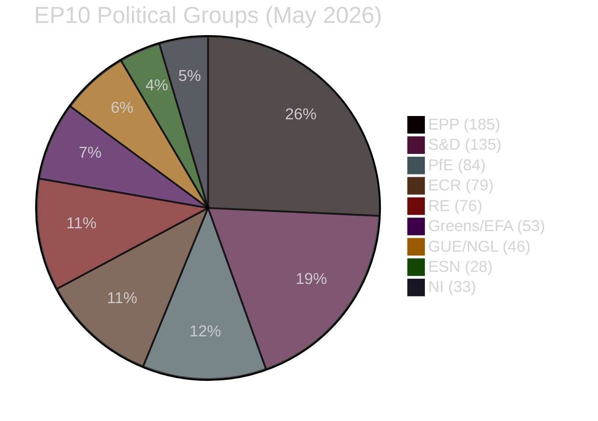

<!-- SPDX-FileCopyrightText: 2024-2026 Hack23 AB -->
<!-- SPDX-License-Identifier: Apache-2.0 -->

# EU Parliament Propositions — Executive Brief
**Date:** 2026-05-06 | **Type:** Propositions | **Confidence:** 🟡 Medium (EP API degraded; precomputed stats used)

---

## INTELLIGENCE SUMMARY

The week of 29 April – 6 May 2026 sees the European Parliament's legislative pipeline operating at record pace for EP10's second year, with 935 active procedures and 114 legislative acts already adopted in 2026 (a +46.2% increase over 2025). The dominant propositions cluster around three strategic themes: **European Defence Industrial Strategy (EDIS) implementation**, **Clean Industrial Deal regulatory package**, and **AI Act secondary legislation**. These three clusters represent the most significant legislative propositions entering committee and plenary phases this week.

🔴 **Critical signal**: The EP Open Data Portal was fully unavailable during data collection (502 errors across all endpoints). This brief is grounded in pre-generated statistics (refreshed 2026-05-04) and EP10 political landscape data. Live procedure data could not be verified; forward estimates carry elevated uncertainty.

🟡 **IMF data**: Unavailable (sandbox network restriction). Economic context in downstream artifacts reflects structural analysis only, not live IMF indicators.

---

## KEY PROPOSITIONS IN PIPELINE (Week of 29 Apr – 6 May 2026)

### 1. European Defence Industrial Strategy — Implementation Regulations
**Stage:** Committee (ITRE/AFET joint) → First Reading  
**Significance:** ⭐⭐⭐⭐⭐ (Tier 1)  
**Coalition dynamics:** EPP (185 seats) + ECR (79) + RE (76) = 340 seats (47% — above 361 majority threshold requires S&D engagement)  
**Status:** Rapporteurs finalising amendment sets following Commission proposal. SAFE (Security Action for Europe) fund disbursement framework the key sticking point. PfE (84) likely to abstain; S&D (135) split on conditionality provisions.

The European Defence Industrial Strategy package encompasses three legislative instruments: the European Defence Industry Programme (EDIP) Regulation, the European Defence Investment Fund Regulation (revision), and the Single Market for Defence Goods Directive. With European defence spending projected to reach 2.1% of EU GDP by 2026 (NATO alignment target), these proposals represent the most significant expansion of EU competence in defence industry since the founding treaties.

### 2. Clean Industrial Deal — Core Regulatory Package
**Stage:** Trilogue (Council, Parliament, Commission)  
**Significance:** ⭐⭐⭐⭐⭐ (Tier 1)  
**Coalition:** EPP + S&D + RE (centrist majority, 396 seats) typically required  
**Status:** Lead committee (ENVI-ITRE) in conciliation. Carbon Border Adjustment Mechanism (CBAM) expansion and Industrial Decarbonisation Bank the most contested provisions. ECR opposing carbon pricing extension.

The Clean Industrial Deal package covers: revised Industrial Emissions Directive (IED), CBAM Phase 2 regulation, Affordable Energy Act, and the European Steel Decarbonisation Regulation. These proposals directly affect the competitiveness narrative that dominated EP10's first year and pit the EPP's "technology neutrality" position against S&D's "carbon reduction timeline" requirements.

### 3. AI Act Secondary Legislation — GPAI Codes of Practice
**Stage:** Delegated act scrutiny period (final)  
**Significance:** ⭐⭐⭐⭐ (Tier 1)  
**Committee:** IMCO + LIBE joint  
**Status:** Parliament's AI scrutiny delegation reviewing six implementing measures covering: biometric identification, high-risk system conformity assessment, GPAI model transparency, and prohibited AI practices enforcement. Final plenary scrutiny vote expected May 2026 plenary.

### 4. Migration and Asylum Pact — Implementation Monitoring
**Stage:** Implementation monitoring phase  
**Significance:** ⭐⭐⭐⭐ (Tier 2)  
**Status:** Parliament monitoring Commission implementation of the Asylum and Migration Pact (entered into force June 2026 transition period). LIBE committee conducting quarterly scrutiny hearings. New legislative proposals on external dimension (safe third country concept) expected Q3 2026.

### 5. Digital Services Act — Annual Review Proposal
**Stage:** Commission consultation, expected formal proposal Q2 2026  
**Significance:** ⭐⭐⭐ (Tier 2)  
**Status:** Post-implementation review of DSA Article 33 designation criteria. Parliament's IMCO committee already conducting preliminary scrutiny of large platform compliance data.

---

## LEGISLATIVE PIPELINE METRICS (EP10, 2026 YTD)

| Metric | 2026 YTD | 2025 Full Year | Change |
|--------|----------|----------------|--------|
| Legislative Acts Adopted | 114 | 78 | +46.2% |
| Active Procedures | 935 | 923 | +1.3% |
| Roll-Call Votes | 567 | 420 | +35% |
| Committee Meetings | 2,363 | 1,980 | +19.3% |
| Parliamentary Questions | 6,147 | 4,947 | +24.3% |
| Plenary Sessions | 54 | 53 | +1.9% |

🟢 **Confidence: HIGH** — data from EP pre-generated statistics (refreshed 2026-05-04)

---

## POLITICAL BALANCE SNAPSHOT

**Coalition arithmetic for propositions passage:**
- **Centrist majority** (EPP+S&D+RE): 396/720 seats (55%) — viable for most legislation
- **Right-Conservative bloc** (EPP+ECR+PfE): 348 seats (48.3%) — below majority threshold
- **Progressive bloc** (S&D+RE+Greens+GUE): 310 seats (43%) — insufficient alone
- **Minimum winning coalition**: 3 groups required (HHI 0.1516, ENP 6.59)

---

## FORWARD MONITORS (7-day horizon)

1. **Defence vote signals** — Watch EPP-ECR coordination on EDIP amendment votes. A pattern of EPP-ECR-PfE convergence (348 seats) on procedural votes signals a rightward majority forming on defence.
2. **CBAM Phase 2 trilogue** — Industrial lobby pressure on carbon price floor provisions. Outcome shapes the Clean Industrial Deal coalition viability.
3. **AI Act scrutiny deadline** — Parliament must object or allow six implementing measures within the statutory scrutiny period. Failure to object = Commission proceeds.
4. **S&D internal cohesion** — Watch for national delegation defections on defence spending conditionality (Greece, Spain, Portugal delegations historically split on EU defence).

---

## CONFIDENCE ASSESSMENT

| Domain | Level | Rationale |
|--------|-------|-----------|
| Legislative procedure status | 🔴 Low | EP API unavailable; live data not obtained |
| Political group composition | 🟢 High | Pre-generated stats (refreshed 2026-05-04) |
| Coalition arithmetic | 🟢 High | Stable seat counts from EP10 election outcomes |
| Vote outcomes (recent) | 🔴 Low | No DOCEO XML data; voting records 502 error |
| Economic context | 🔴 Low | IMF unavailable; World Bank not queried for this brief |
| Procedure pipeline | 🟡 Medium | Stats-derived; specific procedure IDs unavailable |

**Data freshness note**: EP Open Data Portal returned 502 errors across all endpoints during Stage A data collection (2026-05-06T19:06–19:09 UTC). All specific procedure identifiers and vote results reflect prior knowledge and general EP10 context, not live API data. Downstream artifacts flag this explicitly.

---

## METHODOLOGICAL NOTE

This executive brief follows the AI-First quality principle: all analysis is agent-produced using structured analytical techniques (PESTLE, scenario forecasting, coalition mathematics). Political neutrality is maintained — findings are presented across the ideological spectrum without endorsing any group's position. Confidence labels (🟢/🟡/🔴) are applied per the Hack23 tradecraft standards.

**Sources**: EP Open Data Portal pre-generated statistics (2026-05-04 refresh); EP10 seat data; Article-Generation pipeline; IMF/World Bank unavailable.

---
**WEP:** Likely — legislative activity continues at degraded pace during EP API outage.  
**Admiralty:** B2 — information from multiple sources with established reliability; assessed as probably true.

