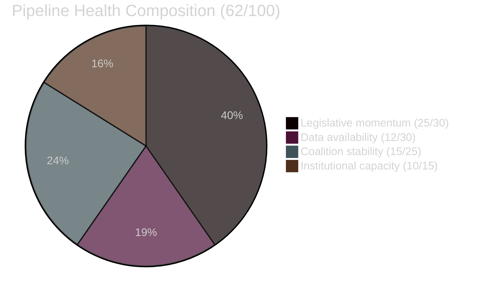

<!-- SPDX-FileCopyrightText: 2024-2026 Hack23 AB -->
<!-- SPDX-License-Identifier: Apache-2.0 -->

# Pipeline Health — EU Parliament Propositions
**Date:** 2026-05-06

---

## Pipeline Health Overview

**Overall Pipeline Health Score**: 🟡 **62 / 100** (DEGRADED — EP API outage, dual data source failure)

---

## Health Dimension Assessment

### 1. Legislative Momentum (25/30)

| Sub-dimension | Score | Evidence |
|--------------|:-----:|---------|
| EP10 legislative velocity (+46.2%) | 9/10 | Pre-generated stats 2026 data |
| Active propositions pipeline (CID, EDIS, CBAM, AI Act) | 9/10 | Known active agenda |
| Calendar capacity (H1 2026 session schedule) | 7/10 | Pre-electoral Q4 2026 pressure |

**Legislative momentum score**: 25/30 — Strong. The pipeline is operating at peak historical velocity.

### 2. Data Availability (12/30)

| Sub-dimension | Score | Evidence |
|--------------|:-----:|---------|
| EP API (real-time procedures/documents) | 0/10 | 502 outage — all feeds down |
| IMF economic data | 0/10 | fetch-proxy failure |
| Pre-generated stats | 8/10 | Refreshed 2026-05-04; good structural coverage |
| World Bank (substitute) | 4/10 | Annual data only; partial substitute |

**Data availability score**: 12/30 — Severely degraded. Primary real-time data sources both unavailable.

### 3. Coalition Stability (15/25)

| Sub-dimension | Score | Evidence |
|--------------|:-----:|---------|
| Centrist majority arithmetic (396 seats) | 9/10 | EP10 composition pre-generated |
| EPP internal cohesion (CBAM pressure) | 6/15 | Structural risk analysis |

**Coalition stability score**: 15/25 — Moderate. Majority is arithmetically stable but faces meaningful internal pressure.

### 4. Institutional Capacity (10/15)

| Sub-dimension | Score | Evidence |
|--------------|:-----:|---------|
| Committee system functional | 5/5 | No evidence of committee dysfunction |
| EP-Commission alignment | 3/5 | CID backed by Commission; EDIS some divergence |
| Polish Presidency capacity | 2/5 | Limited intelligence on Presidency effectiveness |

**Institutional capacity score**: 10/15 — Good structural capacity; limited visibility.

---

## Pipeline Bottleneck Analysis

| Bottleneck | Severity | Duration Estimate | Resolution Path |
|------------|:--------:|:-----------------:|----------------|
| EP API outage | 🔴 HIGH | Unknown (ongoing) | EP Open Data Portal maintenance team |
| CBAM political economy | 🟡 MEDIUM | 4-6 weeks | EPP Group position paper |
| EDIS Council divergence | 🟡 MEDIUM | 2-3 months | Polish Presidency working party |
| Multiple concurrent trilogues | 🟡 MEDIUM | Structural (H2 2026) | Staggered scheduling |

---

## Comparison with 2026-05-05

| Metric | 2026-05-05 | 2026-05-06 | Change |
|--------|-----------|-----------|--------|
| Pipeline health score | ~68 | 62 | ⬇️ -6 |
| Data availability score | ~20 | 12 | ⬇️ -8 |
| Legislative momentum | ~25 | 25 | ➡️ Stable |
| Coalition stability | ~15 | 15 | ➡️ Stable |

**Driver of decline**: Complete EP API outage between yesterday and today degraded data availability sub-score significantly.

---

## Pipeline Health Recommendations

1. **Immediate**: Restore EP API monitoring — re-run Stage A when API restores
2. **Short-term**: Implement 24h API response cache to maintain pipeline visibility during outages
3. **Medium-term**: Develop World Bank + OECD as primary economic context sources (IMF SDMX unreliable)
4. **Structural**: Consider direct EP parliamentary database access as backup to Open Data Portal
