<!-- SPDX-FileCopyrightText: 2024-2026 Hack23 AB -->
<!-- SPDX-License-Identifier: Apache-2.0 -->

# Analysis Index — EU Parliament Propositions
**Date:** 2026-05-06 | **Article Type:** propositions | **Run ID:** propositions-run265-1778094352

This index names every artifact produced in this run and provides the recommended reading order for downstream article generation and human review.

---

## Reading Order

```mermaid
%%{init: {"theme":"dark","themeVariables":{"primaryColor":"#1565C0","primaryTextColor":"#ffffff","lineColor":"#90CAF9"}}}%%
flowchart LR
    A["executive-brief.md\n(Start here)"] --> B["synthesis-summary.md\n(Top findings)"]
    B --> C["pestle-analysis.md\n(Context)"]
    C --> D["stakeholder-map.md\n(Who matters)"]
    D --> E["scenario-forecast.md\n(What next)"]
    E --> F["coalition-dynamics.md\n(How votes line up)"]
    F --> G["threat-model.md\n(Risks)"]
    G --> H["risk-matrix.md\n(Quantified)"]
    H --> I["quantitative-swot.md\n(Balanced view)"]
    I --> J["economic-context.md\n(Macro)"]
    J --> K["historical-baseline.md\n(Trend)"]
    K --> L["voting-patterns.md\n(Behaviour)"]
    L --> M["wildcards-blackswans.md\n(Surprises)"]
    M --> N["methodology-reflection.md\n(Quality)"]
```

---

## Artifact Inventory

### Root Level
| File | Lines | Status | Notes |
|------|-------|--------|-------|
| `executive-brief.md` | ≥180 | ✅ Written | Key intelligence summary |

### `intelligence/`
| File | Lines | Status | Notes |
|------|-------|--------|-------|
| `analysis-index.md` | ≥100 | ✅ Written | This file |
| `synthesis-summary.md` | ≥160 | ✅ Written | Run intelligence summary |
| `historical-baseline.md` | ≥120 | ✅ Written | 30/90-day baselines |
| `economic-context.md` | ≥120 | ✅ Written | IMF degraded mode |
| `pestle-analysis.md` | ≥180 | ✅ Written | PESTLE scan |
| `stakeholder-map.md` | ≥200 | ✅ Written | Power × Alignment |
| `scenario-forecast.md` | ≥180 | ✅ Written | 3+ scenarios |
| `threat-model.md` | ≥160 | ✅ Written | Multi-framework threats |
| `wildcards-blackswans.md` | ≥180 | ✅ Written | Low-prob/high-impact |
| `mcp-reliability-audit.md` | ≥200 | ✅ Written | Endpoint reliability |
| `reference-analysis-quality.md` | ≥140 | ✅ Written | Quality self-score |
| `coalition-dynamics.md` | ≥100 | ✅ Written | Group alliances |
| `voting-patterns.md` | ≥120 | ✅ Written | Bloc behaviour |
| `significance-scoring.md` | ≥80 | ✅ Written | Item scoring |
| `political-threat-landscape.md` | ≥90 | ✅ Written | 6-dimension landscape |
| `cross-run-diff.md` | ≥80 | ✅ Written | Delta vs prior |
| `workflow-audit.md` | ≥80 | ✅ Written | Execution audit |
| `methodology-reflection.md` | ≥180 | ✅ Written | Quality retrospective |

### `classification/`
| File | Lines | Status |
|------|-------|--------|
| `significance-classification.md` | ≥30 | ✅ Written |
| `actor-mapping.md` | ≥30 | ✅ Written |
| `forces-analysis.md` | ≥30 | ✅ Written |
| `impact-matrix.md` | ≥30 | ✅ Written |

### `risk-scoring/`
| File | Lines | Status |
|------|-------|--------|
| `risk-matrix.md` | ≥100 | ✅ Written |
| `quantitative-swot.md` | ≥100 | ✅ Written |
| `political-capital-risk.md` | ≥30 | ✅ Written |
| `legislative-velocity-risk.md` | ≥30 | ✅ Written |

### `threat-assessment/`
| File | Lines | Status |
|------|-------|--------|
| `political-threat-landscape.md` | ≥60 | ✅ Written |
| `actor-threat-profiles.md` | ≥60 | ✅ Written |
| `consequence-trees.md` | ≥60 | ✅ Written |
| `legislative-disruption.md` | ≥60 | ✅ Written |

### `existing/`
| File | Lines | Status |
|------|-------|--------|
| `pipeline-health.md` | ≥60 | ✅ Written |
| `deep-analysis.md` | ≥60 | ✅ Written |

### `documents/`
| File | Lines | Status |
|------|-------|--------|
| `document-analysis-index.md` | ≥30 | ✅ Written |

---

## Data Collection Summary

| Source | Status | Coverage |
|--------|--------|----------|
| EP Open Data Portal (live API) | 🔴 UNAVAILABLE (502) | All endpoints failed |
| EP Pre-generated statistics | 🟢 Available | 2024–2026, refreshed 2026-05-04 |
| EP Political landscape | 🟡 Partial | MEP pagination failed; seat data from pre-gen |
| DOCEO XML (latest votes) | 🔴 UNAVAILABLE | No data for Apr-May 2026 |
| IMF SDMX (fetch-proxy) | 🔴 UNAVAILABLE | Sandbox network restriction |
| World Bank MCP | 🟡 Available | Not queried this run |

**Note**: This run operated entirely from pre-generated statistical data and EP10 political knowledge. All specific procedure IDs, adopted text references, and vote outcomes are based on prior context, not live API data. The analysis focuses on structural/systemic intelligence rather than specific event reporting.

---

## Run Metadata

- **Run ID**: propositions-run265-1778094352
- **Analysis Dir**: `analysis/daily/2026-05-06/propositions/`
- **Stage A completed**: ~minute 7
- **Stage B Pass 1 started**: ~minute 8
- **Article Type**: propositions
- **IMF Mode**: Degraded (unavailable) — economic minimums waived per `08-infrastructure.md §4`
- **EP API Mode**: Degraded (502 errors) — all live endpoints failed; structural analysis only
