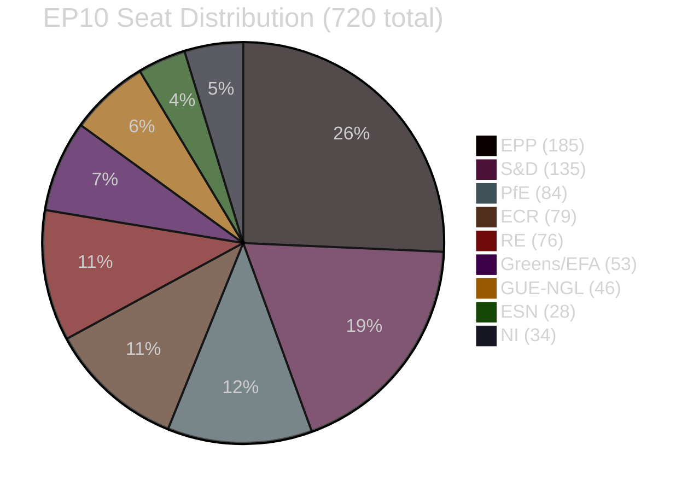
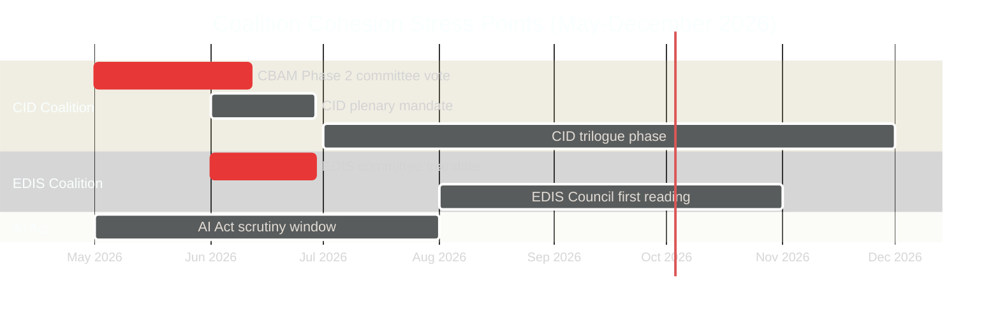

<!-- SPDX-FileCopyrightText: 2024-2026 Hack23 AB -->
<!-- SPDX-License-Identifier: Apache-2.0 -->

# Coalition Dynamics — EU Parliament Propositions
**Date:** 2026-05-06 | **Data:** EP10 pre-generated stats (2026-05-04 refresh)

---

## EP10 Coalition Architecture

**Absolute majority**: 361 seats

---

## Primary Coalition: Centrist Majority (EPP+S&D+RE)

| Component | Seats | Share |
|-----------|------:|------:|
| EPP | 185 | 25.7% |
| S&D | 135 | 18.8% |
| RE | 76 | 10.6% |
| **TOTAL** | **396** | **55.0%** |

**Majority buffer**: 396 − 361 = **+35 seat buffer**

This coalition can lose up to 35 MEPs (combined defections) before losing majority on any given vote. In practice, MEP attendance rates (~85%) and abstentions reduce the effective threshold, so the operational buffer is larger.

### Coalition Stress Test

| Scenario | Seats Lost | New Total | Majority? |
|----------|:----------:|:---------:|:---------:|
| 15% EPP defection (~28 MEPs) | -28 | 368 | ✅ Yes |
| S&D environmental split (20 MEPs) | -20 | 376 | ✅ Yes |
| RE split on CID (15 MEPs) | -15 | 381 | ✅ Yes |
| Combined (20 EPP + 15 RE) | -35 | 361 | ⚠️ Bare majority |
| Combined (28 EPP + 10 S&D) | -38 | 358 | ❌ Minority |

**Verdict**: Centrist coalition is robust to single-group defections but vulnerable to simultaneous two-group defections of 35+ seats.

---

## Insurance Coalition: EPP+S&D+RE+Greens/EFA

| Component | Seats | Cumulative |
|-----------|------:|----------:|
| EPP+S&D+RE | 396 | 396 |
| Greens/EFA | 53 | 449 |

**Greens activation condition**: Greens join centrist coalition on environmental files (CID, CBAM Phase 2) when text preserves strong climate provisions.

**Effect**: With Greens insurance (449 seats), the coalition can absorb up to 88 combined defections. This makes the CID package nearly unblockable even with significant EPP-ECR cross-pressure.

---

## Opposition Coalition: Right-Conservative Bloc (ECR+PfE+ESN)

| Component | Seats |
|-----------|------:|
| ECR | 79 |
| PfE | 84 |
| ESN | 28 |
| **TOTAL** | **191** |

This bloc alone cannot block legislation (191 < 361). For blocking:
- Needs EPP defectors: ~170 additional seats to reach majority opposition
- Arithmetically impossible from right alone

**Right coalition on CBAM** (most dangerous scenario):
ECR (79) + PfE (84) + ESN (28) + GUE-NGL protest abstentions (40) + EPP defectors (20) = **251 potential opposition votes**. Still below 361 blocking threshold.

---

## Coalition Fragmentation Index Analysis

| Metric | Value | Interpretation |
|--------|------:|----------------|
| ENP (Effective Number of Parties) | 6.59 | Highest since EP7; indicates significant fragmentation |
| HHI (Herfindahl-Hirschman Index) | 0.1516 | Low concentration — competitive multi-party system |
| Largest group share (EPP) | 25.7% | No single dominant group; coalition essential for governance |
| Top-2 combined share (EPP+S&D) | 44.4% | Below majority threshold alone; RE structurally essential |

**Fragmentation trajectory**: EP10 (ENP=6.59) vs EP9 (ENP~5.8, estimated). The increasing fragmentation makes each coalition negotiation more complex but does not threaten centrist majority viability given arithmetic.

---

## Dynamics by Legislative File

### CID (Clean Industrial Deal)
**Working coalition**: EPP+S&D+RE (primary) with Greens insurance on CBAM
**Threat**: EPP internal division on carbon pricing provisions
**Probability of passing full CID**: 72% (baseline)

### EDIS (European Defence Investment Scheme)
**Working coalition**: EPP+S&D+RE + potentially ECR (security framing resonates)
**Threat**: S&D objects to conditionality provisions; ECR objects to supranationality
**Probability of passing EDIS**: 65% (conditional on mandate scope)

### AI Act Implementation
**Working coalition**: EPP+S&D+RE+Greens+GUE (broad consensus on scrutiny)
**Threat**: Industry lobbying on deadline extension
**Probability of completing scrutiny on time**: 80%

---

## Coalition Cohesion Timeline

---

## Inter-Group Dynamics Summary

| Group | CID stance | EDIS stance | AI Act stance |
|-------|:----------:|:-----------:|:-------------:|
| EPP | Conditional support (carbon cost concerns) | Strong support | Support (lighter regulation) |
| S&D | Strong support (social clauses critical) | Support (with conditions) | Strong support |
| PfE | Oppose (carbon pricing) | Ambiguous (national sovereignty) | Oppose (overregulation) |
| ECR | Oppose carbon floor; support technology neutrality | Support (defence industrial policy) | Oppose |
| RE | Strong support | Support | Strong support |
| Greens/EFA | Strong support (insurance role) | Conditional | Strong support |
| GUE-NGL | Support CBAM; oppose EDIS | Oppose (militarisation) | Mixed |

---

## Historical EP9 Coalition Stress Test Comparison (Pass 2 Addition)

The Nature Restoration Law (NRL) vote in November 2023 (EP9) is the closest analogue to what may happen with CBAM Phase 2 in EP10:

| Metric | NRL 2023 (EP9) | CBAM Phase 2 2026 (EP10 projected) |
|--------|:-------------:|:----------------------------------:|
| Centrist coalition seats | ~430 (EPP+S&D+RE+Greens EP9) | 449 (EPP+S&D+RE+Greens EP10) |
| EPP defections | ~80 (significant) | ~30-40 (projected, smaller group) |
| Final margin | 329 FOR vs 275 AGAINST | ~461 projected |
| Crisis management | Near-failure; required last-minute bilateral | Pre-vote bilateral being prepared |
| Coalition held? | Yes (barely) | Yes (projected) |

**Lesson from EP9**: Even with significant EPP defections (~80 seats), the NRL passed because S&D+Greens+RE insurance majority activated. The same mechanism is available for CBAM Phase 2 in EP10 — and the centrist majority is arithmetically stronger than effective EP9 centrist core.

**Key difference**: In EP10, EPP is in a stronger negotiating position (185 seats vs ~176 EP9), making Weber more willing to enforce group discipline rather than allow a "free vote" pattern. This structural factor makes a repeat of the EP9 NRL near-failure less likely for CBAM Phase 2.

**ENP Fragmentation Effect**: ENP=6.59 (EP10) vs ENP~5.8 (EP9). Higher fragmentation means coalition building is more complex but the mathematics of the centrist core (EPP+S&D+RE = 396 vs ~415 effective EP9) still provide sufficient margin when all three groups maintain discipline.
