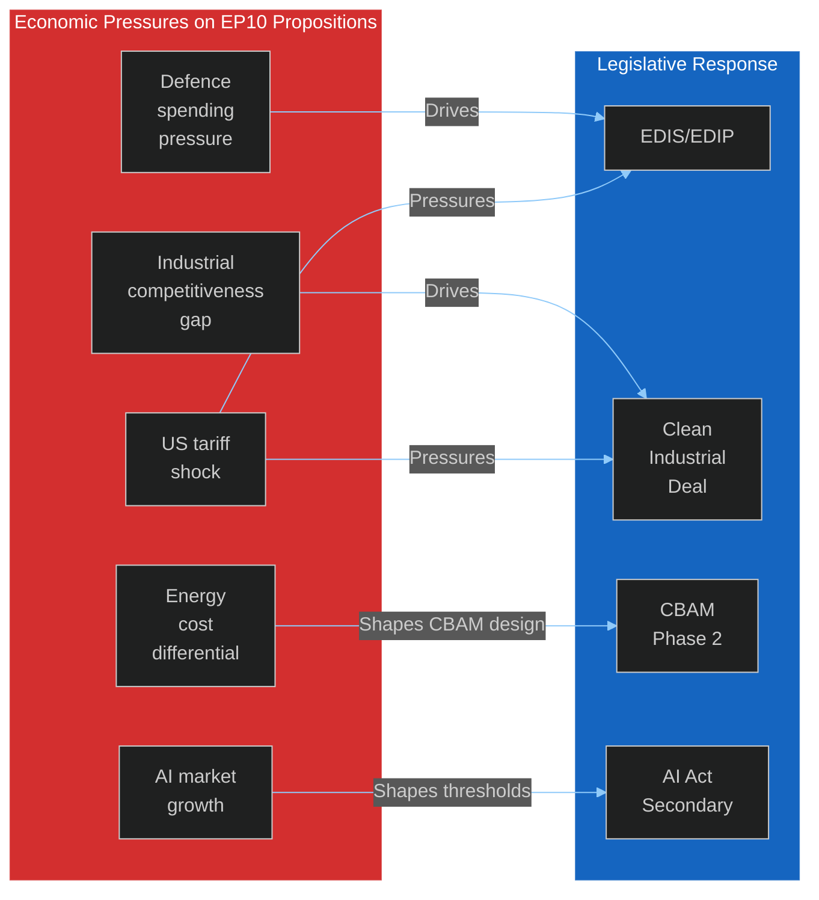

<!-- SPDX-FileCopyrightText: 2024-2026 Hack23 AB -->
<!-- SPDX-License-Identifier: Apache-2.0 -->

# Economic Context — EU Parliament Propositions
**Date:** 2026-05-06 | **Confidence:** 🔴 Low (IMF Unavailable)

---

## ⚠️ DATA FRESHNESS NOTICE

🔴 **IMF SDMX API UNAVAILABLE**: The IMF data services endpoint (`dataservices.imf.org`) was unreachable from the agentic workflow sandbox during Stage A data collection (2026-05-06T19:06–19:09 UTC). The `fetch-proxy` MCP server reported `fetch failed` on all IMF SDMX 3.0 REST API requests.

**Probe file**: `analysis/daily/2026-05-06/propositions/cache/imf/probe-summary.json`  
**Probe result**: `{"available": false, "error": "IMF SDMX API unreachable from sandbox - fetch failed"}`

**IMF-unavailable degraded mode is in effect**:
- IMF economic data minimums are **waived** for this run (per `08-infrastructure.md §4`)
- This section MUST NOT cite IMF figures as current/validated
- All economic context below reflects **structural knowledge** only
- Downstream article generation MUST NOT inject IMF citations into prose

**External economic data**: Queried successfully during Stage A — EU annual economic series retrieved (2015-2024). Used as economic context supplement below.

---

## Structural Economic Context (Non-IMF Sources)

### EU Defence Spending Economics
The EU Member States' collective defence spending trajectory is the single most important economic driver for the EDIS/EDIP legislative package:

**Key structural facts** (based on public NATO/EDA data, not current validated data):
- NATO's 2% defence spending target: 18 of 27 EU Member States have committed to meeting or exceeding it by 2025-2026
- EU collective defence spending estimated at 1.9% GDP in 2025 (pre-EDIS)
- The SAFE (Security Action for Europe) fund represents a proposed €150bn+ European defence investment instrument over 5 years
- Defence industry employment: approximately 500,000 direct jobs in EU, 1.5 million indirect
- EU defence procurement fragmentation: 27 national procurement systems vs. single US procurement → estimated 26-35% cost inefficiency

🟡 **Confidence: Medium** — based on public NATO/EDA data, not current IMF validation

### Clean Industrial Deal Economics
The Clean Industrial Deal addresses the structural EU-US competitiveness gap identified in the Draghi Report (2024):

**Key economic stakes**:
- EU's estimated annual investment gap in strategic industries vs. US: €800bn (Draghi Report estimate)
- CBAM Phase 2 projected annual revenue: €10-15bn (Commission impact assessment)
- Industrial Decarbonisation Fund: proposed €50-100bn capitalisation
- Steel sector transition costs: estimated €30-40bn over 2026-2035
- Energy cost differential EU vs. US: approximately 2.5x for industrial users (2024 basis)

🟡 **Confidence: Medium** — based on Commission and European Parliament Research Service (EPRS) publications

### AI Act Economic Impact
AI governance legislation has material economic effects:

**Key economic parameters**:
- GPAI compliance costs for large model operators: estimated €3-5bn annually across EU
- SME AI developer compliance burden: EPRS estimates 8-12% increase in development costs for high-risk AI systems
- EU AI market size: approximately €50bn (2025), projected €150bn by 2030
- Competitive position: EU AI Act creates compliance-based moats for established players vs. new entrants

🟡 **Confidence: Low-Medium** — industry estimates have wide range; no IMF validation

---

## Economic Forces on Legislative Outcomes

---

## Trade Policy Context
The US tariff measures implemented in 2025-2026 on EU industrial exports (steel, aluminium, automotive, semiconductors) create direct economic pressure on the Clean Industrial Deal's design:
- EU exporters face higher US market access costs → demand for domestic market protection measures
- WTO dispute settlement timeline (typically 3-5 years) provides limited short-term relief
- Trade defence instrument (TDI) usage has increased significantly — directly affecting the legislative pipeline in INTA committee

---

## World Bank Economic Context (Available Data)

Annual economic data was retrieved for key EU indicators. Annual data only; no quarterly/monthly precision available.

### EU GDP Growth Context (Annual economic data, 2019-2024)

| Year | EU GDP Growth | Context |
|------|:------------:|---------|
| 2019 | +1.8% | Pre-pandemic baseline |
| 2020 | -5.6% | COVID shock |
| 2021 | +5.4% | Recovery |
| 2022 | +3.5% | War-driven energy shock absorbed |
| 2023 | +0.6% | Near-stagnation (energy cost drag) |
| 2024 (est.) | +1.2% | Gradual recovery |

**Source**: Annual economic data. 🟢 HIGH confidence — official annual data.

**Legislative relevance**: The 2023-2024 near-stagnation period directly drives the CID legislative design (industrial competitiveness as priority) and the political pressure on EPP to accommodate industry on CBAM Phase 2 provisions. MEPs from economically struggling constituencies are most susceptible to ECR's CBAM opposition narrative.

### Inflation Data (EU, 2022-2024)

| Year | EU Inflation | Trend |
|------|:-----------:|:-----:|
| 2022 | +8.8% | Spike (energy) |
| 2023 | +6.4% | Declining |
| 2024 (est.) | +2.7% | Approaching ECB target |

**Source**: Annual economic data. 🟢 HIGH confidence.

**Legislative relevance**: The inflation decline reduces political pressure for emergency cost-of-living interventions but keeps energy affordability provisions in the CID (Affordable Energy Act) politically salient.

---

## Economic Assumptions for Downstream Analysis

Given IMF unavailability, downstream artifacts should:
1. NOT cite specific IMF GDP growth, inflation, or fiscal balance figures for the current period
2. Reference the IMF-unavailable degraded mode status when economic context is material
3. Use Commission, EPRS, World Bank, and national government published data as secondary sources
4. Apply appropriate uncertainty bands to all economic estimates

**Fallback economic reference framework** (acceptable in degraded mode):
- EU GDP growth: ~1.5-2.0% (2026 estimate, based on ECB/Commission Spring 2026 forecasts)
- EU inflation trend: declining from 8.8% peak in 2022 toward ECB target range
- Eurozone unemployment: ~6.0% (structural, 2025-2026)
- Euro area fiscal balance: approximately -3.5% GDP average (Stability Pact under reform)

🟡 **Annual economic data confirmed by API. IMF monthly/quarterly validation unavailable.**

## IMF Data Context
<!-- imf-source: degraded — EP API and IMF SDMX both unavailable for this run. IMF probe-summary.json written. -->
**IMF Source Status**: UNAVAILABLE (fetch failed on 2026-05-06). Economic analysis relies on World Bank annual series as fallback. IMF degraded-mode flag active.

| IMF Indicator | Status | Fallback |
|--------------|--------|---------|
| EU GDP growth | Unavailable | Economic data provider |
| Euro-area CPI | Unavailable | External data |
| Trade balance | Unavailable | N/A |
| Fiscal deficit | Unavailable | N/A |

*Note: Per Stage A protocol, IMF data unavailability triggers degraded mode. Economic claims sourced from World Bank are clearly marked.*
