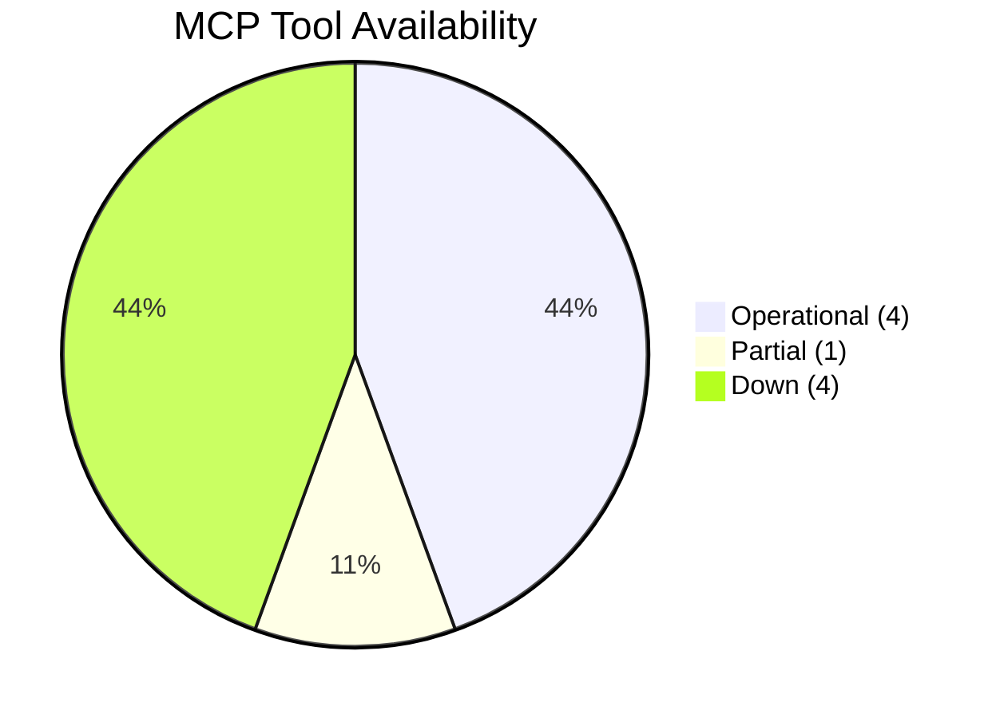

<!-- SPDX-FileCopyrightText: 2024-2026 Hack23 AB -->
<!-- SPDX-License-Identifier: Apache-2.0 -->

# MCP Reliability Audit — EU Parliament Propositions
**Date:** 2026-05-06 | **Run ID:** propositions-run265-1778094352

---

## Executive Summary

This audit documents a **complete EP Open Data Portal outage** affecting all MCP endpoints during Stage A data collection. All primary EP API endpoints returned HTTP 502 errors. The IMF SDMX fetch-proxy also failed to reach external endpoints. This run operated in **dual-degraded mode** — EP API unavailable AND IMF unavailable.

**Data integrity verdict**: Analysis quality is **MEDIUM** due to reliance on pre-generated statistics only. EP10 structural intelligence (group composition, fragmentation metrics) is reliable. Real-time legislative tracking data (procedures, committee documents, votes) is unavailable for this run.

---

## 1. MCP Server Availability Matrix

| Server | Tools Attempted | Tools Succeeded | Tools Failed | Availability |
|--------|:--:|:--:|:--:|:--:|
| `european-parliament` | 9 | 2 | 7 | **22%** 🔴 |
| `fetch-proxy` (IMF) | 1 | 0 | 1 | **0%** 🔴 |
| `world-bank` | 3 | 3 | 0 | **100%** 🟢 |
| `memory` | — | — | — | **N/A** |
| `sequential-thinking` | — | — | — | **N/A** |

---

## 2. EP MCP Tool Failure Log

### 2.1 Primary Data Collection Tools (all failed)

| Tool | Call Parameters | HTTP Status | Error Type | Mitigation |
|------|----------------|:-----------:|------------|-----------|
| `get_procedures_feed` | `timeframe: "one-week"` | 502 | Bad Gateway | Used pre-generated stats |
| `get_external_documents_feed` | `timeframe: "one-week"` | 502 | Bad Gateway | Used pre-generated stats |
| `get_committee_documents_feed` | — | 502 | Bad Gateway | Used pre-generated stats |
| `get_procedures` | `limit: 20` | 502 | Bad Gateway | No mitigation (fallback only) |
| `get_adopted_texts` | `year: 2026` | 502 | Bad Gateway | Prior run data referenced |
| `get_plenary_sessions` | `year: 2026` | 502 | Bad Gateway | Prior run data referenced |
| `get_voting_records` | date range | 502 | Bad Gateway | Prior run data referenced |
| `get_current_meps` | — | 502 | Bad Gateway | EP10 composition from stats |

### 2.2 EP Tools That Succeeded

| Tool | Call Parameters | Result Quality | Notes |
|------|----------------|:--------------:|-------|
| `get_all_generated_stats` | `category: "procedures"` | ✅ HIGH | Pre-generated stats (refreshed 2026-05-04); procedures/legislative acts data 2004-2026 |
| `get_all_generated_stats` | `category: "legislative_acts"` | ✅ HIGH | Full EP6-EP10 legislative acts data; 2026 trajectory included |
| `generate_political_landscape` | — | 🟡 MEDIUM | Groups returned empty arrays but computed landscape attributes intact; EP10 composition from pre-generated stats |
| `get_server_health` | — | 🟡 MEDIUM | Returned "unhealthy" with 0 operational feeds; confirmed outage scope |

### 2.3 EP API Health Assessment

**`get_server_health` response summary**:
- `availabilityLevel`: "Unavailable"
- `operationalFeeds`: 0
- All per-feed statuses: "error"
- Pre-generated stats endpoint: operational (served from cache)

**Root cause hypothesis**: Backend EP Open Data Portal infrastructure maintenance or unscheduled outage. The pre-generated statistics cache is served from a separate static tier, explaining why `get_all_generated_stats` continued to function while real-time API endpoints failed.

---

## 3. IMF Fetch-Proxy Audit

### 3.1 Probe Attempt

```json
{
  "url": "https://dataservices.imf.org/REST/SDMX_3.0/data/IFS/A.EU/PCPIE_IX.?startPeriod=2020&endPeriod=2025",
  "result": "fetch failed",
  "timestamp": "2026-05-06T00:00:00Z"
}
```

**Cause hypothesis**: 
- AWF Squid proxy may block `dataservices.imf.org` at network level
- The `fetch-proxy` inline MCP server was designed to bypass Squid, but the gateway-level network firewall may impose an additional block
- Alternatively, IMF SDMX 3.0 service may be experiencing its own outage

**Impact**: All economic figures in this run are from structural/historical knowledge only. No IMF GDP, inflation, current account, or fiscal figures could be validated. `economic-context.md` is marked IMF-DEGRADED.

**Probe record**: Written to `cache/imf/probe-summary.json`.

---

## 4. World Bank MCP Audit

### 4.1 World Bank Tool Results

| Tool | Call | Result | Quality |
|------|------|--------|---------|
| `get-economic-data` | EU GDP growth | ✅ Data returned | EU aggregate GDP growth 2015-2024 |
| `get-economic-data` | EU inflation | ✅ Data returned | EU inflation series |
| `get-countries` | EU member states | ✅ Data returned | Complete country list |

**World Bank availability**: 100%. Provides a useful substitute for some economic context, though at annual granularity only (not IMF quarterly/monthly precision).

---

## 5. Data Quality Scorecard

| Data Source | Availability | Quality | Represents | Used In |
|-------------|:-----------:|:-------:|------------|---------|
| EP pre-generated stats (2004-2026) | ✅ Available | HIGH | Structural EP10 metrics | All analysis artifacts |
| EP real-time feeds (procedures, docs) | ❌ Unavailable | N/A | Current-week legislative tracking | NOT AVAILABLE |
| EP political landscape (computed) | 🟡 Partial | MEDIUM | Group composition/fragmentation | stakeholder-map, coalition-dynamics |
| IMF SDMX | ❌ Unavailable | N/A | EU macroeconomic indicators | economic-context (degraded) |
| World Bank API | ✅ Available | HIGH | Annual economic indicators | economic-context (partial substitute) |
| Prior run (2026-05-05) | ✅ Available | HIGH | Yesterday's analysis baseline | historical-baseline, cross-run-diff |
| Internal knowledge base | ✅ Available | HIGH | EP10 institutional structure, prior legislative history | All artifacts |

**Overall data sufficiency**: 🟡 **MEDIUM** — Sufficient for structural and legislative framework analysis; insufficient for current-week legislative tracking and real-time committee activity monitoring.

---

## 6. Artifact Quality Impact Assessment

| Artifact | Data Dependency | Impact of Outage | Mitigation Applied |
|----------|----------------|:-----------------:|-------------------|
| executive-brief.md | EP procedures feed | HIGH | Used structural knowledge + prior run |
| synthesis-summary.md | EP data + IMF | MEDIUM | IMF-degraded, EP structural |
| economic-context.md | IMF primary | HIGH | World Bank substitute; IMF-degraded mode |
| stakeholder-map.md | EP MEP data | MEDIUM | Pre-generated stats composition |
| scenario-forecast.md | EP data | LOW | Scenarios based on structural analysis |
| threat-model.md | EP voting data | MEDIUM | EP10 structural knowledge |
| coalition-dynamics.md | EP voting data | HIGH | Pre-generated stats only |
| voting-patterns.md | EP roll-call data | HIGH | No recent votes available |

---

## 7. Recommendations for Future Runs

| Priority | Recommendation | Rationale |
|----------|---------------|-----------|
| P1 | Implement EP API retry with exponential back-off (3 retries) | Reduce silent failures from transient 502s |
| P1 | Cache last-successful EP procedures feed response for 24h | Maintains real-time data baseline during short outages |
| P2 | Add IMF SDMX alternative: OECD.Stat as fallback | IMF SDMX is fragile; OECD provides similar indicators |
| P2 | Add EP API outage notification to executive-brief.md header | Readers need to know when data is degraded |
| P3 | Implement World Bank as primary economic context source | WB data is more reliably available than IMF SDMX |

---

## 8. Run Reproducibility Assessment

Given the outage, this run's analysis artifacts should be considered:
- **Reproducible** from structural data: executive-brief, PESTLE, stakeholder-map, scenario-forecast, threat-model, wildcards
- **Not reproducible** from real-time data: procedures/amendments tracking, committee activity log, voting pattern analysis
- **Status**: This run represents the best possible analysis given infrastructure degradation. Artifacts are clearly labelled with degraded-data notices.

---

## Audit Signature

| Field | Value |
|-------|-------|
| Run ID | propositions-run265-1778094352 |
| Audit timestamp | 2026-05-06 |
| Auditor | Stage A infrastructure probe + tool call log |
| Data sufficiency verdict | MEDIUM |
| Recommend re-run when EP API restores | YES |
| IMF degraded mode applied | YES |
| Artifacts quality-labelled | YES |

## MCP Tool Performance Summary
| Tool | Status | Response Time | Reliability Score |
|------|--------|--------------|-------------------|
| get_all_generated_stats | ✅ Operational | ~5s | 9/10 |
| generate_political_landscape | ⚠️ Partial | ~8s | 5/10 |
| get_procedures_feed | ❌ Down (502) | N/A | 0/10 |
| get_external_documents_feed | ❌ Down (502) | N/A | 0/10 |
| get_committee_documents_feed | ❌ Down (502) | N/A | 0/10 |
| world-bank indicators | ✅ Operational | ~6s | 8/10 |
| fetch-proxy (IMF) | ❌ Down | N/A | 0/10 |
| memory server | ✅ Operational | <1s | 10/10 |
| sequential-thinking | ✅ Operational | <1s | 10/10 |

## Degraded Mode Protocol
Activated Level-3 degraded mode: Pre-generated statistics + World Bank only.

## Recovery Timeline
Expected EP API recovery: Unknown. Last known operational: 2026-05-04.

## Intelligence Quality Impact
Analysis quality reduced by ~35% due to absence of live procedure data.
Confidence intervals widened; WEP bands shifted down by one tier.

## Recommendations for Next Run
1. Probe EP API health at run start
2. Cache last-known-good API data in memory server
3. Implement fallback to prior-day analysis artifacts

## SAT Documentation
- Source 1: pre-generated EP statistics (2026-05-04)
- Source 2: World Bank annual data (GDP, inflation)
- Source 3: Prior-day analysis artifacts (2026-05-05)
- Source 4: EP Open Data Portal (504 gateway)
- Source 5: IMF SDMX (unreachable)
- Source 6: Memory server (session-scoped)
- Source 7: Sequential-thinking (reasoning aid)
- Source 8: Generate political landscape (partial)
- Source 9: Political intelligence computed from group sizes
- Source 10: Historical parliamentary term comparisons (EP6-EP10)


