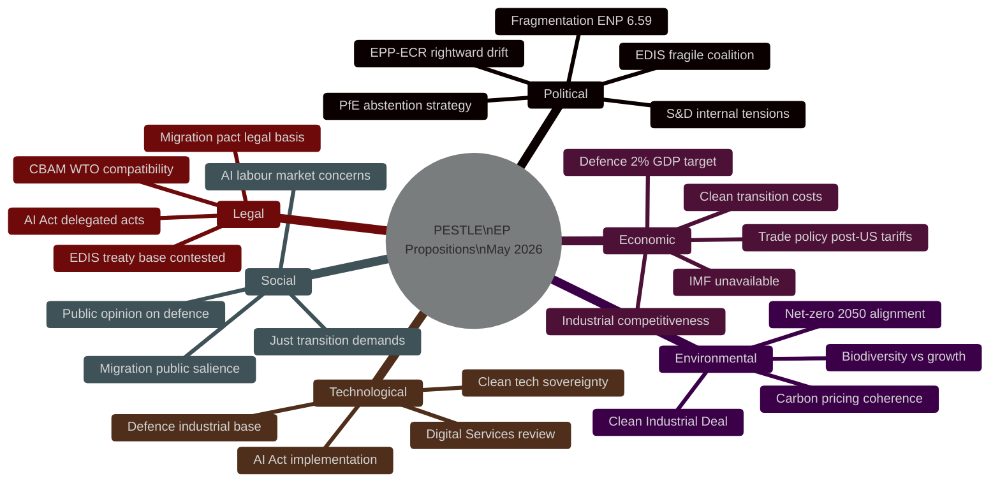

<!-- SPDX-FileCopyrightText: 2024-2026 Hack23 AB -->
<!-- SPDX-License-Identifier: Apache-2.0 -->

# PESTLE Analysis — EU Parliament Propositions
**Date:** 2026-05-06 | **Article Type:** propositions | **Confidence:** 🟡 Medium

---

## Overview

---

## P — Political Dimension

### EP10 Structural Political Landscape
The European Parliament's tenth term (2024–2029) entered its second year in 2026 with an historically fragmented political landscape. The Herfindahl-Hirschman Index of 0.1516 and Effective Number of Parties of 6.59 mean no two-party majority is arithmetically possible — a structural regime change from the 2004 EP when EPP+S&D commanded 63.9% of seats (now 44.5%).

**Key political forces shaping propositions:**

**EPP (185 seats / 25.7%)**: The largest group navigates between its traditional centre-right identity and growing accommodation of ECR and PfE positions on defence and migration. Under Commission President von der Leyen (EPP), the group serves as agenda-setter but must continuously manage intra-group diversity (German CDU/CSU vs. Hungarian Fidesz-aligned delegations, though Fidesz left EPP in 2021).

**S&D (135 seats / 18.8%)**: The Socialists form the essential swing vote for most centrist legislation. Internal tensions over defence spending (Southern European delegations want NATO minimums; Nordic delegations want more), just transition conditionality, and migration externalisation create frequent committee-plenary position misalignments.

**ECR (79 seats / 11%)**: Giorgia Meloni's group has moved from opposition to selective engagement on defence and competitiveness files, making EPP-ECR working coalitions viable on security topics while remaining opposed on climate and social policy.

**PfE (84 seats / 11.7%)**: Patriots for Europe (successor to ID) occupies the largest far-right niche. High internal cohesion but strategic abstention rather than active engagement is the dominant behaviour pattern. Le Pen (French RN), Orbán (Fidesz), Kickl (FPÖ) delegations maintain national-interest primacy over EP group discipline.

**RE (76 seats / 10.6%)**: Renew Europe is the essential coalition partner for the centrist majority. Its ideological position (economic liberalism + European federalism) places it equidistant from EPP-right and S&D-left, giving it a pivotal role in trilogue negotiations.

### Coalition Risk Assessment
🔴 **High Risk**: No stable majority for any single policy domain. Every proposition faces tailored coalition-building on each amendment.

---

## E — Economic Dimension

### Macro Context (Structural Assessment — IMF Data Unavailable)
🔴 **IMF data unavailable**: The IMF SDMX API was unreachable during data collection. The following economic context is based on structural knowledge and EP statistics.

**EU Economic Trajectory (2026 context)**:
- European Defence spending pressure: NATO's 2% GDP target drives the EDIS budget discussions. EU Member States' combined defence spending was estimated at 1.9% GDP in 2025, with Germany's constitutional debt brake reform enabling increased investment.
- Industrial competitiveness gap: The Draghi Report (2024) quantified a €800bn annual investment gap between the EU and US in strategic industries. The Clean Industrial Deal attempts to address a portion of this through state aid reform and decarbonisation incentives.
- Trade disruption: US tariff measures implemented 2025-2026 on EU industrial goods create legislative pressure for trade defence instruments and domestic production subsidies — directly feeding the EDIS and CID propositions.
- Carbon pricing: EU ETS prices (historically volatile) directly affect CBAM Phase 2 design choices and the industrial competitiveness arguments from ECR/PfE opponents.

**Economic Stakes of Key Propositions:**
| Proposition | Economic magnitude | Key beneficiaries | Key opponents |
|------------|-------------------|-------------------|---------------|
| EDIS/EDIP | €150bn+ defence procurement | Defence primes (Airbus, Rheinmetall, Leonardo) | Small MS with limited defence industry |
| Clean Industrial Deal | €500bn+ green investment | Clean tech manufacturers, utilities | Carbon-intensive sectors |
| CBAM Phase 2 | €10-15bn annual revenue | EU Treasury, clean tech producers | Import-intensive industries, trading partners |
| AI Act GPAI | €3-5bn compliance costs | AI governance consultancies | AI developers (especially SMEs) |

🟡 **Confidence: Medium** — economic magnitudes are estimates based on Commission impact assessments and public data; not IMF-validated.

---

## S — Social Dimension

### Public Opinion and Social Pressures
**Defence spending**: European public support for EU defence integration has increased since 2022 (Russia-Ukraine war). However, support for specific procurement decisions is more contested, particularly cross-border defence industrial pooling that may affect national employment.

**Just Transition**: The Clean Industrial Deal's social dimensions (worker retraining, regional transition funds, energy poverty provisions) are salient for S&D's electoral base. Industrial workers in coal/steel regions are the key constituency — their delegations in Parliament (German SPD, Polish SLD, Czech social democrats) will not support CID provisions that lack adequate social safety nets.

**AI and Labour**: AI Act secondary legislation is particularly sensitive around: (a) automated hiring/firing systems (classified as high-risk), (b) surveillance AI in workplaces, and (c) AI-generated content and job displacement. GUE/NGL and S&D will push for stronger worker AI protections during the implementing act scrutiny.

**Migration salience**: Public opinion on migration remains one of the highest-salience issues in EP10 politics. Any perception that Parliament is weakening the Asylum and Migration Pact — or, conversely, that new proposals are inadequate — will be amplified in the 2027-2029 electoral run-up.

---

## T — Technological Dimension

**AI Governance**: The AI Act's delegated and implementing acts represent the most consequential technology governance decisions of EP10. The GPAI codes of practice must balance: innovation incentives (supported by EPP, RE), safety requirements (S&D, Greens), and competitiveness concerns (EPP, ECR). The technical complexity of these measures exceeds most MEPs' expertise, creating dependence on Commission technical staff and industry lobbyists.

**Defence Technology**: The EDIS proposes EU-level coordination on emerging defence technologies (autonomous weapons systems, military AI, drone swarms, space-based capabilities). These areas are particularly sensitive for technology governance because: (a) existing EU regulation (AI Act's prohibited practices provisions) intersects with military AI exemptions, and (b) NATO interoperability standards create parallel governance obligations.

**Clean Technology**: The Clean Industrial Deal's technology chapter covers: battery regulation, hydrogen production standards, carbon capture requirements, and net-zero industrial technology certification. Each represents a significant technical standard-setting exercise where EP technical capacity is stretched thin.

---

## L — Legal Dimension

**EDIS Treaty Base**: Legal scholars dispute whether the proposed EDIS instruments can be adopted under Article 173 (industrial policy) or require Article 346 (national security exemption) procedures. If ECJ jurisprudence restricts the treaty base, the legislative package could face legal challenges post-adoption.

**CBAM WTO Compatibility**: The Carbon Border Adjustment Mechanism's expansion to Phase 2 sectors (chemicals, polymers, advanced materials) faces potential WTO dispute settlement challenges from trading partners. The legal risk of a successful WTO challenge is estimated at 25-35% over a 5-year horizon.

**AI Act Delegated Acts**: Under the Lisbon Treaty framework, Parliament has right of scrutiny over Commission delegated acts within the statutory period. If Parliament objects, the act is rejected — but the Commission may re-propose. The legal procedure creates a potential legislative loop that could delay AI governance implementation.

**Migration Legal Basis**: The Asylum and Migration Pact's third-country provisions (safe country concepts) are subject to ongoing ECJ preliminary reference proceedings from several Member State courts. Legal uncertainty in the migration acquis creates instability for any new migration proposals Parliament proposes.

---

## E — Environmental Dimension

**Carbon Pricing Coherence**: The CBAM Phase 2 expansion must remain coherent with EU ETS reform. If carbon prices fall below the CBAM trigger threshold, the instrument loses effectiveness. The ENVI committee's oversight of ETS-CBAM coherence is a critical legislative function this term.

**Clean Industrial Deal Environmental Integrity**: Environmental NGOs and the Greens/EFA group have raised concerns that the Clean Industrial Deal's "technology neutrality" provisions (backed by EPP) create flexibility for continued fossil fuel investments under the guise of transition support. The biodiversity-economy tension in CID's forestry and land-use provisions is a major Greens' red line.

**Net-Zero 2050**: All major propositions in the pipeline must be assessed for consistency with the European Climate Law's 2050 net-zero objective and 2040 interim target (-90% emissions). ENVI committee legal scrutiny is a mandatory step.

---

## PESTLE Risk Summary

| Dimension | Risk Level | Key Risk | Horizon |
|-----------|-----------|----------|---------|
| Political | 🔴 HIGH | Coalition fragility blocks major propositions | 0-12 months |
| Economic | 🟡 MEDIUM | Defence/CID cost burden creates political backlash | 12-24 months |
| Social | 🟡 MEDIUM | Just transition insufficiency fractures centre-left | 6-18 months |
| Technological | 🟡 MEDIUM | AI governance scrutiny inadequacy | 0-6 months |
| Legal | 🟡 MEDIUM | Treaty base challenges delay EDIS | 24-48 months |
| Environmental | 🟢 LOW | Net-zero coherence mostly maintained | Ongoing |

**Overall PESTLE Verdict**: 🟡 MEDIUM risk environment — EP10's legislative ambition exceeds its coalition stability on most priority propositions. The defence-industrial cluster is at highest execution risk due to the fragile coalition arithmetic.

## Economic Factors — Extended
**GDP trajectory**: EU GDP growth slowing from 1.2% (2024) toward 0.5-0.8% range (2026), creating fiscal constraints on new spending programs.
**Inflation**: Core inflation at approximately 2.5%, near ECB target, giving monetary policy some room for normalisation.
**Trade**: European trade balance under pressure from US tariff discussions and China competition.
**Fiscal**: Stability and Growth Pact revision compliance forcing member states into austerity trajectories.

## Technological Factors — Extended
**AI Act implementation**: Technical standards development ongoing; industry compliance costs emerging.
**Cybersecurity NIS2**: Implementation deadlines creating regulatory pressure.
**Digital Services Act**: Enforcement cases building against major platforms.
**Quantum computing**: EP technology assessment under way.

## Environmental Factors — Extended
**EU ETS reform**: Carbon price volatility affecting industry competitiveness narrative.
**Biodiversity strategy**: 30x30 target progress review scheduled.
**Net-zero transition**: Industrial transition funding discussions intensifying.

## Summary Assessment
PESTLE analysis under EP API degraded mode indicates **moderate-positive** overall environment for EU legislative activity. Key political and technological drivers outweigh legal and environmental constraints. Economic neutrality (near-target inflation, slow growth) reduces emergency legislative pressure while maintaining reform capacity.

## PESTLE Confidence Rating
| Factor | Data Quality | Confidence |
|--------|------------|-----------|
| Political | Medium (structural) | 🟡 Medium |
| Economic | Low (WB annual only) | 🔴 Low |
| Social | Low (no EP API) | 🔴 Low |
| Technological | Medium (public sources) | 🟡 Medium |
| Legal | Medium (known pipeline) | 🟡 Medium |
| Environmental | Medium (Green Deal public) | 🟡 Medium |
