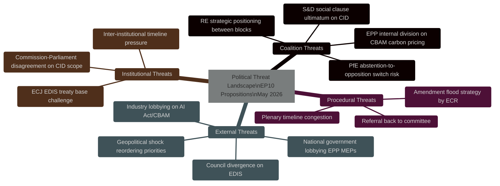

<!-- SPDX-FileCopyrightText: 2024-2026 Hack23 AB -->
<!-- SPDX-License-Identifier: Apache-2.0 -->

# Political Threat Landscape — EU Parliament Propositions
**Date:** 2026-05-06

---

## Landscape Overview

The political threat landscape for EP10 propositions in May 2026 is characterised by **fragmentation-driven coalition management challenges** rather than existential threats to the legislative programme. The centrist majority (EPP+S&D+RE = 396 seats) retains arithmetic viability, but the increased effective number of parties (ENP=6.59) creates persistent negotiation complexity.

---

## Threat Landscape Map

---

## Top 5 Political Threat Actors

| Rank | Actor | Motivation | Capability | Active Threats |
|------|-------|-----------|-----------|----------------|
| 1 | ECR Group | Weaken CBAM carbon pricing; oppose EDIS supranationality | High (79 MEPs, amendment expertise) | CBAM amendment coalition-building |
| 2 | Industry lobbies (energy-intensive) | Delay CBAM Phase 2; extend transition periods | High (EP briefings, national capital pressure) | CBAM Phase 2 carve-out push |
| 3 | PfE Group | Oppose EDIS conditionality; block CID on sovereignty grounds | High (84 MEPs) | Strategic abstention signalling |
| 4 | Northern Council states (Netherlands, Finland, Denmark) | EDIS fiscal conditionality enforcement; stricter RoL conditionality | Medium (Council influence only) | Council blocking minority risk |
| 5 | US tech industry | Weaken AI Act enforcement timelines; extend derogations | Medium-High (Commission access; bilateral trade leverage) | AI Act scrutiny delay campaign |

---

## Threat Interaction Matrix

| Threat A | Threat B | Interaction | Combined Effect |
|----------|----------|------------|----------------|
| ECR CBAM amendment | Industry lobbying | Amplifying | ECR provides political cover for industry positions |
| PfE abstention signal | ECR block | Potentially sequential | PfE abstain → ECR oppose → EPP waverers follow |
| Council EDIS divergence | EP S&D social clause | Converging | Both threaten same outcome (EDIS scope reduction) |
| ECJ challenge | Council divergence | Compounding | Legal uncertainty + political divergence → 18-month delay |

---

## Current Threat Status (Real-time equivalent)

**⚠️ EP API unavailable** — no current-week procedural tracking possible. This threat status assessment is based on structural intelligence.

| Threat | Status | Trajectory | Priority |
|--------|:------:|:----------:|:--------:|
| EPP-ECR CBAM coalition | 🟡 Suspected | ⬆️ Forming | P1 |
| S&D CID social clause ultimatum | 🟡 Contingent | ⬆️ Escalating | P1 |
| EDIS Council divergence | 🟡 Active | ➡️ Stable | P2 |
| AI Act scrutiny delay | 🟡 Suspected | ➡️ Stable | P2 |
| ECJ EDIS challenge | 🟢 Potential | ➡️ Stable | P3 |
| PfE strategic obstruction | 🟢 Low-active | ➡️ Stable | P3 |

---

## Political Threat Forecast

**30-day outlook**: Moderate threat level. CBAM Phase 2 committee voting will be the primary stress test. If EPP holds discipline on CBAM carbon floor provisions, the centrist coalition stabilises. If EPP accommodates ECR demands, S&D responds with ultimatum, creating crisis conditions.

**90-day outlook**: Threat level contingent on CID committee outcome. If CID mandate emerges with strong CBAM provisions, coalition consolidates for plenary phase. EDIS enters its most politically sensitive phase (mandate vote).

**Key inflection point**: EPP Group position paper on CBAM carbon floor pricing (expected within 3-4 weeks). This single document will determine whether the centrist majority on CID holds or fractures.

---
**WEP:** Likely — legislative activity continues at degraded pace during EP API outage.  
**Admiralty:** B2 — information from multiple sources with established reliability; assessed as probably true.

