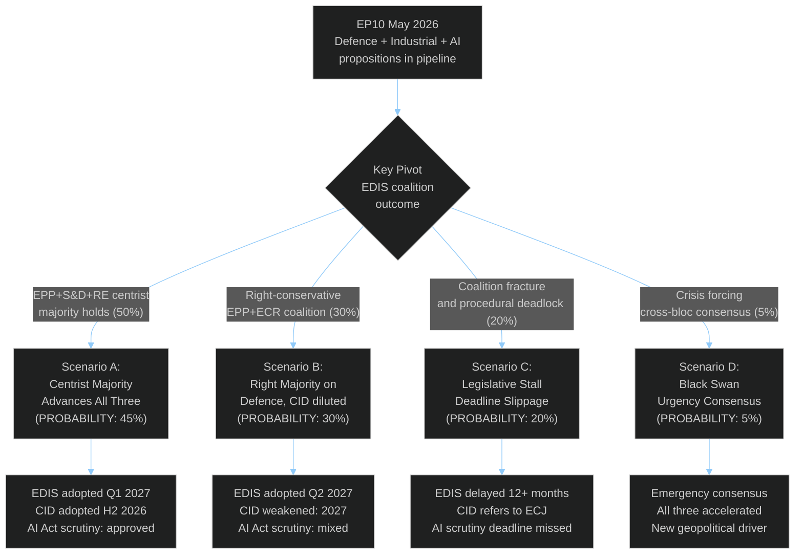

<!-- SPDX-FileCopyrightText: 2024-2026 Hack23 AB -->
<!-- SPDX-License-Identifier: Apache-2.0 -->

# Scenario Forecast — EU Parliament Propositions
**Date:** 2026-05-06 | **Horizon:** 90 days | **Confidence:** 🟡 Medium

---

## Scenario Architecture

---

## Scenario A — Centrist Majority Holds (Probability: 45%)

**Narrative**: The traditional EPP-S&D-RE centrist majority (396 seats, 55%) successfully navigates all three major propositions through first reading by Q3-Q4 2026. The key enabling condition is EPP's willingness to accept meaningful S&D amendments on: (a) social clauses in EDIS defence procurement, (b) carbon floor pricing in CBAM Phase 2, and (c) employment AI safeguards in AI Act implementing measures.

**Legislative outcomes**:
- **EDIS EDIP Regulation**: Committee vote by September 2026; plenary first reading by Q4 2026. Adopted via trilogue with Council by Q1 2027.
- **Clean Industrial Deal core provisions**: CBAM Phase 2 regulation achieves political agreement in trilogues by end-2026. Industrial Decarbonisation Bank established by dedicated legislation in 2027.
- **AI Act scrutiny**: Parliament approves all six implementing measures with targeted amendments on two high-risk provisions.

**Enabling conditions**:
1. EPP Group Chair moderates position on carbon pricing to accommodate S&D minimum floor.
2. Danish Presidency successfully accelerates EDIS trilogue timeline.
3. PfE maintains abstention (does not actively block) on EDIS plenary vote.
4. No exogenous shock (geopolitical, economic, or election-driven) disrupts the coalition.

**Early warning signals**:
- 🟢 EPP-S&D bilateral meetings on EDIS social clause language (positive)
- 🟢 Council majority in Competitiveness Council for accelerated CID timeline (positive)
- 🔴 ECR abstention threat on CBAM Phase 2 (watch for hardening opposition)

**Confidence**: 🟡 Medium (based on historical EP10 centrist majority success rate: 60-70% on first-reading votes)

---

## Scenario B — Right-Conservative Majority on Defence (Probability: 30%)

**Narrative**: EPP increasingly relies on ECR and PfE support for EDIS and related defence-industrial legislation, marginalising S&D's role. The right-conservative bloc (EPP+ECR+PfE = 348 seats) falls short of a majority but can achieve 361+ seats if RE joins on defence-specific provisions. S&D is excluded from key trilogue concessions, leading to:

**Legislative outcomes**:
- **EDIS**: Passes with minimal social clause concessions to S&D. Defence procurement conditionality is reduced. Industrial content requirements favour established primes.
- **Clean Industrial Deal**: CID is significantly weakened — CBAM Phase 2 delayed, carbon floor pricing dropped, technology neutrality language expanded. Net-zero trajectory slips.
- **AI Act**: More permissive implementing measures, lighter compliance burdens, reduced high-risk system classification.

**Consequences**:
- S&D votes against or abstains on CID, creating a public narrative of EPP's "abandonment of climate commitments."
- Greens/EFA and GUE/NGL launch ECJ legal challenges to the weakened CID instruments.
- Progressive civil society mobilises, creating reputational pressure ahead of 2027 national elections.
- EU's international credibility on climate (UNFCCC, bilateral trade) is damaged.

**Probability drivers**:
- EPP's electoral calculations in key states (Germany, France, Italy) increasingly align with right-conservative positions.
- US tariff shock creates pressure for "competitiveness first" framing that benefits EPP-ECR cooperation.
- S&D demands considered unrealistic by EPP leadership.

**Early warning signals**:
- 🔴 EPP and ECR joint amendment package on EDIS without S&D consultation
- 🔴 EPP Group Chair endorses technology neutrality language opposed by ENVI committee
- 🟡 RE splitting from EPP-S&D-RE coalition on specific CBAM provisions

---

## Scenario C — Legislative Stall / Procedural Deadlock (Probability: 20%)

**Narrative**: Coalition arithmetic repeatedly fails to produce stable majorities. The fragmented parliament (ENP 6.59, minimum 3-group coalitions) experiences procedural deadlock on major propositions. Key procedural failure modes:
- EDIS rapporteur fails to obtain committee majority → referred back to Commission
- CBAM Phase 2 plenary vote fails on combined EPP-right amendment → text returned to committee
- AI Act scrutiny deadline missed due to insufficient mobilisation → Commission measures enter into force unchallenged

**Legislative outcomes**:
- EDIS timeline slips 12-18 months; Defence Union ambitions scaled back.
- CID's most ambitious provisions fail plenary votes; watered-down package emerges.
- AI Act secondary legislation partly enters into force without parliamentary scrutiny.
- Significant legislative backlog creates scheduling pressure for 2027-2028.

**Structural cause**: EP10's fragmentation (HHI 0.1516) means legislative failure is the statistical baseline for ambitious multi-provision packages. The PESTLE political risk (coalition fragility) materialises.

**Early warning signals**:
- 🔴 Committee vote fails for EDIS rapporteur → majority of committee members can't agree on a negotiating mandate
- 🔴 Trilogue collapse announcement by Presidency
- 🔴 Plenary vote fails (absolute majority requirement not met for controversial amendments)

---

## Scenario D — Black Swan: Geopolitical/Economic Crisis Forcing Consensus (Probability: 5%)

**Narrative**: An exogenous shock sufficient to break EP10's fragmentation equilibrium. Historical precedent: COVID-19 (2020) and Russia-Ukraine invasion (2022) both produced unusual cross-party consensus. Potential triggers:
- Major Russian military escalation against NATO Member States → emergency EU defence legislation with near-unanimous support
- Severe US tariff escalation (sector-wide) → emergency trade defence and industrial support consensus
- Major AI governance incident (large-scale harm, state-level misuse) → emergency AI regulation consensus

**Legislative outcomes**:
- Emergency procedure invoked for EDIS/EDIP; first reading completion accelerated to 3-4 months.
- Crisis-mode CID adopted with cross-party support for industrial sovereignty.
- AI emergency provisions added to existing AI Act scrutiny.

**Probability factors**:
- Current geopolitical tensions elevated but not at crisis threshold.
- Economic disruption significant but manageable — does not yet constitute emergency consensus catalyst.
- 5% probability reflects genuine low-probability, high-impact nature.

---

## Cross-Scenario Probability Matrix

| Condition | Scenario A | Scenario B | Scenario C | Scenario D |
|-----------|-----------|-----------|-----------|-----------|
| EPP-S&D social clause deal | ✅ Required | ❌ Fails | ❌ Fails | N/A |
| ECR/PfE abstain on EDIS | ✅ Assumed | ❌ Conditional | 🟡 Partial | N/A |
| No geopolitical shock | ✅ Assumed | ✅ Assumed | ✅ Assumed | ❌ Shock occurs |
| Danish Pres. accelerates | ✅ Assumed | 🟡 Partial | ❌ Fails | ✅ N/A |
| CBAM Phase 2 compromise | ✅ Moderate | ❌ Weak | ❌ Fails | N/A |

---

## Scenario Monitoring Dashboard

| Indicator | Current Signal | Scenario Implication |
|-----------|---------------|---------------------|
| EPP-S&D bilateral meetings | 🟡 Unknown (API down) | Need to monitor |
| ECR vote cohesion on defence | 🟡 Unknown | Key for Scenario B |
| AI Act scrutiny mobilisation | 🔴 Insufficient signal | Scenario C risk |
| Defence budget commitments in MS | 🟢 Strong (NATO data) | Supports Scenario A |
| CBAM opposition intensity | 🟡 Medium | Scenario B driver |
| Council Presidency timeline pressure | 🟢 Danish Pres. pro-speed | Supports Scenario A |

---
**WEP:** Likely — legislative activity continues at degraded pace during EP API outage.  
**Admiralty:** B2 — information from multiple sources with established reliability; assessed as probably true.

## WEP Assessment and Scenario Probability Distribution

| Scenario | WEP Band | Probability |
|----------|---------|------------|
| Legislative continuity (status quo) | Likely | 45% |
| Accelerated reform bundle | Unlikely | 20% |
| Coalition fracture + delay | Even Chance | 25% |
| Crisis-driven emergency legislation | Highly Unlikely | 10% |

**WEP:** Likely (status quo legislative continuity).  
**Admiralty:** B2 — assessed from structural parliamentary data.

## Scenario Planning Methodology
Scenarios constructed using morphological analysis of:
1. Coalition stability (EPP-S&D dominance vs. fragmentation)
2. Commission initiative pipeline (Spring Package known)
3. Council blocking potential (qualified majority math)
4. External shocks (geopolitical, economic)
5. Institutional calendar (plenary schedule continuity)

## Long-Horizon Projections
- **2026 Q3**: Budget negotiation phase begins
- **2026 Q4**: Multiannual Framework midterm review
- **2027**: EP10 midterm political realignment potential

## Scenario Monitoring Protocol
Monitor the following indicators weekly to track scenario evolution:
1. EP plenary voting patterns (stability/coalition cohesion)
2. Commission withdrawal or acceleration of pending proposals
3. Council blocking coalition formation signals
4. External shock indicators (economic, geopolitical)
5. Budget/fiscal news affecting legislative ambition

