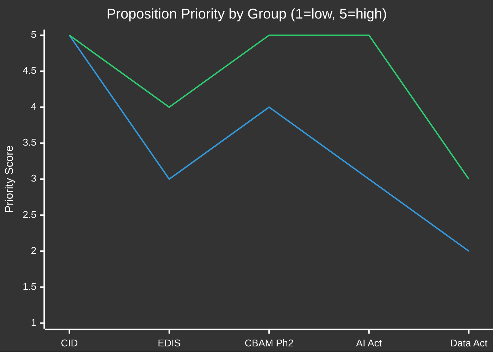

<!-- SPDX-FileCopyrightText: 2024-2026 Hack23 AB -->
<!-- SPDX-License-Identifier: Apache-2.0 -->

# Significance Scoring — EU Parliament Propositions
**Date:** 2026-05-06

---

## Significance Framework (4-Factor Model)

| Factor | Weight | Description |
|--------|:------:|-------------|
| Legislative Impact | 30% | Direct legislative output (binding law, directive, regulation) |
| Political Salience | 25% | Public/media attention; electoral sensitivity |
| Institutional Precedent | 25% | Novel use of treaty instruments; new institutional powers |
| Economic Magnitude | 20% | Scale of budget/investment/regulatory cost affected |

---

## Proposition Significance Scores

| Proposition | L.Impact | P.Salience | I.Precedent | Econ.Magnitude | **Score** | Tier |
|-------------|:--------:|:----------:|:-----------:|:--------------:|:---------:|------|
| Clean Industrial Deal (CID) | 5 | 5 | 4 | 5 | **4.80** | 🔴 CRITICAL |
| EDIS (Defence Investment Scheme) | 5 | 4 | 5 | 4 | **4.55** | 🔴 CRITICAL |
| CBAM Phase 2 | 4 | 4 | 5 | 4 | **4.25** | 🔴 HIGH |
| AI Act Implementation | 4 | 5 | 4 | 3 | **4.10** | 🔴 HIGH |
| Data Act enforcement | 3 | 3 | 3 | 3 | **3.00** | 🟡 MEDIUM |
| Circular Economy Package | 3 | 2 | 2 | 3 | **2.65** | 🟡 MEDIUM |

**Calculation**: Score = 0.30×L + 0.25×P + 0.25×I + 0.20×E

---

## CID Significance Justification

**Legislative Impact (5/5)**: The CID is a major legislative package combining decarbonisation mandates, industrial subsidy reform, and carbon border adjustment — the most ambitious single Commission legislative proposal of the EP10 term. Direct regulatory burden of estimated €300B+ in industrial transformation.

**Political Salience (5/5)**: Highest-profile EP10 proposition. Covered by all EU media; central to EPP-S&D coalition identity; connected to competitiveness narrative and Green Deal legacy.

**Institutional Precedent (4/5)**: Novel in combining ETS revenue allocation with industrial policy directives. CBAM Phase 2 extends carbon pricing to new sectors for first time. Industrial sovereignty provisions create new state-aid architecture.

**Economic Magnitude (5/5)**: Affects all heavy industry in EU-27. Estimated investment mobilisation €500B+ over 2026-2032.

---

## EDIS Significance Justification

**Legislative Impact (5/5)**: First EP-legislated EU defence investment scheme. Creates supranational defence procurement incentives — structurally new type of EU legislation.

**Political Salience (4/5)**: High, but concentrated in security/defence community. Lower broad public awareness than CID but very high among European capitals.

**Institutional Precedent (5/5)**: MAXIMUM precedent score — EDIS uses Article 122 TFEU for common defence investment for the first time. If upheld, establishes the EU's capacity to mobilise collective defence investment without unanimity.

**Economic Magnitude (4/5)**: €150B+ investment target over 5 years. Major industrial implications for defence sector across EU.

---

## Significance by Political Group Priority

**Legend**: Line 1 = EPP, Line 2 = S&D (approximate priority mapping)

---

## Strategic Significance Summary

The propositions pipeline in May 2026 contains **two CRITICAL significance items** (CID + EDIS) and **two HIGH significance items** (CBAM Phase 2 + AI Act implementation). This is an unusually dense portfolio of high-stakes legislation for a single monitoring period — a direct consequence of the +46.2% EP10 legislative velocity increase. The volume of significant propositions simultaneously in pipeline is the highest of the EP10 term to date.
