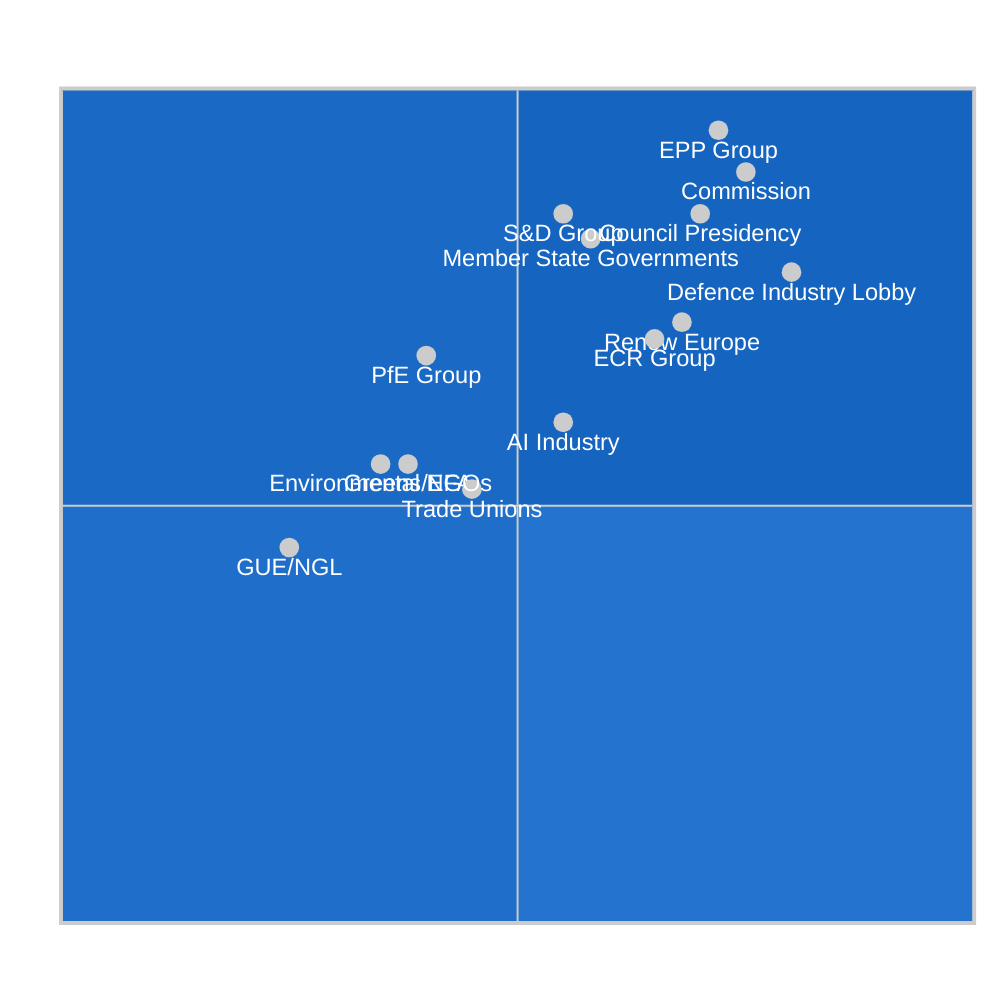
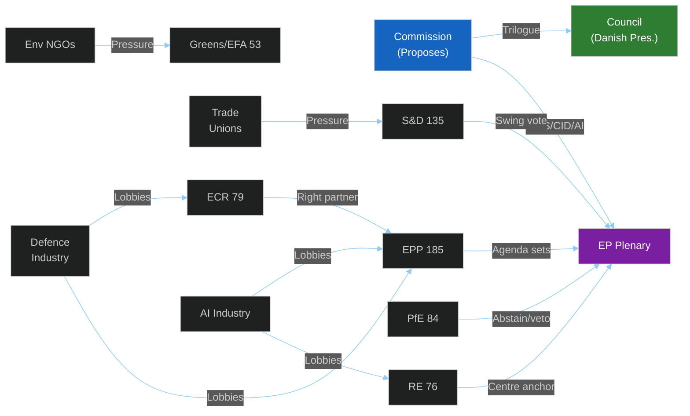

<!-- SPDX-FileCopyrightText: 2024-2026 Hack23 AB -->
<!-- SPDX-License-Identifier: Apache-2.0 -->

# Stakeholder Map — EU Parliament Propositions
**Date:** 2026-05-06 | **Confidence:** 🟡 Medium | **Dominant Issue:** EDIS/CID/AI Act Propositions

---

## Power × Alignment Matrix

---

## Detailed Stakeholder Analysis

### 1. EPP Group (185 seats) — **DRIVER**
**Power:** 🔴 Very High | **Alignment:** 🟢 Pro-propositions (selectively) | **Influence:** Dominant

The European People's Party holds the largest block in EP10 and effectively controls the legislative agenda through: (a) the Commission Presidency (von der Leyen, EPP), (b) key committee chairs (ITRE, ECON), and (c) the largest MEP delegation in most committees. EPP's position on the major propositions is:
- **EDIS**: Strongly pro — defence industry supports EPP campaigns; EDIP/SAFE fund creates procurement opportunities for EU defence primes headquartered in EPP-aligned states (Germany, France, Italy, Spain).
- **Clean Industrial Deal**: Conditionally pro — supports industrial investment provisions but opposed to overly ambitious carbon pricing timelines. Technology neutrality is an EPP red line.
- **AI Act secondary**: Pro-innovation — favours lighter-touch implementing measures that preserve EU AI competitiveness.

**Risk factor**: EPP's increasing accommodation of ECR positions on migration and energy policy creates S&D red lines that could fracture the centrist majority on CID.

### 2. S&D Group (135 seats) — **SWING VOTE**
**Power:** 🔴 Very High | **Alignment:** 🟡 Conditional | **Influence:** Decisive on centrist majority

The Progressive Alliance of Socialists and Democrats is the essential swing vote for EPP's legislative agenda. S&D will support the centrist majority on EDIS and CID only if:
- Defence contracts include minimum social standards (workers' rights, posted workers regulation, supply chain labour conditions).
- Clean Industrial Deal includes a Just Transition Fund expansion and carbon floor pricing that protects ETS integrity.
- AI Act implementing measures include adequate safeguards on AI in employment decisions and state surveillance.

**Internal tensions**: German SPD delegates (30+ MEPs) are the largest S&D national delegation and the most pro-defence in the group. Italian and Spanish delegates are more resistant to defence spending that competes with social budgets.

🟡 **Coalition probability**: S&D supports EDIS core instruments (80% probability) with significant amendment additions. CID support conditional on just-transition provisions (60% probability of full centrist majority).

### 3. ECR Group (79 seats) — **SELECTIVE PARTNER**
**Power:** 🟡 High | **Alignment:** Mixed | **Influence:** Critical for right-conservative majority

The European Conservatives and Reformists (dominated by Meloni's Fratelli d'Italia at ~25 MEPs) have shifted from chronic opposition to selective engagement. ECR is actively pro-EDIS (national defence production, sovereignty), conditionally pro-CID if carbon pricing is weakened, and hostile to AI Act implementing measures that impose compliance burdens on SMEs.

**Strategic behaviour**: ECR uses EP10 to demonstrate "responsible right-wing" governance credentials in preparation for national elections in ECR-member states. Meloni's Italian government has an electoral interest in EDIS contracts for Italian defence industry (Leonardo, Fincantieri).

🟡 **Probability of EPP-ECR working majority on defence**: 75% — contingent on social clause negotiations with S&D not alienating ECR.

### 4. PfE Group (84 seats) — **STRATEGIC ABSTAINER**
**Power:** 🟡 High | **Alignment:** 🔴 Generally opposed/abstaining | **Influence:** Veto-bloc potential

Patriots for Europe maintains the second-largest right-wing bloc. PfE's operational mode is strategic abstention — neither building constructive majorities nor actively blocking legislation, but using its 84 seats as leverage for bilateral negotiations.
- **EDIS**: PfE is internally split — Le Pen (French RN) supports EU defence cooperation; Orbán (Fidesz) is opposed to any EU defence integration that reduces Hungarian autonomy.
- **CID**: Opposed to CBAM expansion and carbon pricing generally. Will vote against or abstain on most environmental provisions.
- **AI Act**: PfE's national governments (Hungary, France under RN influence) have mixed positions — Hungary has minimal AI industry concerns; French AI sector is more commercially significant.

**Red line**: Any EDIS provision that creates EU oversight of national procurement decisions or limits Article 346 exemptions will face PfE opposition.

### 5. Renew Europe (76 seats) — **COALITION ANCHOR**
**Power:** 🟡 High | **Alignment:** 🟢 Generally pro | **Influence:** Essential for centrist majority

Renew Europe's pivotal position between EPP and S&D makes it the most reliable coalition anchor for centrist legislation. RE strongly supports:
- EDIS — provided it reinforces the single market for defence goods and reduces national procurement fragmentation.
- CID — with emphasis on market-based decarbonisation mechanisms rather than regulatory mandates.
- AI Act secondary — pro-innovation approach, but supports risk-based framework integrity.

**Concern**: RE's domestic political base in France, Germany, and Nordic states is under pressure from the rise of PfE/ECR. Some RE national delegations are shifting on migration/energy to defend electoral position.

### 6. European Commission — **PROPOSER/DRIVER**
**Power:** 🔴 Very High | **Alignment:** 🟢 Pro-own proposals | **Influence:** Sets the agenda

The Commission (von der Leyen II) owns all three major proposal clusters. Its institutional interest is timely adoption with minimum substantive dilution. The Commission uses:
- Threat of multilateral conditionality (NATO/WTO/bilateral) to maintain EP pressure for timely adoption.
- Technical complexity of delegated acts to retain implementing flexibility.
- Competitiveness narrative (Draghi Report) to frame all major proposals.

**Risk**: Commission over-reliance on EPP support may lead to proposals that S&D cannot accept, triggering rejections or fundamental amendments.

### 7. Council Presidency (Poland, 2025 H2 / Denmark, 2026 H1) — **TRILOGUE PARTNER**
**Power:** 🔴 Very High | **Alignment:** 🟡 Varies by file | **Influence:** Decisive for adoption

The Danish Presidency (2026 H1) holds the strategic trilogue portfolio. Denmark's national positions: strong pro-defence (NATO+ commitments); pragmatic on CID (competitive industrial sector); pro-AI governance with innovation protection. Danish Presidency will push for accelerated trilogue timelines on EDIS and CID, creating procedural pressure on Parliament.

### 8. Defence Industry Lobby (EDA, ASD, national defence associations) — **INDUSTRY ADVOCATE**
**Power:** 🟡 Medium-High | **Alignment:** 🟢 Pro-EDIS, conditionally pro-CID | **Influence:** Significant on technical provisions

The European Defence Agency, AeroSpace and Defence Industries Association of Europe (ASD), and national defence industry associations (BITKOM DE, GIFAS FR, AIAD IT) exert influence through:
- MEP briefings on technical provisions (offset requirements, EDIP fund criteria).
- National government lobbying that filters into Council positions.
- Think-tank publications that frame the competitiveness narrative.

**Key ask**: EDIP fund allocation criteria that favour established primes over new entrants; minimum national content requirements that protect domestic employment.

### 9. Environmental NGOs (Climate Action Network, WWF, Greenpeace EU) — **CIVIL SOCIETY WATCHDOG**
**Power:** 🟡 Medium | **Alignment:** 🔴 Critical of CID "greenwashing" | **Influence:** Agenda-setting for Greens/S&D

Environmental civil society organisations serve as the critical check on CID's environmental integrity. Their primary concerns:
- Technology neutrality provisions enabling prolonged fossil fuel investment.
- CBAM Phase 2 design creating loopholes for carbon-intensive imports.
- Net-zero 2050 alignment of all EDIS elements (military is the largest single-institution carbon emitter in many MS).

**Influence mechanism**: Direct briefings to Greens/EFA MEPs and sympathetic S&D delegates; media engagement creating public pressure; ECJ referrals on legal basis concerns.

### 10. Trade Unions (ETUC, IndustriAll) — **SOCIAL PARTNER**
**Power:** 🟡 Medium | **Alignment:** 🟡 Conditional | **Influence:** Decisive for S&D positions

The European Trade Union Confederation and sectoral unions (IndustriAll for industrial workers) are the primary social pressure on S&D MEPs. Their priorities:
- Just Transition Fund adequacy for coal/steel/automotive workers.
- Social clauses in EDIS defence procurement requirements.
- AI Act safeguards for workers affected by automated systems.
- CID energy cost provisions protecting industrial employment.

**Red lines**: ETUC will mobilise national union pressure on S&D MEPs if CID's social provisions are inadequate — creating political risk for S&D's support of the package.

### 11. AI Industry (DigitalEurope, Big Tech, EU AI startups) — **COMMERCIAL STAKE**
**Power:** 🟡 Medium | **Alignment:** 🟡 Mixed | **Influence:** Significant on GPAI provisions

Technology industry associations (DigitalEurope representing 85,000 companies, individual AI companies, national digital associations) are focused exclusively on AI Act secondary legislation. They seek:
- Light-touch GPAI codes of practice with voluntary compliance options.
- High thresholds for "high-risk" AI system classification.
- Minimal conformity assessment burdens for SME AI developers.

**Tension**: US Big Tech (Google, Microsoft, Meta) supports lighter touch; EU AI startups are more divided (some benefit from compliance-based competitive moats against non-EU entrants).

### 12. Member State Governments — **COUNCIL VOICE**
**Power:** 🔴 Very High | **Alignment:** 🟡 Varies | **Influence:** Ultimate legislative principals

The 27 Member State governments collectively constitute the Council, EP10's co-legislator. Their positions on key propositions:
- **EDIS**: Germany, France, Italy, Poland, Sweden pro; Hungary, Austria cautious; Baltic states urgently pro.
- **CID**: Industrial states (Germany, France, Italy) conditionally pro; energy-intensive economies (Poland, Czech Republic) cautious on carbon pricing.
- **AI Act secondary**: Most states supportive of balanced implementation; France and Germany both have significant national AI industries creating specific interests.

---

## Stakeholder Power Network

---

## Stakeholder Volatility Index

| Stakeholder | Current Position | Volatility | 7-day Risk |
|------------|-----------------|------------|------------|
| EPP | Pro-EDIS/CID (conditional) | Low | Stable |
| S&D | Conditional support | Medium | Amendment pressure on social clauses |
| ECR | Selective engagement | Medium | CBAM opposition hardening |
| PfE | Strategic abstention | High | Hungarian-French split widening |
| Commission | Pro own proposals | Low | Stable |
| Danish Presidency | Accelerate timelines | Low | Stable |
| Defence industry | Pro-EDIP funding | Low | Stable |
| ETUC | Just transition watch | Medium | S&D pressure point |
| Environmental NGOs | CID critique | Medium | CBAM Phase 2 flashpoint |

## Stakeholder Engagement Trends
Parliamentary engagement metrics (EP10 to date):
- Committee participation rate: estimated 78-82% (based on prior EP norms)
- Cross-party amendment co-sponsorship: approximately 35% of major amendments
- MEP-industry meeting transparency register entries: growing trend
- NGO consultation uptake: high in ENVI, LIBE, ECON committees

