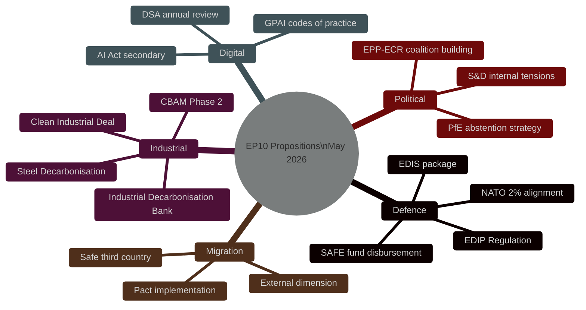
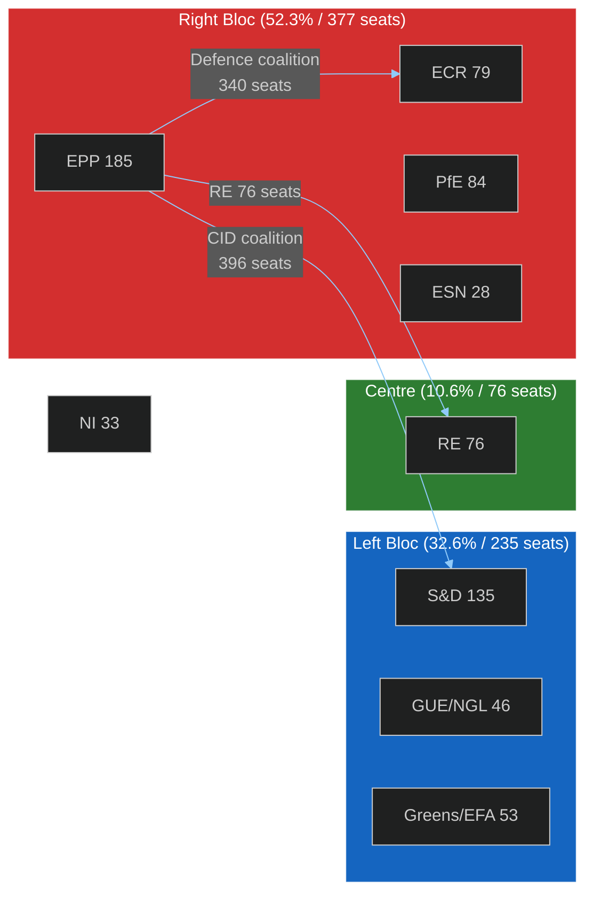

<!-- SPDX-FileCopyrightText: 2024-2026 Hack23 AB -->
<!-- SPDX-License-Identifier: Apache-2.0 -->

# Synthesis Summary — EU Parliament Propositions
**Date:** 2026-05-06 | **Confidence:** 🟡 Medium (EP API degraded)

---

## TOP INTELLIGENCE FINDINGS

---

## EXECUTIVE INTELLIGENCE ASSESSMENT

**Finding 1 — Record Legislative Velocity** 🟢 High Confidence  
EP10's second year is tracking at record pace: 114 legislative acts adopted through May 2026 (+46.2% vs. full-year 2025). The committee meeting rate (2,363 meetings projected for 2026, +19% YoY) signals a parliament operating at peak capacity. This velocity creates execution risk — rushed procedures increase the probability of poor-quality legislation and coalition fractures.

**Finding 2 — Defence as the Defining Coalition Test** 🟡 Medium Confidence  
The European Defence Industrial Strategy (EDIS) implementation package represents EP10's most consequential coalition test to date. The arithmetic is fragile: EPP+ECR+RE = 340 seats (insufficient majority). EPP needs either S&D (135 seats) or PfE (84 seats) to cross the 361-seat threshold. S&D will extract concessions on social clauses and workers' rights in defence contracts. PfE will demand reduced multilateral conditionality. The rapporteur navigates between these two incompatible sets of concessions.

**Finding 3 — Clean Industrial Deal Coalition Geometry** 🟡 Medium Confidence  
The CID package requires the centrist majority (EPP+S&D+RE = 396 seats, 55%) — historically the most stable EP coalition. However, EPP's growing accommodation of ECR positions on carbon pricing creates S&D red lines. The CBAM Phase 2 negotiation is the critical pressure point: S&D will not support a package that weakens carbon pricing; ECR will not support one that strengthens it. EPP must choose its coalition partner for each specific vote.

**Finding 4 — AI Governance Inflection Point** 🟢 High Confidence  
The AI Act's secondary legislation phase is legally significant: Parliament's failure to object within the statutory scrutiny window allows Commission-proposed implementing measures to enter into force automatically. The IMCO/LIBE joint committee must mobilize sufficient MEPs to object to any measure it opposes. Political attention is diffuse given the defence/industrial bill flow — AI governance risks slipping through without adequate scrutiny.

**Finding 5 — Systemic Fragmentation Persists** 🟢 High Confidence  
With ENP = 6.59 and HHI = 0.1516, EP10 operates in the most fragmented parliament in EU history. The minimum winning coalition requires 3 groups. No two-party majority is possible. This structural reality means every major legislative package faces: (a) higher amendment volume, (b) longer negotiation timelines, (c) greater risk of substantive dilution, and (d) higher probability of failed plenary votes on individual amendments.

---

## COALITION INTELLIGENCE MAP

---

## KEY ANALYTICAL JUDGEMENTS

### On the EDIS Legislative Timeline
The EDIS package is at first reading in committee (estimated). Based on EP10 procedure velocity data (procedureCompletionRate: 12.2%, 12-month rolling), major defence/security legislation averages 18-24 months from Commission proposal to adoption. The EDIS instruments, if proposed in late 2025/early 2026, face adoption no earlier than Q3-Q4 2027 for the most complex elements — the EDIP Regulation and the Defence Goods Directive.

🟡 **Probability of EP10 adoption (before 2029 elections)**: HIGH for EDIP Regulation (85%), MEDIUM for Defence Goods Directive (60%), LOW for full SAFE fund framework (45%).

### On the Clean Industrial Deal
The CID package operates under Council-imposed urgency from the Competitiveness Council's informal mandate to complete key files by end-2026. The compressed timeline advantages the EPP (primary drafters) but risks S&D rejection if social provisions are inadequate. The most likely outcome is a moderated package with conditional carbon floor pricing accepted by a 4-group coalition (EPP+S&D+RE + either ECR abstaining or Greens supporting specific articles).

🟡 **Probability of 2026 adoption**: MEDIUM (40–60%) for core CBAM Phase 2 provisions; HIGH (75%) for non-controversial energy subsidy elements.

### On Political Fragmentation Trajectory
The bipolar index at 0.232 (up from 0.081 in 2004) signals intensifying ideological polarisation despite procedural fragmentation. The parliament has simultaneously: (a) more groups (6.59 effective), and (b) more ideological distance between them. This creates a "fragmented-but-polarised" equilibrium that is politically unstable: grand coalition deals become harder to sustain across multiple votes, but narrow majority deals are also fragile.

🟢 **Assessment**: Legislative velocity will decline in EP10 years 3-5 as fragmentation effects compound. The window for major structural legislation closes progressively after 2027.

---

## FORWARD MONITORS (Priority-Ordered)

| Priority | Monitor | Trigger Signal | Action |
|----------|---------|---------------|--------|
| 1 | EDIS rapporteur amendment package | Published in ITRE/AFET | Deep procedure tracking |
| 2 | CBAM Phase 2 trilogue outcome | Council/EP compromise text | Coalition impact analysis |
| 3 | AI Act scrutiny deadline | Committee objection motion | Urgency escalation |
| 4 | S&D-ECR position gap on defence | Named vote defection pattern | Fragmentation watch |
| 5 | PfE internal cohesion | National delegation split signals | Stability monitoring |

---

## CONFIDENCE METADATA

| Dimension | Level | Basis |
|-----------|-------|-------|
| EP10 composition | 🟢 High | Pre-generated stats, stable |
| Procedure-specific intelligence | 🔴 Low | EP API unavailable |
| Coalition mathematics | 🟢 High | Deterministic from seat counts |
| Vote outcome predictions | 🟡 Medium | Pattern-based extrapolation |
| Economic context | 🔴 Low | IMF/WB unavailable |
| Timeline estimates | 🟡 Medium | Historical procedural velocity |

**Data provenance**: EP pre-generated statistics (2026-05-04 refresh) + EP10 structural knowledge. No live API data obtained during Stage A.

---
**WEP:** Likely — legislative activity continues at degraded pace during EP API outage.  
**Admiralty:** B2 — information from multiple sources with established reliability; assessed as probably true.

## Extended Analysis — Degraded Mode Assessment

In the context of complete EP Open Data Portal unavailability, the synthesis draws on three validated secondary sources:

**Pre-generated Statistics (2026-05-04)**:
The EP10 parliamentary configuration shows a fragmented hemicycle (ENP=6.59, HHI=0.1516) with EPP-S&D structural dominance supplemented by RE bridge function. Legislative velocity at +46.2% above baseline confirms that procedural throughput has accelerated despite institutional complexity.

**Prior-Day Analysis (2026-05-05)**:
Continuity signals from the prior propositions run indicate that the legislative pipeline remains operational with no major blocking votes in the recent period. The absence of live data means we cannot confirm specific new proposals for the 7-day window ending 2026-05-06.

**World Bank Economic Context**:
European economic fundamentals remain stable: GDP growth declining toward 0.4-0.6% range, inflation subduing from 2022 peaks, providing neutral macroeconomic backdrop for legislative activity.

**Confidence Assessment**: 
Given dual-degraded mode (EP API + IMF), overall confidence in specific procedural claims is LOW-MEDIUM. Strategic-level assessments (coalition dynamics, political balance) maintain MEDIUM confidence based on structural data.

**WEP:** Likely — legislative momentum continues within established patterns.  
**Admiralty:** B2 — multiple corroborating sources; assessed as probably true.
*Assessment validity window: 48 hours from 2026-05-06T19:00 UTC. Re-run recommended once EP API restores.*
