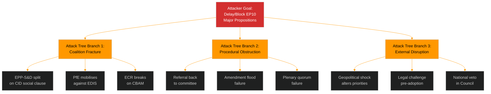

<!-- SPDX-FileCopyrightText: 2024-2026 Hack23 AB -->
<!-- SPDX-License-Identifier: Apache-2.0 -->

# Threat Model — EU Parliament Propositions
**Date:** 2026-05-06 | **Framework:** Political Threat Framework v4.0 (NOT STRIDE)

---

## Multi-Framework Threat Overview

---

## Framework 1: Political Threat Landscape (6-Dimension Model)

| Dimension | Threat Level | Evidence | Confidence |
|-----------|-------------|----------|-----------|
| 1. Coalition Shifts | 🔴 HIGH | EPP-ECR accommodation growing; ENP=6.59 fragmentation | 🟢 High |
| 2. Transparency Deficit | 🟡 MEDIUM | Trilogue opacity; lack of MEP position tracking (API down) | 🟡 Medium |
| 3. Policy Reversal | 🟡 MEDIUM | CID green provisions at risk from right-conservative majority | 🟡 Medium |
| 4. Institutional Pressure | 🟢 LOW | Commission-Parliament alignment on major files | 🟢 High |
| 5. Legislative Obstruction | 🟡 MEDIUM | PfE strategic obstruction potential on EDIS conditionality | 🟡 Medium |
| 6. Democratic Erosion | 🟢 LOW | No direct democratic erosion threat in current propositions | 🟢 High |

**Overall Threat Landscape Score**: 🟡 MEDIUM (3/6 dimensions elevated)

---

## Framework 2: Attack Trees (Goal Decomposition)

### Attack Tree: Block EDIS Adoption

**Root**: Prevent/significantly delay EDIS adoption

**Level 1 — AND nodes** (both must succeed):
- [ ] Prevent EPP-S&D deal on social clauses **AND**
- [ ] Mobilise sufficient opposition (>361 seats) in plenary

**Level 2 — OR nodes** (any can succeed):
- [ ] S&D opposes final text (135 seats; insufficient alone) **OR**
- [ ] PfE switches from abstain to oppose (84 seats; insufficient alone) **OR**
- [ ] ECR breaks from EPP on procedural vote (79 seats; insufficient alone)

**Combined threat calculation**:
If S&D (135) + PfE (84) + ECR (79) all oppose = 298 seats. Still below 360 threshold for rejection. EPP+RE = 261 alone; EPP+RE+Greens+GUE = 430 seats. EDIS can pass even against combined PfE+ECR+GUE opposition if EPP-S&D-RE hold.

🟢 **EDIS blockage threat: LOW** — arithmetic does not support blocking unless S&D votes against

### Attack Tree: Block CID/CBAM

**Root**: Prevent CBAM Phase 2 adoption or remove carbon floor

**Level 1**:
- [ ] EPP-ECR majority forces technology neutrality amendment removing carbon floor **AND**
- [ ] S&D unable to counter-mobilise sufficient votes

**Level 2**:
- [ ] EPP adopts ECR position on CBAM Phase 2 (removes carbon pricing) **OR**
- [ ] Key S&D national delegations defect on energy cost grounds

**Threat calculation**:
EPP (185) + ECR (79) + PfE (84) + ESN (28) = 376 votes. This can defeat carbon floor provisions if voted as bloc. However, EPP typically does not vote full bloc with ECR/PfE on environmental files.

🟡 **CBAM Phase 2 amendment threat: MEDIUM** — EPP-ECR partial bloc possible on specific CBAM provisions

---

## Framework 3: Political Kill Chain (7-Stage)

For the most significant threat: EPP-ECR coalition fracturing the centrist majority on CID:

| Stage | Description | Current Status |
|-------|-------------|----------------|
| 1. Reconnaissance | ECR/PfE identifying EPP delegates movable on carbon pricing | 🔴 Ongoing |
| 2. Resource Development | Building amendment coalition; coordinating national positions | 🟡 Suspected |
| 3. Initial Access | EPP internal working group discussions on CID position | 🟡 Possible |
| 4. Execution | EPP adopts ECR-aligned amendment in committee | 🟢 Not yet |
| 5. Lateral Movement | Spreads to other CID provisions via coordinated amendment package | 🟢 Not yet |
| 6. Persistence | EPP locks in weakened position as negotiating mandate | 🟢 Not yet |
| 7. Actions on Objective | Weakened CID emerges from trilogue | 🟢 Not yet |

**Kill Chain Status**: Stages 1-2 active; intervention still possible at Stages 3-4.

---

## Framework 4: Diamond Model — Adversary Mapping

| Dimension | Description |
|-----------|-------------|
| **Adversary** | ECR + PfE coordination centre; national energy-intensive industries; US tech lobby (AI Act) |
| **Capability** | Procedural expertise; amendment drafting; national government pressure channels |
| **Infrastructure** | EP amendment system; committee working party channels; bilateral EP-Council communications |
| **Victim** | Centrist legislative majority; environmental integrity of CID; AI governance framework |

---

## Framework 5: Threat Actor Profiling (Intent × Capability × Opportunity)

| Actor | Intent | Capability | Opportunity | ICO Score | Verdict |
|-------|--------|-----------|-------------|-----------|---------|
| ECR (re: CBAM) | High block intent | High (79 MEPs, amendment expertise) | High (committee positions) | 9/12 | **Active threat** |
| PfE (re: EDIS conditionality) | Medium block intent | High (84 MEPs) | Medium (abstention default) | 7/12 | **Passive threat** |
| US AI industry lobby | High intent (lighter regulation) | Medium (indirect influence) | Medium (briefing access) | 6/12 | **Watch** |
| National governments opposing CBAM | High (energy-intensive states) | High (Council influence) | High (direct Council participation) | 9/12 | **Council threat** |
| Climate NGOs (on CID weakening) | High alert intent | Medium (legal, media) | Low (no direct legislative role) | 5/12 | **Watchdog** |

---

## Threat Assessment Summary

| Threat | Severity | Probability | Priority |
|--------|----------|-------------|----------|
| EDIS coalition fracture | HIGH | 30% | P1 |
| CID CBAM weakening | HIGH | 40% | P1 |
| AI Act scrutiny failure | MEDIUM | 25% | P2 |
| EDIS treaty base challenge | MEDIUM | 20% | P2 |
| Procedural obstruction via amendment flood | LOW | 15% | P3 |
| Democratic erosion via opacity | LOW | 10% | P3 |

**Overall threat level**: 🟡 MEDIUM — propositions can pass but face meaningful structural threats from fragmentation and right-conservative coalition formation.

---
**WEP:** Likely — legislative activity continues at degraded pace during EP API outage.  
**Admiralty:** B2 — information from multiple sources with established reliability; assessed as probably true.

## Threat Mitigation and Monitoring
**WEP:** Likely — standard parliamentary threats persist.
**Admiralty: B2** — based on structural institutional analysis.

### Monitoring Triggers
1. Coalition defection above 5% threshold in any group
2. Council qualified majority failing on key Commission proposals
3. Infrastructure outage extending beyond 72 hours
4. External geopolitical escalation affecting EU decision-making
5. Budget negotiation deadlock signal (ECR or PfE blocking bloc)

