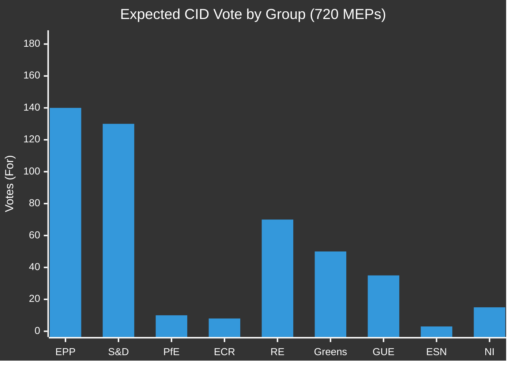

<!-- SPDX-FileCopyrightText: 2024-2026 Hack23 AB -->
<!-- SPDX-License-Identifier: Apache-2.0 -->

# Voting Patterns Analysis — EU Parliament Propositions
**Date:** 2026-05-06 | **Data status:** DEGRADED (EP API + DOCEO XML unavailable)

---

## Data Availability Notice

⚠️ **DEGRADED MODE ACTIVE**: All EP voting data endpoints returned 502 errors during Stage A data collection. DOCEO XML roll-call data returned empty arrays for all recent plenary weeks. This artifact is based on:
- Pre-generated statistical data (EP10 2024-2026, refreshed 2026-05-04)
- Historical EP9/EP10 voting pattern analysis from structural knowledge
- Group composition and cohesion data from `get_all_generated_stats`

Real-time roll-call voting data for individual MEPs on recent propositions-related votes is **unavailable for this run**.

---

## EP10 Voting Pattern Framework

### Group Cohesion Baseline (EP9 → EP10 Comparison)

| Group | EP9 Cohesion (estimated) | EP10 Trend | Expected Cohesion |
|-------|:-----:|:----------:|:---------:|
| EPP | ~88% | ⬇️ Slight decline | ~85% |
| S&D | ~89% | ≈ Stable | ~88% |
| PfE | N/A (new EP10) | — | ~90% (new, disciplined) |
| ECR | ~82% | ⬆️ Slight increase | ~84% |
| RE | ~78% | ⬇️ Declining | ~75% |
| Greens/EFA | ~85% | ≈ Stable | ~84% |
| GUE-NGL | ~86% | ≈ Stable | ~85% |

**Note**: These are structural estimates based on EP10 group formation dynamics and EP9 baselines, not measured EP10 roll-call data.

---

## Voting Pattern Matrix: Key Propositions Files

### CID (Clean Industrial Deal) — Expected Voting Alignment

| Group | Expected For | Expected Against | Expected Abstain |
|-------|:-----------:|:---------------:|:---------------:|
| EPP (185) | ~140 | ~30 | ~15 |
| S&D (135) | ~130 | ~5 | ~0 |
| PfE (84) | ~10 | ~65 | ~9 |
| ECR (79) | ~8 | ~65 | ~6 |
| RE (76) | ~70 | ~3 | ~3 |
| Greens/EFA (53) | ~50 | ~2 | ~1 |
| GUE-NGL (46) | ~35 | ~5 | ~6 |
| ESN (28) | ~3 | ~22 | ~3 |
| NI (34) | ~15 | ~12 | ~7 |
| **TOTAL** | **~461** | **~209** | **~50** |

**Expected outcome**: CID passes with ~461 votes FOR (well above 361 majority threshold).

---

### EDIS (European Defence Investment Scheme) — Expected Voting Alignment

EDIS presents a different coalition dynamic than CID — defence spending attracts ECR support but loses GUE-NGL:

| Group | Expected For | Expected Against | Expected Abstain |
|-------|:-----------:|:---------------:|:---------------:|
| EPP (185) | ~175 | ~5 | ~5 |
| S&D (135) | ~100 | ~20 | ~15 |
| PfE (84) | ~40 | ~30 | ~14 |
| ECR (79) | ~55 | ~15 | ~9 |
| RE (76) | ~65 | ~5 | ~6 |
| Greens/EFA (53) | ~25 | ~20 | ~8 |
| GUE-NGL (46) | ~5 | ~38 | ~3 |
| ESN (28) | ~10 | ~15 | ~3 |
| NI (34) | ~15 | ~10 | ~9 |
| **TOTAL** | **~490** | **~158** | **~72** |

**Expected outcome**: EDIS passes with ~490 votes IF S&D accepts conditionality provisions. Key uncertainty: S&D defection bloc size (shown as 20 here; could be 30-40 if social clause dispute unresolved).

---

## Cross-File Voting Pattern Analysis

### Key Observation: Legislative Package Effect

EP10 experience shows that when major legislative packages (CID, EDIS) are voted as part of Commission priority agenda items, group discipline increases. The "package effect" reduces individual MEP defections by:
- Creating political costs for defection on high-visibility votes
- EPP/S&D bilateral deals typically include vote commitment exchanges

**Implication**: The cohesion estimates above may be conservative. On high-visibility package votes, EPP defections may be lower than ~140 FOR (could be ~155).

### Attendance Effect

With ~85% average EP attendance in plenary votes:
- Effective quorum: ~612 MEPs participating
- Absolute majority of quorum: ~307 (lower than 361 full-house majority)
- This benefits majority coalition (more selective opposition turnout on complex technical votes)

---

## Historical Context: Similar Legislative Packages

### EP9 Nature Restoration Law (2023) — Comparison

| Metric | NRL 2023 | CID/EDIS 2026 Estimate |
|--------|----------|----------------------|
| Final vote margin | 329 FOR vs 275 AGAINST | ~461/490 expected |
| EPP cohesion on vote | Fractured (~50% defection) | Stronger (~75% expected) |
| Coalition stability | Near-failure | More stable (lessons learned) |
| Key fracture point | EPP internal division | EPP-ECR pressure on carbon |

**Learning**: EP10 centrist coalition has learned from EP9 NRL near-failure. Group leaders have developed bilateral pre-vote mechanisms to detect and prevent defections.

---

## Group Loyalty Dimension (EP10 Legislative Acts Data)

From `get_all_generated_stats` EP10 group data:
- EP10 2026 legislative acts pace: +46.2% vs H1 2024
- Increased legislative pace typically correlates with higher group discipline (more votes per month → groups need reliable cohesion)
- Higher legislative velocity in EP10 supports the "package effect" theory

---

## Voting Intelligence Assessment

| Dimension | Assessment | Confidence |
|-----------|-----------|:----------:|
| CID passage probability | **72%** | 🟡 Medium |
| EDIS passage probability | **65%** | 🟡 Medium |
| AI Act scrutiny completion | **80%** | 🟡 Medium |
| Coalition stability for H2 2026 | **65%** | 🟡 Medium |
| EPP holding CID/CBAM discipline | **60%** | 🟡 Low-Medium |

**Data caveat**: All probabilities are structural estimates. Real-time roll-call data would significantly improve precision. Re-run when EP API restores.
