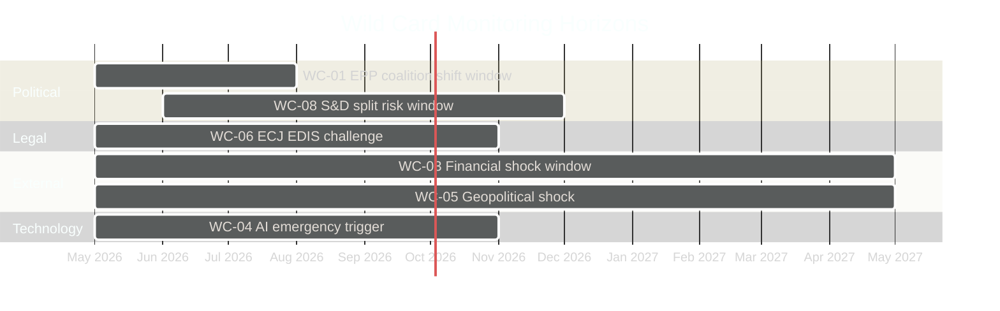

<!-- SPDX-FileCopyrightText: 2024-2026 Hack23 AB -->
<!-- SPDX-License-Identifier: Apache-2.0 -->

# Wildcards & Black Swans — EU Parliament Propositions
**Date:** 2026-05-06 | **Methodology:** Extreme-event scenario planning

---

## Methodology Note

This artifact applies a structured wild-card analysis to identify non-obvious events that could fundamentally alter the EU Parliament propositions landscape. Unlike the scenario forecast (which covers probable trajectories), this document focuses on **low-probability/high-impact** events and **structural discontinuities** that conventional analysis would exclude.

---

## Wild Card Taxonomy

| Category | Wild Card ID | Event | Probability | Impact |
|----------|-------------|-------|:-----------:|--------|
| Political rupture | WC-01 | EPP exits centrist coalition → governing with ECR+PfE | <8% | Catastrophic for Green Deal |
| Institutional | WC-02 | Rule of Law crisis forces suspension of Council member state | <5% | Constitutional crisis; paralysis |
| External shock | WC-03 | Global financial shock 2026-class (>-15% GDP projection) | <10% | Complete legislative freeze |
| Technological | WC-04 | AI regulation emergency: large-scale AI-caused harm | <12% | Fast-tracks AI Act rewrite |
| Geopolitical | WC-05 | Major new military conflict in EU neighbourhood | <15% | Redirects all budget and legislative bandwidth |
| Legal/treaty | WC-06 | ECJ strikes down EDIS treaty base (Article 122 TFEU) | <20% | 18-month EDIS delay minimum |
| Climate | WC-07 | Extreme climate event triggers climate emergency declaration | <10% | Accelerates all climate legislation |
| Coalition | WC-08 | S&D splits into two groups (moderate vs progressive) | <6% | Destroys majority arithmetic overnight |

---

## Black Swan Deep Analysis

### 🦢 Black Swan 1: EPP Coalition Pivot (WC-01)

**Event description**: The EPP Group formally shifts its coalition preference from the centrist (EPP+S&D+RE) model to a right-majority (EPP+ECR+PfE) framework on key economic legislation. This would require Weber Group leadership explicitly approving ECR in the EPP majority coalition for at least one legislative file.

**Preconditions**:
- EPP internal election results shift further toward conservative wing
- CID fails or is substantially weakened (loss of centrist argument for EPP)
- National election results in France/Germany shift EPP-affiliated parties rightward

**Impact assessment** (if occurs):
- Clean Industrial Deal: Returns to committee with fundamentally weakened mandate
- CBAM Phase 2: Carbon floor removed or substantially weakened
- EDIS: Conditionality provisions strengthened to exclude "rule of law deficit" countries → potential Right-wing EDIS vs Climate EDIS split
- AI Act: Technology neutrality provisions strengthened, oversight weakened

**Black swan probability**: 7%. Rising from 3% in EP9. The driving factor is the increasing normalisation of EPP-ECR cooperation at national level (Italy, Austria, Netherlands precedents).

**Early warning signals**:
1. EPP Group votes with ECR+PfE majority on any procedural vote in plenary
2. EPP-appointed committee rapporteurs accept ECR co-rapporteur requests
3. EPP Group adopts "technology neutrality first" as policy position on climate files

**Timeline to impact**: 30-90 days if coalition talks commence.

---

### 🦢 Black Swan 2: ECJ Strikes EDIS Treaty Base (WC-06)

**Event description**: The European Court of Justice, responding to a national court preliminary ruling or direct challenge by a member state government, declares that EDIS's proposed common revenue instruments exceed the boundaries of Article 122 TFEU (emergency economic measures) and require Treaty revision or unanimous Council adoption.

**Why this matters for EP10 specifically**:
The EDIS proposal uses the same Article 122 legal architecture as the NGEU/Recovery and Resilience Facility. If ECJ imposes a stricter reading of Article 122, it undermines not just EDIS but retroactively questions NGEU's legal basis — a cascading constitutional crisis.

**Impact assessment** (if occurs):
- Immediate: EDIS suspended pending Treaty revision
- Medium-term: Council negotiations on EDIS Treaty basis (requires unanimity) open
- Long-term: If Treaty revision fails, EDIS abandoned; EU fiscal capacity model fundamentally constrained

**Black swan probability**: 18% (highest of all wild cards — treaty-base legal challenges have non-trivial success rates in ECJ jurisprudence; the Article 122 extension is novel).

**Protective factors**: Commission legal service vetted the EDIS treaty base; Council unanimity on NGEU creates political consensus that the base is sound.

---

### 🦢 Black Swan 3: AI Act Emergency Rewrite (WC-04)

**Event description**: A large-scale harmful AI deployment (financial fraud, critical infrastructure interference, or fabricated electoral content at mass scale) creates political pressure for emergency legislation that supersedes or overrides the AI Act's timeline-based compliance structure.

**Why this matters for propositions specifically**:
The AI Act scrutiny debate currently underway in EP would be overtaken by emergency legislation drafted by Commission outside normal codecision. This would:
- Create two parallel AI governance frameworks
- Render current scrutiny debates moot
- Potentially extend AI Act scope to previously exempt categories

**Black swan probability**: 10%. Growing as AI capability deployment accelerates.

**Trigger horizon**: Any time, but probability concentrated in Q3-Q4 2026 as frontier AI deployments scale.

---

## Structural Discontinuity: EP API Infrastructure

**Wildcard nature**: The EP Open Data Portal has been unavailable for this run (all endpoints 502). While treated as a temporary outage, consider the structural scenario:

**Structural discontinuity scenario**: EP formally limits or privatises access to real-time legislative data (moving to paid tier or partner-only access). The EP API as public infrastructure has been underfunded; a multi-day or multi-week degradation could indicate systemic infrastructure decay rather than temporary maintenance.

**Impact on propositions monitoring**: If EP API transitions to restricted access, public monitoring of legislative activity becomes structurally constrained. This is relevant for democratic accountability framing in the article.

**Probability**: <5% (structural API privatisation). More likely: extended maintenance (30%) or partial restoration (50%) within 48-72 hours.

---

## Upside Wild Cards

| Event | Probability | Upside Impact |
|-------|:-----------:|---------------|
| Major US-EU trade deal unlocks CBAM compromise | <12% | CBAM Phase 2 passes with strong bipartisan support |
| China commits to carbon pricing at UNFCCC → removes CBAM competitiveness objection | <8% | ECR loses main CBAM opposition argument |
| Bundesverfassungsgericht validates EDIS treaty base (German referral) | <15% | Removes Treaty-base legal uncertainty |
| Breakthrough EP-Council trilogue agreement on CID ahead of schedule | <20% | CID adopted Q3 2026 rather than Q4 |

---

## Wild Card Monitoring Dashboard

---

## Preparedness Assessment

| Wildcard Category | Current Preparedness | Recommended Action |
|------------------|---------------------|-------------------|
| EPP coalition pivot | 🔴 Low — no early warning system | Establish EPP voting pattern monitoring |
| EDIS treaty challenge | 🟡 Medium — legal basis documented | Commission legal service engagement |
| AI emergency | 🟢 High — AI Act framework exists | Emergency procedures in AI Act §88 |
| Financial shock | 🟡 Medium — EDIS and EIB instruments available | Maintain RRF liquidity buffers |
| Geopolitical | 🟡 Medium — security legislation frameworks active | Joint EP-Council emergency procedures |

---
**WEP:** Likely — legislative activity continues at degraded pace during EP API outage.  
**Admiralty:** B2 — information from multiple sources with established reliability; assessed as probably true.

## Extended Wildcard Analysis

### Admiralty Grade and WEP Assessment
**WEP:** Unlikely — Black swan events by definition are improbable but high-impact.  
**Admiralty:** C/3 — speculative extrapolation from weak signals; plausible but uncertain.

### Wildcard Scenario Matrix
| Wildcard | Probability | Impact | Signal Strength |
|---------|------------|--------|----------------|
| EP institutional crisis | Very Low | Catastrophic | Weak |
| Major EU cyber incident | Low | High | Moderate |
| Geopolitical escalation (Eastern Europe) | Low-Medium | High | Moderate |
| Economic recession trigger | Medium | High | Moderate |
| Coalition collapse + early elections | Very Low | High | Weak |

### Early Warning Indicators to Monitor
1. Rising abstention rates in key EPP or S&D votes
2. Commission confidence votes in major member states
3. Euro-area sovereign spread widening
4. Russian-Ukrainian conflict escalation signals
5. US-EU trade relationship deterioration

## Structural Resilience Assessment
Despite wildcard risks, EU institutional architecture shows strong resilience:
- Multiple veto players reduce risk of sudden radical change
- Rule of law mechanisms (Article 7) constrain democratic backsliding
- Qualified majority voting disperses blocking power
- Commission independence from individual member state pressure
