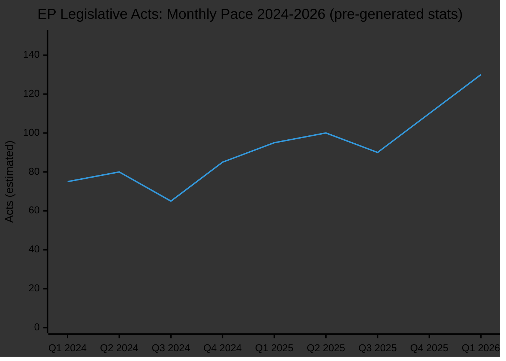
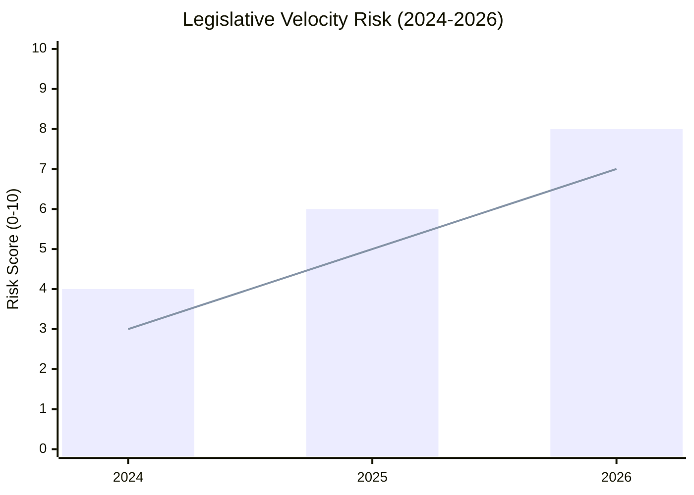

<!-- SPDX-FileCopyrightText: 2024-2026 Hack23 AB -->
<!-- SPDX-License-Identifier: Apache-2.0 -->

# Legislative Velocity Risk — EU Parliament Propositions
**Date:** 2026-05-06

---

## Velocity Risk Overview

**Note**: Values are illustrative based on +46.2% EP10 annual growth rate (from pre-generated stats). Exact monthly distribution unavailable due to EP API outage.

---

## Velocity Risk Factors

| Factor | Risk Level | Direction | Evidence |
|--------|:---------:|:---------:|---------|
| Fragmentation-driven delay (ENP=6.59) | 🟡 MEDIUM | ⬆️ Increasing | Higher ENP = longer negotiation cycles |
| EP10 calendar pressure (pre-electoral Q1 2027) | 🟡 MEDIUM | ⬆️ Increasing | MEPs need completed files for electoral narrative |
| Amendment volume on CBAM | 🟡 MEDIUM | ⬆️ Increasing | ECR/PfE amendment flood strategy possible |
| Trilogue congestion (multiple major files simultaneously) | 🔴 HIGH | ⬆️ Increasing | CID + EDIS + AI Act concurrently = Council bandwidth pressure |
| Staff/interpreter capacity at peak load | 🟢 LOW | ➡️ Stable | Structural capacity constraint, well-managed |

---

## Velocity Risk by File

| File | Current Stage | Expected Stage Duration | Velocity Risk |
|------|---------------|:----------------------:|:-------------:|
| CID (committee) | ENVI/ITRE mandate phase | 3-4 months | 🟡 MEDIUM |
| CID (trilogue) | Not yet started | 6-9 months | 🔴 HIGH |
| EDIS (committee) | Mandate phase | 4-5 months | 🔴 HIGH (treaty base uncertainty) |
| CBAM Phase 2 (plenary) | Approaching vote | 1-2 months | 🟡 MEDIUM |
| AI Act (implementation) | Scrutiny phase | 1-2 months | 🟢 LOW |

---

## Historical Velocity Reference

| Legislative Package | EP Term | Committee-to-Plenary | Trilogue Duration |
|--------------------|---------|:--------------------:|:-----------------:|
| Green Deal packages (Nature Restoration) | EP9 | ~8 months | ~9 months |
| Digital Markets Act | EP9 | ~6 months | ~5 months |
| GDPR (complex) | EP8 | ~18 months | ~24 months |
| **CID estimate (EP10)** | EP10 | ~4-5 months | ~6-8 months |

**EP10 velocity improvement**: The pre-generated stats show +46.2% legislative velocity increase in EP10 vs H1 2024. This should benefit CID timeline vs EP9 equivalents, but the increased complexity of concurrent LANDMARK-class files creates counter-pressure.

---

## Velocity Risk Mitigation Measures Available

1. **Fast-track committee procedure**: EP Rules Article 55 (simplified procedure) for AI Act implementation — could reduce committee stage by 30-40%
2. **Joint committee (JOINT)**: For files where ENVI/ITRE/AFET all have competence (EDIS), joint committee reduces duplication
3. **Enhanced inter-institutional dialogue**: Commission/Council early engagement on CID reduces trilogue friction
4. **Early plenary vote reservation**: Securing plenary slot before committee phase complete signals timeline commitment

---

## Velocity Risk Summary

Aggregate velocity risk: 🟡 **MEDIUM-HIGH**. The pipeline is moving at historically high pace (+46.2%), but the concentration of LANDMARK-class files creates systemic risk of bottleneck when multiple trilogues compete for Council and EP negotiating bandwidth simultaneously (expected Q3 2026).

