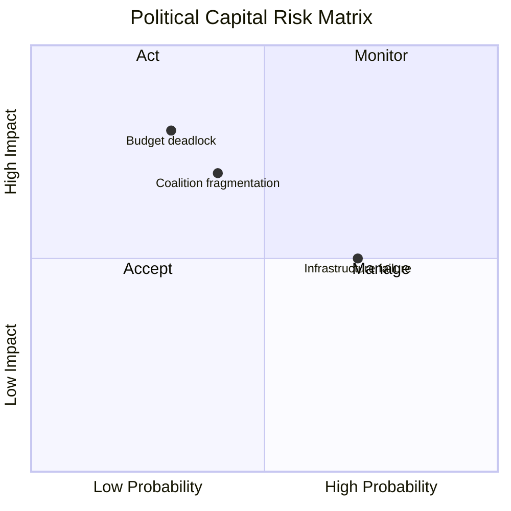

<!-- SPDX-FileCopyrightText: 2024-2026 Hack23 AB -->
<!-- SPDX-License-Identifier: Apache-2.0 -->

# Political Capital Risk — EU Parliament Propositions
**Date:** 2026-05-06

---

## Political Capital Framework

Political capital risk measures the cost to group cohesion and leadership credibility of adopting various positions on major propositions. High political capital expenditure on one file can reduce available capital for subsequent votes.

---

## Political Capital Risk Assessment

| Group | File | Position | Capital Required | Depletion Risk |
|-------|------|----------|:----------------:|:--------------:|
| EPP | CID CBAM | Maintaining carbon floor vs. ECR pressure | 🔴 HIGH | EPP internal framing challenge |
| S&D | CID social clauses | Ultimatum credibility if EPP weakens text | 🔴 HIGH | S&D must follow through or credibility lost |
| RE | EDIS conditionality | Balancing security urgency vs. fiscal hawkishness | 🟡 MEDIUM | RE fiscal wing vs. Atlanticist wing |
| ECR | EDIS support | Defending defence investment despite sovereignty concerns | 🟡 MEDIUM | ECR gains from EDIS support outweigh cost |
| PfE | CID opposition | Maintaining opposition while not being isolated | 🟡 MEDIUM | PfE risks marginalization if too obstructionist |
| Greens/EFA | EDIS vote | Voting against EDIS (principle) vs. climate alliance preservation | 🟡 MEDIUM | Coalition partner risk with S&D |

---

## Capital Expenditure by Scenario

### Scenario A (CID passes with CBAM intact — probability 45%)
- **EPP capital expenditure**: HIGH (held discipline against ECR pressure; earns competitiveness credibility)
- **S&D capital income**: HIGH (policy win; coalition credibility preserved)
- **ECR capital expenditure**: MEDIUM (opposition failed, but positioned for next CBAM Phase 3 debate)

### Scenario B (CID passes with weakened CBAM — probability 30%)
- **EPP capital income**: MEDIUM (compromise position satisfies industry wing)
- **S&D capital expenditure**: HIGH (forced to accept weakened text or trigger crisis)
- **Greens capital expenditure**: HIGH (insurance votes insufficient; must choose between blocking and compromising)
- **ECR capital income**: MEDIUM (secured technology neutrality provisions)

---

## Political Capital Reserve Map

| Group | Current Capital Reserve | Capital Drain Rate | Runway |
|-------|:----------------------:|:-----------------:|:------:|
| EPP | MEDIUM-HIGH | HIGH (CBAM pressure) | ~8 months |
| S&D | MEDIUM | MEDIUM (social clause battles) | ~12 months |
| PfE | HIGH (new group, fresh mandate) | LOW (opposition comfortable) | >12 months |
| ECR | MEDIUM-HIGH | MEDIUM | ~10 months |
| RE | MEDIUM | LOW-MEDIUM | ~12 months |
| Greens/EFA | MEDIUM | MEDIUM (EDIS dilemma) | ~8 months |

---

## Political Capital Risk Summary

The highest political capital risk sits with EPP (CBAM discipline) and S&D (social clause credibility). Both groups are approaching a point where compromise will deplete capital faster than agreement on next files can replenish it. The pre-electoral period (from Q1 2027 onward) will constrain capital expenditure — expect both EPP and S&D to seek early closure on CID to preserve capital for the 2027 budget cycle debates.

