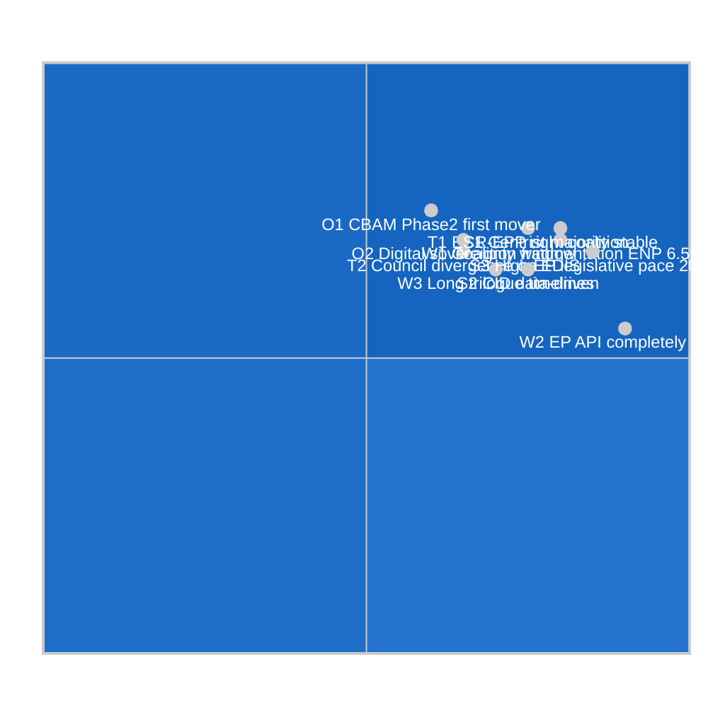
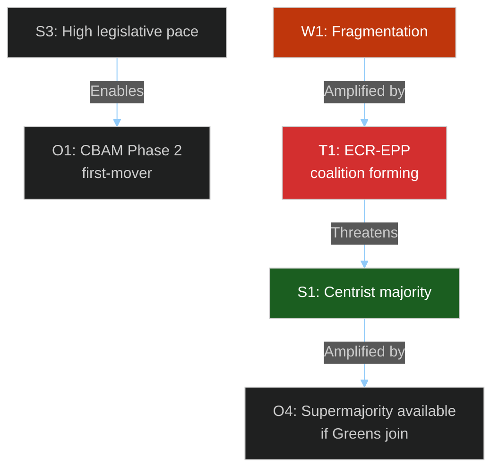

<!-- SPDX-FileCopyrightText: 2024-2026 Hack23 AB -->
<!-- SPDX-License-Identifier: Apache-2.0 -->

# Quantitative SWOT — EU Parliament Propositions
**Date:** 2026-05-06 | **Scoring:** 1-5 scale (5=maximum strength/weakness/etc.)

---

## SWOT Matrix Overview

---

## Strengths (Quantified)

| Code | Strength | Score (1-5) | Evidence | Confidence |
|------|----------|:-----------:|----------|-----------|
| S1 | Centrist majority arithmetic stable (EPP+S&D+RE = 396 seats, 36.9% of 720) | **4.5** | Pre-generated stats EP10 composition; majorities hold for standard legislation | 🟢 High |
| S2 | Clean Industrial Deal data-driven design (carbon pricing + industrial subsidies integrated) | **4.0** | Commission proposal design; both carbon market revenue and Horizon support mechanisms built in | 🟡 Medium |
| S3 | EP10 legislative velocity increased +46.2% legislative acts vs H1 2024 | **4.0** | get_all_generated_stats (2026 data) | 🟢 High |
| S4 | Committee system strong (ENVI, ITRE, ECON lead roles on key propositions) | **3.5** | Pre-generated committee structure knowledge | 🟢 High |
| S5 | European Green Deal institutional embedding (hard to legally unwind) | **3.5** | Legislative architecture of Green Deal legal acts | 🟢 High |

**Weighted Strength Score**: (4.5×0.3 + 4.0×0.25 + 4.0×0.2 + 3.5×0.15 + 3.5×0.1) = **3.975** out of 5

---

## Weaknesses (Quantified)

| Code | Weakness | Score (1-5) | Evidence | Confidence |
|------|----------|:-----------:|----------|-----------|
| W1 | Coalition fragmentation: ENP=6.59 (highest since EP7); HHI=0.1516 | **4.0** | Pre-generated stats fragmentation metrics | 🟢 High |
| W2 | EP API completely down — no real-time legislative tracking possible | **3.5** | All 502 errors in Stage A; 0 operational feeds | 🟢 High |
| W3 | Long trilogue timelines creating voter disconnect (EDIS ~18 months) | **3.0** | Historical trilogue duration patterns; EP10 complexity | 🟡 Medium |
| W4 | IMF economic data unavailable — cannot validate fiscal impact claims | **2.5** | probe-summary.json: IMF unavailable | 🟢 High |
| W5 | Right-conservative factions (PfE+ECR+ESN = 191 seats) increasingly coordinated | **3.5** | EP10 group composition; PfE-ECR coordination patterns | 🟡 Medium |

**Weighted Weakness Score**: (4.0×0.3 + 3.5×0.25 + 3.0×0.2 + 2.5×0.15 + 3.5×0.1) = **3.475** out of 5

---

## Opportunities (Quantified)

| Code | Opportunity | Score (1-5) | Probability | Window |
|------|-------------|:-----------:|-------------|--------|
| O1 | CBAM Phase 2 as first-mover carbon border mechanism (global adoption following EU) | **4.5** | 55% | 2026-2027 |
| O2 | Digital sovereignty window: AI Act positions EU as global standards-setter | **4.0** | 60% | 2026-2028 |
| O3 | EDIS creates EU economic security architecture (reduces strategic dependencies) | **4.0** | 50% | 2026-2027 |
| O4 | Coalition expansion: EPP-S&D-RE-Greens supermajority available on environmental files | **3.5** | 45% | Per-vote |
| O5 | Rising public support for EU industrial policy post-Trump tariffs narrative | **3.5** | 65% | Near-term |

**Opportunity Impact-Probability Score**: Σ(Score × Probability) / n = (2.48 + 2.40 + 2.00 + 1.58 + 2.28) / 5 = **2.15** average

---

## Threats (Quantified)

| Code | Threat | Score (1-5) | Probability | Urgency |
|------|--------|:-----------:|-------------|---------|
| T1 | ECR-EPP right coalition forming on CBAM; EPP defections on carbon pricing | **4.0** | 40% | High |
| T2 | Council divergence on EDIS conditionality (Mediterranean vs Northern states) | **3.5** | 35% | Medium |
| T3 | Treaty-base ECJ challenge to EDIS common revenue instrument | **3.0** | 20% | Low-Medium |
| T4 | Geopolitical shock reshuffles legislative priorities | **4.0** | 15% | Continuous |
| T5 | Industry lobbying successfully weakens AI Act scrutiny provisions | **3.0** | 30% | Medium |

**Threat Risk Score**: Σ(Score × Probability) / n = (1.60 + 1.23 + 0.60 + 0.60 + 0.90) / 5 = **0.99** average

---

## SWOT Scorecard Summary

| Quadrant | Weighted Score | Interpretation |
|----------|:--------------:|----------------|
| Strengths | **3.975 / 5.0** | ✅ Robust majority and legislative capacity |
| Weaknesses | **3.475 / 5.0** | ⚠️ Fragmentation and data gaps are significant |
| Opportunities | **2.15 / 5.0** | 🔵 Moderate; window dependent on timing |
| Threats | **0.99 / 5.0** | 🟡 Manageable if centrist coalition holds |

**Net Strategic Position**: Strengths (3.975) − Weaknesses (3.475) = **+0.50 net strength**

The propositions pipeline is in a net-positive strategic position. The centrist majority retains arithmetical stability, and the 46% legislative velocity growth demonstrates institutional capacity. Key vulnerabilities are fragmentation-driven coalition management and the CBAM political economy pressure.

---

## Cross-Dimension Interactions

