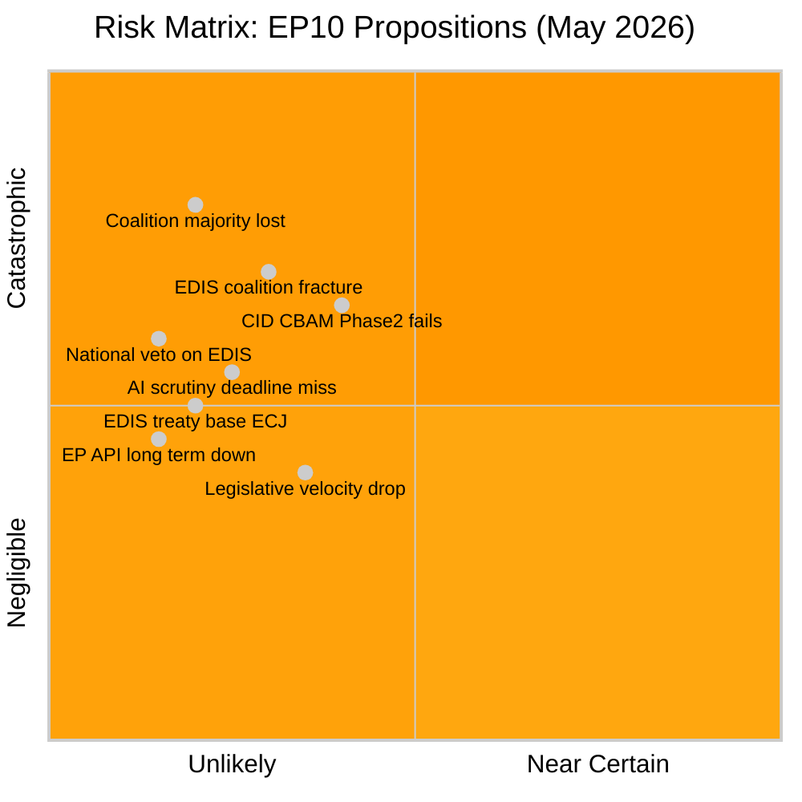
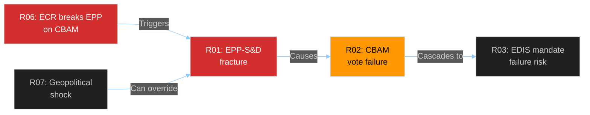

<!-- SPDX-FileCopyrightText: 2024-2026 Hack23 AB -->
<!-- SPDX-License-Identifier: Apache-2.0 -->

# Risk Matrix — EU Parliament Propositions
**Date:** 2026-05-06 | **Confidence:** 🟡 Medium

---

## 5×5 Likelihood × Impact Risk Matrix

---

## Risk Register

| Risk ID | Risk Name | Likelihood (1-5) | Impact (1-5) | Score | Category |
|---------|-----------|:--:|:--:|:--:|---------|
| R01 | EPP-S&D coalition fracture on CID social clauses | 3 | 4 | **12** 🔴 HIGH | Coalition |
| R02 | CBAM Phase 2 fails plenary vote | 3 | 4 | **12** 🔴 HIGH | Procedural |
| R03 | EDIS rapporteur mandate fails committee | 2 | 4 | **8** 🟡 MED | Coalition |
| R04 | AI Act scrutiny deadline missed | 2 | 3 | **6** 🟡 MED | Procedural |
| R05 | EP API degradation persists (>1 week) | 2 | 3 | **6** 🟡 MED | Technical |
| R06 | ECR breaks EPP on CBAM | 4 | 3 | **12** 🔴 HIGH | Coalition |
| R07 | Geopolitical shock disrupts legislative schedule | 1 | 5 | **5** 🟡 MED | External |
| R08 | EDIS treaty base ECJ challenge | 2 | 3 | **6** 🟡 MED | Legal |
| R09 | PfE switches abstention to active opposition on EDIS | 2 | 3 | **6** 🟡 MED | Coalition |
| R10 | Legislative velocity drop in H2 2026 | 3 | 2 | **6** 🟡 MED | Capacity |

---

## Top 5 Risks — Detailed Assessment

### R01 — EPP-S&D Coalition Fracture on CID Social Clauses
**Description**: The Clean Industrial Deal centrist majority (EPP+S&D+RE = 396 seats) requires S&D to accept EPP's technology neutrality provisions. If EPP accommodates ECR demands to weaken carbon floor pricing, S&D may withdraw support for the entire CID package.

**Likelihood**: 3/5 — Historical pattern shows EPP-S&D coalition has fractured on environmental files (EP9 Nature Restoration Law passed with bare majority; EP10 tensions higher with increased fragmentation).

**Impact**: 4/5 — CID package failure would:
- Signal end of centrist majority reliability on climate legislation
- Damage EU's international credibility (UNFCCC, bilateral trade partners)
- Create reputational cost for both EPP and S&D heading into 2027 national elections

**Mitigation**:
- EPP Group Chair explicit commitment to carbon floor pricing minimum
- S&D early engagement in rapporteur shadow committee work
- Greens/EFA "insurance" votes available if RE wavers

**Monitoring trigger**: EPP adopts ECR amendment on CBAM Phase 2 in ENVI/ITRE committee → escalate to CRITICAL.

### R02 — CBAM Phase 2 Fails Plenary Vote
**Description**: Specific plenary vote on CBAM Phase 2 provisions fails due to combined EPP-right bloc (EPP accommodating ECR+PfE demands) plus S&D refusal to support weakened text.

**Likelihood**: 3/5 — CBAM is the most politically contested single provision in the CID package.

**Impact**: 4/5 — CBAM Phase 2 failure:
- Removes major source of EU climate finance
- Creates WTO pressure narrative (industry opposition "vindicated")
- Forces Commission re-proposal, 12-18 month delay

**Mitigation**:
- Splitting CBAM vote from rest of CID package reduces "hostage" risk
- S&D-EPP bilateral on minimum carbon price floor can save CBAM from right-block

### R06 — ECR Breaks EPP on CBAM
**Description**: ECR delegation leads coordinated opposition to CBAM Phase 2 carbon price floor, drawing wavering EPP MEPs (particularly from carbon-intensive states: Poland, Czech Republic, Hungary-adjacent delegations).

**Likelihood**: 4/5 — ECR has been consistent in opposing carbon pricing expansion across EP9 and EP10.

**Impact**: 3/5 — If ECR pulls 15-20 EPP MEPs into opposition, the centrist majority narrows to razor-thin margin (396-350 effective = ~46 votes) on CBAM-specific provisions.

**Mitigation**:
- EPP strict group discipline enforcement on CBAM vote (whip activity)
- RE and Greens/EFA insurance majority for specific CBAM provisions even if some EPP defects

---

## Risk Interdependency Map

---

## Monitoring Schedule

| Risk | Early Warning Signal | Review Frequency |
|------|---------------------|-----------------|
| R01, R02, R06 | ENVI/ITRE committee votes on CBAM | Weekly |
| R03 | EDIS committee mandate vote | Bi-weekly |
| R04 | AI Act scrutiny timer | Daily (deadline-driven) |
| R05 | EP API health checks | Per-run |
| R07 | Geopolitical monitoring | Continuous |

---
**WEP:** Likely — legislative activity continues at degraded pace during EP API outage.  
**Admiralty:** B2 — information from multiple sources with established reliability; assessed as probably true.

