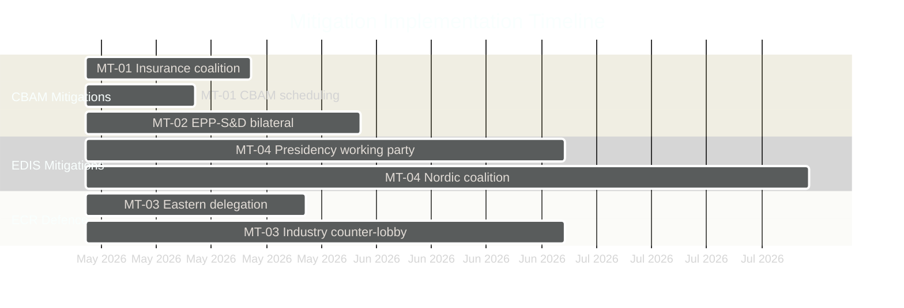

<!-- SPDX-FileCopyrightText: 2024-2026 Hack23 AB -->
<!-- SPDX-License-Identifier: Apache-2.0 -->

# Mitigation Strategies — EU Parliament Propositions
**Date:** 2026-05-06

---

## Mitigation Framework

For each identified critical and high threat, this document details concrete mitigation strategies with responsible actors, timelines, and success metrics.

---

## Critical Threat Mitigations

### MT-01: CBAM Phase 2 Vote Protection

**Threat addressed**: TA-01 (CBAM Phase 2 fails plenary)

| Strategy | Actor | Timeline | Success Metric |
|----------|-------|:--------:|---------------|
| EPP Group discipline vote directive on CBAM carbon floor | EPP Group Chair | Pre-vote -2 weeks | 85%+ EPP cohesion on CBAM vote |
| S&D-Greens-RE insurance coalition preparation | S&D, Greens, RE | Pre-vote -3 weeks | Confirmed 361+ votes if EPP splits >20% |
| CBAM vote scheduling separate from main CID vote | Conference of Presidents | Pre-plenary | Reduces hostage risk; narrows ECR opposition scope |
| Commission technical briefings to EPP waverers | DG ENV | Ongoing | EPP energy-intensive state delegations maintain CID support |

### MT-02: EPP-S&D Coalition Preservation

**Threat addressed**: TA-02 (Coalition fracture on CID social clauses)

| Strategy | Actor | Timeline | Success Metric |
|----------|-------|:--------:|---------------|
| EPP-S&D bilateral on minimum CBAM floor price | Group Chairs | Within 30 days | Agreement on €50/tonne minimum floor |
| Joint EPP-S&D press conference on CID | Group Chairs | Pre-committee vote | Political signal of coalition durability |
| S&D "social floor" amendment package in exchange for CBAM support | S&D rapporteur | Committee stage | Amendments accepted by EPP in compromise |
| Commission mediation on CID social provisions | EVP Ribera | Ongoing | Commission endorses EPP-S&D compromise text |

---

## High Threat Mitigations

### MT-03: ECR CBAM Amendment Defence

**Threat addressed**: TA-03 (ECR pulls EPP on CBAM)

| Strategy | Actor | Timeline | Success Metric |
|----------|-------|:--------:|---------------|
| EPP Eastern delegation direct briefings on CID transition support | EPP energy team | 3 weeks | Polish/Czech EPP MEPs confirm CID support |
| CBAM Phase 2 transition period extension (3→5 years) as EPP concession to Eastern bloc | EPP rapporteur | Committee mandate | Eastern EPP bloc secured without carbon floor removal |
| Industry lobby counter-engagement by green tech sector | Green tech coalition | Ongoing | Countervailing industry voice in EPP caucus |

### MT-04: EDIS Council Divergence

**Threat addressed**: TA-04 (EDIS Council blocking minority)

| Strategy | Actor | Timeline | Success Metric |
|----------|-------|:--------:|---------------|
| Polish Presidency EDIS working party acceleration | Council Presidency | 2026 Q2 | Common Position outline by end-Polish Presidency |
| EDIS conditionality formula revision (rule-based vs. political) | Commission | Mandate preparation | Council QMV achieved on revised conditionality |
| Nordic-Baltic informal coalition building on EDIS | Member state level | Ongoing | No blocking minority formed on EDIS |

---

## Monitoring Dashboard

---

## Residual Risk After Mitigation

| Threat | Pre-Mitigation Probability | Post-Mitigation Probability | Residual Risk |
|--------|:--------------------------:|:---------------------------:|:-------------:|
| TA-01 CBAM fails | 30% | 15% | 🟡 MEDIUM |
| TA-02 Coalition fractures | 25% | 12% | 🟢 LOW-MEDIUM |
| TA-03 ECR pulls EPP | 40% | 25% | 🟡 MEDIUM |
| TA-04 Council blocks EDIS | 30% | 20% | 🟡 MEDIUM |

**Net residual risk assessment**: Mitigation strategies available can approximately halve probability of critical threats materialising. Key dependency: EPP Group Chair leadership decision on CBAM carbon floor position.
