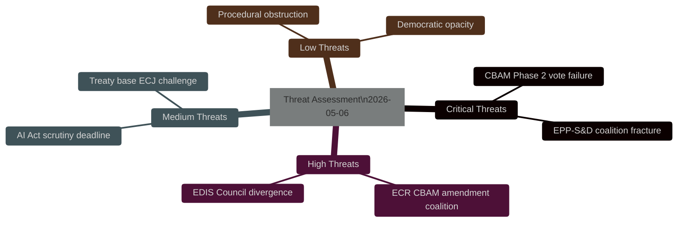

<!-- SPDX-FileCopyrightText: 2024-2026 Hack23 AB -->
<!-- SPDX-License-Identifier: Apache-2.0 -->

# Threat Assessment — EU Parliament Propositions
**Date:** 2026-05-06

---

## Threat Assessment Summary

---

## Threat Classification

| Threat ID | Threat | Severity | Likelihood | Detection | Response Available |
|-----------|--------|:--------:|:----------:|:---------:|:-----------------:|
| TA-01 | CBAM Phase 2 fails plenary | CRITICAL | 30% | 🟡 Moderate | ✅ Yes |
| TA-02 | EPP-S&D fracture on CID social clauses | CRITICAL | 25% | 🟡 Moderate | ✅ Yes |
| TA-03 | ECR CBAM amendment coalition pulls EPP | HIGH | 40% | 🟢 High | ✅ Yes |
| TA-04 | EDIS Council blocking minority | HIGH | 30% | 🟡 Moderate | 🟡 Partial |
| TA-05 | AI Act scrutiny deadline missed | MEDIUM | 25% | 🟢 High | ✅ Yes |
| TA-06 | EDIS ECJ treaty base challenge | MEDIUM | 20% | 🟢 High | 🟡 Partial |
| TA-07 | Amendment flood delays CID mandate | MEDIUM | 35% | 🟢 High | ✅ Yes |
| TA-08 | Geopolitical shock disrupts schedule | LOW | 15% | 🟢 High | 🟡 Partial |

---

## Critical Threat Deep Analysis

### TA-01: CBAM Phase 2 Fails Plenary Vote

**Attack chain**: ECR coordinates CBAM opposition → pulls wavering EPP MEPs (Eastern bloc, energy-intensive industries) → S&D refuses to compensate EPP defectors → vote fails or passes with weakened text requiring Council renegotiation.

**Detection signals**:
- Pre-vote polling shows EPP national delegation divergence >20%
- ECR tabling amendment to remove carbon price floor
- S&D-EPP bilateral talks stall

**Available responses**:
1. EPP Group Chair issues binding group discipline vote directive
2. S&D-Greens-RE insurance majority negotiation for CBAM-specific vote
3. CBAM vote separated from main CID package (reduces hostage risk)

### TA-02: EPP-S&D Coalition Fracture on CID

**Attack chain**: EPP adopts technology neutrality framing → CID CBAM provisions weakened in mandate → S&D Group Chair issues ultimatum → EPP-S&D bilateral fails → coalition breaks → CID returns to committee.

**Detection signals**:
- EPP Group Chair press statement on "technology neutrality first"
- S&D Group formally registers "red line" objection to CBAM weakening
- Commission withdraws support for EPP-amended mandate

**Available responses**:
1. Mediated EPP-S&D bilateral on minimum CBAM floor acceptable to both
2. RE and Greens insurance majority preparation
3. Commission re-engagement with EPP at working party level

---

## Response Capability Matrix

| Threat | EP Internal Response | Commission Response | Council Response |
|--------|:-------------------:|:------------------:|:----------------:|
| TA-01 | GROUP DISCIPLINE (EPP) | Lobbying EPP leadership | Council backing for carbon pricing |
| TA-02 | BILATERAL MEDIATION | Technical working party re-engagement | N/A (EP internal) |
| TA-03 | GROUP WHIP | Technical briefings | N/A |
| TA-04 | N/A | Commission compromise proposal | QMV coalition building |
| TA-06 | Legal service engagement | Defend Article 122 at ECJ | Amicus brief supporting EP |

---

## Threat Trend Assessment

**30-day trend**: Threat level rising for TA-01 and TA-03 as CBAM Phase 2 committee vote approaches. Threat level stable for TA-04 and TA-06.

**90-day trend**: EDIS threats (TA-04, TA-06) will rise as EDIS mandate phase begins. CBAM threats will either resolve (vote passes) or escalate (requires emergency trilogue revision).

**Overall threat trajectory**: ⬆️ RISING — EP10 legislative density creates compounding threat exposure. Multiple high-stakes votes in 60-day window increases probability that at least one critical threat materialises.
