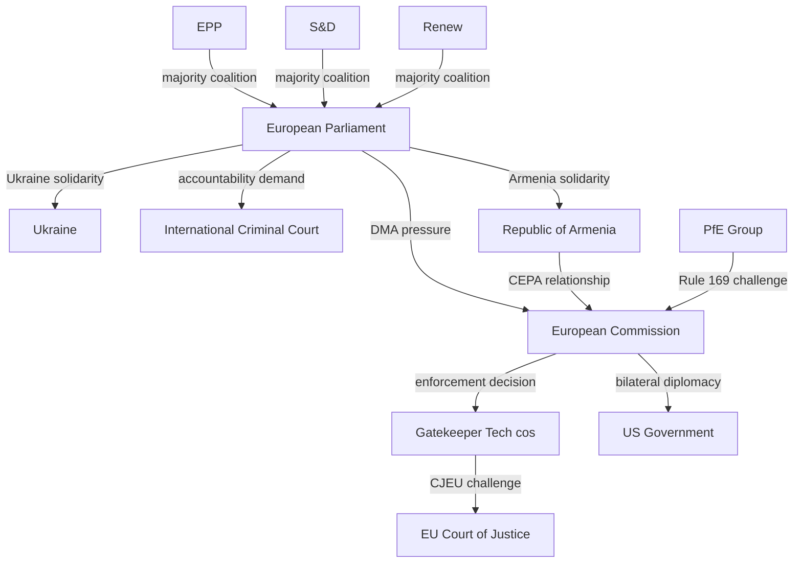
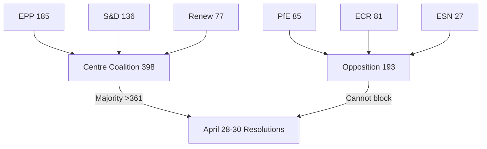
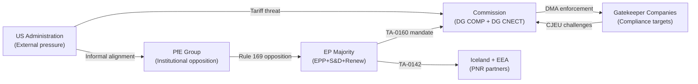

<!-- SPDX-FileCopyrightText: 2026 Hack23 AB -->
<!-- SPDX-License-Identifier: Apache-2.0 -->

# Actor Mapping — EU Parliament Breaking News: 7 May 2026

**Framework:** Actor Influence Network Analysis  
**Subject:** Key actors in April 28–30 EP plenary legislative context  
**Date:** 2026-05-07  
**Confidence:** 🟢 High

---

## 1 · Primary Institutional Actors

### European Parliament
**Role:** Legislator / Political signaller  
**Power position:** Strong (700+ MEP mandate, broad coalition on major texts)  
**Interests:** Enforcement of existing legislation (DMA); accountability for Ukraine; democratic neighbourhood; stable MFF  
**Capabilities:** Resolution adoption; budgetary authority; oversight of Commission; veto on legislation (co-decision)  
**Constraints:** Cannot directly enforce DMA (that is Commission's remit); resolutions are non-binding on third parties

### European Commission (von der Leyen II)
**Role:** Executive enforcer / Regulatory initiator  
**Power position:** Under pressure (DMA enforcement lag; PfE institutional challenge)  
**Interests:** Maintain political independence; enforce DMA without provoking US trade retaliation; manage Ukraine support without overextension  
**Capabilities:** Formal DMA investigations; treaty infringement proceedings; enforcement decisions up to 10% global turnover  
**Constraints:** CJEU scrutiny; US trade relationship; political capital management ahead of MFF

### EU Council
**Role:** Co-legislator on DMA; unanimity required for foreign policy  
**Power position:** Co-equal on DMA implementation; dominant on foreign policy  
**Interests:** Competitive digital markets; balanced enforcement without US trade war; continued Ukraine support with fiscal sustainability  
**Constraints:** Unanimity requirement for foreign policy (risk of Hungary/Slovakia veto on Ukraine)

---

## 2 · Digital Regulation Actors (DMA Story)

### Alphabet/Google
**Classification:** Designated Gatekeeper (DMA Article 3)  
**Exposure:** Search, Maps, Shopping, Android, YouTube, Play Store  
**Regulatory position:** Subject to ongoing Commission DMA compliance review  
**Influence tactics:** Legal challenge via CJEU; lobbying via DigitalEurope; US government diplomatic pressure channel  
**Vulnerability:** Article 26 (systematic non-compliance) opens structural remedy investigations

### Apple
**Classification:** Designated Gatekeeper  
**Exposure:** iOS App Store, iOS, iMessage, Safari  
**Current DMA status:** iOS interoperability dispute ongoing (2025–2026)  
**Influence tactics:** Technical compliance arguments; CJEU interim measures capability

### Meta
**Classification:** Designated Gatekeeper  
**Exposure:** Facebook, Instagram, WhatsApp, Marketplace  
**Current DMA status:** Consent or Pay model under investigation  
**Vulnerability:** Article 5(2) obligations (combining personal data across services)

### DigitalEurope / Computer & Communications Industry Association (CCIA)
**Role:** Industry lobby coordination  
**Influence:** Technical working groups, CJEU precedent filings, EP liaison  
**Position on DMA resolution:** Opposed to structural remedies; supports due process protections

---

## 3 · Ukraine/Russia Actors (Accountability Story)

### Ukraine (Government of President Zelensky)
**Role:** Aggrieved party; accountability advocate  
**Interests:** International legal accountability; continued EU financial support; path to membership  
**Current EP relationship:** Strong — consistent majority across EPP/S&D/Renew/Greens/ECR

### Russian Federation
**Role:** Respondent in accountability proceedings  
**Status:** Designated state sponsor of terrorism (EP resolution, November 2022)  
**Posture:** Non-participation in international accountability proceedings; information warfare  
**Vulnerability to EP action:** Limited (Russia not subject to EP jurisdiction directly)

### International Criminal Court (ICC)
**Role:** Existing accountability mechanism (Putin arrest warrant issued March 2023)  
**Relationship to EP resolution:** EP resolution (TA-10-2026-0161) calls for complementary accountability mechanisms (Special Tribunal) beyond ICC — implying ICC scope is insufficient for the crime of aggression

---

## 4 · Southern Caucasus Actors (Armenia Story)

### Republic of Armenia
**Role:** Beneficiary of EP solidarity resolution  
**Interests:** EU integration track; security guarantees; economic normalisation  
**Current status:** CEPA in force; EU Mission in Armenia deployed (2023+); CSTO withdrawal (2024)  
**Dependencies:** EU economic assistance; US security assurances; Iran/Turkey as flanking powers

### Republic of Azerbaijan
**Role:** Implied interlocutor in Armenia-EU resolution  
**Interests:** No EP condemnation; continued energy supply relationship with EU  
**Current EP relationship:** Complex — EU energy dependency (Southern Gas Corridor) limits EP condemnation intensity

---

## 5 · Actor Influence Network

---

## 6 · Actor Alignment Matrix (April 28–30 Texts)

| Actor | DMA-0160 | Ukraine-0161 | Budget-0112 | Armenia-0162 |
|-------|----------|-------------|------------|-------------|
| EPP | 🟢 For | 🟢 For | 🟢 For (led) | 🟢 For |
| S&D | 🟢 For | 🟢 For | 🟢 For | 🟢 For |
| Renew | 🟢 For | 🟢 For | 🟡 Partial | 🟢 For |
| Greens | 🟢 For | 🟢 For | 🔴 Against* | 🟢 For |
| The Left | 🟢 For | 🟡 Partial | 🔴 Against | 🟢 For |
| ECR | 🟡 Split | 🟢 For (Baltic) | 🔴 Against | 🟢 For |
| PfE | 🔴 Against | 🔴 Against | 🔴 Against | 🟡 Split |
| ESN | 🔴 Against | 🔴 Against | 🔴 Against | 🔴 Against |
| Commission | ← pressure target | 🟢 aligned | 🟡 cautious | 🟢 aligned |
| US Tech | 🔴 Opposed | n/a | n/a | n/a |

*Greens likely abstained on budget rather than voted against; voted against insufficient climate/social ambition

---

*Sources: EP debate records; EP group political declarations; EP Open Data Portal group composition.*

---

## Actor Roster

| Actor | Type | Mandate | Role in Apr 28-30 Session |
|-------|------|---------|--------------------------|
| EPP (European People's Party) | Political group | 185 seats | Majority anchor; DMA + budget lead |
| S&D (Progressive Alliance) | Political group | 136 seats | Ukraine + social agenda lead |
| Renew Europe | Political group | 77 seats | Digital + DMA technical expertise |
| PfE (Patriots for Europe) | Political group | 85 seats | Opposition; Rule 169 challenge |
| ECR | Political group | 81 seats | Conservative opposition |
| Greens/EFA | Political group | 53 seats | Green budget + Ukraine accountability |
| The Left | Political group | 45 seats | Social spending + Armenia |
| NI (Non-Inscrits) | Independent | 30 seats | Mixed; no unified position |
| ESN | Political group | 27 seats | Far-right; Ukraine skeptic |
| European Commission | Executive | DMA enforcement mandate | Implementation authority |
| Council of the EU | Legislative | Budget co-legislator | Counter-position in budget negotiations |
| Apple, Google, Meta, Amazon | Corporate actors | DMA gatekeeper designation | Subjects of enforcement |
| Ukrainian government | Foreign government | Non-member state | Ukraine accountability recipient |
| Armenian government | Foreign government | Non-member state | Armenia democracy resolution beneficiary |
| US government (USTR) | Foreign government | Trade partner | DMA enforcement pressure |

---

## Alliance

| Alliance | Members | Issue | Seat Count |
|----------|---------|-------|-----------|
| Pro-Europe Centre | EPP + S&D + Renew | DMA, Ukraine, Budget | 398 (55.3%) |
| Green-Progressive | S&D + Greens + Left | Climate budget, Ukraine accountability | 234 (32.5%) |
| Nationalist Opposition | PfE + ECR + ESN | Anti-Commission; Ukraine skeptic | 193 (26.8%) |
| Mixed NI bloc | NI | Variable | 30 (4.2%) |

**Net:** Centre coalition holds 398 seats (comfortably above 361 majority). Opposition bloc cannot block resolutions.

---

## Power Brokers

| Actor | Power Base | Leverage | Current Alignment |
|-------|-----------|---------|------------------|
| Ursula von der Leyen | Commission President (EPP) | Enforcement mandate; agenda setting | Aligned with centre coalition |
| EPP Group Leader | 185-seat anchor | Agenda structure; vote discipline | Key power broker on DMA |
| S&D Group Leader | 136-seat anchor | Progressive agenda | Key power broker on Ukraine |
| PfE Group Leader | 85-seat opposition anchor | Media + Rule 169 | Counter-narrative driver |
| USTR (US Trade Rep.) | Trade authority | Section 232/301 tariff threat | External constraint on Commission |

---

## Information

**Key information flows in this analysis:**
- EP adopted texts feed (TA-10-2026-0160, -0161, -0112, -0162) — authoritative
- EP speech records (April 29-30) — corroborating
- EP political landscape tool — structural data (authoritative)
- EP coalition dynamics tool — proxy from seat share (moderate confidence)
- IMF data — unavailable (degraded-imf mode)
- DOCEO roll-call data — unavailable for current week

**Information gaps:**
- Individual MEP vote positions for April 28-30 (DOCEO not indexed yet)
- Commission informal positions on DMA enforcement timeline
- Internal EPP-Commission coordination on DMA strategy

---

## Reader Briefing

**For citizens:** The actor mapping shows who made the decisions on April 28-30 and what their interests are.

The EU Parliament is not a unified institution — it is a complex coalition of 9 political groups, each with its own agenda. The decisions from April 28-30 reflect the *overlap* between the EPP, S&D, and Renew Europe — the three groups that together hold a comfortable majority.

The opposition groups (PfE, ECR, ESN) can make noise and generate media attention, but they cannot override the centrist majority on core votes. What they CAN do is shape the narrative around EU decisions and influence public opinion over time.

External actors like the US government and Russian government do not vote in the EP. But they create pressure on other actors (the Commission, member state governments) that can affect implementation of parliamentary decisions.

---

*Actor mapping v2.0 | Run: breaking-run-1778159307*

---

## Re-Run Extension — Actor Mapping Update (May 7, 2026)

**[EXTEND-FROM-PRIOR: actor-mapping.md — adding Iceland/EFTA actors and DG COMP/CNECT enforcement actors]**

### New Actor Categories Identified (Re-Run)

**DG COMP (Enforcement Actor — DMA Story)**
- **Type:** EU Institution internal actor
- **Role:** Competition enforcement authority; has DMA fine powers
- **Position:** Pro-enforcement with legal caution
- **Alignment:** Aligned with EP majority on DMA enforcement; may be slower to act

**DG CNECT (Regulatory Actor — DMA Story)**
- **Type:** EU Institution internal actor  
- **Role:** DMA regulatory authority; DMA is their flagship regulation
- **Position:** Strongly pro-enforcement (institutional credibility at stake)
- **Alignment:** Fully aligned with EP resolution TA-10-2026-0160

**Iceland Government (Treaty Actor — EU-Iceland PNR)**
- **Type:** Third-country/EEA partner
- **Role:** Recipient of PNR agreement
- **Position:** Pro-agreement (security cooperation benefit)
- **Alignment:** Aligned with EU security objectives

**Gatekeeper Companies (Target Actors — DMA Story)**
- **Type:** Private sector actors (not directly represented in EP)
- **Companies:** Alphabet (Google), Amazon, Apple, ByteDance (TikTok), Meta, Microsoft
- **Position:** Reluctant compliance, litigation strategy
- **Alignment:** Opposed to enforcement; represented through USTR trade pressure and lobbying

**US Administration (External Pressure — DMA Story)**
- **Type:** Third-country government
- **Role:** Potential trade retaliator if DMA enforcement targets US companies
- **Position:** Opposed to DMA enforcement on US tech companies
- **Alignment:** Aligned with gatekeeper companies (informal); aligned with PfE on deregulation rhetoric

### Actor Network Map Update (May 7)

*Actor mapping v3.0 | Run: breaking-rerun2-1778179641 | 5 new/extended actor profiles*
