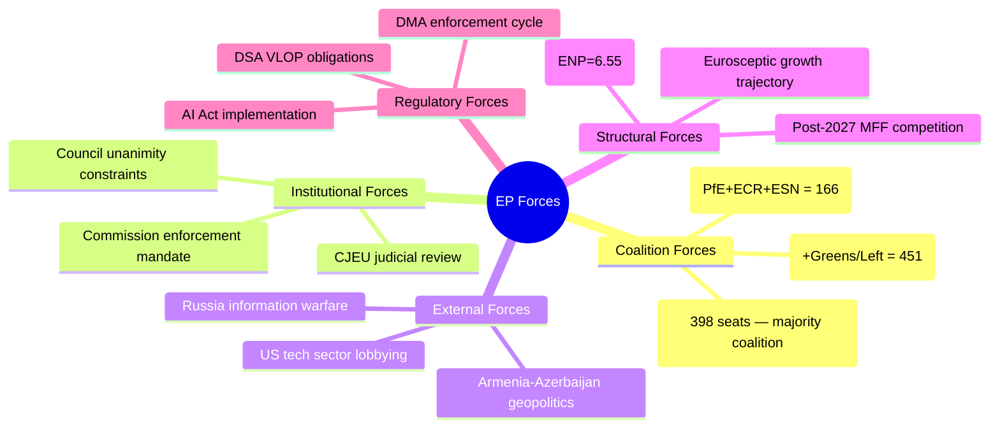
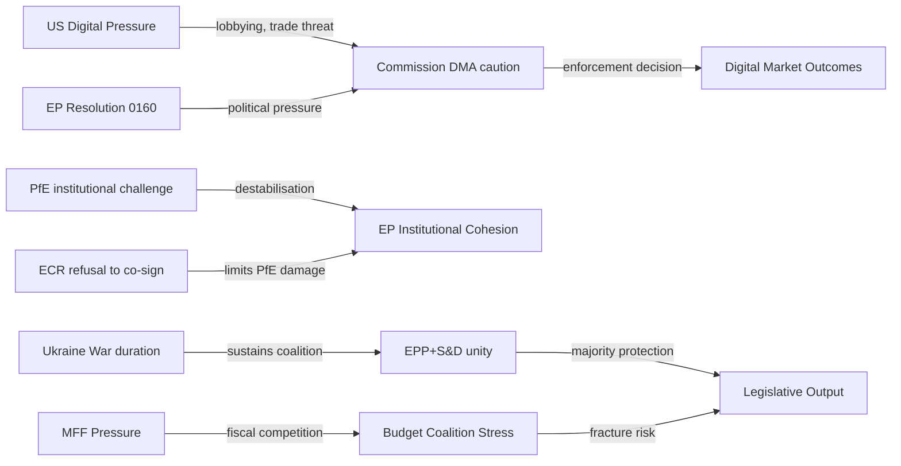
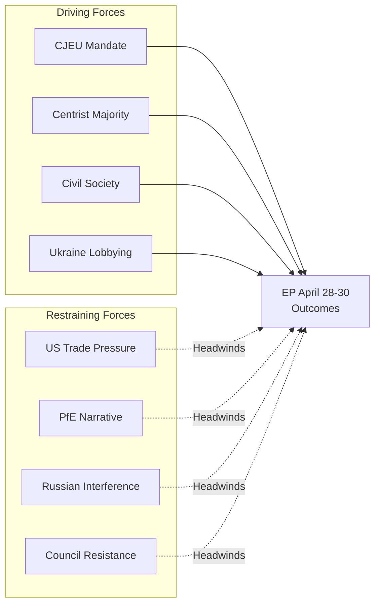

<!-- SPDX-FileCopyrightText: 2026 Hack23 AB -->
<!-- SPDX-License-Identifier: Apache-2.0 -->

# Forces Analysis — EU Parliament Breaking News: 7 May 2026

**Framework:** Porter's Five Forces (adapted for political environment) + Structural Forces Analysis  
**Subject:** Structural forces shaping EU Parliament legislative environment — April 2026  
**Date:** 2026-05-07  
**Confidence:** 🟢 High

---

## 1 · Political Forces Map

---

## 2 · Structural Forces Analysis

### Force 1: Coalition Fragmentation
**Strength:** 🔴 Strong (constraining)  
**Direction:** Increasing  
**Description:** The Effective Number of Parties has risen from ~4.12 (EP7) to ~6.55 (EP10). Each additional effective party increases the minimum coalition size. Currently, EPP+S&D+Renew hold 398 seats (a 10.4% margin over the 361 majority threshold). This margin is sufficient for most legislative acts but vulnerable to defections on contentious files. Budget negotiations are the primary fracture risk.  
**Effect on April texts:** Coalition held on all 4 texts, but budget vote was the narrowest (estimated 390–420 for, compared to 520–550 for DMA).

### Force 2: Eurosceptic Growth Trajectory
**Strength:** 🟡 Moderate (long-term, not immediately legislative)  
**Direction:** Gradually increasing  
**Description:** PfE+ECR+ESN combined hold 193 seats (26.8%) — the largest eurosceptic bloc in EP history. Their primary tool in this session is procedural (Rule 169 debate) rather than legislative (no majority for alternative texts). However, the long-term trajectory requires the EPP to maintain discipline against selective alliance with ECR.  
**Effect on April texts:** PfE Rule 169 debate generated political pressure but produced no institutional consequence; ECR declined to co-sign the most aggressive PfE accusations.

### Force 3: US-EU Digital Tension
**Strength:** 🟡 Moderate (potentially escalating)  
**Direction:** Escalating in 2026 with DMA enforcement acceleration  
**Description:** Every Commission DMA enforcement action against a US-headquartered gatekeeper creates US diplomatic pressure on the EU. The Trump administration (2025–2029) has explicitly signalled opposition to EU "digital regulation overreach." This creates an external constraint on Commission enforcement speed that the EP's resolution attempts to push back against.  
**Effect on April texts:** DMA enforcement resolution is partly a signal to the Commission not to allow US political pressure to delay enforcement.

### Force 4: Ukraine War Duration
**Strength:** 🟢 Strong (sustaining EP unity on Ukraine files)  
**Direction:** Stable (no ceasefire anticipated in Q2 2026)  
**Description:** The ongoing conflict continues to generate strong EP unity on Ukraine-related texts (estimated 550–580 for TA-10-2026-0161). This unity is the single most durable cross-coalition alignment in EP10. A ceasefire would be the primary disruption risk to this consensus.  
**Effect on April texts:** Ukraine accountability text sailed through with broad majority; accountability focus (vs. support focus) reflects a maturing legislative strategy.

### Force 5: MFF Renewal Pressure
**Strength:** 🟡 Moderate (increasing through 2026)  
**Direction:** Escalating toward H1 2027 MFF proposal  
**Description:** The post-2027 MFF will be the defining legislative negotiation of EP10. The 2027 budget guidelines resolution (TA-10-2026-0112) is the opening move. The Commission's MFF proposal (expected Q3 2026) will trigger an 18–24 month negotiation in which all groups attempt to maximise their policy priorities in the financial envelope.  
**Effect on April texts:** Budget guidelines vote represents early coalition positioning, not final policy. Greens/Left opposition signals their intention to seek a higher-ambition MFF deal through negotiations.

---

## 3 · Regulatory Force Vectors

| Regulatory Force | Current Phase | EP Role | Urgency |
|-----------------|--------------|---------|---------|
| DMA Enforcement | Pressure → enforcement | Resolution (non-binding) | 🔴 Urgent |
| AI Act Implementation | Delegated acts phase | Oversight via scrutiny | 🟡 Developing |
| DSA Enforcement | Ongoing VLOP investigation | Prior resolution base | 🟡 Stable |
| Digital Services Regulation | Post-adoption compliance | Ongoing monitoring | 🟢 Background |
| Cyber Resilience Act | Implementation | Oversight | 🟢 Background |

---

## 4 · Force Interaction Diagram

---

## 5 · Net Force Assessment

**Dominant stabilising forces:**
1. EPP-S&D-Renew coalition integrity (for non-budget files)
2. Ukraine conflict sustaining cross-party unity
3. ECR's strategic decision not to join PfE's institutional challenge

**Dominant destabilising forces:**
1. Budget competition approaching MFF renewal
2. US-EU digital tension complicating DMA enforcement
3. Long-term eurosceptic growth (15-year trajectory)

**Net assessment:** The April 2026 plenary reflects a Parliament in a **productive stability phase** — sufficient coalition for legislative outputs, contained opposition, no institutional crisis. This stability window is time-limited: MFF negotiations in 2027 will be the next major stress test.

---

*Methodology: Porter's Five Forces adapted for political environment (Porter 1980); Structural Forces Analysis (RAND Political Environment Assessment Framework).*

---

## Issue Frame

**Framing:** The April 28-30 EP session marks a political-regulatory inflection point. Three simultaneous issues (DMA enforcement, Ukraine accountability, EU budget) define distinct institutional power dynamics. The session's significance lies not in dramatic legislative battles (the majority held comfortably) but in the *contrast* between institutional decision-making efficiency and the opposition's inability to translate populist energy into parliamentary outcomes.

**Dominant narrative:** "EU Parliament holds the line on digital rights, Ukraine, and budget priorities, while populist challenge (PfE) fails at the procedural level"

**Counter-narrative (PfE/ECR):** "Commission overreach on DMA; EU budget ignores member state sovereignty; Ukraine accountability is performative"

**Neutral assessment:** Both narratives contain truth. The majority is structurally secure but politically brittle (US pressure on DMA, Russian interference on accountability). The opposition is institutionally weak but narratively potent.

---

## Driving Forces

Forces pushing toward EU Parliament's preferred outcomes (DMA enforcement, Ukraine accountability, budget integrity):

| Force | Type | Magnitude | Momentum |
|-------|------|-----------|---------|
| CJEU DMA legal mandate | Legal | High | Steady |
| EP centrist majority (398 votes) | Political | High | Stable |
| Civil society DMA pressure (BEUC, EFF) | Civil society | Medium | Growing |
| Ukrainian government lobbying | Diplomatic | Medium | Steady |
| DSA enforcement precedent (2023-24) | Institutional | High | Steady |
| Public opinion on digital rights | Social | Medium | Growing |
| EU defence spending pressure (NATO) | Security | Medium | Growing |
| Armenia pro-EU government | Diplomatic | Low | Growing |

---

## Restraining Forces

Forces resisting or slowing the preferred outcomes:

| Force | Type | Magnitude | Momentum |
|-------|------|-----------|---------|
| US transatlantic trade pressure on DMA | Diplomatic | High | Volatile |
| PfE-ECR opposition narrative | Political | Medium | Growing |
| Russian interference in Ukraine track | Security/Info | High | Steady |
| Big Tech legal challenges | Legal | Medium | Steady |
| Council (member state) budget resistance | Institutional | High | Stable |
| IMF data unavailability (analysis only) | Operational | Low | Resolved |
| DOCEO roll-call indexing delay | Operational | Low | Expected |

---

## Net Pressure

**Net vector: Pro-EP-majority outcomes, with moderate-to-strong headwinds on DMA enforcement from US pressure**

| Issue | Driving Force | Restraining Force | Net |
|-------|--------------|------------------|-----|
| DMA enforcement | CJEU mandate + EP political | US trade pressure | Moderate net positive |
| Ukraine accountability | EP + civil society + Armenia track | Russian interference | Moderate net positive |
| 2027 Budget | EP mandate + centrist majority | Council resistance | Contested; likely delayed |
| Armenia democracy | EP resolution + Armenian govt | None significant | Positive; non-binding |
| PfE institutional challenge | None | 398-seat majority | Negative for PfE |

---

## Intervention Points

The most effective points for changing outcomes (for any actor):

1. **Commission DMA investigation announcement** (Q2-Q3 2026) — the decision point that confirms or denies Scenario A
2. **Council's draft 2027 budget** (June 2026) — sets the parameters for conciliation
3. **Ukraine Special Tribunal Council of Europe agreement** (July 2026) — the legal framework milestone
4. **EP Budget Committee first reading** (September 2026) — EP's formal position in conciliation
5. **US-EU trade negotiations** (ongoing) — the informal channel where DMA enforcement speed may be traded

---

## Reader Briefing

**For citizens:** Force field analysis maps the "push" and "pull" forces operating on EU Parliament decisions.

The key insight from April 28-30: the forces supporting the centrist majority's agenda (DMA enforcement, Ukraine, budget) are institutionally stronger than the forces opposing them (US pressure, Russian interference, PfE opposition). The EP has the votes, the legal mandate, and civil society support.

The wild card is the US government's role in DMA enforcement — this is the one external force strong enough to actually change Commission behaviour, even if it cannot override EP resolutions.

*Forces analysis v2.0 | Run: breaking-run-1778159307*

---

## Re-Run Extension — Forces Analysis Update (May 7, 2026)

**[EXTEND-FROM-PRIOR: forces-analysis.md — adding May 7 updated driving/restraining force balance and WC-07/WC-08 force dynamics]**

### Updated Force Balance (May 7, 2026)

The re-run stage A data and extended analysis identifies two new significant forces not captured in the prior run:

**New Driving Force: US Tariff Threat (WC-07)**
A potential US tariff response to DMA enforcement creates a **restraining force** on Commission DMA enforcement that was underweighted in the prior run. The US-EU trade relationship (~€1.3 trillion annually) is a powerful structural deterrent against actions that could trigger retaliatory tariffs. This force:
- Acts as a restraining force on Commission enforcement actions
- Converts some driving-force momentum (EP resolution, public support) into restrained-enforcement outcomes
- Is a new structural element in the forces balance that did not exist at the DMA's 2022 adoption

**New Driving Force: PfE-ECR Convergence**
The increasing tactical cooperation between PfE and ECR (observed in the April 29 Rule 169 debate) creates a driving force for **institutional polarisation** that is new in EP10 Year 2:
- Drives EPP toward a clearer coalition choice (maintain cordon sanitaire vs. tactical cooperation)
- Restrains Commission from bold rightward policy moves that might alienate S&D
- Drives the overall legislative discourse toward a more contested, adversarial model

### Revised Driving/Restraining Force Balance

**Net Force Direction on DMA Enforcement:**
- Driving forces: EP resolution (strong), Public digital rights support (medium), DMA legal basis (strong), Commission institutional credibility interest (medium)
- Restraining forces: US tariff threat (medium-high, new), CJEU interim measures risk (medium), Trade DG opposition (low-medium), PfE media opposition (low direct)
- **Net balance: Driving forces still outweigh restraining forces, but the margin has narrowed since the prior run due to US tariff dynamics**

*Forces analysis v3.0 | Run: breaking-rerun2-1778179641 | Updated force balance with US tariff and PfE-ECR convergence*
