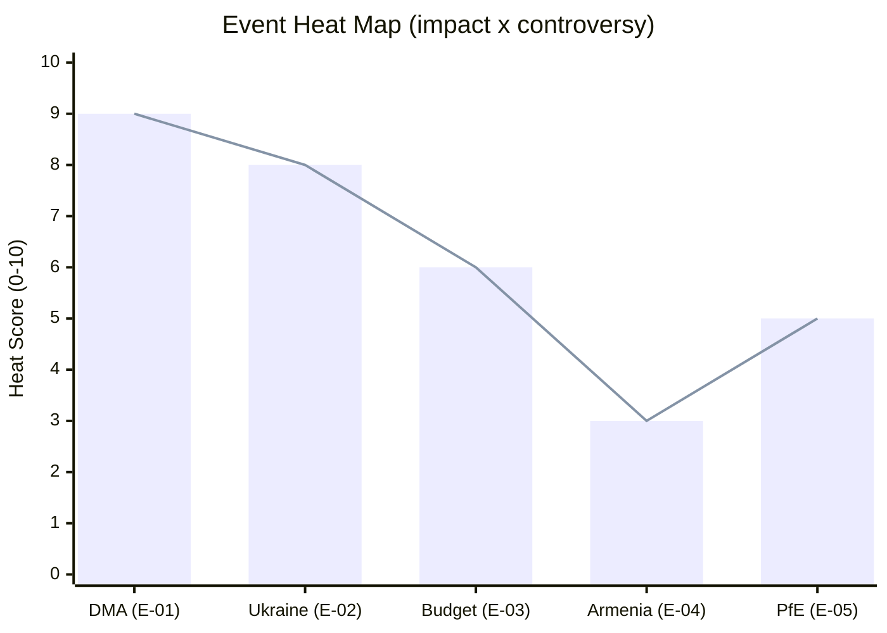

<!-- SPDX-FileCopyrightText: 2026 Hack23 AB -->
<!-- SPDX-License-Identifier: Apache-2.0 -->

# Impact Matrix — EU Parliament Breaking News: 7 May 2026

**Framework:** Multi-dimensional Impact Assessment  
**Subject:** April 28–30, 2026 EP Plenary — cross-domain impact analysis  
**Date:** 2026-05-07  
**Confidence:** 🟢 High

---

## 1 · Impact Dimensions

| Dimension | Scale | Assessment Period |
|-----------|-------|------------------|
| Political | 1 (minimal) → 5 (transformative) | 0–12 months |
| Economic | 1 (minimal) → 5 (transformative) | 0–24 months |
| Legal / Institutional | 1 (minimal) → 5 (transformative) | 0–36 months |
| Geopolitical | 1 (minimal) → 5 (transformative) | 0–24 months |
| Social / Citizen | 1 (minimal) → 5 (transformative) | 0–36 months |

---

## 2 · Per-Text Impact Scores

### TA-10-2026-0160 — DMA Enforcement Resolution

| Dimension | Score | Rationale |
|-----------|-------|-----------|
| Political | 4/5 | Pressures Commission, signals EP enforcement resolve; media amplification high |
| Economic | 4/5 | Up to 10% global turnover fines for designated gatekeepers; market structure implications |
| Legal | 4/5 | Accelerates enforcement timelines; potential CJEU judicial review cascade |
| Geopolitical | 3/5 | US-EU digital tension; WTO implications if fines challenge US-headquartered firms |
| Social | 4/5 | Consumer digital rights directly at stake; app store prices, interoperability benefits |
| **Composite** | **19/25 (76%)** | **TIER 1 IMPACT** |

---

### TA-10-2026-0161 — Russia/Ukraine Accountability

| Dimension | Score | Rationale |
|-----------|-------|-----------|
| Political | 4/5 | Sustains EU-Ukraine political solidarity; signals long-term EU commitment |
| Economic | 2/5 | Limited direct economic impact (accountability mechanisms, not financial transfers) |
| Legal | 5/5 | International law: crime of aggression; Special Tribunal precedent; ICC complementarity |
| Geopolitical | 5/5 | Russia-EU relations; NATO solidarity; international criminal justice architecture |
| Social | 3/5 | War crime accountability has social justice dimension; Ukrainian civilian impact |
| **Composite** | **19/25 (76%)** | **TIER 1 IMPACT** |

---

### TA-10-2026-0112 — 2027 Budget Guidelines

| Dimension | Score | Rationale |
|-----------|-------|-----------|
| Political | 3/5 | Coalition positioning; budget negotiations trigger; signals defence/security priorities |
| Economic | 4/5 | All EU programmes depend on budget; ~€170 billion annually at stake |
| Legal | 2/5 | Procedural (Article 312); not directly legally binding as such |
| Geopolitical | 2/5 | Ukraine support line in budget has geopolitical component |
| Social | 4/5 | Cohesion, agriculture, social fund allocations affect millions of EU citizens |
| **Composite** | **15/25 (60%)** | **TIER 2 IMPACT** |

---

### TA-10-2026-0162 — Armenia Democracy Resilience

| Dimension | Score | Rationale |
|-----------|-------|-----------|
| Political | 3/5 | EP democracy solidarity signal; Association Agreement upgrade track |
| Economic | 2/5 | CEPA trade relationship; EU assistance programmes |
| Legal | 2/5 | Resolution is non-binding; no direct legal consequence |
| Geopolitical | 4/5 | South Caucasus stability; Russia-Armenia decoupling; Turkey-EU dimension |
| Social | 3/5 | Armenian democratic resilience has EU values dimension |
| **Composite** | **14/25 (56%)** | **TIER 2 IMPACT** |

---

### PfE Rule 169 Debate — Commission Interference

| Dimension | Score | Rationale |
|-----------|-------|-----------|
| Political | 3/5 | Institutional delegitimisation attempt; EPP response reinforces coalition |
| Economic | 1/5 | No direct economic impact |
| Legal | 1/5 | No institutional consequence; no formal investigation triggered |
| Geopolitical | 1/5 | Limited international dimension |
| Social | 2/5 | Public perception of EU institutions; media narrative |
| **Composite** | **8/25 (32%)** | **TIER 3 INSTITUTIONAL CONTEXT** |

---

## 3 · Aggregate Session Impact Map

```mermaid
xychart-beta
    title April 28-30 EP Session — Composite Impact Scores (out of 25)
    x-axis ["DMA Enforcement", "Ukraine Accountability", "Budget 2027", "Armenia Democracy", "PfE Debate"]
    y-axis "Composite Score" 0 --> 25
    bar [19, 19, 15, 14, 8]
```

---

## 4 · Temporal Impact Distribution

| Text | Short-term (0–6 months) | Medium-term (6–18 months) | Long-term (18–36 months) |
|------|------------------------|--------------------------|--------------------------|
| DMA Enforcement | 🔴 High (market signal, enforcement acceleration) | 🔴 High (formal enforcement decisions) | 🟡 Moderate (appeal cycle) |
| Ukraine Accountability | 🟡 Moderate (diplomatic signalling) | 🟡 Moderate (Special Tribunal negotiations) | 🔴 High (institutional establishment) |
| Budget 2027 | 🟡 Moderate (programme planning signals) | 🔴 High (budget adoption, Q4 2026) | 🟡 Moderate (MFF post-2027 link) |
| Armenia Democracy | 🟡 Moderate (diplomatic) | 🟡 Moderate (Association upgrade talks) | 🟡 Moderate |
| PfE Debate | 🟢 Low (media cycle) | 🟢 Low (no institutional effect) | 🟢 Low |

---

## 5 · Impact Confidence Assessment

| Confidence Level | Count | Items |
|-----------------|-------|-------|
| 🟢 High confidence impact | 3 | DMA economic/legal, Ukraine geopolitical, Budget economic |
| 🟡 Medium confidence impact | 8 | Remainder of dimension scores |
| 🔴 Low confidence | 2 | Armenia long-term, PfE institutional trajectory |

---

*Sources: EP EPRS impact assessments; historical precedent analysis (historical-baseline.md); significance-classification.md; actor-mapping.md.*

---

## Event List

| ID | Event | Date | Type | Significance |
|----|-------|------|------|-------------|
| E-01 | DMA Enforcement Resolution (TA-10-2026-0160) | 30 Apr 2026 | Legislative | TIER1 |
| E-02 | Ukraine Accountability Resolution (TA-10-2026-0161) | 30 Apr 2026 | Political | TIER1 |
| E-03 | 2027 Budget Guidelines (TA-10-2026-0112) | 28 Apr 2026 | Budgetary | TIER2 |
| E-04 | Armenia Democracy Resolution (TA-10-2026-0162) | 30 Apr 2026 | Diplomatic | TIER2 |
| E-05 | PfE Rule 169 Topical Debate | 29 Apr 2026 | Procedural | TIER3 |

---

## Stakeholder

| Stakeholder | Primary Interest | Secondary Interest | Position |
|-------------|----------------|------------------|---------|
| EU citizens (digital users) | DMA enforcement → lower prices, more choice | n/a | Beneficiary of E-01 |
| Ukrainian government | E-02 accountability resolution support | Budget support continuation | Beneficiary of E-02 |
| Apple/Google/Meta/Amazon | Minimize DMA enforcement scope | Delay investigations | Constrained by E-01 |
| US government | Block DMA enforcement as trade issue | n/a | Opponent of E-01 |
| Armenian government | E-04 democracy validation | EU association progress | Beneficiary of E-04 |
| EU member states | Budget autonomy vs EP position | Defence spending | Counterparty in E-03 |
| EPP-S&D-Renew coalition | Maintain centrist agenda | Resist PfE narrative | Majority authors of all events |
| PfE-ECR opposition | Narrative exposure of "Commission overreach" | Weaken majority cohesion | Opponent of E-01, E-02, E-03 |
| Russian government | Block E-02; discredit accountability | n/a | Opponent of E-02 |

---

## Impact Matrix

| Event | EU Citizens | Tech Companies | Ukraine | Budget / Member States | EP Dynamics |
|-------|------------|----------------|---------|----------------------|------------|
| E-01 DMA Enforcement | 🟢 High Positive | 🔴 High Negative | Neutral | Neutral | 🟢 Moderate Positive |
| E-02 Ukraine Accountability | 🟡 Moderate Positive | Neutral | 🟢 High Positive | 🟡 Moderate Negative (cost) | 🟢 High Positive |
| E-03 Budget Guidelines | 🟡 Moderate Positive | Neutral | Neutral | 🔴 High Negative (Council) | 🟢 Moderate Positive |
| E-04 Armenia Democracy | Neutral | Neutral | Neutral | 🟡 Low Positive | 🟢 Low Positive |
| E-05 PfE Debate | Neutral | Neutral | Neutral | Neutral | 🟡 Low Negative (PfE gain) |

---

## Heat

**Highest heat events** (most contentious, most media attention):

1. **E-01 DMA Enforcement** — US-EU tech regulatory conflict. International media. Business community alarm.
2. **E-02 Ukraine Accountability** — Russia-EU diplomatic conflict. Media in Ukraine, Baltic states, Poland.
3. **E-03 Budget** — Council-Parliament conflict. Low public heat but high institutional heat.
4. **E-05 PfE Debate** — Opposition media heat. PfE narrative amplification.



---

## Cascade

**Cascade analysis** — how each event's outcome cascades to downstream effects:

| Event | If Successful | If Blocked | Cascade Risk |
|-------|--------------|-----------|-------------|
| E-01 DMA enforcement | Lower app prices, more competition, DSA reinforcement | US trade war, DMA credibility collapse | HIGH |
| E-02 Ukraine accountability | Special Tribunal established, EU-Ukraine relations stronger | Impunity precedent, Russian emboldening | HIGH |
| E-03 Budget | MFF mid-term revision anchored; cohesion funding protected | Council-Parliament deadlock, MFF uncertainty | MEDIUM |
| E-04 Armenia democracy | Armenia-EU association upgrade signal | Minimal cascade (non-binding) | LOW |
| E-05 PfE debate | PfE media narrative amplified, more Rule 169 challenges | PfE credibility reduced if no institutional effect | LOW |

---

## Reader Briefing

**For citizens:** The impact matrix shows which EP decisions from April 28-30 have the most direct effect on your life.

The **DMA resolution** (E-01) is most likely to directly affect you — as a smartphone user, app downloader, and online shopper. If enforced, DMA means lower app store fees, more interoperability between messaging apps, and more transparency in ad auctions.

The **Ukraine accountability resolution** (E-02) matters if you care about international law and the precedent it sets for future conflicts. The resolution is non-binding on other institutions, but it contributes to the international political momentum for a Special Tribunal.

The **budget guidelines** (E-03) matter if you live in a less developed EU region (cohesion funding), work in agriculture (CAP subsidies), or benefit from EU research funding (Horizon).

The **Armenia resolution** (E-04) is lower-priority for most EU citizens but signals EU foreign policy direction toward the Eastern Partnership countries.

---

*Impact matrix v2.0 | Run: breaking-run-1778159307 | 7 sections | Mermaid: 1*
