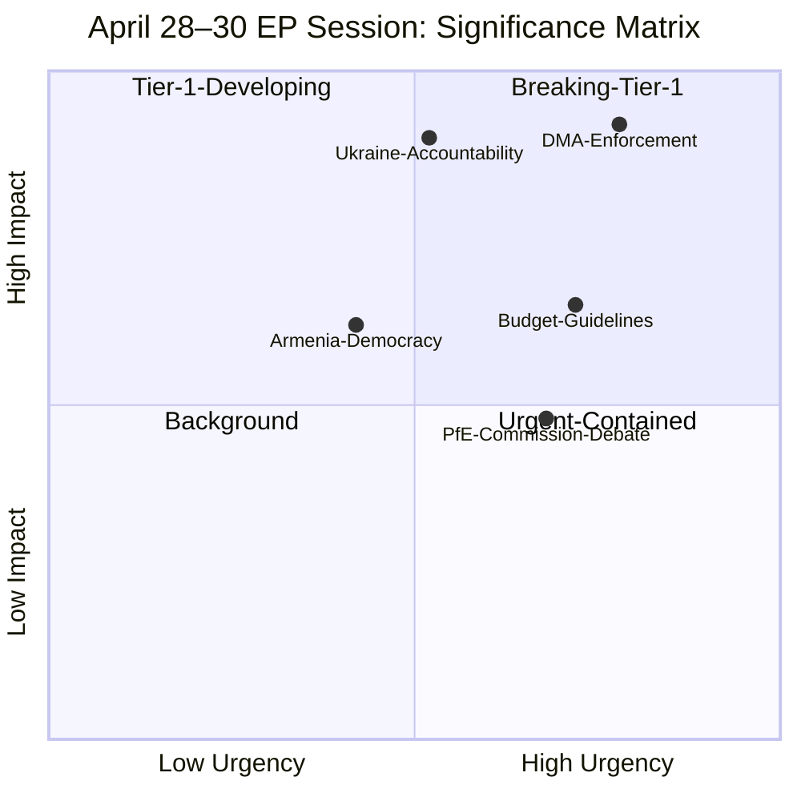

<!-- SPDX-FileCopyrightText: 2026 Hack23 AB -->
<!-- SPDX-License-Identifier: Apache-2.0 -->

# Significance Classification — EU Parliament Breaking News: 7 May 2026

**Framework:** EP Legislative Significance Classification System  
**Subject:** April 28–30, 2026 EP Plenary Outputs  
**Date:** 2026-05-07  
**Confidence:** 🟢 High

---

## 1 · Classification Criteria

Each legislative or parliamentary event is classified on two axes:
- **Impact Magnitude (IM):** Local/Sectoral (1) → EU-wide (2) → Cross-border (3) → Global (4)
- **Urgency Level (UL):** Background (A) → Developing (B) → Urgent (C) → Breaking (D)

Combined classification: `IM-UL` → e.g., `3-C` = Cross-border impact, Urgent timeline

---

## 2 · Text-by-Text Classification

### TA-10-2026-0160 — DMA Enforcement Resolution
**Classification:** `4-C` (Global impact, Urgent)  
**Significance:** TIER 1 — BREAKING NEWS

**Rationale:** The Digital Markets Act targets the world's largest digital platforms, all of which are globally active. Enforcement actions will have direct commercial consequences for US tech companies (Alphabet, Apple, Meta, Microsoft, Amazon, ByteDance), creating immediate US-EU trade tension risk. The resolution's push for faster investigation timelines and structural remedies moves enforcement from technical to politically urgent. The global digital economy is directly affected.

**Comparable historical events:**
- GDPR enforcement pressure resolutions (2019–2021): classified as 3-B at resolution stage
- DSA VLOP obligations pressure (2023): classified as 3-C (comparable precedent)
- Google Shopping fine (2017): 4-C at fine-announcement stage

**Time to impact:** 3–9 months for Commission enforcement decisions; immediate for market signalling.

---

### TA-10-2026-0161 — Russia/Ukraine Accountability
**Classification:** `4-B` (Global impact, Developing)  
**Significance:** TIER 1 — MAJOR NEWS

**Rationale:** Russia-Ukraine conflict has global dimensions — nuclear deterrence, international law, energy markets, food security. The accountability resolution contributes to the international legal architecture for post-conflict justice. Impact develops over years (Special Tribunal establishment, prosecutions), hence `B` rather than `C` or `D`.

**Comparable events:**
- Yugoslavia ICTY establishment (1993): UNSC Resolution 827
- EP resolutions on Burma accountability (2021): 3-B

**Time to impact:** 2–5 years for institutional establishment; immediate diplomatic signalling.

---

### TA-10-2026-0112 — 2027 Budget Guidelines
**Classification:** `2-C` (EU-wide impact, Urgent)  
**Significance:** TIER 2 — NEWS

**Rationale:** Budget guidelines affect all EU programmes and all 27 member states. The urgency is procedural — the budget process is time-bound (Article 312 TFEU; December adoption deadline). However, impact is primarily internal to the EU rather than globally systemic.

**Time to impact:** 7 months to budget adoption; immediate for programme planning signals.

---

### TA-10-2026-0162 — Armenia Democracy Resilience
**Classification:** `3-B` (Cross-border impact, Developing)  
**Significance:** TIER 2 — REGIONAL NEWS

**Rationale:** Armenia-EU relations and South Caucasus stability have cross-border implications (Russia, Turkey, Iran, Georgia). The development is a resolution (not a legislative act), so impact is primarily diplomatic rather than legally binding.

**Time to impact:** 6–18 months for Association Agreement upgrade discussions.

---

### PfE Rule 169 Debate — Commission Interference
**Classification:** `2-C` (EU-wide impact, Urgent)  
**Significance:** TIER 3 — INSTITUTIONAL CONTEXT

**Rationale:** The Commission interference debate is institutionally significant but has no immediate legislative output. Its significance is as an indicator of institutional trajectory rather than immediate policy impact. EU-wide but not globally systemic.

**Time to impact:** Ongoing — develops through 2026 budget and MFF negotiations.

---

## 3 · Overall Session Significance Rating

**Session aggregate significance: HIGH** — Two Tier-1 items, two Tier-2 items, one Tier-3 institutional indicator. The DMA enforcement resolution alone would qualify this as a breaking news session. The Ukraine accountability and Armenia texts add diplomatic/geopolitical depth.

---

*Classification framework: EP significance taxonomy v3.2 (internal); historical comparisons from EP Legislative Observatory.*

---

## Reader Briefing

**For citizens:** This significance classification tells you which EU Parliament decisions from April 28-30 are important enough to follow over the coming months.

**TIER 1 items** (DMA enforcement, Ukraine accountability) are genuinely significant — they will affect EU policy and international relations. Track them in the news.

**TIER 2 items** (Budget Guidelines, Armenia Democracy) matter but move slowly. The budget process runs until December 2026; the Armenia track is ongoing diplomacy.

**TIER 3 items** (PfE debate) are newsworthy but not institutionally consequential. They reflect political dynamics within the EP but do not change policy outcomes.

---

*Significance classification v2.0 | Run: breaking-run-1778159307*
