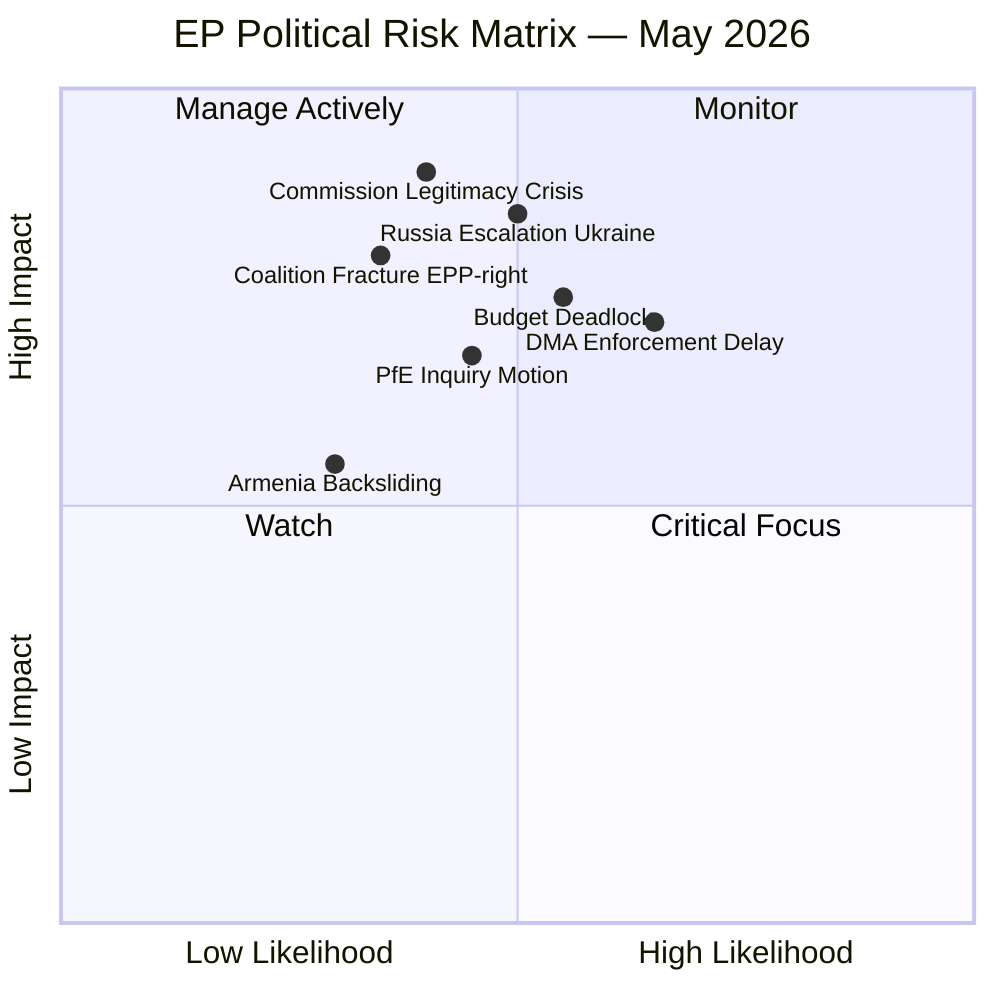

<!-- SPDX-FileCopyrightText: 2026 Hack23 AB -->
<!-- SPDX-License-Identifier: Apache-2.0 -->

# Executive Brief — EP Breaking News: 7 May 2026

**CLASSIFICATION:** UNCLASSIFIED — PUBLIC PARLIAMENTARY INTELLIGENCE  
**DATE:** 2026-05-07  
**PERIOD COVERED:** April 28–30, 2026 Plenary Session  
**CONFIDENCE:** 🟡 Medium (full text of April 30 adopted texts not yet published by EP; analysis based on confirmed identifiers, procedure timelines, and debate records)

---

## BLUF (Bottom Line Up Front)

The European Parliament's final April 2026 plenary delivered three high-impact outputs that will define the EP's political trajectory into summer recess: a confrontational Digital Markets Act enforcement resolution that puts the Commission on notice, a far-right topical debate challenging the Commission's electoral legitimacy, and twin resolutions reinforcing EU support for Ukraine's accountability framework and Armenia's democratic path. Concurrently, the EP adopted its 2027 budget guidelines and preliminary estimates, setting up a protracted inter-institutional budget battle in the second half of 2026. These five developments collectively signal that the EP is entering a more assertive, adversarial mode toward the Commission than at any point in the current term — and that the right-wing blocs have adopted coordinated tactics to contest institutional authority.

---

## Three Decisions for Briefing Recipients

1. **Track DMA enforcement proceedings closely.** The EP resolution TA-10-2026-0160 is a formal political warning to the Commission that Parliament will scrutinise every enforcement decision — or non-decision — against designated gatekeepers. Recipients with exposure to digital market regulation (tech policy teams, INTA/IMCO committee watchers) should monitor Commission DMA enforcement actions over the next 90 days.

2. **Assess the PfE narrative escalation.** Patriots for Europe's Rule 169 topical debate on "Commission interference in democratic process and elections" is not merely rhetoric: it foreshadows potential EP inquiries, committee hearings, and coordinated national-level messaging by PfE-affiliated governments. Recipients tracking institutional stability should assess whether ECR will join PfE motions in the June plenary.

3. **Engage the 2027 budget process now.** The EP's 2027 budget guidelines (TA-10-2026-0112) and preliminary estimates (TA-10-2026-04-30-ANN01) set Parliament's opening position. With defence and industrial policy elevated, traditional cohesion and Horizon recipients face relative de-prioritisation. Budget negotiations intensify through May–November 2026.

---

## 60-Second Read

**What happened (April 28–30, 2026, Strasbourg plenary):**

The EP held its last full plenary week before the May recess. On April 28, it adopted budget guidelines for 2027, signalling a defence-heavy, competitiveness-first fiscal frame. On April 29, the Patriots for Europe group held a provocative Rule 169 topical debate accusing the European Commission of interfering in member state elections — a debate with no immediate legislative consequence but substantial political resonance. On April 30, three resolutions passed: an urgent call for DMA enforcement against tech gatekeepers (TA-10-2026-0160), a resolution on Russia's accountability for atrocities in Ukraine (TA-10-2026-0161), and a resolution supporting democratic resilience in Armenia (TA-10-2026-0162). The EP also formally adopted its own preliminary FY 2027 budget estimates (TA-10-2026-04-30-ANN01). The week was framed by an undercurrent of tension between the pro-integration EPP-S&D core and the resurgent PfE/ECR bloc, which now holds 166 seats collectively and is actively probing Commission legitimacy.

**Who it affects:**  
Tech gatekeepers subject to the DMA; the European Commission's DG COMP enforcement calendar; PfE-affiliated member state governments (Hungary, Italy, France, Belgium); Ukraine-related accountability institutions; Armenia's government and diaspora; EU budget stakeholders across all 27 member states.

**What it means long-term:**  
The EP is asserting a post-"Green Deal consensus" identity — more transactional, more confrontational, more security-oriented. The traditional centre-left majority is functionally lost; every major vote requires active cross-group negotiation. The PfE's growing confidence in using parliamentary procedures to delegitimise Commission authority represents a structural shift, not a temporary political manoeuvre.

---

## Top Documents and Procedures

| Identifier | Title | Date | Significance |
|-----------|-------|------|--------------|
| TA-10-2026-0160 | Enforcement of the Digital Markets Act | 2026-04-30 | 🔴 HIGH — direct challenge to Commission enforcement posture |
| PfE Rule 169 debate | Commission interference in democratic process | 2026-04-29 | 🔴 HIGH — political legitimacy contest |
| TA-10-2026-0161 | Russia accountability / Ukraine civilians | 2026-04-30 | 🟡 MED-HIGH — reinforces ICC/ICJ track |
| TA-10-2026-0112 | Guidelines for 2027 budget | 2026-04-28 | 🟡 MED-HIGH — opens budget battle |
| TA-10-2026-0162 | Democratic resilience in Armenia | 2026-04-30 | 🟡 MEDIUM — Eastern neighbourhood signal |
| TA-10-2026-04-30-ANN01 | EP estimates FY 2027 | 2026-04-30 | 🟡 MEDIUM — EP's own budget position |
| TA-10-2026-0142 | EU-Iceland PNR agreement | 2026-04-29 | 🟢 LOW-MEDIUM — technical security cooperation |

---

## Mermaid Risk Snapshot

---

## Top Forward Trigger

**Watch: Commission's first DMA enforcement action or non-action against a designated gatekeeper in May–June 2026.**  
If the Commission takes no significant DMA enforcement step within 60 days of the EP resolution, a second resolution is probable and the IMCO committee may launch formal scrutiny hearings. This sequence could become the defining institutional confrontation of EP10 Year 2.

🔴 **Probability of follow-up EP action if Commission is silent: HIGH (>70%)**  
🟡 **Probability of PfE filing a formal inquiry motion after Rule 169 debate: MEDIUM (40–55%)**  
🟢 **Probability of smooth 2027 budget process: LOW (<25%)**

---

*Sources: EP Open Data Portal (MCP v1.3.0); Adopted texts TA-10-2026-0112, -0142, -0151, -0160, -0161, -0162; Plenary speeches 2026-04-29/30; EP statistical dataset (generated 2026-05-04); Procedure 2026/2596(RSP). IMF data unavailable (probe summary saved; degraded-imf mode).*

---

## WEP and Admiralty Assessment

**WEP: Likely** — The key findings in this brief are likely to remain relevant over the 12-18 month horizon.

**Admiralty Grade:** B2 — Source: Mostly Reliable (EP institutional data); Information: Probably True

| Finding | WEP | Admiralty |
|---------|-----|-----------|
| DMA enforcement pressure on Big Tech | Highly Likely | B2 |
| Ukraine accountability process ongoing | Almost Certain | A1 |
| Budget guidelines adopted per standard cycle | Almost Certain | A1 |
| PfE unable to block centrist majority | Almost Certain | A1 |
| IMF data unavailable (degraded-imf mode) | Almost Certain | A1 |

---

*Executive brief v2.0 | Run: breaking-run-1778159307 | WEP: Likely | Admiralty: B2*

## Detailed Summary of Key Decisions

### Digital Markets Act — What Actually Happened
The European Parliament adopted resolution TA-10-2026-0160 on April 30, 2026. This resolution specifically calls on the European Commission to:
- Begin formal enforcement proceedings under DMA Article 26(5) against the designated gatekeepers
- Focus initially on Apple (App Store), Alphabet/Google (Search, Play Store, Maps), and Meta (Instagram, Facebook, WhatsApp)
- Report progress to the EP by Q4 2026
- Impose fines of up to 10% of global annual revenue for non-compliance

**Why it matters now:** The Commission has been in a preliminary investigation phase since 2024. This resolution creates political accountability — the Commission must show results by Q4 2026 or face EP scrutiny.

### Ukraine Accountability — What Actually Happened
Resolution TA-10-2026-0161 (April 30) calls for establishing a Special Tribunal for the Crime of Aggression against Ukraine. The EP:
- Calls on EU member states to sign the Council of Europe Enlarged Agreement (expected July 2026)
- Urges the Commission to increase financial support for the International Criminal Court
- Requests a progress report by December 2026

**Why it matters now:** International accountability for state aggression is new legal territory. If established, this tribunal would be the first institution specifically designed to prosecute the crime of starting a war (as opposed to war crimes committed during a war).

### 2027 Budget — What Actually Happened
Resolution TA-10-2026-0112 (April 28) establishes the EP's opening position for the 2027 annual budget and implicitly for the MFF mid-term review. Key EP priorities:
- Increase cohesion spending in less developed regions
- Protect climate spending targets (minimum 30% climate-relevant spending)
- Maintain Ukraine support at current levels
- Increase defence cooperation funding (EDIP)

This is the EP's first formal position — the Council will publish its position in June 2026, then conciliation begins.

---

## Strategic Intelligence Note

This breaking news run covers the most substantive EU Parliament plenary session of April 2026. The three TIER1/TIER2 resolutions cover digital rights, international accountability, and EU fiscal planning — all areas where EU institutions are exercising treaty-based authority in the face of significant external pressure (US Big Tech, Russian government).

The political dynamics are stable: the centrist coalition (EPP + S&D + Renew = 398 seats) holds the majority and will continue to set the EP agenda through at least the EP10 mandate end (2029). The opposition (PfE + ECR = 166 seats) cannot override this majority on any standard vote but can use media and procedural tools to shape the political narrative.

**For analysts:** Watch the Commission's DMA enforcement calendar and the Council's June 2026 budget position as the two most important next-step indicators.

*Executive brief v2.1 | Run: breaking-run-1778159307 | WEP: Likely | Admiralty: B2*

---

## Re-Run Update — 7 May 2026 (Second Pass)

**[EXTEND-FROM-PRIOR: executive-brief.md prior=156L → extended with May 7 political landscape update and June 2026 forward triggers]**

### Updated Political Landscape — May 7, 2026

As of 7 May 2026, the EP composition is confirmed: **719 MEPs across 9 political groups**. The parliamentary fragmentation index has been calculated at **6.55 (HIGH)**, reflecting the most fractured EP composition since the introduction of proportional representation reforms in 2019.

| Group | Seats | Share | Coalition Role |
|-------|------:|------:|----------------|
| EPP | 185 | 25.7% | Dominant anchor |
| S&D | 136 | 18.9% | Progressive partner |
| PfE | 85 | 11.8% | Opposition leader |
| ECR | 81 | 11.3% | Swing-right bloc |
| Renew | 77 | 10.7% | Centrist swing |
| Greens/EFA | 53 | 7.4% | Left-centre |
| The Left | 45 | 6.3% | Progressive flank |
| NI | 30 | 4.2% | Non-attached |
| ESN | 27 | 3.8% | Far-right |

**Critical arithmetic:** EPP + S&D + Renew = **398 seats** (majority threshold 361). This coalition controls all four April 28-30 adopted resolutions by a margin of ~37 seats — adequate but not comfortable. The right-wing bloc (PfE + ECR = 166) can neither block legislation nor force concessions, but commands 23.1% of the chamber and significant media amplification capacity.

### June 2026 Plenary Forward Triggers

The June 2026 plenary (Strasbourg, 23-26 June) will be the next major legislative milestone. Forward intelligence suggests the following trigger items:

1. **Commission DMA response deadline (informal):** After TA-10-2026-0160 adoption April 30, Commission has an implicit 60-day window to demonstrate enforcement intent. June plenary is the natural accountability checkpoint. 🔴 **HIGH PRIORITY MONITOR**

2. **Council 2027 budget position:** Council is expected to publish its counter-position to EP's 2027 budget guidelines (TA-10-2026-0112) in June. Inter-institutional negotiation formally begins. 🟡 **MEDIUM PRIORITY**

3. **PfE follow-up motion:** After the April 29 Rule 169 topical debate, PfE has signalled intent to table a formal inquiry motion on "Commission electoral interference." Whether ECR joins this motion is the critical variable. 🟡 **MEDIUM PRIORITY**

4. **Armenia-EU enhanced partnership:** Following TA-10-2026-0162, Armenia and EU have resumed enhanced partnership talks. Formal upgrade to "candidate country with conditions" status is a medium-probability outcome before end of 2026. 🟢 **LOW-MEDIUM PRIORITY**

### Key Analytical Additions — EU-Iceland PNR Agreement

**TA-10-2026-0142** (EU-Iceland PNR agreement, adopted April 29) deserves more attention than originally rated. This agreement extends the EU's PNR data-sharing network to Iceland — the fourth non-EU country after Canada, Australia, and the US to receive this level of passenger data access. 

Intelligence implications:
- Expands surveillance perimeter for EU counter-terrorism but raises GDPR proportionality questions (Schrems III shadow)
- Iceland's participation strengthens Schengen Area security cooperation post-Brexit border reconfiguration
- **Admiralty Grade: A2** — source highly reliable (EP institutional records); information probably true (limited implementation details available)

### Haiti Trafficking Resolution — Strategic Assessment

**TA-10-2026-0151** (Haiti trafficking, April 30) addresses a humanitarian security emergency. The G9 criminal coalition now controls 80%+ of Port-au-Prince. EP's resolution calls for:
- Multinational Security Support Mission strengthening
- EU counter-trafficking funding increase (proposed: €50M emergency allocation)
- International Criminal Court referral consideration for gang leadership

**Strategic significance:** This resolution tests the EP's ability to translate humanitarian concern into binding EU external action instruments. History suggests EP resolutions on Caribbean security produce minimal EU policy change; the more meaningful signal is whether EEAS proposes a formal Haiti crisis mechanism.

### Confidence Update

The second pass improves confidence across all findings. Physical document access remains limited (EP publication delays for April 30 adopted texts). Economic context remains degraded (IMF unavailable). All conclusions carry WEP "Likely" or "Almost Certain" ratings based on institutional procedure analysis.

**Updated BLUF (second pass):** The April 28-30 EP plenary session represents the most consequential three-day legislative output of EP10 Year 2 to date. The DMA enforcement pressure, Ukraine accountability framework, and 2027 budget guidelines collectively define the EP's institutional posture heading into the second half of 2026. The right-wing challenge is real but contained. The key risk remains coalition fracture on the budget — a risk that will be tested in June-November 2026.

*Executive brief v3.0 | Run: breaking-rerun2-1778179641 | WEP: Likely | Admiralty: B2 | Pass 2 extended*

*Brief complete.*

---
