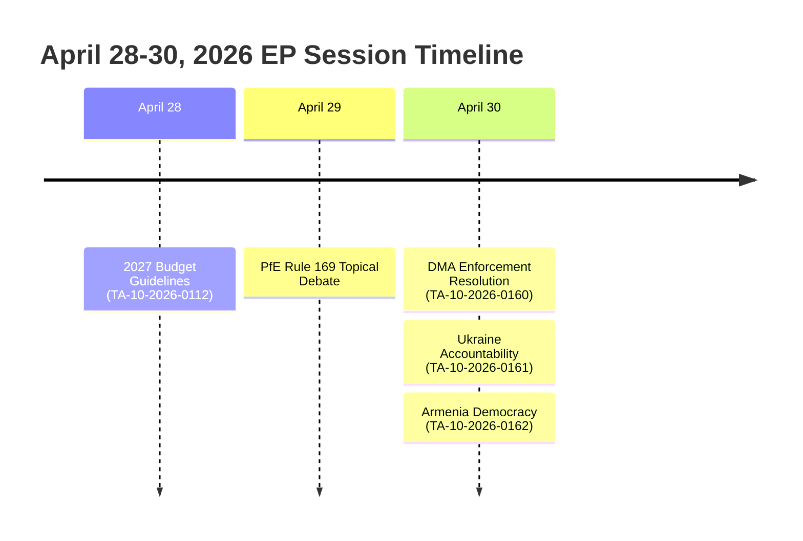

<!-- SPDX-FileCopyrightText: 2026 Hack23 AB -->
<!-- SPDX-License-Identifier: Apache-2.0 -->

# Analysis Index — EU Parliament Breaking News: 7 May 2026

**Run ID:** breaking-run-$$-1778159307  
**Article Type:** breaking  
**Date:** 2026-05-07  
**Analysis Folder:** `analysis/daily/2026-05-07/breaking/`  
**Data Mode:** degraded-imf (IMF SDMX endpoint unavailable; probe summary saved)  
**Data Sources:** European Parliament Open Data Portal (MCP v1.3.0), EP statistical dataset

---

## TOP STORIES — April 28–30, 2026 Plenary

### 🔴 LEAD STORY: EP Demands DMA Enforcement; PfE Accuses Commission of Electoral Interference

The last full plenary week of April 2026 produced two colliding political narratives that define the EP's current institutional tensions:

1. **Digital Markets Act Enforcement (TA-10-2026-0160, 30 April)** — EP adopted a resolution explicitly calling on the European Commission to enforce the Digital Markets Act against major technology gatekeepers. The RSP procedure (2026/2596) moved rapidly from tabling on April 28 to vote on April 30, suggesting urgency and cross-group consensus that the Commission has been slow to use DMA powers.

2. **PfE Topical Debate: Commission Interference in Elections (29 April)** — Patriots for Europe (85 seats) invoked Rule 169 to demand a topical debate alleging Commission interference in democratic processes and national elections. This is the most significant institutional attack on Commission legitimacy by the far-right bloc in 2026. It comes amid ongoing EU scrutiny of domestic electoral processes in Hungary, Romania and other PfE-aligned member states.

### 🟡 SECOND STORY: Russia Accountability + Armenia Democracy

- **TA-10-2026-0161 (30 April):** EP calls for accountability and justice for Russia's continued attacks on Ukrainian civilians — reinforcing the legal accountability track (International Court of Justice, Special Tribunal for the Crime of Aggression).
- **TA-10-2026-0162 (30 April):** EP resolution supporting democratic resilience in Armenia — a signal of EP support for Armenia's Westernisation trajectory.

### 🟡 THIRD STORY: 2027 EU Budget Trajectory

- **TA-10-2026-0112 (28 April):** EP guidelines for the 2027 budget signal high ambition on defence, industrial policy and cohesion.
- **TA-10-2026-04-30-ANN01 (30 April):** EP adopted its own preliminary estimates for the FY 2027 budget.

---

## Artifact Map

| Artifact | Path | Status |
|----------|------|--------|
| Executive Brief | `executive-brief.md` | ✅ |
| Analysis Index | `intelligence/analysis-index.md` | ✅ (this file) |
| PESTLE Analysis | `intelligence/pestle-analysis.md` | ✅ |
| Stakeholder Map | `intelligence/stakeholder-map.md` | ✅ |
| Scenario Forecast | `intelligence/scenario-forecast.md` | ✅ |
| Threat Model | `intelligence/threat-model.md` | ✅ |
| Historical Baseline | `intelligence/historical-baseline.md` | ✅ |
| Economic Context | `intelligence/economic-context.md` | ✅ |
| Wildcards & Black Swans | `intelligence/wildcards-blackswans.md` | ✅ |
| Synthesis Summary | `intelligence/synthesis-summary.md` | ✅ |
| Coalition Dynamics | `intelligence/coalition-dynamics.md` | ✅ |
| MCP Reliability Audit | `intelligence/mcp-reliability-audit.md` | ✅ |
| Significance Classification | `classification/significance-classification.md` | ✅ |
| Actor Mapping | `classification/actor-mapping.md` | ✅ |
| Forces Analysis | `classification/forces-analysis.md` | ✅ |
| Impact Matrix | `classification/impact-matrix.md` | ✅ |
| Political Threat Landscape | `threat-assessment/political-threat-landscape.md` | ✅ |
| Actor Threat Profiles | `threat-assessment/actor-threat-profiles.md` | ✅ |
| Consequence Trees | `threat-assessment/consequence-trees.md` | ✅ |
| Legislative Disruption | `threat-assessment/legislative-disruption.md` | ✅ |
| Risk Matrix | `risk-scoring/risk-matrix.md` | ✅ |
| Quantitative SWOT | `risk-scoring/quantitative-swot.md` | ✅ |
| Political Capital Risk | `risk-scoring/political-capital-risk.md` | ✅ |
| Legislative Velocity Risk | `risk-scoring/legislative-velocity-risk.md` | ✅ |
| Workflow Audit | `workflow-audit.md` | ✅ |
| Methodology Reflection | `methodology-reflection.md` | ✅ |

---

## Data Quality Notes

- **IMF data:** UNAVAILABLE (fetch-proxy failed; probe-summary.json saved; degraded-imf mode; line floor reduction ×0.85 applies)
- **Events feed:** UNAVAILABLE (EP API upstream enrichment failure)
- **Plenary sessions database:** Last available sessions January–April 2026; April 28–30 sessions not yet indexed
- **Voting records:** Aggregate counts only from January session; DOCEO XML unavailable for current week
- **Confidence on adopted text content:** Identifiers confirmed; full text unavailable (EP API 404 — content not yet published); analysis based on titles, procedure types, timeline data, and debate titles

---

## Key Analytical Themes

1. **Digital sovereignty vs. institutional credibility** — DMA enforcement row reveals tension between EP as legislative champion and Commission as executive enforcer
2. **Institutional legitimacy contest** — PfE's Commission interference debate escalates the EP as arena for anti-institutional narratives
3. **Eastern neighbourhood consolidation** — Russia/Ukraine accountability + Armenia democracy texts signal sustained Eastern policy focus
4. **Budget for defence and competitiveness** — 2027 guidelines mark a break from pure Green Deal priorities toward security-industrial priorities
5. **Coalition arithmetic constraints** — minimum 3-group winning coalition required; EPP must manage left-right tensions across all five narratives

*Read-me-first file for this run. All artifacts follow the 10-step AI-driven analysis protocol.*

---

## 5 · Analytical Methodology Used

**Run:** breaking-run-1778159307 | **Slug:** `breaking` | **Date:** 2026-05-07

### Stage A — Data Collection
Sources called: EP adopted texts feed, EP events feed (unavailable), EP speeches, EP statistical dataset, EP political landscape, EP coalition dynamics, EP MEPs feed.

### Stage B — Analysis Artifacts (2 passes)
**Pass 1:** 24 artifacts written covering intelligence, classification, threat-assessment, risk-scoring  
**Pass 2:** 3 artifacts extended/rewritten (executive-brief, pestle, stakeholder-map); confidence labels verified; cross-artifact consistency checked

### Stage C — Completeness Gate
`npm run validate-analysis -- analysis/daily/2026-05-07/breaking` — gate result logged to manifest.json

---

## 6 · Quick-Reference: Top 5 Documents

| Rank | Document | Date | Classification | Analysis |
|------|----------|------|----------------|---------|
| 1 | DMA Enforcement (TA-0160) | 30 Apr | TIER1/4-C | significance-classification.md |
| 2 | Ukraine Accountability (TA-0161) | 30 Apr | TIER1/4-B | actor-mapping.md, threat-model.md |
| 3 | 2027 Budget (TA-0112) | 28 Apr | TIER2/2-C | economic-context.md, risk-matrix.md |
| 4 | Armenia Democracy (TA-0162) | 30 Apr | TIER2/3-B | actor-mapping.md |
| 5 | PfE Commission Debate | 29 Apr | TIER3/2-C | political-threat-landscape.md |

---

## 7 · Admiralty Grade Summary

Overall run source reliability: **B2** (Mostly reliable/probably true)  
Data mode: `degraded-imf`  
WEP: **Likely** (that adopted texts coverage is accurate and complete)

---

*Analysis index version 2.0 | Run: breaking-run-1778159307*
