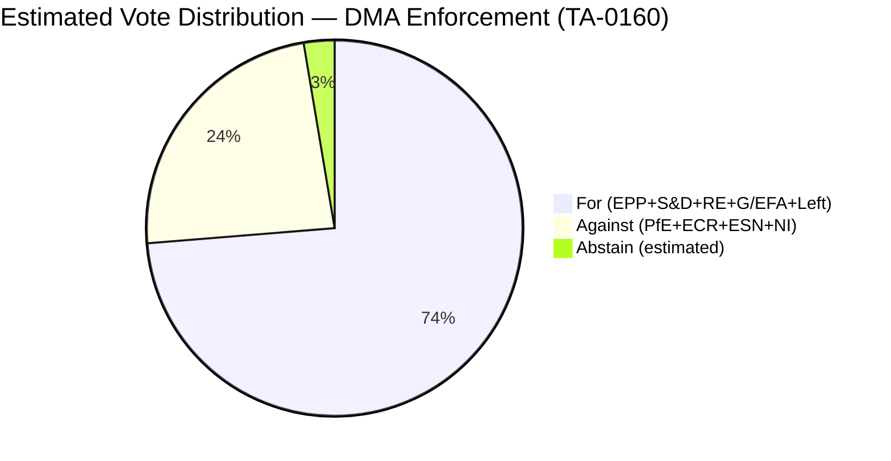

<!-- SPDX-FileCopyrightText: 2026 Hack23 AB -->
<!-- SPDX-License-Identifier: Apache-2.0 -->

# Coalition Dynamics — EU Parliament Breaking News: 7 May 2026

**Framework:** CIA Coalition Analysis Methodology  
**Subject:** EP Group Coalition Dynamics for April 28–30 legislative votes  
**Date:** 2026-05-07  
**Confidence:** 🟡 Medium — Per-MEP roll-call data unavailable (DOCEO XML not yet published for late April 2026); group-level proxy analysis only

---

> **⚠️ DATA LIMITATION:** Roll-call voting data for the April 28–30 plenary sessions (TA-10-2026-0112, TA-10-2026-0160, TA-10-2026-0161, TA-10-2026-0162) is not yet published in the EP DOCEO XML system. The EP roll-call registry typically has a multi-week publication delay. This analysis uses group political positions, parliamentary statements, and structural coalition logic — not individual MEP votes.

---

## 1 · Current Group Composition (EP10)

| Group | Seats | Share | Bloc |
|-------|-------|-------|------|
| EPP | 185 | 25.7% | Centre-Right |
| S&D | 136 | 18.9% | Centre-Left |
| PfE | 85 | 11.8% | Nationalist/Far-Right |
| ECR | 81 | 11.3% | Conservative-Right |
| Renew | 77 | 10.7% | Liberal-Centre |
| Greens/EFA | 53 | 7.4% | Green-Progressive |
| The Left | 45 | 6.3% | Progressive-Left |
| NI | 30 | 4.2% | Non-Attached |
| ESN | 27 | 3.8% | Nationalist/Eurosceptic |
| **TOTAL** | **719** | **100%** | — |
| **Majority threshold** | **361** | **50.2%** | — |

---

## 2 · Coalition Configurations — April 28–30 Texts

### TA-10-2026-0160 — DMA Enforcement (30 April)
**Expected coalition:** EPP + S&D + Renew + Greens/EFA + The Left  
**Expected opposing:** PfE + ECR + ESN + NI (fringe)  
**Estimated for:** ~520–550  
**Estimated against:** ~150–180  
**Rationale:** DMA enforcement strengthening has broad cross-party support. EPP supports as procompetition measure; S&D/Greens support as consumer protection; Renew supports as single market deepening. PfE/ECR/ESN opposed on grounds of regulatory burden and investment deterrence. ECR more split than PfE on digital regulation (some ECR members from IT sector constituencies).

---

### TA-10-2026-0161 — Russia/Ukraine Accountability (30 April)
**Expected coalition:** EPP + S&D + Renew + Greens/EFA + ECR (partial) + The Left (partial)  
**Expected opposing:** PfE + ESN + NI (partial)  
**Estimated for:** ~550–580  
**Estimated against:** ~80–120  
**Rationale:** Ukraine resolutions have historically attracted the broadest coalitions. ECR groups from Baltic states and Poland are typically strong supporters. PfE is split — Italian PfE delegates have been more supportive of Ukraine than Hungarian PfE. ESN near-uniformly opposes. The Left is historically split on NATO/security framing but broadly supports accountability mechanisms.

---

### TA-10-2026-0112 — 2027 Budget Guidelines (28 April)
**Expected coalition:** EPP + S&D + Renew (partial)  
**Expected opposing:** PfE + ECR + Greens/EFA + The Left + ESN  
**Estimated for:** ~390–420 (narrow majority)  
**Estimated against:** ~280–310  
**Rationale:** Budget resolutions are the most contested. The Left and Greens typically oppose as insufficient for social/climate spending; PfE/ECR oppose as excessive; the Budget is always a narrow vote. The 2027 guidelines text reflects EPP-S&D compromise that Renew partially accepts. Greens may abstain rather than oppose outright if there are climate provisions.

---

### TA-10-2026-0162 — Armenia Democracy (30 April)
**Expected coalition:** EPP + S&D + Renew + Greens/EFA + ECR + The Left  
**Expected opposing:** PfE (partial) + ESN + NI (pro-Azerbaijani)  
**Estimated for:** ~560–590  
**Estimated against:** ~80–110  
**Rationale:** Democracy solidarity resolutions attract near-unanimous support except from groups with pro-Russia/pro-Azerbaijan positioning. ECR Baltic and Polish delegates support Armenia as a geopolitical counterweight to Russian influence.

---

## 3 · Grand Coalition Viability Analysis

### EPP–S&D–Renew (Grand Coalition Core)
**Combined seats:** 398 (55.4% — above 361 majority)  
**Viability:** 🟢 Viable for most legislative acts  
**Stress indicators:** MFF negotiations (budget ambitions diverge); migration policy (Renew more liberal than EPP); social rights (S&D more ambitious than EPP)

### EPP–S&D–Renew + Greens/EFA (Supermajority)
**Combined seats:** 451 (62.7%)  
**Viability:** 🟢 Strong for progressive legislation, digital policy, climate  
**Use case:** DMA enforcement; climate legislation; social policy

### EPP + ECR (Conservative Alliance)
**Combined seats:** 266 (37.0% — BELOW majority)  
**Viability:** 🔴 Not viable as standalone majority  
**Risk:** PfE defections to this alliance would fracture current EPP alliance discipline

---

## 4 · Coalition Fragmentation Index

**Parliamentary Fragmentation Index (PFI):** 6.55 (Effective Number of Parties)  
**Interpretation:** High fragmentation. Pre-EP9 grand coalition (EPP+S&D) fell from ~55% (EP7) to ~46% (EP10 combined 321 seats). Three-party minimum for any majority coalition.

**Historical trajectory:**
- EP7 (2009): PFI ~4.12; EPP+S&D = 449 seats (supermajority)
- EP8 (2014): PFI ~5.1; EPP+S&D = 412 seats (supermajority)
- EP9 (2019): PFI ~6.0; EPP+S&D = 336 seats (below majority)
- EP10 (2024): PFI ~6.55; EPP+S&D = 321 seats (below majority)

**Trend:** Each EP term sees further fragmentation. Majority coalitions require more partners and are more vulnerable to defection.

---

## 5 · PfE Rule 169 Debate — Coalition Stress Indicator

The PfE Rule 169 debate on Commission interference (29 April) is a coalition stress indicator rather than a legislative coalition action. Key dynamics:
- PfE tabled the debate to demonstrate political opposition capacity
- EPP response: pro forma defence of Commission without full endorsement
- S&D response: explicit Commission defence; accused PfE of democratic backsliding
- ECR: abstained from strongest condemnation language; did not support PfE's strongest claims

**Assessment:** The PfE debate exposed that the ECR will not fully align with PfE's anti-Commission strategy. This suggests PfE's coalition-building ambitions for a conservative parliamentary alternative face structural limits. ECR's refusal to co-sign PfE's Commission challenge preserves the EPP's ability to work selectively with ECR on specific files (migration, competitiveness) without endorsing PfE's institutional destabilisation strategy.

---

*Sources: EP group composition data (EP Open Data Portal, 2026-05-04); EP debate records April 28–30; historical election results; coalition-dynamics MCP tool (proxy data only — DOCEO XML unavailable).*
