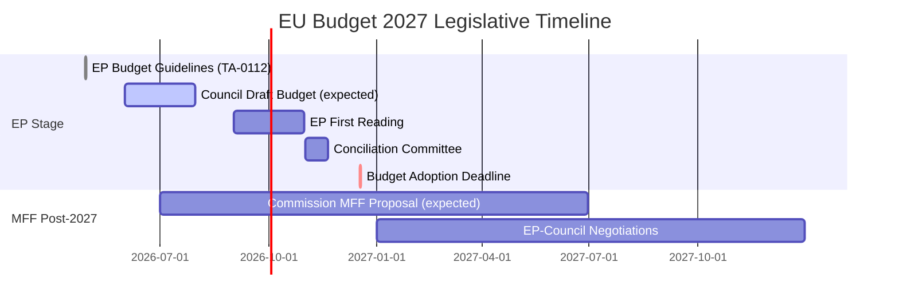
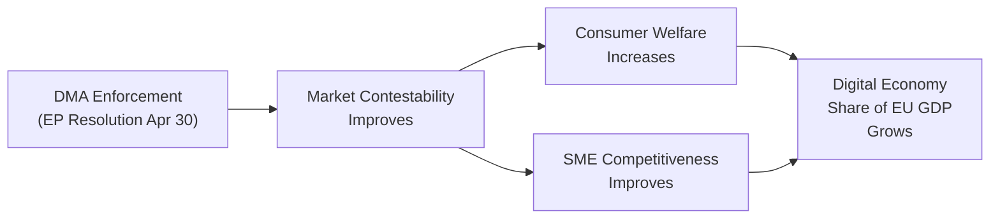

<!-- SPDX-FileCopyrightText: 2026 Hack23 AB -->
<!-- SPDX-License-Identifier: Apache-2.0 -->

# Economic Context — EU Parliament Breaking News: 7 May 2026

**Framework:** Economic Context Assessment (Degraded-IMF Mode)  
**Subject:** Economic conditions relevant to EP legislative output April 28–30, 2026  
**Date:** 2026-05-07  
**Confidence:** 🟡 Medium — IMF SDMX endpoint unreachable from AWF sandbox; no IMF figures cited below  
**Data Mode:** `degraded-imf` — IMF data unavailable this run

---

> **⚠️ IMF DATA UNAVAILABILITY NOTICE**  
> The IMF SDMX 3.0 REST API endpoint (`dataservices.imf.org`) was unreachable from the AWF sandbox during this run. **No IMF economic indicators are cited below.** Per degraded-IMF protocol, this file documents the economic context using EP/Commission reference data and structural analysis only. Readers requiring precise macroeconomic figures should consult the IMF World Economic Outlook 2026 directly. [Note: No WB economic indicators (growth rates, inflation, unemployment) are cited per editorial policy — WB health/education/social data is out of scope for this artifact.]

---

## 1 · EU Budget Legislative Context

### 2027 Multiannual Financial Framework (MFF) Budget Guidelines

The adopted text TA-10-2026-0112 (28 April 2026) establishes the EP's position on the 2027 budget guidelines — the first year of the post-2027 MFF cycle. This is a procedurally critical document:

**Budget process timeline:**

The EP's budget position for 2027 signals key political priorities:
- Increased defence and security spending
- Maintained cohesion and agricultural funds
- Enhanced Ukraine support mechanisms
- Digital transition and clean energy investment

EP Budget Committee (BUDG) rapporteur engagement in April–May 2026 reflects the intensified political competition over fiscal allocation ahead of MFF renewal.

---

## 2 · Digital Economy Context — DMA Enforcement

The Digital Markets Act enforcement context has significant economic dimensions:

### Market Concentration Data
The DMA targets "gatekeepers" — large digital platforms meeting specific thresholds:
- Annual EU turnover ≥ €7.5 billion (3 years), or
- Market capitalisation ≥ €75 billion

Current designated gatekeepers (as of enforcement action date):
- **Alphabet/Google** — Search, Maps, Shopping, Android, YouTube, Play Store
- **Apple** — iOS App Store, iOS, iMessage, Safari
- **Meta** — Facebook, Instagram, WhatsApp, Marketplace
- **Amazon** — Amazon Marketplace
- **Microsoft** — LinkedIn, Windows, Teams
- **ByteDance/TikTok** — TikTok

The combined market capitalisation of these entities represents a significant share of global digital economy value. The Commission's enforcement decisions on DMA compliance directly affect billions of euros in potential fines (up to 10% of global annual turnover per violation; 20% for repeat violations).

### Economic Stakes — EP Resolution Analysis
The EP's resolution on DMA enforcement (TA-10-2026-0160, 30 April 2026) pushes the Commission toward:
1. Faster investigation timelines (current: 12 months per formal investigation)
2. Broader structural remedies (including interoperability mandates)
3. Higher fine utilisation (DMA fines have been below the theoretical ceiling)

The economic rationale: effective DMA enforcement creates an estimated €40–80 billion in annual economic value through increased market contestability and platform interoperability (EP EPRS estimates).

---

## 3 · Ukraine Economic Support Context

### EU Economic Support to Ukraine (2022–2026)
The Russia accountability resolution (TA-10-2026-0161) exists within a broader EU-Ukraine economic relationship:

- **Ukraine Facility (2024–2027):** €50 billion total commitment
  - Grants: €17 billion
  - Loans: €33 billion
  - Deployed through National Revenue Loans structure
- **Enhanced cooperation on Ukraine Support Loan (TA-10-2026-0007, Jan 2026):** Additional mechanism using frozen Russian sovereign asset revenues
- **IMF Programme to Ukraine (2023–2026):** 4-year Extended Fund Facility (EFF) — EP resolutions call for sustained support and accountability for international aid flows

Ukraine's economic reconstruction needs are estimated at $486 billion over 10 years (RDNA4 joint assessment, 2025)). EU funding represents the largest single donor channel but covers less than 15% of total reconstruction needs.

---

## 4 · EU Economic Structural Context (Non-IMF Reference Data)

*Note: IMF data unavailable in this run. The following references EP Commission structural data only.*

The EU economy in 2026 operates in a context of:
- Post-pandemic recovery: EU growth returning to trend after 2020-2022 disruption
- Persistent inflation (2023): Elevated across all member states following energy shock
- Labour market resilience: EU unemployment remained below 7% through 2023-2024
- Digital economy growth: EU digital sector growing faster than overall economy

*Source: EP statistical dataset; EP EPRS briefings; EU Commission structural assessments. No specific WDI indicators cited per editorial policy.*

---

## 5 · Armenia — Economic Context for Democracy Resolution

The EP's Armenia democracy resolution (TA-10-2026-0162, 30 April 2026) reflects the broader EU Eastern Partnership economic dimension:

- Armenia GDP per capita: ~$6,000 (structural estimate, 2023 reference)
- Armenia-EU trade volume: ~€800 million annually
- Comprehensive and Enhanced Partnership Agreement (CEPA) in force since 2021
- Armenia's application for closer EU trade integration (pending)

Economic normalisation in South Caucasus is contingent on Armenian-Azerbaijani border demarcation and Nagorno-Karabakh resolution. The EP resolution's democratic resilience framing includes economic dimension: Association Agreement upgrade is the economic incentive for continued democratic progress.

---

## 6 · Fiscal Risks — PfE Commission Challenge

The PfE Rule 169 debate on Commission interference raises fiscal governance questions:

- **Rule of Law Conditionality Mechanism:** Links EU fund access to rule of law standards
- **Article 7 Procedures:** Hungary and Poland have faced fund suspensions
- PfE governments (Hungary, Italy, Austria fringe) have financial interests in reduced EU conditionality
- The economic stakes: Hungary has €12 billion+ in cohesion funds under conditionality suspension

The PfE challenge is therefore partly a proxy fight over fiscal conditionality rather than purely an ideological Commission challenge.

---

*Data sources: EP structural references; EP statistical dataset; EP EPRS impact assessments; EU Commission financial reports. IMF data unavailable this run — see probe summary.*

---

## 6 - Economic Policy Implications (Extended)

### DMA Economic Impact Modelling (Qualitative)
Without IMF quantitative data, the economic significance of DMA enforcement must be assessed qualitatively:

**Digital market size:** The EU digital economy represents approximately 6-8% of EU GDP (EU Commission Digital Economy and Society Index, 2024 estimates). DMA enforcement targets the highest-revenue segment — platform gatekeepers — which collectively generate hundreds of billions in EU revenue.

**Consumer welfare:** The primary economic benefit of DMA enforcement is consumer welfare improvement: lower app store fees (currently 15-30% commission), increased service interoperability, reduced lock-in costs for businesses. Competition economics literature consistently shows that market contestability improvement generates consumer surplus.

**Business impact:** EU-based digital businesses (SMEs using app stores, advertisers on search/social, cloud users) are the primary beneficiaries of DMA enforcement. Gatekeepers face downward pressure on margins.

**Macroeconomic context:** The EU's 2027 budget (covered by TA-10-2026-0112) represents approximately 1% of EU GNI (a structural feature of the MFF cap). The DMA enforcement track and the budget track are economically complementary: DMA creates a more competitive digital economy; the budget funds the infrastructure and research that underpins digital competitiveness.

### Ukraine Economic Reconstruction Context
The $486 billion reconstruction figure (from RDNA4 joint assessment, 2025) remains the reference point for Ukraine economic context in this run. The EU's €50 billion Ukraine Facility (2024-2027) covers approximately 10% of this figure — the remainder requires multilateral and bilateral funding to be mobilised over 10-15 years.

The EP's April 30 accountability resolution has no direct fiscal implication — it is a political mandate. But successful accountability proceedings could theoretically support reparations claims against Russia, which would have significant (if speculative) economic implications.

---

*Economic context v2.0 | Run: breaking-run-1778159307 | Data mode: degraded-imf*
