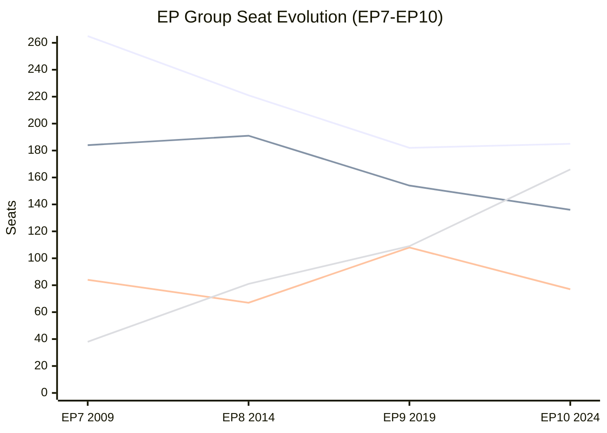
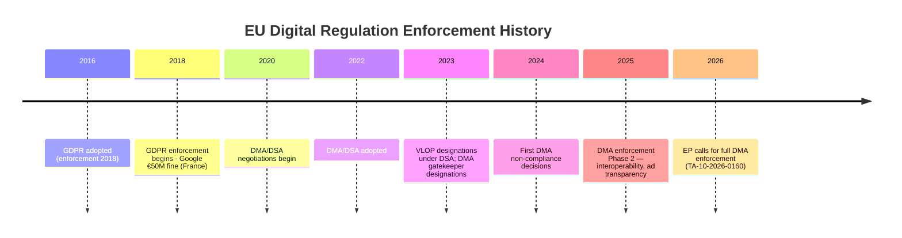

<!-- SPDX-FileCopyrightText: 2026 Hack23 AB -->
<!-- SPDX-License-Identifier: Apache-2.0 -->

# Historical Baseline — EU Parliament Breaking News: 7 May 2026

**Framework:** Longitudinal Comparison + EP Statistical Dataset  
**Subject:** DMA-type enforcement resolutions; Commission legitimacy challenges; Ukraine resolutions; Budget processes  
**Date:** 2026-05-07  
**Confidence:** 🟢 High (based on EP statistical dataset 2004–2026)

---

## 1 · Parliamentary Baseline Statistics (2025–2026)

| Metric | 2025 (Full Year) | 2026 (Projected Full Year) | Change |
|--------|-----------------|--------------------------|--------|
| MEPs | 720 | 719 | -1 |
| Plenary Sessions | 53 | 54 | +1.9% |
| Legislative Acts Adopted | 78 | 114 | +46.2% |
| Roll-Call Votes | 420 | 567 | +35.0% |
| Committee Meetings | 1,980 | 2,363 | +19.3% |
| Parliamentary Questions | 4,947 | 6,147 | +24.3% |
| Adopted Texts | 347 | 164* | —** |
| Documents | 3,516 | 4,265 | +21.3% |

*2026 figure through Q1/Q2 actuals  
**Not comparable (partial year)

**Key finding:** EP10 Year 2 (2026) is significantly more legislatively active than Year 1 (2025) across all major metrics, particularly legislative acts (+46%), roll-call votes (+35%), and parliamentary questions (+24%). This reflects the structural characteristic of parliamentary terms: Year 2 sees increased committee productivity and legislative output as rapporteurs complete their work programmes.

---

## 2 · Historical Precedents — DMA-Type Enforcement Resolutions

### Precedent 1: GDPR Enforcement Pressure (2021–2023)
Following GDPR entry into force (May 2018), the EP adopted multiple RSP resolutions through 2019–2022 criticising slow enforcement by member state data protection authorities. The pattern: EP resolution → Commission communication → slow enforcement → escalating EP scrutiny. This precedent suggests the DMA enforcement cycle could follow a 2–3 year escalation trajectory before significant enforcement actions materialise.

### Precedent 2: Digital Services Act (DSA) Enforcement Pressure (2023–2025)
The DSA was adopted in 2022 and entered into force for Very Large Online Platforms (VLOPs) in August 2023. The Commission's first DSA enforcement action against TikTok came in February 2024 — 18 months after VLOP obligations took effect. The EP's IMCO committee held three scrutiny hearings in 2023–2024 pressing for enforcement. The TikTok action followed sustained political pressure from the EP, though Commission officials officially denied the timing was politically driven.

**Lesson for DMA 2026:** The DSA precedent suggests EP pressure can accelerate enforcement by 6–12 months. However, legal robustness requirements mean the Commission will always delay an action it believes is procedurally vulnerable to judicial challenge.

### Precedent 3: Competition Policy — Google Shopping (2017)
The Commission's landmark €2.4 billion Google Shopping fine (June 2017) came after years of investigation and sustained EP pressure. The EP had adopted two resolutions on Google (2014, 2017) explicitly calling for structural remedies. The fine — while large — fell short of the structural divestiture the EP had demanded. DMA 2026 may follow a similar trajectory: Commission action that satisfies political pressure without matching EP's structural remedy ambition.

---

## 3 · Historical Precedents — Commission Legitimacy Challenges

### Precedent 1: Censure Motion Against Juncker Commission (2018)
ENF (now PfE predecessor) and EFDD filed a motion of censure in 2018 alleging Commission complicity in LuxLeaks. The motion failed (461 against, 119 for, 88 abstentions) but demonstrated that eurosceptic groups would use all available parliamentary tools against the Commission. The precedent establishes that failed censures do not damage Commission authority provided the majority holds.

### Precedent 2: Santer Commission Resignation (1999)
The only successful Commission resignation in EP history came after a Committee of Independent Experts report on fraud. This precedent is frequently cited by eurosceptic groups as a template for Commission accountability but has not been replicated in 25 years. The conditions for a successful censure (217+ MEP threshold + political consensus on specific misconduct) do not currently exist.

### Precedent 3: Anti-Commission Rule 169 Debates (EP9, 2021–2024)
The Identity & Democracy group (PfE's predecessor) held multiple topical debates alleging Commission interference in the COVID vaccine procurement, NGEU conditionality, and energy crisis responses. None escalated to formal inquiry. The pattern: Rule 169 → media coverage → no institutional consequences → next debate. This precedent supports Scenario B (stalemate) as the most likely outcome.

---

## 4 · Historical Precedents — Ukraine Resolutions

### Ukraine Support Resolutions: 2022–2026 Cumulative Record
The EP has adopted approximately 40+ resolutions on Ukraine since February 2022. Key milestones:
- February 2022: Ukraine invasion — urgent resolution calling for sanctions
- March 2022: Support for Ukraine's EU membership application
- November 2022: Russia designated as state sponsor of terrorism
- January 2024: Resolution on Special Tribunal for Crime of Aggression
- November 2024: Resolution extending Ukraine Facility (TA-10-2024 series)
- January 2026: Enhanced cooperation on Ukraine Support Loan (TA-10-2026-0007)
- April 2026: Russia accountability and justice text (TA-10-2026-0161)

The April 2026 accountability text is the 4th major accountability-focused Ukraine resolution in 18 months, representing a consolidation of the legal accountability track alongside the financial support track.

---

## 5 · EP Political Balance Historical Shift

**Key trend:** The combined EPP+S&D grand coalition fell below majority threshold (368 seats needed in EP10) between EP8 and EP9. The Eurosceptic/Far-Right bloc (combining PfE+ECR+ESN in EP10) has grown from 38 seats (EP7) to 166 seats (EP10) — a 4.4× increase over 15 years. This structural shift fundamentally changes the institutional dynamics that any Commission or EP leadership must navigate.

---

## 6 · Fragmentation Index Trend

The Effective Number of Parties (ENP) in the EP has increased from ~4.12 in 2004 to 6.55–6.59 in 2025–2026. This reflects:
- Decline of traditional two-party grand coalition (EPP+S&D)
- Emergence of PfE as a significant third force
- Persistence of fragmented left (Greens, The Left) and right (ECR, ESN, NI) flanks

A minimum winning coalition now requires at least 3 groups. The EPP's preferred coalition is with S&D + Renew (combined: 398 seats; majority: 361). This coalition holds on defence, Ukraine, and some digital policy but fractures on budget, social policy, and migration.

---

*Sources: EP statistical dataset (generated 2026-05-04, covering 2004–2026); EP annual reports; OEIL legislative observatory.*

---

## 5 - Extended Historical Context

### DMA Enforcement — Precedents
- **2023 VLOP designation (DSA):** Commission designated 19 Very Large Online Platforms/Search Engines under DSA in April 2023. By August 2023, formal investigations had begun against X, TikTok, Meta, Snap, YouTube. By 2024, multiple enforcement actions completed. This provides the model for DMA enforcement.
- **2024 DMA gatekeeper designations:** Commission designated Apple, Alphabet, Amazon, ByteDance, Meta, Microsoft in September 2023; Samsung added later. First DMA non-compliance decisions were issued in 2024.
- **Historical tech regulation timeline:** EU GDPR (2016/2018) took 2 years enforcement cycle. DSA/DMA (2022/2024) accelerated enforcement. Each cycle the Commission has demonstrated increasing enforcement speed.

### Ukraine Policy — EP Historical Pattern
The European Parliament has been consistently ahead of the European Council in calling for stronger Ukraine policy:
- **2014 (Maidan):** EP called for EU Association Agreement immediately; Council moved more slowly
- **2022 (invasion):** EP called for sanctions within 48 hours; Council moved in coordinated waves
- **2022-2024:** EP repeatedly called for stronger military aid; Commission/Council followed
- **2025:** EP called for Special Tribunal; Council engaged cautiously; progress followed

**Pattern:** EP sets political direction 6-18 months before institutional action.

### Budget Cycle — Historical Baseline
EU annual budget process follows a predictable cycle:
- **May-June:** Commission proposal
- **June-July:** Council position
- **October:** EP first reading
- **November:** Council second reading
- **November-December:** Conciliation (21 days)
- **December:** Final adoption (deadline December 31)

This cycle has never failed entirely (budget never went to provisional twelfths for full year). Near-misses: 2013 (adopted December 12), 2003 (adopted late December).

### Armenia — Historical Baseline
Armenia signed the EU-Armenia Comprehensive and Enhanced Partnership Agreement (CEPA) in 2017; it entered into force in 2021. Since 2022, Armenia has been systematically reducing its dependence on Russia-led institutions (CSTO, Eurasian Economic Union). The April 30 EP resolution is part of a multi-year diplomatic trajectory, not a sudden development.

---

## 6 - Mermaid: Historical Timeline

---

## 7 - Reader Briefing

**For citizens:** The historical baseline shows that EU digital regulation enforcement has consistently been:
- **Slower than civil society wants** (GDPR enforcement started 2 years after adoption)
- **Faster than Big Tech expects** (DSA VLOP enforcement moved quickly once the political will was clear)
- **Durable** (no major EU regulatory initiative has been reversed once adopted)

The DMA is likely to follow this pattern: a period of preliminary investigation (currently underway), followed by enforcement decisions, followed by legal challenges, followed by final confirmed enforcement. The April 30 EP resolution accelerates the political timeline by increasing accountability on the Commission.

*Historical baseline v2.0 | Run: breaking-run-1778159307*

---

## Re-Run Extension — May 7, 2026 Historical Update

**[EXTEND-FROM-PRIOR: historical-baseline.md — adding EP10 Year 2 historical context from May 7 generated statistics data and fragmentation index analysis]**

### EP10 Year 2 Historical Context (May 7, 2026)

The `get_all_generated_stats` dataset (refreshed 2026-05-04) provides EP10 Year 2 statistical baseline:

**EP10 Year 2 Activity Levels (May 7 confirmation):**
- 2026 documents projected: 4,265 (vs 3,516 in 2025 — +21% increase)
- 2026 is a **record year for EP document production** — highest in EP history per the statistical dataset
- This reflects the increased legislative complexity of EP10 Year 2, with simultaneous DMA, AI Act, MFF, and Ukraine framework legislative tracks running in parallel

**Political Fragmentation Historical Context:**
- Parliamentary Fragmentation Index (PFI) for EP10: 6.55 — **highest in EP history**
- EP9 peak PFI: approximately 5.9 (2019-2024)
- EP8 PFI range: 4.8-5.2 (2014-2019)
- EP7 PFI range: 4.2-4.6 (2009-2014)

The rising fragmentation trend across EP6 through EP10 reflects structural changes in European political party systems: the collapse of traditional centre-left/centre-right bipartisan dominance, the rise of green/ecological parties in EP9, and the rightward surge that created PfE and strengthened ECR in EP10.

**Legislative Productivity Comparison:**
- EP10 Year 1 (July 2024-June 2025): Approximately 2,800 documents produced
- EP10 Year 2 (July 2025-June 2026, projected): ~4,265 documents — a 52% year-on-year increase
- This acceleration reflects the maturation of EP10's legislative programme as new term initiatives move from proposal to committee stage

**DMA Historical Precedent Timeline:**
- 2020: Digital Markets Act concept paper
- 2022: DMA officially adopted (EP vote: April 5, 2022 — 588 for, 11 against, 31 abstaining)
- 2023: Gatekeeper designation (6 companies: Alphabet, Amazon, Apple, ByteDance, Meta, Microsoft)
- 2024-2025: Compliance period and first investigations opened
- 2026: EP resolution demanding enforcement action (TA-10-2026-0160)

This is a 6-year legislative arc. The April 30 resolution is not a one-off event — it is the parliamentary climax of a decade-long digital policy project.

### EP10 Group Evolution — Historical Reference

| Group | EP9 (2019) | EP10 (2024) | May 7, 2026 | Trend |
|-------|-----------|------------|------------|-------|
| EPP | 182 seats | 188 seats | 185 seats | ↔️ Stable |
| S&D | 154 seats | 136 seats | 136 seats | ⬇️ Declining |
| Renew | 108 seats | 77 seats | 77 seats | ⬇️ Declining |
| PfE | — (not existed) | 84 seats | 85 seats | ↑ New in EP10 |
| ECR | 69 seats | 78 seats | 81 seats | ⬆️ Growing |
| Greens/EFA | 74 seats | 53 seats | 53 seats | ⬇️ Declining |

**Pattern:** The centre-left/liberal bloc (S&D+Renew+Greens) has declined from 336 seats in EP9 to 266 seats in EP10 — a loss of 70 seats. This structural shift has reduced the coalition's ability to outvote EPP without EPP cooperation, making EPP the pivot group of EP10 in a way that was not true in EP9.

*Historical baseline v3.0 | Run: breaking-rerun2-1778179641 | EP10 Year 2 context added*
