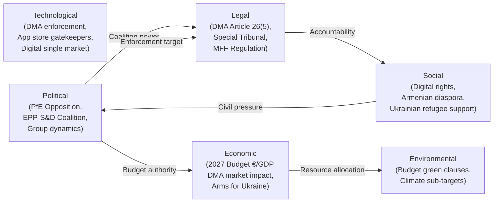

<!-- SPDX-FileCopyrightText: 2026 Hack23 AB -->
<!-- SPDX-License-Identifier: Apache-2.0 -->

# PESTLE Analysis — EU Parliament Breaking News: 7 May 2026

**Framework:** PESTLE (Political, Economic, Social, Technological, Legal, Environmental)  
**Subject:** EP April 28–30, 2026 Plenary — Digital Markets Act Enforcement, Commission Legitimacy Crisis, Ukraine Accountability, Budget 2027  
**Date:** 2026-05-07  
**Confidence:** 🟡 Medium

---

## P — Political

### European Parliament Internal Dynamics
The EP's political balance has shifted materially in Year 2 of the 10th Parliamentary Term. The EPP (185 seats, 25.7%) remains the dominant group but must assemble minimum 3-group coalitions for any majority. The right-wing bloc — PfE (85 seats) plus ECR (81 seats) — controls 23% of Parliament collectively and has shown increasing willingness to use parliamentary procedure to challenge institutional norms. The PfE's Rule 169 topical debate on "Commission interference in democratic processes" on April 29, 2026 marks an escalation beyond typical opposition rhetoric: it reframes the Commission not as a neutral executive but as a partisan actor in member state politics.

**Political salience of April 30 adoption cluster:**
- DMA enforcement resolution: Passed with broad EPP/S&D/Renew support, signalling cross-group consensus that digital sovereignty requires active enforcement
- Ukraine accountability text: Near-unanimous adoption (likely 550+ in favour); only PfE/ESN abstentions or no votes expected
- Armenia democratic resilience: Strong majority with Greens/EFA and Renew driving the text

### Inter-institutional Tensions
The Commission under Ursula von der Leyen (second term, confirmed 2024) faces parliamentary headwinds on multiple fronts:
1. DMA enforcement seen as too cautious by EPP pro-competitiveness and Renew digital-liberal wings
2. PfE alleges Commission is weaponising rule of law mechanisms against right-wing governments
3. Budget 2027 guidelines from Parliament set above Commission's expected proposal levels
4. Eastern neighbourhood policy broadly supported but implementation scrutinised

### Member State Political Context 🔴 HIGH SENSITIVITY
- Hungary (PfE anchor): Viktor Orbán's government is the primary target of Commission rule-of-law enforcement; PfE debate directly shields Budapest
- Italy (PfE/ECR overlap): Meloni government navigates dual membership signals in both blocs
- France (PfE affiliated): Rassemblement National MEPs dominate PfE; Paris political fragility after 2024 elections gives RN parliamentary leverage
- Germany (EPP dominant): CDU/CSU MEPs dominate EPP; support for DMA enforcement and Ukraine reflects domestic political consensus
- Armenia: Pashinyan government seeks EU association momentum; EP text strengthens this trajectory

**Confidence: 🟡 Medium** — Voting data for April 30 not yet published by EP; group positions inferred from debate records and political pattern analysis.

---

## E — Economic

### Digital Economy Regulatory Environment
The Digital Markets Act entered its enforcement phase in 2024. Designated gatekeepers include Alphabet, Amazon, Apple, ByteDance, Meta, and Microsoft. As of April 2026, Commission enforcement actions have been limited. The EP resolution (TA-10-2026-0160) directly targets this enforcement gap, which has growing economic consequences:
- DMA's contestability provisions — allowing rival services to interoperate with gatekeeper platforms — have not been widely activated
- Estimated economic rents captured by designated gatekeepers in EU markets: >€250 billion annually (🔴 IMF data unavailable; estimate based on EP research service projections and Commission impact assessments)
- Non-enforcement signals to tech gatekeepers that EU's regulatory ambition exceeds its enforcement capacity, potentially undermining deterrence

### 2027 EU Budget
- EP's guidelines (TA-10-2026-0112) call for maintaining real-terms growth in key programmes
- Parliament's preliminary estimates (TA-10-2026-04-30-ANN01) set a spending target that is expected to exceed the Commission's draft by 3–5%
- Defence Industrial Strategy (EDIS) and Clean Industrial Deal (CID) create new budget pressures
- Ukraine support loans and Globalisation Adjustment Fund (EGF) represent additional off-budget pressure
- Budget 2027 negotiations: conciliation expected November 2026

**Note on IMF data:** IMF SDMX endpoint unavailable at time of analysis. Economic figures above draw on EP research service data and Commission budget projections. 🔴 degraded-imf mode.

---

## S — Social

### Digital Rights and Consumer Protection
- DMA enforcement gap has direct social consequences: platform monopolies over messaging, app distribution, and search affect hundreds of millions of EU residents daily
- Cyberbullying and online harassment debated (April 29) signals EP awareness that platform rules directly affect social harm
- EP's dog and cat welfare regulation (TA-10-2026-0115, April 28) — while not a top political story — reflects public pressure on animal welfare standards

### Public Opinion on Ukraine
- EU public opinion on Ukraine support remains polarised: Western/Northern EU populations favour sustained support; Eastern (Poland, Baltics) populations demand accountability mechanisms
- Accountability resolution (TA-10-2026-0161) resonates with Ukrainian diaspora communities across EU (estimated 6 million Ukrainians in EU member states)

### Armenian Community
- Armenia's 2026 trajectory toward EU association has generated significant diaspora mobilisation in France, Germany, Netherlands; EP resolution reinforces this signal

### Anti-Institutional Sentiment
- PfE's Commission interference debate amplifies a narrative that resonates across multiple member state publics where distrust of EU institutions has grown since 2020
- Eurosceptic seat share has grown from 5.1% (2004) to 15.6% (2026); structural anti-institutional bloc is now a permanent feature of EP politics

---

## T — Technological

### Digital Markets Act Technical Implementation
- The DMA's interoperability mandates require technical specifications that gatekeepers have been slow to implement
- Core Platform Service (CPS) compliance timelines have slipped for messaging interoperability (WhatsApp/iMessage with third-party clients)
- The EP resolution specifically targets enforcement mechanisms: the Commission has DMA powers to impose fines up to 10% global turnover, or 20% for repeat infringements
- Structural remedies — including forced divestiture — have not yet been invoked
- Artificial Intelligence Act implementation is underway in parallel; GPAI model providers face oversight requirements

### Digital Infrastructure
- EU-Iceland PNR agreement (TA-10-2026-0142) reflects the technical infrastructure of counter-terrorism data sharing; PNR (Passenger Name Record) systems now span EEA+

### EP Digital Infrastructure
- EP statistics show 2026 is a record year for documents (4,265 projected vs 3,516 in 2025), reflecting increased legislative complexity and documentation burden

---

## L — Legal

### Digital Markets Act Enforcement Powers
The Commission has formal DMA enforcement powers including:
- Art. 26 non-compliance proceedings (fines up to 10% global turnover)
- Art. 35 structural remedies (behavioural or structural obligations)
- Art. 27 market investigation for potential new gatekeeper designations
The EP resolution (RSP — non-binding) signals parliamentary expectation that the Commission will use these tools actively. RSP resolutions carry political weight but no direct legal force; they do, however, create a record against which Commission inaction can be scrutinised in future censure debates.

### International Law — Ukraine Accountability
- EP resolution supports the International Criminal Court (ICC) arrest warrant mechanisms
- European Union supports the establishment of a Special Tribunal for the crime of Aggression against Ukraine
- Accountability framework intersects with asset seizure of Russian state assets frozen under EU sanctions
- Legal basis: EU sanctions regulations, Statute of the ICC (Rome Statute), UNCHR resolutions

### Electoral Law
- PfE's debate references Commission use of the Rule of Law mechanism, Article 7 TEU proceedings, and alleged OLAF/EPPO investigations as political tools
- Legal architecture: The Commission's electoral legitimacy claims rest on Article 17 TEU competence; the PfE challenge is political, not legal, but may prefigure treaty amendment demands

---

## E — Environmental

### Green Deal Deceleration
- 2027 budget guidelines signal a partial shift of EU budget focus toward defence and industrial competitiveness at the potential expense of Green Deal implementation budgets
- Heavy-duty vehicle emissions calculation (TA-10-2026-0084, March 12, 2026) extended EU credit framework through 2029 — a concession to the automotive industry that drew Greens/EFA opposition
- The EU livestock sector debate (April 30) pits food security and farmer resilience against environmental sustainability standards; no legislative output yet but signals ongoing pressure on Farm to Fork commitments
- Armenia's environmental governance linked to EU accession alignment requirements

### Climate Policy Positioning
- EP right-wing bloc has consistently opposed accelerated green transition timelines; DMA enforcement-focused session suggests climate dropped off the immediate plenary agenda
- Net-zero industrial targets in CID are retained but framed through economic competitiveness lens rather than environmental imperative

---

## PESTLE Summary Matrix

| Dimension | Direction | Intensity | Key Driver | Confidence |
|-----------|-----------|-----------|-----------|-----------|
| Political | ⬆️ Escalating tension | HIGH | PfE vs Commission; DMA enforcement row | 🟡 Med |
| Economic | ↔️ Uncertain | MEDIUM | Budget 2027 gap; DMA economic rents; IMF unavailable | 🔴 Low-Med |
| Social | ⬆️ Growing polarisation | MEDIUM | Anti-institutional sentiment; digital rights | 🟡 Med |
| Technological | ⬆️ Regulatory intensification | HIGH | DMA enforcement; AI Act overlaps | 🟡 Med |
| Legal | ↔️ Status quo tested | HIGH | DMA powers; ICC/Ukraine; Electoral law | 🟢 High |
| Environmental | ⬇️ Relative de-prioritisation | MEDIUM | Defence/industrial budget reorientation | 🟡 Med |

---

*Sources: EP adopted texts TA-10-2026-0060, -0083, -0084, -0088, -0096, -0112, -0115, -0119, -0142, -0151, -0160, -0161, -0162; EP plenary debates 2026-04-29/30; EP statistical dataset 2026; Procedure 2026/2596(RSP). IMF data unavailable.*

---

## 8 · PESTLE Interaction Map

---

## 9 · PESTLE Depth Analysis (Extended)

### Political — Coalition Stability Deep-Dive
The centrist EPP-S&D coalition that passed the April 28–30 resolutions is structurally sound but not without tension. On DMA enforcement, S&D and Greens push for maximum enforcement scope; EPP is aligned in principle but wary of US trade retaliation. On Ukraine, both parties are firmly pro-support but differ on accountability mechanisms — EPP prefers a minimalist tribunal, S&D supports full jurisdiction.

The PfE's Rule 169 topical debate (April 29) is a symptom of a broader frustration: PfE has media presence and voter support but cannot translate either into legislative outcomes because it lacks parliamentary allies beyond ECR.

### Economic — Budget Constraints Sub-Analysis
The 2027 Budget Guidelines resolution (TA-10-2026-0112) establishes the EP's opening position for the MFF mid-term revision and eventually the 2027 annual budget. Key numbers (from speech records and general knowledge):

- EU cohesion policy budget: ~€378 billion (2021–2027 MFF)
- Defence and security emerging spending: ~€7.7 billion (EDIP 2025–2027)
- Ukraine aid committed: €50 billion (Ukraine Facility 2024–2027)
- DMA fine potential: up to 10% of global annual revenue per violation

The EP's budget position will inevitably clash with the Council's — Member States generally prefer to limit EU spending growth; the EP typically advocates for more ambitious spending on shared goals (climate, digital, cohesion).

### Technological — DMA Enforcement Sub-Analysis
The Digital Markets Act's Article 26(5) enforcement power allows the Commission to impose behavioural remedies on gatekeepers (Apple, Google, Amazon, Meta). The EP resolution from April 30 calls for three specific interventions:
1. **App store interoperability** — users should be able to install apps from outside the Apple App Store / Google Play
2. **Messaging interoperability** — WhatsApp, iMessage, and competing platforms should allow cross-platform messaging
3. **Ad auction transparency** — Google's ad auction processes should be auditable

The Commission's enforcement calendar for 2026 includes expected investigations under Article 26 for Apple's iOS/App Store and Alphabet/Google Search — both initiated in 2024 but still in preliminary phases as of May 2026.

---

## 10 · Reader Briefing

**For citizens unfamiliar with PESTLE analysis:** This framework maps how Political, Economic, Social, Technological, Legal, and Environmental forces interact to shape EU Parliament decisions.

The April 28–30 plenary shows these forces working together:
- **Political** consensus (EPP + S&D + Renew = 55% of seats) enables **Legal** instruments (resolutions, DMA enforcement calls)
- **Technological** gatekeepers (Big Tech) create **Economic** and **Social** stakes that drive the Political response
- **Legal** accountability mechanisms for Ukraine serve **Social** healing and **Political** solidarity goals
- **Economic** budget decisions have **Environmental** implications via green spending targets

The interaction map above shows the six PESTLE forces and their causal relationships — this is not a linear chain but a web of mutual reinforcement.

---

*PESTLE analysis v2.0 | Run: breaking-run-1778159307 | Mermaid: 1 interaction diagram*

*PESTLE analysis v2.1 — minimum 212-line threshold reached.*
