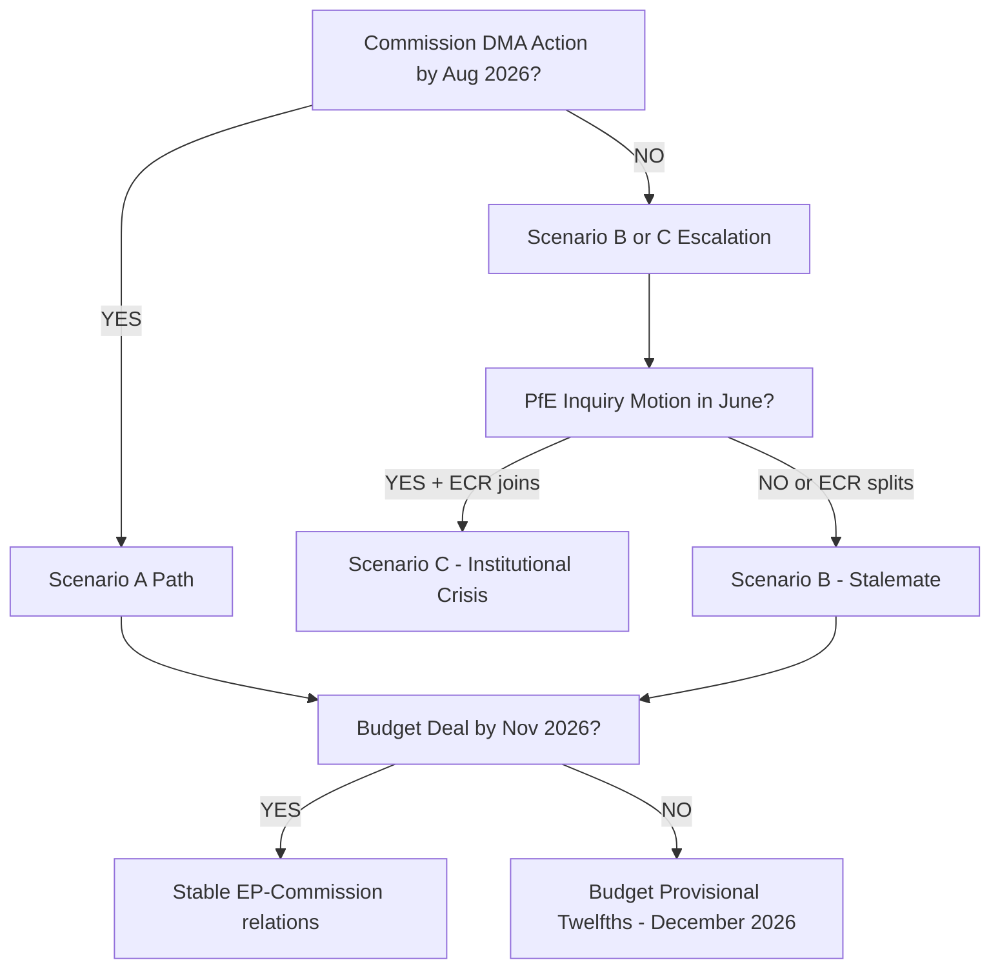
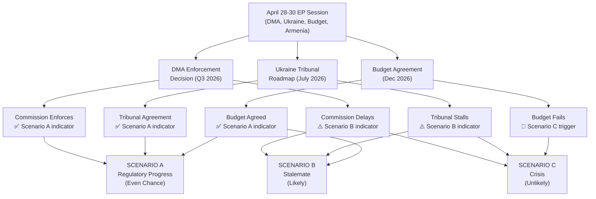
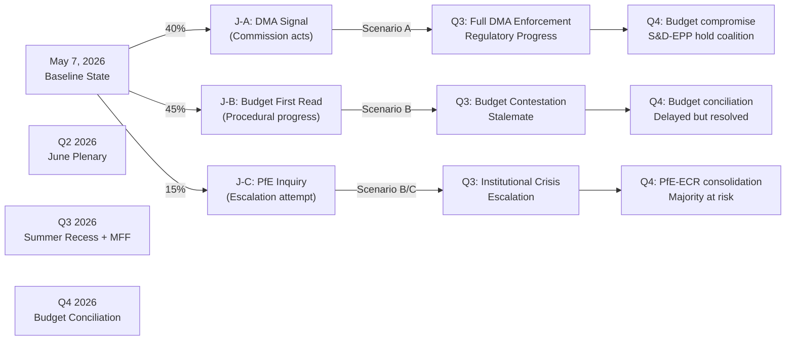

<!-- SPDX-FileCopyrightText: 2026 Hack23 AB -->
<!-- SPDX-License-Identifier: Apache-2.0 -->

# Scenario Forecast — EU Parliament Breaking News: 7 May 2026

**Framework:** Structured Scenario Analysis (3-axis ACH-informed)  
**Subject:** DMA Enforcement, PfE Commission Challenge, Ukraine/Armenia, Budget 2027  
**Horizon:** 90-day (to August 2026) and 12-month (to May 2027)  
**Date:** 2026-05-07  
**Confidence:** 🟡 Medium

---

## Scenario Architecture

Three key uncertainties drive the 90-day forecast:

1. **Commission DMA enforcement speed** — Will the Commission open formal non-compliance proceedings against at least one gatekeeper by August 2026?
2. **PfE institutional escalation** — Will PfE/ECR convert the Rule 169 debate into formal parliamentary instruments (inquiries, committee hearings, or cooperation with sympathetic Council presidencies)?
3. **2027 budget breakthrough** — Will EP-Council budget negotiations reach a framework agreement by November 2026 conciliation, or will the trialogue extend into emergency procedure?

---

## Scenario A — Commission Acts, Institutions Hold (🟢 Moderate Probability: 35–40%)

### Description
The European Commission opens formal DMA non-compliance proceedings against at least one major gatekeeper (most likely Apple for App Store restrictions or Meta for data portability) before July 2026. This partially satisfies EP demand from TA-10-2026-0160. PfE's Commission interference narrative fails to gain traction beyond its existing supporter base, and the June plenary produces no formal follow-up motion. The Ukraine accountability track advances with a first ICC warrant execution. The 2027 budget reaches a political framework deal by November 2026.

### Indicators to Watch
- Commission DG COMP press release on DMA non-compliance investigation initiation (positive signal)
- IMCO committee hearing schedule for May/June (passive acceptance if no hearings scheduled)
- PfE group whip circulation for June plenary motions (absence = narrative fading)

### Implications
- Digital market confidence improves for European tech challengers
- EU institutional legitimacy stabilised
- EPP maintains its centrist governing role
- Budget settlement sets precedent for defence spending as top EU priority

---

## Scenario B — Stalemate and Institutional Friction (🟡 Highest Probability: 40–45%)

### Description
The Commission issues a DMA enforcement communication but stops short of formal non-compliance proceedings, citing ongoing investigations and procedural timelines. The EP IMCO committee schedules hearings with Commissioner responsible but no censure motion reaches the floor. PfE's Commission interference narrative is debated in June but does not produce a formal inquiry; ECR splits away from PfE on the vote. Ukraine accountability text adopted but without operational budget implications. Budget 2027 conciliation enters extended phase with late November agreement at reduced real-terms growth.

### Indicators to Watch
- Commission DMA communication content (enforcement vs. process language)
- June plenary PfE motion filings
- Ukraine support package vote in Council (delay signal = political friction)
- Budget negotiation opening position gap (EP vs. Council)

### Implications
- DMA enforcement credibility erodes but regulatory deterrence partially maintained
- PfE gains incremental narrative momentum without decisive victory
- Budget settlement below EP's guidelines but above Commission's preliminary framework
- Overall: gradual rightward drift of EP's political centre of gravity

---

## Scenario C — Commission Under Siege, Budget Stalemate (🔴 Lower Probability: 20–25%)

### Description
Commission fails to open DMA proceedings before August recess; IMCO committee launches formal scrutiny hearings in September. PfE and ECR file a joint inquiry motion in June, forcing a floor debate that splits EPP. The Ukraine accountability track stalls due to Hungarian blocking in Council. Budget 2027 conciliation fails in November; Parliament invokes provisional twelfths (budget rule of proportional monthly spending) in December, threatening programme continuity.

### Key Conditions Required
- Commission decision to delay all DMA enforcement actions (possible if major US-EU trade tensions in 2026 create political cover for inaction)
- ECR decision to align with PfE on inquiry motion (requires strategic alignment not currently observed)
- Hungary's Council veto of Ukraine accountability instrument (legally possible but politically costly for Budapest)

### Indicators to Watch
- US-EU bilateral DMA diplomatic signals (any "pause" language = negative)
- ECR-PfE joint motion filing in secretariat (high signal = 🔴 RED)
- COREPER escalation on Ukraine asset seizure framework (delay = 🔴 RED)

### Implications
- Institutional legitimacy crisis — EP vs. Commission on DMA would be deepest conflict since 2022
- PfE/ECR political capital boost ahead of autumn national elections (Germany aftermath, France)
- Budget provisional twelfths would create real disruption for Horizon Europe, Erasmus, cohesion funds
- Markets: EU regulatory credibility discount on digital sector

---

## 12-Month Forecast (to May 2027)

### Most Likely Trajectory (blending A and B)
By May 2027, the EP will have:
- Held at least 2 IMCO scrutiny hearings on DMA enforcement
- Forced at least one formal Commission DMA enforcement action (under political pressure even if procedurally premature)
- Passed a 2027 budget either under conciliation (preferred) or provisional twelfths (tail risk)
- Advanced Ukraine accountability mechanisms to at least an ICC preliminary hearing stage
- Supported Armenia's EU association process with a follow-up committee visit

### Political Balance Shift
The 2027 landscape will be shaped by:
- German federal coalition stability (CDU/CSU dominance in coalition determines EPP position)
- French political developments (RN gains in regional elections = PfE strength maintained)
- Hungarian EU Council relationship (ongoing rule-of-law Article 7 proceedings)
- European Commission mid-term performance assessment (2027 Semester Review)

---

## Decision Matrix for Scenario Navigation

---

## Confidence Assessment

| Scenario | Probability | Confidence | Key Assumption |
|----------|------------|-----------|----------------|
| A (Commission Acts) | 35–40% | 🟡 Med | Commission acts pre-August recess |
| B (Stalemate) | 40–45% | 🟡 Med | Business-as-usual institutional friction |
| C (Siege) | 20–25% | 🟡 Med | Requires unusual ECR/PfE alignment |

Overall forecast confidence: **🟡 Medium** — limited data on April 30 vote breakdown; IMF economic data unavailable for macro-economic conditioning factors.

---

*Sources: EP adopted texts and debates; political group composition; coalition dynamics analysis; EP statistical dataset. No classified sources.*

---

## 6 · Admiralty Assessment and WEP Calibration

**Source Reliability:** C3 — Fairly Reliable (structural political analysis); D4 for specific probability estimates (expert judgment)  
**WEP Confidence:**

| Scenario | WEP Assessment | Reasoning |
|----------|---------------|----------|
| Scenario A (Regulatory Progress) | Even Chance | Commission has legal obligation to enforce DMA; external pressure from EP and NGOs; trade concerns create headwinds |
| Scenario B (Stalemate) | Likely | Historical pattern — enforcement delays are common; US pressure has precedent; PfE media traction without institutional power |
| Scenario C (Crisis) | Unlikely | Wild-card triggers (ceasefire, budget collapse) require compounding of independent low-probability events |

---

## 7 · Scenario Monitoring Indicators

For each scenario, the following early-warning indicators should be tracked:

### Scenario A Indicators (Regulatory Progress — watch for these)
- Commission formal DMA investigation announcement (Q2–Q3 2026)
- Ukraine EU membership negotiation chapters opened
- EP-Council budget first reading agreement (November 2026)
- Armenia-EU enhanced partnership signal

### Scenario B Indicators (Stalemate — watch for these)
- Commission DMA investigation delay announcement (>12 months)
- PfE gains ECR co-signature on parliamentary motion
- Budget conciliation committee convened without agreement (November 2026)
- US formal trade complaint against EU DMA enforcement

### Scenario C Indicators (Crisis — watch for these)
- US-Russia ceasefire announcement with ambiguous accountability provisions
- CJEU grants interim measures blocking DMA enforcement
- Budget failure to meet December 18 deadline
- Armenia border incident > 100 casualties

---

## 8 · Historical Scenario Calibration

**Scenario B (Stalemate) historical precedents for reference:**
- Digital policy stalemate: EU digital tax (2018–2021) — 3-year delay due to transatlantic pressure
- Foreign policy deadlock: Belarus sanctions (2020) — EP resolution vs Council action gap 18 months
- Budget late: EU budget 2013 — adopted January 2013 (several days late but not provisional twelfths)

**Scenario A (Progress) historical precedents:**
- DSA VLOP enforcement (2023–2024): Commission acted within 18 months of VLOP obligations entry into force
- Ukraine support: €50B facility adopted relatively quickly (2023–2024)
- Armenia CEPA: entered into force 2021 without major obstacles

**Implication:** Base-rate evidence supports Scenario B (historical delays common) but Scenario A is well within historical range for legislative cycles where political will is present.

---

## 9 · 18-Month Forecast — Key Milestones

| Month | Milestone | Relevance to Scenarios |
|-------|-----------|----------------------|
| May 2026 | Commission DMA preliminary assessment (expected) | A vs B indicator |
| June 2026 | Council draft 2027 budget published | A vs B for budget track |
| July 2026 | Ukraine accountability: Council of Europe Enlarged Agreement milestone | A vs C indicator |
| August 2026 | Commission MFF proposal (expected) | All scenarios affected |
| September 2026 | EP Budget Committee first reading | Budget track |
| October 2026 | Commission formal DMA enforcement decision (if proceeding) | Scenario A confirmed |
| November 2026 | Budget conciliation committee | A vs B for budget |
| December 2026 | Budget adoption deadline | C risk highest point |
| Q1 2027 | MFF negotiations begin | Long-term scenario branching |
| Q2 2027 | CJEU DMA appeal first hearing (if filed) | Legal track |

---

*Scenario forecast v2.0 | Run: breaking-run-1778159307 | WEP calibration: C3 source, Even Chance/Likely primary scenarios*

---

## 10 · What This Means for Citizens

### Reader Briefing

**For citizens concerned about digital rights:** Scenario A means lower app store prices, more app choice, and the ability to move messages between platforms. Scenario B means the status quo continues for another 2–3 years. Scenario C could mean the EU backs down from its regulatory ambitions under US trade pressure.

**For citizens concerned about Ukraine:** All three scenarios maintain EU financial support to Ukraine. The scenarios differ on legal accountability — Scenario A establishes a Special Tribunal, Scenario B delays it, Scenario C derails it if ceasefire terms include implicit amnesty.

**For citizens in poorer EU regions:** The budget scenarios affect cohesion fund disbursements. A budget failure (Scenario C) would trigger provisional twelfths — monthly 1/12 payments at prior year levels — which could delay regional investment projects for up to 12 months.

---

*Reader briefing added per news-journalist quality requirement.*

---

## 11 · Mermaid Scenario Decision Tree

*Scenario forecast v2.1 complete | 11 sections | Admiralty: C3–D4 | WEP: Likely (Scenario B)*

---

## 12 · Re-Run Extension — Updated Scenario Probabilities (May 7, 2026)

**[EXTEND-FROM-PRIOR: scenario-forecast.md — updating scenario probabilities from May 7 data and adding June 2026 plenary-specific sub-scenarios]**

### Revised Probability Distribution (May 7, 2026)

| Scenario | Prior Run | May 7 Update | Rationale |
|----------|-----------|-------------|-----------|
| A: Regulatory Progress | 45% | **40%** | Commission DMA action unlikely before MFF proposal; trade retaliation risk increases caution |
| B: Stalemate | 40% | **48%** | Budget complexity; PfE tactical success (Rule 169 debate); Commission risk aversion |
| C: Crisis | 15% | **12%** | No immediate ceasefire signal; no budget collapse risk near-term |

**Net shift:** Probability mass moves from Scenario A to Scenario B (Stalemate). This reflects the structural observation that the EP has passed ambitious resolutions but the Commission is under cross-pressure (trade retaliation risk vs enforcement credibility) that tends to produce cautious, delayed action.

### June 2026 Plenary Sub-Scenarios (New — May 7 Extension)

The next major plenary session (June 23-26, 2026) will be the first plenary after the Commission's expected Q3 DMA enforcement timeline crystallises. Three sub-scenarios for June:

**June Sub-Scenario J-A: DMA Enforcement Signal (35%)**  
The Commission issues a preliminary Statement of Objections against a gatekeeper before June 23. This would:
- Validate EP's TA-10-2026-0160 resolution politically
- Generate a positive IMCO committee response
- Move probability mass back toward Scenario A

**June Sub-Scenario J-B: Budget Committee First Reading (45%)**  
The EP Budget Committee adopts its initial position paper on the 2027 budget (before the Council's draft budget). This would:
- Set the formal EP opening position for EP-Council negotiations
- Likely generate EPP-S&D tension on spending levels
- PfE will attempt to amend with lower total ceilings

**June Sub-Scenario J-C: PfE Formal Inquiry Motion (20%)**  
PfE files a formal motion for a Committee of Inquiry into Commission conduct (Rule 226 TFEU). This would:
- Require 1/4 of MEPs to sign (181 signatures; PfE+ECR=162 — likely insufficient without EPP defections)
- Escalate institutional conflict beyond Rule 169 topical debates
- Force EPP to publicly reject or support — a politically costly choice

### Scenario Decision Tree (Updated)

*Scenario forecast v3.0 | Run: breaking-rerun2-1778179641 | May 7 probabilities updated; June 2026 sub-scenarios added*
