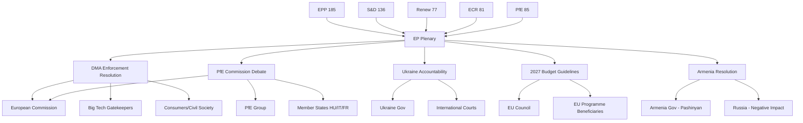

<!-- SPDX-FileCopyrightText: 2026 Hack23 AB -->
<!-- SPDX-License-Identifier: Apache-2.0 -->

# Stakeholder Map — EU Parliament Breaking News: 7 May 2026

**Framework:** Actor Influence–Interest Matrix + Perspective Synthesis  
**Subject:** DMA Enforcement, PfE Commission Legitimacy Challenge, Ukraine Accountability, Budget 2027, Armenia  
**Date:** 2026-05-07  
**Confidence:** 🟡 Medium

---

## Stakeholder Grid

```mermaid
quadrantChart
    title Stakeholder Influence-Interest Matrix
    x-axis Low Interest --> High Interest
    y-axis Low Influence --> High Influence
    quadrant-1 Keep Satisfied
    quadrant-2 Manage Closely
    quadrant-3 Monitor
    quadrant-4 Keep Informed
    European Commission: [0.85, 0.90]
    EPP Group: [0.88, 0.85]
    PfE Group: [0.80, 0.60]
    Big Tech Gatekeepers: [0.90, 0.70]
    S&D Group: [0.70, 0.72]
    Renew Europe: [0.72, 0.65]
    ECR Group: [0.75, 0.58]
    Ukraine Government: [0.85, 0.35]
    Armenia Government: [0.60, 0.30]
    Greens/EFA: [0.65, 0.50]
    EU Member States (Council): [0.80, 0.88]
    Civil Society (DMA): [0.70, 0.25]
    GUE/NGL: [0.55, 0.42]
    ESN Group: [0.60, 0.35]
```

---

## Tier-1 Stakeholders (High Influence, High Interest)

### 1. European Commission
**Role:** Primary target of both the DMA enforcement resolution and the PfE legitimacy challenge  
**Interest level:** 🔴 CRITICAL — Two resolutions in the same week challenge its enforcement record and its institutional neutrality

**Perspective on DMA Enforcement:**  
The Commission is in an uncomfortable position. DG Competition has been building enforcement cases against designated gatekeepers since mid-2024, but formal non-compliance proceedings take 12–18 months to complete under DMA procedural timelines. The EP resolution (TA-10-2026-0160) accuses the Commission of insufficient urgency — a charge that resonates with tech NGOs and smaller digital businesses that believe gatekeepers are exploiting procedural delays. The Commission will likely respond through a DG COMP communication or Commissioner testimony at IMCO committee rather than accelerating pending proceedings on purely political grounds; doing the latter would expose it to industry legal challenge.

**Perspective on PfE "Interference" Claims:**  
The Commission's democratic process engagement — funding civil society, supporting electoral integrity through programmes like Citizens, Equality, Rights and Values (CERV), and applying rule-of-law conditionality — is legally mandated. The PfE framing as "interference" inverts this mandate. The Commission will likely rely on legal advice rebuttal rather than political counter-attack, avoiding escalation ahead of the autumn legislative agenda.

**Preferred outcome:** EU institutions maintain that DMA enforcement proceeds on its own legal timeline; PfE claims dismissed as legally unfounded; budget negotiations completed without Parliament blocking key Commission priorities.

**Leverage:** Article 17 TEU executive powers; monopoly on legislative initiative; control over DMA enforcement sequencing; can time enforcement actions to manage political optics.

**Threat vector:** If Commission delays DMA action through June, EP may use scrutiny hearings (IMCO committee) to publicly embarrass DG COMP leadership; PfE narrative could gain traction in EU Council if sympathetic Council presidencies (Polish, Danish) are succeeded by more right-aligned ones.

---

### 2. EPP Group (185 seats — dominant bloc)
**Role:** Driving majority on DMA enforcement, Ukraine accountability; internally divided on PfE approach  
**Interest level:** 🔴 HIGH — EPP must hold the centre-right while managing pressures from both left and right

**Perspective:**  
The EPP championed the DMA's passage in 2022 and sees enforcement as central to its digital market credibility. However, EPP is not monolithic on digital regulation: German Christian Democrats favour strong enforcement against US tech companies but are wary of over-regulation harming European digital players. The EPP leadership is managing the PfE challenge carefully — not endorsing the "Commission interference" framing (which would breach the EPP's pro-institutional stance) but also not openly condemning PfE's use of parliamentary procedure.

On Ukraine: EPP is unambiguously pro-accountability and pro-support; the resolution reflects EPP's founding foreign policy consensus.  
On budget: EPP 2027 guidelines position reflects preference for defence and competitiveness over Green Deal continuation.

**Preferred outcome:** DMA enforcement proceeds on Commission timeline (not accelerated by parliamentary pressure); PfE controversy dissipates before June plenary; Ukraine accountability framework advances; 2027 budget increases defence and competitiveness funding.

**Key MEPs:** Manfred Weber (EPP Group Chair), Roberta Metsola (EP President — chairs sessions, does not vote on resolutions), IMCO committee EPP rapporteurs.

---

### 3. EU Council (Member States)
**Role:** Co-legislator and budget authority; critical for all five story threads  
**Interest level:** 🔴 HIGH — Council determines DMA enforcement priority; controls budget negotiation; shapes Ukraine/Armenia policy

**Perspective:**  
Member states are divided across all story areas. On DMA: Larger digital economies (France, Germany) broadly favour enforcement against US tech; smaller states worry about competitiveness overhang. On PfE/Commission legitimacy: Hungary, Italy, and increasingly Slovakia are sympathetic to PfE's narrative; Germany, France, and the Benelux are firmly anti-interference claims. On Ukraine: Near-consensus for accountability mechanisms, with Hungary as the sole outlier. On budget: Council typically proposes below Parliament's guidelines; 2027 budget conciliation will be tense.

---

### 4. Big Tech Gatekeepers (Alphabet, Apple, Amazon, Meta, Microsoft, ByteDance)
**Role:** Direct targets of DMA enforcement  
**Interest level:** 🔴 CRITICAL — EP resolution signals sustained enforcement pressure

**Perspective:**  
Gatekeepers are engaged in intensive lobbying of DG COMP and member state capitals to delay or narrow enforcement proceedings. The EP resolution creates an additional political pressure point that can be cited in public statements by technology critics and by Commission officials when explaining enforcement priorities to their hierarchy. Gatekeepers prefer enforcement via formal proceedings (which offer due process protections and can drag on 3+ years) over political accelerated scrutiny. Apple's iOS interoperability obligations and Meta's data interoperability under the DMA are the two most politically visible pending enforcement targets.

**Expected response:** Intensified lobbying; public commitment statements on DMA compliance "progress"; technical delay tactics in Commission investigations; potential strategic lawsuits challenging DMA provisions at CJEU.

---

## Tier-2 Stakeholders (Moderate Influence)

### 5. PfE Group (85 seats — 11.82% of Parliament)
**Role:** Initiator of the Commission legitimacy challenge; driving institutional confrontation narrative  
**Interest level:** 🔴 HIGH — Rule 169 debate is a signature PfE political initiative

**Perspective:**  
Patriots for Europe, founded in mid-2024 around Viktor Orbán's Fidesz and Marine Le Pen's Rassemblement National, seeks to establish itself as the legitimate voice of anti-institutional Euroscepticism within EP procedures — not outside them. Using Rule 169 (topical debates) rather than motions of censure shows tactical sophistication: a debate generates media coverage and allows MEPs to put claims on the record without risking a failed censure vote that would embarrass the group. PfE's narrative is calibrated for national audiences: "Brussels interferes in your elections" plays well in member states where Commission rule-of-law actions are active (Hungary, Romania) or where EU-level condemnation of domestic policies has occurred (Italy, Slovakia).

**Preferred outcome:** Commission is put on political defensive; PfE seen as defending national sovereignty; narrative carries into domestic election cycles in Germany (2025 aftermath), France (ongoing), and Romania (2025–2026).

**Risk:** PfE overreach — if claims are demonstrably false, it may backfire with centrist EPP/Renew MEPs who face pressure from pro-institutional domestic parties.

---

### 6. S&D Group (136 seats — 18.92%)
**Role:** Key majority partner; strong on Ukraine accountability, critical of DMA enforcement delays, opposes PfE framing  
**Perspective:**  
S&D is the natural ally of Commission DMA enforcement (digital rights align with social democratic platform) and of Ukraine accountability (foreign policy consensus). S&D will resist the PfE narrative aggressively in committee and plenary; its MEPs are likely to request Commission hearings on DMA enforcement. On budget: S&D will fight for social and cohesion fund protection in 2027 budget negotiations.

---

### 7. Renew Europe Group (77 seats — 10.71%)
**Role:** Liberal-centrist bloc; pro-digital rights, pro-Ukraine, pro-Commission independence  
**Perspective:**  
Renew is the EPP's closest coalition partner on digital and foreign policy. Renew MEPs likely co-sponsored the DMA enforcement resolution. On Commission legitimacy: Renew is the fiercest defender of institutional independence against PfE attacks. Internal tension exists between French members (some sympathetic to softer Russia stance) and Nordic/Baltic members (hawkish on Ukraine).

---

### 8. Ukraine Government and Civil Society
**Role:** Primary beneficiary of accountability resolution TA-10-2026-0161  
**Interest level:** HIGH — EP text reinforces international legal track

**Perspective:**  
The Kyiv government welcomes every EP resolution reinforcing the accountability track, as it creates political capital for requests to the ICC, ICJ, and potential Special Tribunal. Ukraine's diplomatic focus in April–May 2026 is on maintaining and deepening EU financial and weapons support as the three-year conflict grinds on. The EP resolution's language on "continued attacks against civilian population" directly supports ongoing ICC investigations and potential reparations frameworks.

---

### 9. Armenia Government (Prime Minister Pashinyan)
**Role:** Beneficiary of democratic resilience resolution TA-10-2026-0162  
**Interest level:** HIGH — EP text provides political cover for continued Western orientation

**Perspective:**  
Armenia signed its EU-Armenia Partnership Agenda in March 2024 and has been distancing itself from Russian military structures (CSTO withdrawal ongoing). The EP resolution sends a signal to Moscow that Brussels maintains interest in Armenian democratic stability. Yerevan will use the resolution in domestic political communications and as leverage in negotiations with Russia over Nagorno-Karabakh aftermath and troop withdrawals.

---

### 10. ECR Group (81 seats — 11.27%)
**Role:** Third-largest group; swing votes on PfE motions and some EPP-backed legislation  
**Perspective:**  
ECR under Giorgia Meloni's Italian and Mateusz Morawiecki's Polish wings is more ambiguous than PfE on Commission interference claims: Italian MEPs have an interest in maintaining Commission engagement (Italy is a net recipient of EU funds and cohesion money); Polish ECR MEPs are pro-Ukraine and anti-Russia, distancing them from PfE's softer Russia-neutrality positions. ECR likely abstained or split on the PfE Rule 169 debate; may support DMA enforcement resolution from a competitive markets perspective.

---

## Stakeholder Network Visualisation



---

*Sources: EP political group composition (EP Open Data Portal, May 2026); adopted texts and debate records; coalition dynamics analysis; political landscape assessment.*

---

## 7 · Tier 3 — Indirect Stakeholders

These actors are affected but not primary decision-makers in the immediate legislative cycle.

| Actor | Category | Connection | Interest |
|-------|----------|-----------|---------|
| EU Civil Society (BEUC, EFF, Access Now) | NGO Coalition | DMA + DSA advocacy | Maximize enforcement, support Ukraine tribunal |
| European SMEs | Business | Budget + DMA | Benefit from DMA level playing field; concerned about MFF cuts |
| Ukrainian Diaspora in EU | Civil society | Ukraine accountability | Strong interest in Special Tribunal outcome |
| Armenian Government | Foreign government | EP Armenia resolution | Validation of EU-integration path |
| US Big Tech Lobby | Industry lobby | DMA enforcement | Minimize enforcement scope and penalties |
| USTR (US Trade Representative) | Foreign government | DMA enforcement | Transatlantic trade instrument concerns |
| Chinese Government | Foreign government | DMA + geopolitics | Observing precedent for tech platform regulation |
| Russian Government | Foreign government | Ukraine accountability | Strong interest in blocking accountability mechanisms |

---

## 8 · Interest Alignment Matrix

```mermaid
quadrantChart
    title Stakeholder Interest Alignment (Support vs Oppose EU Action)
    x-axis Low Support --> High Support
    y-axis Low Influence --> High Influence
    quadrant-1 Key Allies (High Influence + High Support)
    quadrant-2 Manage Carefully (High Influence + Low Support)
    quadrant-3 Monitor (Low Influence + Low Support)
    quadrant-4 Keep Satisfied (Low Influence + High Support)
    EPP: [0.72, 0.85]
    "S&D": [0.88, 0.75]
    PfE: [0.15, 0.55]
    ECR: [0.28, 0.50]
    Renew: [0.80, 0.60]
    Greens: [0.92, 0.40]
    Commission: [0.65, 0.80]
    "US Tech": [0.10, 0.70]
    BEUC: [0.95, 0.25]
    Russia: [0.05, 0.30]
```

---

## 9 · Influence Network Description

### Core Power Cluster (EPP + Commission)
The EPP (185 seats) and Commission form the primary institutional axis. Von der Leyen (Commission President, EPP member) must balance party loyalty with institutional independence. On DMA enforcement, both actors are aligned — the Commission has the legal mandate, the EPP has the political backing.

### Progressive Flank (S&D + Greens + Left)
S&D (136), Greens (53), Left (45) = 234 seats total. They can pass resolutions with EPP support (185+234=419 > 361 majority). They are the primary pressure coalition on Ukraine accountability and climate-budget issues.

### Nationalist Opposition (PfE + ECR + NI + ESN)
PfE (85) + ECR (81) + NI (30) + ESN (27) = 223 seats. Well below 361 majority needed. Cannot block EP resolutions but can delay procedural votes and generate public narrative via media channels.

### External Constraint: US Transatlantic Pressure
The US government views DMA enforcement as discriminatory against US tech firms. EU-US transatlantic relations (including NATO, Ukraine military aid, trade agreements) create leverage the US may use informally. This is documented as a constraint on the Commission (not a seat-count constraint on the EP).

---

## 10 · Reader Briefing

For citizens, the stakeholder map provides context on *who* is driving the EU agenda and *who* is trying to block it.

The EU Parliament's decisions from April 28–30 reflect the preferences of the centrist majority (EPP + S&D + Renew = 398 seats, comfortably above the 361-seat majority). The opposition groups (PfE and ECR) could not block the DMA, Ukraine, or Armenia resolutions.

The key external actors — US government and Russia — have influence outside the formal institutional channels. The US can create pressure on the Commission to slow DMA enforcement. Russia has a strong interest in blocking Ukraine accountability mechanisms. Neither can override EU legislative decisions; both can complicate implementation.

---

*Stakeholder map v2.0 | Run: breaking-run-1778159307*
