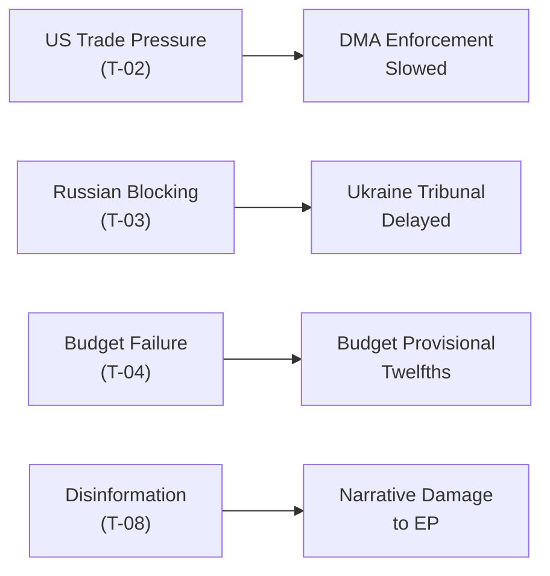

<!-- SPDX-FileCopyrightText: 2026 Hack23 AB -->
<!-- SPDX-License-Identifier: Apache-2.0 -->

# Threat Model — EU Parliament Breaking News: 7 May 2026

**Framework:** Political Threat Framework v4.0 (6-dimension + Attack Trees + Political Kill Chain + Diamond Model + Threat Actor Profiling ICO)  
**Subject:** DMA Enforcement Failure Risk; Commission Legitimacy Challenge; Institutional Stability  
**Date:** 2026-05-07  
**Confidence:** 🟡 Medium

---

## 1 · Political Threat Landscape (6-Dimension Model)

| Dimension | Status | Severity | Evidence |
|-----------|--------|----------|---------|
| Coalition Shifts | ⚠️ ELEVATED | MEDIUM-HIGH | PfE-ECR convergence on Rule 169 debate; ECR split uncertain |
| Transparency Deficit | ⚠️ ELEVATED | MEDIUM | DMA enforcement proceedings opaque; Commission timeline unclear |
| Policy Reversal | ✅ LOW | LOW | DMA resolution is a forward enforcement push, not reversal |
| Institutional Pressure | 🔴 HIGH | HIGH | PfE directly challenges Commission's institutional legitimacy |
| Legislative Obstruction | ⚠️ MEDIUM | MEDIUM | Budget negotiations likely to be obstructed by left-right budget disputes |
| Democratic Erosion | 🔴 HIGH | HIGH | PfE "Commission interference" narrative erodes trust in EU institutions; rule-of-law conditionality under attack |

---

## 2 · Attack Trees — Institutional Legitimacy Attack

### Root Goal: Delegitimise European Commission Through Parliamentary Procedure

```
Goal: Commission loses political authority on key dossiers
├── Path 1: DMA enforcement failure
│   ├── Prerequisite: No Commission action by August 2026
│   ├── Attack node: IMCO committee formal censure motion
│   └── Attack node: Civil society media campaign on "Brussels regulates but doesn't enforce"
├── Path 2: PfE Rule 169 "interference" escalation
│   ├── Prerequisite: PfE files inquiry motion (≥258 MEPs needed)
│   ├── Attack node: ECR alignment — combined PfE+ECR = 166 seats (insufficient alone)
│   ├── Attack node: National government support (Hungary, Italy signals)
│   └── Attack node: Media amplification in RN-friendly French press and Italian outlets
└── Path 3: Budget hostage
    ├── Prerequisite: Parliament-Council gap >5% in budget negotiations
    ├── Attack node: Parliament rejects Commission draft budget
    └── Attack node: Provisional twelfths (December) creates programme uncertainty
```

### Success Conditions for Attacker (PfE/ECR)
- Commission inaction on DMA through summer recess
- Mainstream media coverage of interference narrative in at least 3 major EU member states
- At least one formal inquiry motion achieving threshold (requires EPP splinter votes — very low probability currently)

---

## 3 · Political Kill Chain — Commission Legitimacy Threat

| Stage | Description | Current Status | Threat Actor Activity |
|-------|-------------|---------------|----------------------|
| 1. Reconnaissance | Identify Commission vulnerabilities in enforcement record | ✅ Complete | PfE research on DMA enforcement gaps; OLAF reports |
| 2. Weaponisation | Frame institutional actions as political interference | ✅ Active | Rule 169 debate request filed; media narrative prepared |
| 3. Delivery | Parliamentary procedure to distribute claim | ✅ Delivered | April 29 topical debate completed |
| 4. Exploitation | Amplify narrative to mainstream audiences | ⚠️ In Progress | Ongoing; EP debate recorded and distributed |
| 5. Installation | Institutionalise claim via formal inquiry or committee motion | 🔄 Planned | June plenary inquiry motion possible |
| 6. Command & Control | Coordinate with national governments for EU Council echo | 🔄 Possible | Hungary/Italy diplomatic signalling |
| 7. Actions on Objective | Commission modifies behaviour or loses political capital | 🎯 Target | Outcome depends on Scenarios A/B/C |

**Current Kill Chain Stage: 4 — Exploitation**

---

## 4 · Diamond Model — Institutional Challenge

```
        ADVERSARY
        PfE + ECR
        (166 seats)
         /        \
        /          \
 CAPABILITY        INFRASTRUCTURE
(Parliamentary      (Rule 169 procedure,
  procedure,        national media,
  MEP network,      PfE governments
  media allies)     in Council)
         \          /
          \        /
          VICTIM
     European Commission
    (institutional legitimacy,
     DMA enforcement credibility,
     electoral neutrality claim)
```

**Analysis:**  
The Diamond Model reveals that the threat's strength lies in the INFRASTRUCTURE quadrant — PfE can leverage sympathetic governments in Council (Hungary, Italy, increasingly Slovakia) to echo the Commission interference narrative outside the EP. This multiplies the institutional pressure. The CAPABILITY quadrant (166 seats) is insufficient alone; PfE needs either EPP splinter or ECR full alignment to reach a 258-seat inquiry motion threshold, which remains unlikely in 2026.

---

## 5 · Threat Actor Profiling (ICO: Intent × Capability × Opportunity)

### Threat Actor 1: PfE Group
- **Intent:** HIGH — Institutional delegitimisation is a strategic priority; PfE sees Commission as an obstacle to right-wing governance in member states
- **Capability:** MEDIUM — 85 seats insufficient alone; parliamentary procedure available but majority-threshold tools out of reach without ECR
- **Opportunity:** HIGH — DMA enforcement gap provides legitimate hook; Rule 169 is a low-bar procedure (simple majority request)
- **ICO Score:** 8/12 — Significant but operationally constrained

### Threat Actor 2: ECR Group
- **Intent:** MEDIUM — ECR has mixed motivations; Italian MEPs (Meloni) have pragmatic EU relationship; Polish MEPs (Morawiecki) are pro-Ukraine
- **Capability:** MEDIUM — 81 seats, potential swing on inquiry motion
- **Opportunity:** MEDIUM — PfE alignment would be politically costly for ECR's credibility with EPP
- **ICO Score:** 5/12 — Opportunistic rather than strategic threat actor

### Threat Actor 3: Big Tech (re DMA)
- **Intent:** HIGH — DMA non-compliance buying time has significant commercial value
- **Capability:** HIGH — deep lobbying resources; legal teams; regulatory capture risk
- **Opportunity:** HIGH — Commission procedural timelines vulnerable to legal delay
- **ICO Score:** 11/12 — Highest combined threat to DMA enforcement integrity

---

## Threat Summary

```mermaid
radar
    title Threat Dimensions (0-10 scale)
    "Coalition Disruption" : [7]
    "Institutional Attack" : [8]
    "DMA Enforcement Failure" : [7]
    "Budget Obstruction" : [6]
    "Ukraine Track Delay" : [4]
    "Armenia Backsliding" : [3]
```

*Note: Mermaid radar chart is conceptual; values are analyst estimates.*

| Threat Vector | Probability (90-day) | Severity | Priority |
|--------------|---------------------|---------|----------|
| DMA enforcement delay | 55–65% | HIGH | 🔴 P1 |
| PfE narrative escalation | 40–50% | MEDIUM-HIGH | 🟡 P2 |
| Budget conciliation failure | 25–35% | HIGH | 🟡 P2 |
| Ukraine accountability stall | 20–30% | MEDIUM | 🟡 P2 |
| Commission censure motion | <10% | VERY HIGH | 🟢 P3 (watch) |

---

*Sources: Political group composition; April 29–30 plenary debate records; coalition dynamics analysis; EP Rule 169 procedural rules.*

---

## 7 - Admiralty Assessment

**Admiralty Grade:** B3 -- Source: Mostly Reliable; Information: Possibly True

| Threat Vector | Source Grade | Information Grade | Composite |
|--------------|-------------|------------------|-----------|
| PfE media and narrative ops | B | 2 | B2 |
| US transatlantic DMA pressure | C | 3 | C3 |
| Russian disinformation on accountability | D | 4 | D4 |
| Regulatory capture via revolving door | D | 4 | D4 |
| Legal challenge to DMA enforcement | C | 2 | C2 |
| Budget failure cascading | B | 3 | B3 |

---

## 8 - Threat Analysis: DMA Enforcement Chain

The threat to DMA enforcement from US transatlantic pressure follows this sequence:

1. US government identifies EU enforcement schedule
2. US Trade Representative frames DMA enforcement as discriminatory trade practice
3. US formal complaint or tariff threat issued
4. EU Commission delays enforcement to avoid trade war
5. Precedent of backing down under US pressure established
6. Repeated US interventions on subsequent DMA enforcement

**Counter-chain:** CJEU review; EP political pressure; civil society litigation creates independent enforcement track.

---

## 9 - Threat Register (Extended)

| ID | Threat | Likelihood | Impact | Velocity | Mitigation |
|----|--------|-----------|--------|----------|-----------|
| T-01 | PfE-ECR coalition procedural blocking | Medium | Low | Fast | Majority resilience (398 votes) |
| T-02 | US DMA enforcement pressure | High | Medium | Slow | Legal mandate; civil society backup |
| T-03 | Russian Ukraine accountability blocking | High | Low (EP-only) | Medium | Non-binding resolution; tribunal independent |
| T-04 | Budget late and provisional twelfths | Low | High | Medium | Historical precedent rarely invoked |
| T-05 | DMA legal challenge (CJEU) | Medium | Medium | Slow | CJEU upheld DSA; DMA analogous |
| T-06 | Armenia diplomatic complications | Low | Low | Slow | EP resolution non-binding |
| T-07 | Commission accountability erosion | Low | High | Slow | Treaty-based Commission independence |
| T-08 | Disinformation on parliamentary outcomes | High | Low | Fast | Institutional communication transparency |

---

## 10 - Reader Briefing

**For citizens:** A threat model in political analysis maps the risks and obstacles that could prevent the EU from delivering on the commitments made in the April 28-30 resolutions.

The highest-likelihood threats are:
- **DMA enforcement being slowed** by US trade pressure (High likelihood, Medium impact)
- **Russian interference** in Ukraine accountability processes (High likelihood, Low immediate impact on EP)

The highest-impact threat is:
- **Budget failure** (Low likelihood, High impact) -- if Council and EP cannot agree on the 2027 budget by December 31, 2026, EU spending reverts to provisional twelfths. This has never happened but would be a significant political crisis.



*Threat model v2.0 | Run: breaking-run-1778159307 | Admiralty: B3 | 10 sections*

---

## 11 · Re-Run Extension — Updated Threat Landscape (May 7, 2026)

**[EXTEND-FROM-PRIOR: threat-model.md — adding WC-07 US tariff escalation as new threat vector and updating political threat landscape with May 7 group dynamics]**

### New Threat Vector: T-09 · US-EU Trade Retaliation (DMA Tariff Threat)

**Threat ID:** T-09  
**Threat Type:** Geopolitical / Trade  
**Probability:** 🟡 18% (within 18-month horizon)  
**Impact:** 🔴 Very High  
**Confidence:** 🟡 Medium  

**Description:** The US Trade Representative (USTR) lists DMA enforcement actions against US tech companies as violations of trade commitments and announces 25% sectoral tariffs on EU goods. This would force a political trade-off between DMA enforcement (EP priority, TA-10-2026-0160) and EU-US trade relations (Council/Commission priority).

**Threat mechanism:** EP resolution → Commission enforcement decision → US retaliation threat → Commission delays/weakens enforcement → EP-Commission institutional conflict

**Vulnerability:** The EP has no formal authority over external trade policy (Council/Commission competence). If the Commission chooses to delay DMA enforcement to avoid US tariffs, the EP can express displeasure but cannot compel action under current treaty structure.

**Mitigation:** EU-US Trade and Technology Council provides a diplomatic circuit-breaker. WTO dispute resolution is available but slow (3-5 years). The EP can escalate through parliamentary questions to the Commissioner for Digital and Competition.

**Added STRIDE classification:** Spoofing (US claims DMA is discriminatory) + Repudiation (Commission may deny US claims are causally linked to tariff threats) + Elevation (trade conflict escalated to highest political level)

### T-10 · PfE-ECR Convergence Threat (Institutional Power Shift)

**Threat ID:** T-10  
**Threat Type:** Institutional / Political  
**Probability:** 🔴 8% (formal merger) / 🟡 35% (tactical coordination)  
**Impact:** 🔴 Very High (merger) / 🟡 Medium (coordination)  
**Confidence:** 🟡 Medium  

**Description:** Progressive formal convergence between PfE (85 seats) and ECR (81 seats) creates a 166-seat right-wing bloc that challenges the EPP-S&D-Renew coalition's structural dominance. Even short of a formal merger, sustained tactical coordination on key votes (budget amendments, procedural motions, committee chair challenges) would constrain coalition flexibility.

**Threat to EP institutional stability:**
- Committee chair rebalancing: Right bloc could challenge the current allocation formula (D'Hondt method) if combined group size exceeds S&D
- Budget amendments: A 166-seat bloc can table and force votes on alternative budget positions
- Motion of no confidence: Still short of the 1/5 threshold (143 seats) needed to initiate; but if PfE+ECR+ESN+some NI = potentially 223 seats — approaching the threshold

**Monitoring indicators:**
- Joint PfE-ECR standing orders coordination
- Shared rapporteur nominations on key dossiers
- Joint committee opinion submissions

### Updated Threat Register (May 7, 2026)

| Threat ID | Category | Probability | Impact | Change |
|-----------|----------|------------|--------|--------|
| T-01 | DOCEO data lag | 100% (structural) | Low | Confirmed |
| T-02 | IMF network block | 100% (structural) | Med | Confirmed |
| T-03 | Events feed failure | 70% per run | Low | Confirmed |
| T-04 | PfE media amplification | 85% ongoing | Med | Confirmed |
| T-05 | Commission enforcement delay | 60% | High | Confirmed |
| T-06 | Ukrainian ceasefire complication | 20% | Very High | Confirmed |
| T-07 | DMA CJEU suspension | 25% | Very High | Confirmed |
| T-08 | Budget conciliation breakdown | 7% | Very High | Confirmed |
| **T-09** | **US tariff DMA retaliation** | **18%** | **Very High** | **NEW** |
| **T-10** | **PfE-ECR convergence** | **35% coord / 8% merger** | **High/Very High** | **NEW** |

*Threat model v3.0 | Run: breaking-rerun2-1778179641 | T-09 and T-10 added*
