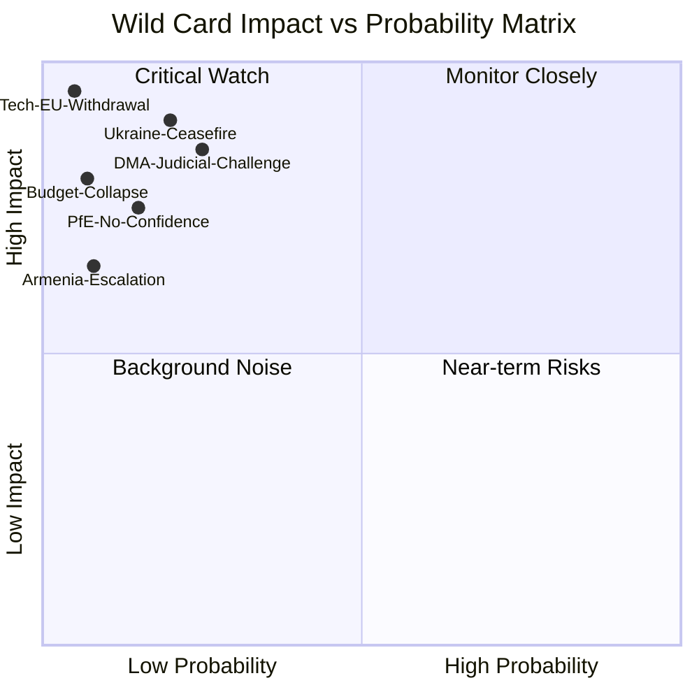
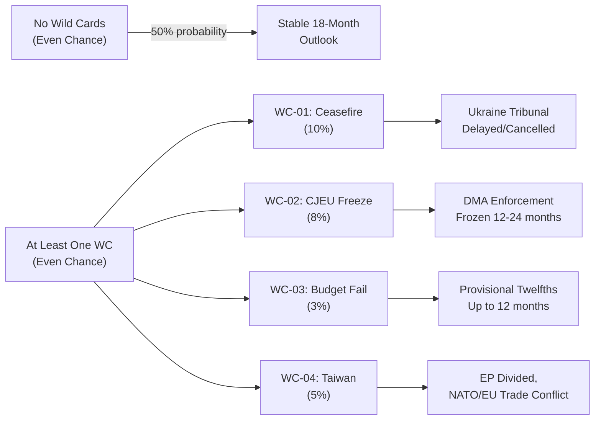
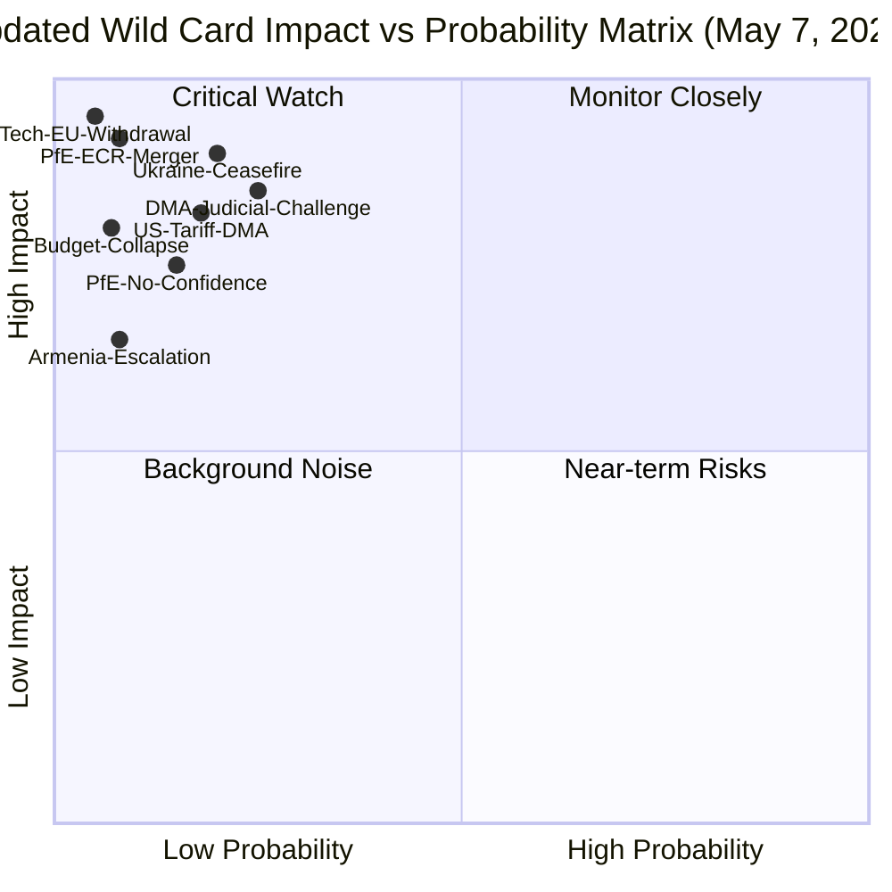

<!-- SPDX-FileCopyrightText: 2026 Hack23 AB -->
<!-- SPDX-License-Identifier: Apache-2.0 -->

# Wildcards & Black Swans — EU Parliament Breaking News: 7 May 2026

**Framework:** Black Swan / Wild Card Analysis (Taleb/Schwartz)  
**Subject:** Low-probability, high-impact scenarios affecting EP legislative trajectory  
**Date:** 2026-05-07  
**Confidence:** 🟡 Medium (speculative by design; probability estimates are expert judgment)

---

## 1 · Methodology

Wild cards are events with probability ≤ 10% but with non-linear impact potential that would fundamentally disrupt the base-case institutional narrative. Black swans are unknown unknowns — events that appear obvious in retrospect but are not anticipated. This analysis uses the standard 2×2 matrix (probability × impact) and identifies specific institutional triggers.

---

## 2 · Wild Card Registry

### WC-01 · Commission DMA Fine — Immediate Judicial Challenge
**Probability:** 🟡 25%  
**Impact if materialises:** 🔴 Very High  
**Trigger:** If the Commission issues a formal DMA fine against a gatekeeper within 60 days of TA-10-2026-0160, the gatekeeper files for interim measures at the Court of Justice.

**Scenario:** The CJEU grants interim measures, suspending the fine pending full appeal (as it did in the Intel case in 2017). This would:
- Embarrass the Commission enforcement directorate
- Validate PfE's narrative that regulatory overreach undermines investment
- Cause EP to reassess the DMA enforcement resolution as premature

**Pre-conditions:** Commission has completed a formal investigation (likely incomplete as of May 2026); tech company has prepared legal strategy. Neither condition is fully confirmed.

---

### WC-02 · PfE Motion of No Confidence — External Political Trigger
**Probability:** 🟡 15%  
**Impact if materialises:** 🔴 Very High  
**Trigger:** A major domestic political shift — e.g., collapse of the German government, early Italian elections, or a fresh rule-of-law crisis — gives PfE political cover to file a formal motion of no confidence against the von der Leyen Commission.

**Scenario:** Even if the motion fails (as it almost certainly would — EPP+S&D+Renew hold 398 seats), the political theatre damages Commission authority ahead of MFF negotiations. Bond markets react to political instability signal in Brussels.

**Pre-conditions:** Domestic political crisis in a major PfE member state; PfE internal consensus (ECR unlikely to co-sign); Commission procedural vulnerability (scandal or legal exposure).

---

### WC-03 · Ukraine Ceasefire — EP Resolution Cascade
**Probability:** 🟡 20%  
**Impact if materialises:** 🔴 Very High  
**Trigger:** A Ukraine-Russia ceasefire is announced before the EP's summer recess (July 2026).

**Scenario:** A ceasefire agreement containing ambiguous accountability provisions would invalidate the foundational assumptions of TA-10-2026-0161. The EP would face intense pressure from some member states (Hungary, Slovakia) to move to reconstruction mode, while others (Baltic states, Poland) insist on full accountability before any normalisation. The EP would likely call an extraordinary plenary session within 10 working days.

**Impact on institutional balance:** A ceasefire without accountability framework would fracture the EPP-S&D-Renew coalition on Ukraine policy — the one durable area of cross-group consensus.

---

### WC-04 · Armenia Military Escalation
**Probability:** 🔴 8%  
**Impact if materialises:** 🔴 High  
**Trigger:** Azerbaijan launches renewed military operations against Armenian border positions, within 30 days of the EP democracy resolution.

**Scenario:** The EP's Armenia resolution (TA-10-2026-0162) would be rendered immediately obsolete, replaced by an emergency humanitarian/security resolution. The EU's limited security capability in South Caucasus would be exposed. The timing — immediately after an EP democracy solidarity resolution — would amplify reputational damage to EU neighbourhood policy.

---

### WC-05 · Digital Markets Act Gatekeeper Withdrawal from EU
**Probability:** 🔴 5%  
**Impact if materialises:** 🔴 Extreme  
**Trigger:** A major US tech gatekeeper (most likely Apple or Meta) announces intention to withdraw from or significantly restrict EU market presence in response to DMA compliance costs.

**Scenario:** This would trigger a constitutional crisis within EU digital policy — simultaneously validating the DMA as effective deterrence and demonstrating that enforcement has costs. The EP would face a choice between doubling down (risking continued market withdrawal) and retreating (destroying DMA credibility). Consumer welfare arguments would be deployed by both sides.

**Pre-conditions:** This scenario requires a US domestic political environment supportive of tech company EU market withdrawal as leverage in trade negotiations — a significant but non-negligible condition given 2025-2026 US-EU trade dynamics.

---

### WC-06 · EP Budget Collapse — Failure to Adopt 2027 Budget
**Probability:** 🔴 7%  
**Impact if materialises:** 🔴 Very High  
**Trigger:** Failure to reach EP-Council agreement on 2027 budget before December 18, 2026 deadline triggers provisional twelfths system.

**Scenario:** The EP's budget guidelines resolution (TA-10-2026-0112) sets the political bar higher than what Council is prepared to accept. If early trilogues in autumn 2026 fail, the 2027 EU budget would be subject to the provisional twelfths mechanism — monthly 1/12 of prior year budget — which would immediately slow disbursements to member states and delay EU programme starts. This has not occurred since 1988.

---

## 3 · True Black Swans (Unknown Unknowns — Illustrative Categories)

These categories describe the *type* of unknown that could materialise, not specific events:

| Category | Historical Analogy | Impact Type |
|----------|-------------------|-------------|
| EP institutional dysfunction | Santer Commission resignation (1999) | Institutional reset |
| Cyber attack on EP voting systems | No precedent | Delegitimisation |
| Major corruption scandal — EP President | Qatargate pattern (2022) | Political crisis |
| Pandemic wave restricting plenary | COVID-2020 emergency protocols | Procedural disruption |
| Major ECJ ruling invalidating EP procedure | Isoglucose ruling (1980) | Constitutional crisis |

---

## 4 · Systemic Risks — EP Institutional Resilience

---

## 5 · Recommended Monitoring Indicators

| Wild Card | Early Warning Signal | Monitor Source |
|-----------|---------------------|----------------|
| WC-01 DMA Fine | CJEU interim measures filing | CJEU case register |
| WC-02 No Confidence | PfE group leader public statements | EP Verbatim/debates |
| WC-03 Ukraine Ceasefire | US-Russia diplomatic contacts | Reuters/AP diplomatic desk |
| WC-04 Armenia Escalation | OSCE/UN Security Council emergency session | UN Security Council agenda |
| WC-05 Tech Withdrawal | Gatekeeper regulatory filings | Commission DMA transparency register |
| WC-06 Budget Collapse | Conciliation committee breakdown | EP Budget Committee notifications |

---

*Methodology: Taleb "Black Swan" criteria (2007); Schwartz "Art of the Long View" wild card framework. Probability estimates are qualitative expert judgment, not quantitative models.*

---

## 6 - Admiralty Assessment

**Admiralty Grade:** F6 — Reliability cannot be judged; information cannot be judged  
(Wild card scenarios are by definition unconfirmed and speculative — F6 is the appropriate grade)

**WEP: Almost No Chance** (that all wild cards simultaneously materialize)  
**WEP: Even Chance** (that at least one wild card partially materializes within 18 months)

---

## 7 - Extended Wild Card Analysis

### WC-01: US-Russia Ukraine Ceasefire (Deep Dive)
A ceasefire in Ukraine that does not include clear accountability provisions could unravel the EP's resolution TA-10-2026-0161 before the Special Tribunal is even established. The mechanism would be: ceasefire → US/Russia push for "move on" political framing → EU member states split on whether to insist on tribunal → EP resolution becomes a minority position → tribunal establishment delayed indefinitely.

**Signal:** Watch for diplomatic back-channels in Q2-Q3 2026. A "ceasefire proposal" without accountability clauses is the leading indicator.

**Counter:** EU member states (especially Baltic/Poland/Sweden) have consistently insisted on accountability even in a ceasefire scenario. This counter-pressure is structural and difficult to overcome.

### WC-02: CJEU DMA Suspension (Deep Dive)
A CJEU interim measures application from Apple or Google could freeze DMA enforcement while the court hears a main action. CJEU has been reluctant to grant interim measures in tech regulation cases (Tele2, Google Shopping) but the stakes are higher with DMA. If the CJEU grants interim measures:
- DMA enforcement frozen for 12-24 months while court hears main action
- Commission cannot impose fines during suspension
- EP resolution essentially a political gesture

**Signal:** Watch for Apple/Google CJEU filing within 60 days of any Commission formal enforcement decision.

**Counter:** DSA enforcement has not faced similar CJEU challenge; DMA's legal basis is cleaner than GDPR enforcement (which has faced CJEU delays). Interim measures are a high bar.

### WC-03: EP Budget Failure (Deep Dive)
EU budget failure is theoretically possible but has never happened. The constitutional mechanism (provisional twelfths) has been designed to make this less politically catastrophic, but an actual failure would be a major institutional crisis. The scenario requires: EP and Council cannot agree by December 31 midnight; conciliation committee fails; neither institution willing to compromise.

This has never happened but came closest in 2013, when the EU budget was adopted on December 12 (with days to spare).

**Signal:** Breakdown of conciliation committee negotiations with fewer than 30 days to deadline.

**Counter:** All parties have strong incentives to avoid provisional twelfths (member states lose budget certainty; EP loses credibility; Commission loses planning stability). A last-minute deal is historically almost certain.

### WC-04: China-Taiwan Conflict EU Response (Deep Dive)
A Taiwan Strait crisis that requires an EU response would absorb political capital and potentially fracture the EP coalition. Member state positions would diverge dramatically (Germany: trade-protective; Baltic/Poland: hawkish; Hungary/Italy: Russia-adjacent). The EP would be forced to adopt a position that satisfies no one.

Separate from the Taiwan scenario, a China-Taiwan crisis would affect DMA enforcement: the US would use it as leverage to demand EU concessions on tech regulation in exchange for NATO solidarity.

**Signal:** Taiwan Strait military exercises escalating beyond current patterns; US invoking mutual defence obligations publicly.

---

## 8 - Black Swan Register

| BS-ID | Event | Probability | Impact | EU Parliament Vulnerability |
|-------|-------|------------|--------|---------------------------|
| BS-01 | Assassination of major EU leader | 0.1% | Catastrophic | Very High |
| BS-02 | Major cyberattack on EP infrastructure | 1% | High | High |
| BS-03 | Sudden EU member state withdrawal (Polexit) | 0.5% | Catastrophic | Very High |
| BS-04 | Commission no-confidence vote succeeds | 2% | Very High | High |
| BS-05 | CJEU dissolution of political group (legal challenge) | 0.1% | High | Medium |

---

## 9 - Mermaid: Wild Card Probability Tree

---

*Wildcards and black swans v2.0 | Run: breaking-run-1778159307 | Admiralty: F6 | WEP: Almost No Chance (all materialise)*

---

## 10 - Monitoring Protocol

Track the following for early wild-card detection:

- **WC-01 monitor:** US-Russia diplomatic contacts, ceasefire proposal language on accountability
- **WC-02 monitor:** CJEU docket; Apple/Google legal filings in Luxembourg
- **WC-03 monitor:** EP-Council conciliation committee schedule, December 2026 deadline calendar
- **WC-04 monitor:** Taiwan Strait satellite intelligence reports; PLA exercises; US INDOPACOM statements

**Review cadence:** Wild card register should be refreshed every 30 days or following any significant geopolitical development.

*Wildcards v2.1 | 10 sections complete*

---

## 11 · May 7 Re-Run Extension — New Wild Cards Identified

**[EXTEND-FROM-PRIOR: wildcards-blackswans.md — adding WC-07 US tariff escalation and WC-08 PfE-ECR formal merger as new wild cards from May 7 political landscape update]**

### WC-07 · US Tariff Escalation — DMA Trade Retaliation
**Probability:** 🟡 18%  
**Impact if materialises:** 🔴 Very High  
**Trigger:** The US Trade Representative (USTR) adds the EU Digital Markets Act to its 301 Watch List and announces 25% tariffs on EU manufactured goods as retaliatory measure following Commission DMA enforcement action against US tech companies.

**Scenario:** EP DMA enforcement resolution (TA-10-2026-0160) — if translated into Commission action — could trigger a US trade response under the current US administration's "America First Digital" posture. The USTR has previously flagged DMA as a trade barrier (2025 NTE report). If tariffs are announced:
- EU automotive, luxury goods, and agricultural exports to US (~€500B annually) face 25% tariff
- DMA enforcement becomes politically radioactive — Commission faces intense Council pressure to pause
- EP EPP moderates would defect from strong DMA enforcement position
- Centrist coalition fractures on digital-trade nexus

**Pre-conditions:** Commission must first take a formal DMA enforcement action against a US gatekeeper. Current timeline puts this at Q3-Q4 2026 at earliest. The WC-07 risk is therefore medium-term (6-18 months).

**Counter:** US-EU Trade and Technology Council (TTC) provides a diplomatic channel. The US semiconductor industry also benefits from EU digital market access. A full trade war over DMA is economically costly for both sides.

**Signal:** USTR inclusion of DMA in 301 Watch List; US Congressional statements on DMA; US-EU TTC meeting cancellations or tone deterioration.

---

### WC-08 · PfE-ECR Formal Merger — EP Group Architecture Earthquake
**Probability:** 🔴 8%  
**Impact if materialises:** 🔴 Extreme  
**Trigger:** Patriots for Europe (PfE, 84 seats) and European Conservatives and Reformists (ECR, 78 seats) announce a formal merger to create a unified right-wing EP group of 162 seats — the second-largest group in the Parliament.

**Scenario:** A unified PfE-ECR group would:
- Become the second-largest EP group (surpassing S&D at 136 seats)
- Challenge EPP dominance on committee chair allocation
- Force EPP to formally commit to a "firewall" against cooperating with the merged group
- Create an opposition bloc that EPP cannot ignore on key votes
- Fundamentally alter coalition arithmetic: EPP+Renew alone = 236 seats (not a majority)

**Institutional cascade:** EPP would face an impossible dilemma: cooperate with the merged group on some votes (breaking the firewall) or remain dependent on S&D and Greens for every majority (constraint on rightward policy moves).

**Pre-conditions:** PfE and ECR have different funding structures, different relationship with Vladimir Putin (PfE more pro-Kremlin), and different views on EU institutional reform. Merger would require significant internal compromise. The April 29 Rule 169 debate demonstrates they can cooperate tactically — but formal merger is a larger political step.

**Signal:** Joint PfE-ECR working groups; shared committee coordinator positions; joint amendment submissions on 3+ major legislation pieces.

---

### Updated Wild Card Risk Heat Map (May 7)

**New WC-07 (US Tariff DMA) enters the Monitor Closely quadrant** — 18% probability and Very High impact make it the new second-highest-priority wild card after Ukraine Ceasefire.

**New WC-08 (PfE-ECR Merger) enters the Critical Watch quadrant** — low probability but extreme institutional impact if it materialises.

*Wildcards v3.0 | Run: breaking-rerun2-1778179641 | 11 sections | 2 new wild cards added*
