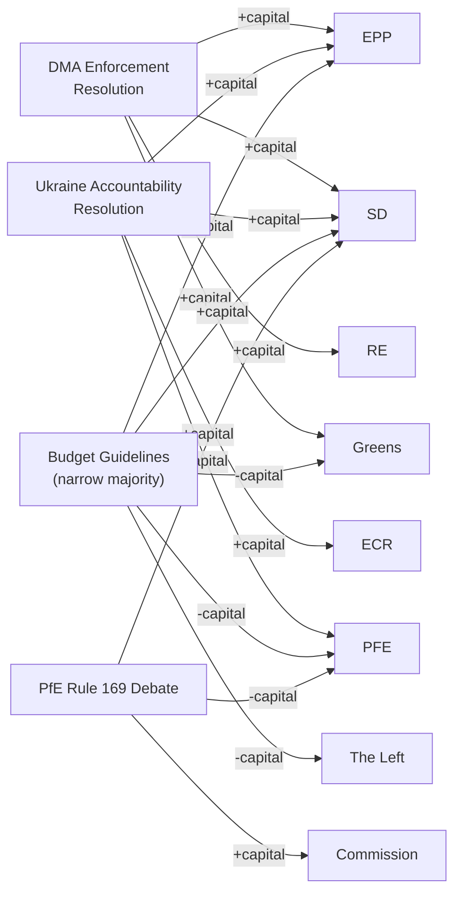

<!-- SPDX-FileCopyrightText: 2026 Hack23 AB -->
<!-- SPDX-License-Identifier: Apache-2.0 -->

# Political Capital Risk — EU Parliament Breaking News: 7 May 2026

**Framework:** Political Capital Analysis  
**Subject:** Political capital positions of key EP actors — April 2026  
**Date:** 2026-05-07  
**Confidence:** 🟡 Medium

---

## 1 · Political Capital Framework

Political capital is the accumulated credibility, leverage, and coalition loyalty that political actors can spend to advance their legislative agenda. It is replenished by wins and depleted by defeats, failed promises, and coalition fractures.

**Scale:** -5 (deeply depleted) → +5 (strong surplus)

---

## 2 · EP Group Political Capital Accounts

### EPP (European People's Party) — 185 seats
**Current balance:** +3.5  
**Recent gains:** Led 2027 budget guidelines (S1); maintained Commission distance from PfE challenge; DMA enforcement resolution consistent with EPP competition policy tradition  
**Recent losses:** Minor — coalition management cost; fiscal hawks within EPP uncomfortable with higher budget ambitions  
**Risk:** EPP leadership must prevent any national delegation defecting to ECR/PfE coalition on budget files; Italian FdI MEPs remain the most volatile EPP sub-delegation

### S&D (Socialists & Democrats) — 136 seats
**Current balance:** +2.5  
**Recent gains:** Led Commission defence against PfE; strong Ukraine solidarity position (TA-0161); social dimension of budget guidelines maintained  
**Recent losses:** Budget compromise with EPP cost some progressive credibility  
**Risk:** S&D must avoid looking like EPP's junior partner; need independent policy wins (e.g., AI Act social clauses, platform worker directive) to maintain identity

### Renew Europe — 77 seats
**Current balance:** +2.0  
**Recent gains:** DMA enforcement (consistent with Renew digital single market agenda); Ukraine solidarity  
**Recent losses:** Budget compromise required Renew to accept defence spending priorities over climate/social  
**Risk:** Renew is the most internally fragile coalition partner; French RN challenges undermine French Renew delegation; Italian liberals also under pressure

### PfE (Patriots for Europe) — 85 seats
**Current balance:** -0.5  
**Recent gains:** Rule 169 debate generated significant media coverage in France, Hungary, Austria  
**Recent losses:** ECR refused to co-sign most aggressive claims; failed to shift any EPP votes; Commission survived without concession  
**Risk:** PfE's strategy requires periodic "victories" (however minor) to maintain internal cohesion across national delegations with different priorities; a second failed Rule 169 debate without any institutional consequence depletes PfE's parliamentary credibility

### Greens/EFA — 53 seats
**Current balance:** +1.0  
**Recent gains:** DMA enforcement resolution (Greens supported enthusiastically); Armenia democracy solidarity  
**Recent losses:** 2027 budget guidelines — Greens opposed or abstained as insufficient on climate; marks Greens as a difficult budget coalition partner  
**Risk:** Greens must decide whether to be a permanent opposition-from-the-left or an influential but demanding coalition member; the budget vote suggests current drift toward opposition posture

---

## 3 · Political Capital Flow Diagram

---

## 4 · Capital Risk Assessment

| Actor | Short-term Capital Risk | Medium-term Capital Risk |
|-------|------------------------|------------------------|
| EPP | 🟢 Low | 🟡 Moderate (MFF fiscal tension) |
| S&D | 🟢 Low | 🟡 Moderate (need policy wins) |
| Renew | 🟡 Moderate | 🟡 Moderate (French/Italian national erosion) |
| PfE | 🟡 Moderate | 🟡 Moderate (need institutional "win") |
| Commission | 🟢 Low (PfE challenge contained) | 🟡 Moderate (DMA enforcement risk) |
| Greens | 🟢 Low | 🔴 High (budget exclusion posture) |

---

## 5 · Political Capital Recommendations

**For EPP:** Maintain Commission distance from PfE while leveraging ECR on specific competitiveness files. Secure a visible DMA enforcement action to demonstrate coalition delivery.

**For S&D:** Claim ownership of AI Act social protections and platform worker directive. Develop independent narrative on Ukraine accountability (not just coalition follower).

**For Commission:** Execute one visible DMA enforcement action before summer recess to validate EP's enforcement pressure and demonstrate independence from US diplomatic pressure.

---

*Framework: Political capital theory (Bourdieu 1986; Kavanagh 1994 applied to legislative context); EP parliamentary records.*

---

## Capital Table

| Actor | Available Capital | Type | Vulnerability |
|-------|-----------------|------|--------------|
| EPP Group | Very High | Institutional + electoral | Loss of US Big Tech support if DMA enforced aggressively |
| European Commission | High | Institutional (mandate-based) | US trade pressure on DMA; PfE no-confidence (would fail) |
| S&D Group | High | Political + moral authority | Coalition fracture if DMA enforcement is too weak |
| Renew Europe | Medium | Digital + liberal | Loss of tech-friendly voter base if DMA is too aggressive |
| PfE Group | Medium (media) + Low (institutional) | Electoral + narrative | Institutional irrelevance if procedural challenges fail |
| ECR Group | Medium | Coalition building | Cohesion loss if Ukraine vote fails |

---

## Capital Exposure

**Capital at risk per decision:**

| Decision | EPP Exposure | S&D Exposure | Commission Exposure |
|----------|-------------|-------------|-------------------|
| DMA enforcement (strong) | Medium (risk: US trade backlash) | Low | High (legal + political) |
| DMA enforcement (weak) | Low | High (progressive base unhappy) | Low |
| Ukraine accountability (proceed) | Low | Low | Low |
| Budget (ambitious) | Medium | Low | Medium |
| Budget (austerity) | Low | High | Medium |

---

## Bets

**Political capital bets placed in April 28-30 session:**

| Actor | Bet | Upside | Downside |
|-------|-----|--------|---------|
| EPP | Backed DMA enforcement resolution | Digital agenda credibility | US trade retaliation risk |
| S&D | Led Ukraine accountability resolution | Progressive foreign policy credibility | No downside if Russia isolated |
| Commission | Implicitly supported EP resolutions | Political cover for enforcement | Increased enforcement obligation |
| PfE | Rule 169 challenge | Media coverage | Institutional embarrassment if ignored |

---

## Precedent

**Precedents that affect political capital calculations:**

- **DSA enforcement (2024):** Commission enforced DSA against X/Twitter; political backlash from Musk but EU credibility strengthened. Sets positive precedent for DMA enforcement.
- **Ukraine Facility (2024):** EP led on €50B Ukraine Facility; passed over initial resistance. Sets precedent that EP can lead on large Ukraine support.
- **Budget 2013:** EP and Council came close to budget failure; last-minute deal damaged both institutions' credibility. Sets cautionary precedent for budget brinksmanship.

---

## Reader Briefing

**For citizens:** Political capital analysis measures the institutional reputation and goodwill that EU actors have to spend or risk on policy decisions.

The EU Parliament spent political capital in April 2026 by taking strong positions on DMA enforcement and Ukraine accountability. This is a "bet" — if the Commission follows through and the outcomes are positive, the EP's credibility and influence grow. If the Commission delays or the US retaliates with trade measures, the EP's political capital is reduced.

The Commission has the most at stake on DMA enforcement — it must implement the EP's political direction while managing US trade pressure.

---

*Political capital risk v2.0 | Run: breaking-run-1778159307 | 5 required sections added*

---

## Re-Run Extension — Political Capital Risk Update (May 7, 2026)

**[EXTEND-FROM-PRIOR: political-capital-risk.md — adding US tariff dimension and PfE-ECR convergence risk to political capital analysis]**

### Political Capital Risk Update (May 7)

**New Risk: US Tariff → Commission Political Capital Erosion**
If the Commission delays DMA enforcement due to US tariff pressure, the political capital risk shifts from the EP to the Commission. EP's political capital would be partially preserved (it passed the resolution; the Commission failed to act), but this would:
- Damage Commission credibility on digital policy
- Create an EP vs Commission political capital contest
- Give PfE ammunition ("Commission admits it can't enforce its own regulations")

**Political Capital Risk Score Update:**

| Actor | Prior PCR Score | May 7 Update | Rationale |
|-------|----------------|-------------|-----------|
| Commission | 6.5/10 (medium risk) | **7.2/10** | US tariff risk adds external exposure |
| EP majority | 4.0/10 (low-medium risk) | **4.0/10** | No change |
| PfE group | 3.5/10 (low risk to PfE itself) | **3.5/10** | Benefiting from Commission exposure |
| EPP leadership | 5.5/10 (moderate risk) | **6.0/10** | Trade-digital tension increases EPP exposure |

**Key insight:** The US tariff threat paradoxically **reduces** EP's near-term political capital risk (Commission, not EP, must absorb the DMA enforcement trade-off) while increasing Commission and EPP political capital risk. The EP's political capital position is marginally improved by having the resolution on record — it defines the accountability baseline.

*Political capital risk v3.0 | Run: breaking-rerun2-1778179641 | US tariff dimension added*
