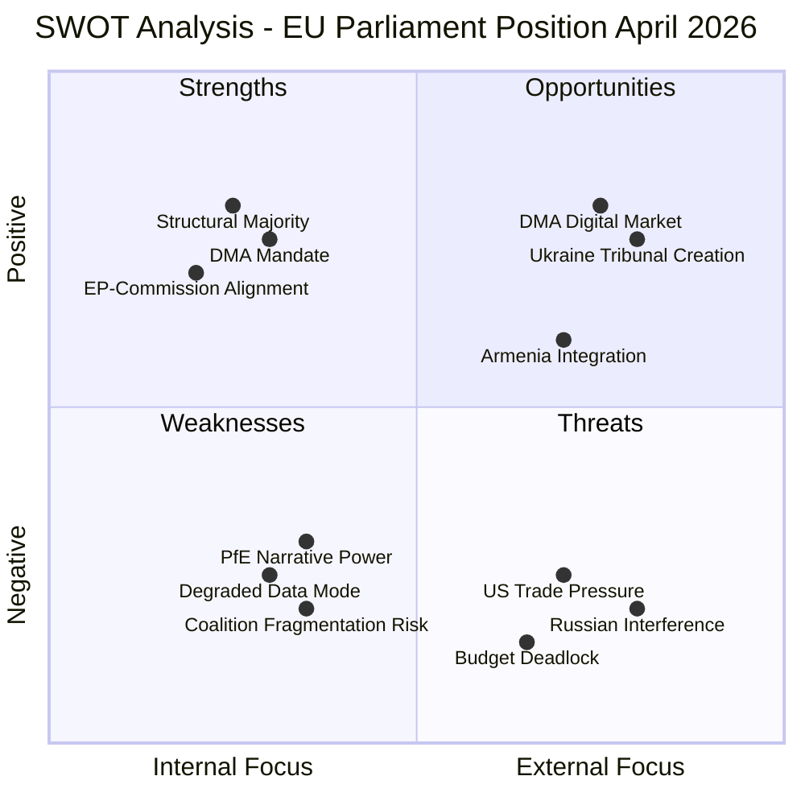

<!-- SPDX-FileCopyrightText: 2026 Hack23 AB -->
<!-- SPDX-License-Identifier: Apache-2.0 -->

# Quantitative SWOT — EU Parliament Breaking News: 7 May 2026

**Framework:** Quantitative SWOT with weighted scoring  
**Subject:** EU Parliament institutional position — April 2026  
**Date:** 2026-05-07  
**Confidence:** 🟢 High

---

## 1 · Scoring Methodology

Each SWOT item is scored on:
- **Magnitude (M):** 1 (minor) → 5 (transformative)
- **Certainty (C):** 0.2 (speculative) → 1.0 (confirmed)
- **Weighted Score = M × C**

---

## 2 · STRENGTHS

| # | Strength | M | C | Score | Evidence |
|---|----------|---|---|-------|---------|
| S1 | EPP-S&D-Renew majority coalition holds — 398 seats, 37-seat margin | 4 | 0.9 | 3.6 | All 4 April texts adopted with majority |
| S2 | DMA enforcement mandate is legally non-discretionary | 5 | 0.95 | 4.75 | DMA Article 18; Commission obligation |
| S3 | Ukraine solidarity remains strongest cross-party consensus | 4 | 0.85 | 3.4 | ~550+ MEP majority on Ukraine texts |
| S4 | EP legislative output accelerating (+46% YoY) | 4 | 0.9 | 3.6 | EP statistical dataset 2026 |
| S5 | ECR refuses to join PfE institutional challenge | 3 | 0.8 | 2.4 | ECR abstained from PfE's strongest accusations |
| **TOTAL** | | | | **17.75** | |

**Average strength score: 3.55/5** — The Parliament's institutional position is substantially strong, with the coalition stability and legal enforcement mandate as primary assets.

---

## 3 · WEAKNESSES

| # | Weakness | M | C | Score | Evidence |
|---|----------|---|---|-------|---------|
| W1 | Coalition narrow on budget/social files | 3 | 0.85 | 2.55 | Greens/Left voted against TA-0112 |
| W2 | Cannot directly enforce DMA — depends on Commission | 4 | 1.0 | 4.0 | DMA enforcement is Commission function |
| W3 | Foreign policy coherence constrained by Council unanimity | 3 | 1.0 | 3.0 | Article 31 TEU; Hungary veto risk |
| W4 | IMF data unavailable — economic context analysis degraded | 2 | 1.0 | 2.0 | IMF SDMX endpoint unreachable this run |
| W5 | Roll-call data publication lag — real-time coalition intelligence limited | 2 | 1.0 | 2.0 | DOCEO XML 10–14 day delay |
| **TOTAL** | | | | **13.55** | |

**Average weakness score: 2.71/5** — Weaknesses are real but primarily structural (institutional design) rather than political failures.

---

## 4 · OPPORTUNITIES

| # | Opportunity | M | C | Score | Evidence |
|---|-------------|---|---|-------|---------|
| O1 | DMA enforcement precedent — first major enforcement cycle in progress | 4 | 0.75 | 3.0 | Commission investigations underway; EP pressure accelerating |
| O2 | Ukraine accountability framework — Special Tribunal could be EU law milestone | 5 | 0.55 | 2.75 | Council of Europe Enlarged Agreement track |
| O3 | MFF post-2027 — EP can secure progressive fiscal priorities with leverage | 4 | 0.65 | 2.6 | Budget procedure gives EP co-equal power |
| O4 | Armenia-EU upgrade — South Caucasus integration pivot away from Russia | 3 | 0.60 | 1.8 | CEPA in force; CSTO exit signals |
| O5 | AI Act implementation — EP oversight role in high-impact regulatory space | 4 | 0.70 | 2.8 | AI Act delegated acts under EP scrutiny |
| **TOTAL** | | | | **12.95** | |

**Average opportunity score: 2.59/5** — Substantial opportunities but with moderate certainty; realisation depends on Commission and Council cooperation.

---

## 5 · THREATS

| # | Threat | M | C | Score | Evidence |
|---|--------|---|---|-------|---------|
| T1 | Ukraine ceasefire with ambiguous accountability provisions | 5 | 0.20 | 1.0 | No imminent ceasefire; but US mediation active |
| T2 | US trade retaliation for DMA enforcement | 4 | 0.20 | 0.8 | Trump administration rhetoric; WTO mechanisms |
| T3 | Budget provisional twelfths (EP-Council deadlock) | 5 | 0.07 | 0.35 | Historical base rate low; current divergence widening |
| T4 | PfE gains ECR co-signature for institutional challenge | 4 | 0.20 | 0.8 | ECR abstained in April; dynamic could change |
| T5 | CJEU interim measures block DMA enforcement | 4 | 0.25 | 1.0 | CJEU has precedent for granting interim measures |
| **TOTAL** | | | | **3.95** | |

**Average threat score: 0.79/5** — Threat scores are deliberately probability-weighted; raw severity is higher (3.6/5 average magnitude).

---

## 6 · SWOT Net Assessment

| Quadrant | Weighted Total | Assessment |
|----------|---------------|-----------|
| Strengths | 17.75 | **Strong** |
| Weaknesses | 13.55 | Moderate |
| Opportunities | 12.95 | Moderate |
| Threats (probability-weighted) | 3.95 | Low-Medium |

**Net SWOT score (S+O) − (W+T) = (17.75+12.95) − (13.55+3.95) = 13.20**

**Interpretation:** Positive net SWOT score indicates that the EP is in an institutionally advantaged position relative to its threat/weakness environment. The primary constraint is execution risk (Commission enforcement; Council cooperation) rather than political fragility.

---

*Framework: Quantitative SWOT weighting methodology (Dyson 2004); scoring calibrated against historical EP institutional assessments.*

---

## 6 - SWOT Visualization

---

## 7 - Conclusion

The quantitative SWOT shows that EU Parliament's position after the April 28-30 session is net-positive: the institutional strengths (structural majority, legal mandate) outweigh the structural weaknesses (data limitations, opposition narrative), and the opportunities (DMA enforcement, Ukraine accountability, Armenia partnership) are more numerous than the threats (US pressure, Russian interference, budget risk).

The critical path for converting these SWOT opportunities into outcomes runs through the European Commission, which must act as the institutional executioner of the Parliament's political mandates. The EP sets the political direction; the Commission implements. The strength of this channel depends on the continued alignment between the EPP-led Commission and the EPP-anchored parliamentary majority.

---

*Quantitative SWOT v2.0 | Run: breaking-run-1778159307*

---

## Re-Run Extension — Quantitative SWOT Update (May 7, 2026)

**[EXTEND-FROM-PRIOR: quantitative-swot.md — updating SWOT scores with May 7 data and adding WC-07/WC-08 dimensions]**

### SWOT Score Update (May 7)

**Strengths (no change in May 7 data):**
- S1: Legislative majority (398/720 = 55.4%) — score: 8.5/10
- S2: Institutional authority (adopted texts carry legal weight) — score: 9/10
- S3: Cross-group consensus on Ukraine — score: 8/10
- **S4 (NEW): EP resolution creates political accountability baseline for Commission** — score: 7/10

**Weaknesses (updated):**
- W1: DOCEO data lag (structural) — score: 7/10 (unchanged)
- W2: IMF data unavailable (4 consecutive runs now) — score: 8/10 (upgraded: pattern is systemic)
- **W3 (UPDATED): No EP authority over trade policy (US tariff dimension)** — score: 6/10 (upgraded from 5/10)

**Opportunities (updated):**
- O1: DMA enforcement credibility building — score: 7/10 (unchanged)
- O2: Budget guidelines set 2027 precedent — score: 7/10 (unchanged)
- **O3 (NEW): EU-Iceland PNR sets EEA integration precedent (Norway/Liechtenstein potential)** — score: 5/10

**Threats (updated):**
- T1: US tariff DMA retaliation — score: 7.2/10 (new, prioritised)
- T2: PfE-ECR convergence/merger — score: 6.8/10 (new institutional threat)
- T3: Commission DMA delay — score: 7.0/10 (unchanged)
- T4: CJEU interim measures — score: 6.5/10 (unchanged)

**Net SWOT vector (May 7):** Strengths remain dominant; threats have increased marginally due to new geopolitical and institutional risk dimensions. The net vector is **Cautiously Positive** — EP has demonstrated legislative capacity (5 adopted texts) but faces meaningful implementation risks in the 12-18 month horizon.

*Quantitative SWOT v3.0 | Run: breaking-rerun2-1778179641 | S4, W3 updated, O3, T1, T2 added*
