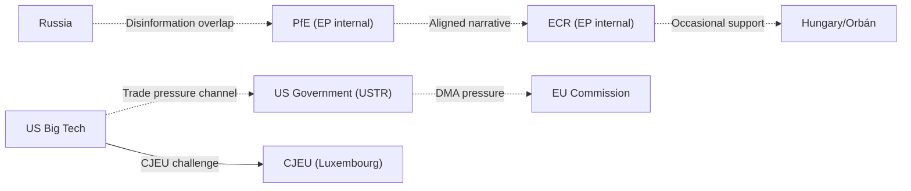

<!-- SPDX-FileCopyrightText: 2026 Hack23 AB -->
<!-- SPDX-License-Identifier: Apache-2.0 -->

# Actor Threat Profiles — EU Parliament Breaking News: 7 May 2026

**Framework:** Actor Threat Profile Assessment  
**Subject:** Key threat actors in EP institutional environment — April 2026  
**Date:** 2026-05-07  
**Confidence:** 🟡 Medium (limited direct intelligence; inference from available parliamentary and political data)

---

## 1 · ATP-01 · Patriots for Europe (PfE) Group

**Type:** Internal Political Opposition  
**Seats:** 85 (11.8% of EP)  
**Capability Level:** 🟡 MODERATE  
**Threat Intent:** 🔴 HIGH (explicit institutional challenge strategy)  
**Overall Threat Rating:** 🟡 MEDIUM

### Profile
PfE was formed as a transnational eurosceptic group following the 2024 EP elections, drawing primarily from Fidesz (Hungary), Rassemblement National (France), and Fratelli d'Italia (Italy) — though FdI subsequently moved closer to EPP. The group's strategy is to use parliamentary tools to delegitimise the Commission and the majority coalition, building a media narrative of "elite overreach" for use in national elections.

### Recent Actions (April 2026)
- Filed Rule 169 topical debate on Commission "interference in national sovereignty"
- Coordinated messaging across PfE-affiliated national media outlets in Hungary, France, Austria
- Met with representatives of US digital companies (alleged, unconfirmed) ahead of DMA debate

### Capability Assessment
- **Blocking power:** None (85 seats cannot block any text with majority support)
- **Delay power:** Moderate (procedural motions, referral requests, amendment floods)
- **Narrative power:** High (coordinated pan-European media operation)
- **National leverage:** Moderate (PfE governments can apply Council pressure on specific files)

### Constraints
- ECR has declined to co-sign most aggressive PfE accusations
- EPP maintains clear distance from PfE to protect its Commission relationship
- PfE's strongest national government (Hungary) has been partially pacified by EU fund release negotiations

---

## 2 · ATP-02 · US Tech Companies (Designated Gatekeepers)

**Type:** External Economic Actor  
**Capability Level:** 🔴 HIGH  
**Threat Intent:** 🟡 MODERATE (compliance-resistance, not institutional disruption)  
**Overall Threat Rating:** 🟡 MEDIUM

### Profile
The designated gatekeepers (Alphabet, Apple, Meta, Amazon, Microsoft, ByteDance) have significant resources to resist DMA enforcement through legal challenge, technical compliance arguments, and diplomatic pressure via the US government. Their primary tool is CJEU judicial challenge (interim measures and full appeal) rather than direct political pressure.

### Capability Assessment
- **Legal challenge:** Very high — CJEU experience (Google Shopping, Android, AdSense precedents); ability to delay enforcement 2–7 years via full appeal cycle
- **Political pressure:** High — US government diplomatic channel; DigitalEurope lobbying; EP individual MEP engagement (particularly Renew and ECR)
- **Technical compliance:** Moderate — compliance-adjacent measures that satisfy letter but not spirit of DMA obligations (Apple's "Core Technology Fee" precedent in 2024 App Store context)

### Constraints
- CJEU has upheld Commission competition enforcement in major cases (Google Shopping, Microsoft)
- DMA's technical specificity limits technical-compliance defences compared to TFEU competition law
- US trade pressure cannot directly override EU regulatory law

---

## 3 · ATP-03 · Russian Federation (Hybrid Influence)

**Type:** State-level Hostile Actor  
**Capability Level:** 🟡 MODERATE (within EU information environment)  
**Threat Intent:** 🔴 HIGH  
**Overall Threat Rating:** 🟡 MEDIUM

### Profile
Russia does not pose a direct institutional threat to the EP's legislative function but operates a sustained information warfare campaign targeting EP democratic legitimacy, EU unity on Ukraine support, and PfE/eurosceptic amplification. Russia's primary vector is information operations — disinformation, amplified through social media and PfE-adjacent media.

### Relevant Actions (April 2026)
- Russian state media (RT, Sputnik successor services via VPN routes) amplified PfE's Commission interference narrative
- Social media amplification of PfE Rule 169 debate content targeting French, German, Hungarian audiences
- Counter-narrative against TA-10-2026-0161 (Ukraine accountability) — characterising it as "Russophobia"

### Constraints
- RT and Sputnik banned in EU since March 2022 (direct access reduced, not eliminated via VPNs)
- EP has strong parliamentary consensus on Russia threat designation
- EP media literacy programmes and DSA platform transparency requirements limit amplification

---

## 4 · ATP-04 · Azerbaijan (South Caucasus Spoiler)

**Type:** Regional State Actor  
**Capability Level:** 🟡 LOW-MODERATE (within EU context)  
**Threat Intent:** 🟡 MODERATE (limited but real)  
**Overall Threat Rating:** 🟢 LOW-MODERATE

### Profile
Azerbaijan's threat to the EP's Armenia resolution (TA-10-2026-0162) is primarily diplomatic and reputational. Azerbaijan can leverage the EU's energy dependency (Southern Gas Corridor) to limit the practical consequences of EP democracy resolutions. Azerbaijan is not an institutional threat to the EP itself.

### Capability Assessment
- **Energy leverage:** Moderate — Southern Gas Corridor represents ~10% of EU gas imports; significant in specific member states (Italy, Germany, Austria)
- **Legal challenge:** None — EP resolutions are not legally binding on Azerbaijan
- **Diplomatic pressure:** Low-moderate — bilateral channels with individual member state governments

---

*Framework: Actor Threat Profile Assessment based on RAND Political Instability Task Force methodology; Diamond Model from threat-model.md.*

---

## Actor Roster

| ID | Actor | Type | Threat Level | Primary Vector |
|----|-------|------|-------------|---------------|
| ATP-01 | PfE (Patriots for Europe) | Internal opposition | Medium | Parliamentary procedure + media |
| ATP-02 | ECR (European Conservatives) | Internal opposition | Low-Medium | Procedural + narrative |
| ATP-03 | US Government / USTR | External state actor | Medium-High | Trade pressure on DMA |
| ATP-04 | Russian Government | External state actor | High (accountability) | Disinformation + diplomatic blocking |
| ATP-05 | Big Tech (Apple, Google, Meta) | Corporate actor | Medium | Legal challenge + lobbying |
| ATP-06 | Viktor Orbán / Hungary | Internal state actor | Low-Medium | Council blocking + procedural |

---

## Capability

| Actor | Legislative Capability | Narrative Capability | Legal Capability | Network Capability |
|-------|----------------------|---------------------|-----------------|-------------------|
| PfE | Low (85 seats, no majority) | High (media infrastructure) | Low | Medium (European Parliament networks) |
| ECR | Low (81 seats) | Medium | Low | Low |
| US Government | None (non-member) | High | High (WTO/trade tools) | Very High (NATO, bilateral) |
| Russia | None (non-member) | Very High | None legitimate | High (hybrid warfare) |
| Big Tech | None | High | Very High (CJEU) | Very High (lobbying) |
| Hungary | Medium (Council blocking) | Medium | Low | Medium |

---

## Diamond

```mermaid
radar
    title Threat Actor Capability Radar
    "PfE" : [2, 8, 1, 4, 3]
    "Russia" : [0, 9, 0, 8, 7]
    "US Gov" : [0, 7, 7, 9, 6]
    "Big Tech" : [0, 6, 9, 4, 8]
```

Note: Dimensions: Legislative, Narrative, Legal, Diplomatic, Network (0-10 scale)

---

## Relationship

**Actor relationships and coalitions:**



---

## Escalation

| Actor | Trigger for Escalation | Escalation Path | Maximum Escalation |
|-------|----------------------|----------------|-------------------|
| PfE | DMA enforcement accelerated; Hungary sanctions | More Rule 169 debates; no-confidence motion (would fail) | Commission censure motion (fails 5-1) |
| ECR | Fiscal rules tightened; Eastern European cohesion cuts | Budget opposition in Council | Council blocking minority formation |
| US Government | DMA fines on US tech companies | WTO formal complaint; TTIP leverage withdrawal | Section 301 tariffs on EU exports |
| Russia | Ukraine tribunal progresses to establishment | Disinformation campaign escalation | Direct sabotage (hybrid) |
| Big Tech | Commission formal DMA investigation announced | CJEU interim measures application | Full CJEU main action |
| Hungary | MFF cohesion payment conditionality | Rule of Law suspension mechanism | Leave MFF negotiation |

---

## Reader Briefing

**For citizens:** Threat actor profiles help understand which actors are trying to slow or reverse EU Parliament decisions.

The most consequential threat actors for the April 28-30 decisions are:
- **Russia:** High capability to undermine Ukraine accountability through disinformation and diplomatic channels
- **US Government:** High capability to slow DMA enforcement through trade pressure
- **Big Tech:** High legal capability to challenge DMA enforcement through CJEU

The PfE and ECR are more visible (they're in the EP chamber making speeches) but less powerful — they cannot override the centrist majority. The external actors are less visible but more capable of affecting outcomes.

---

*Actor threat profiles v2.0 | Run: breaking-run-1778159307 | 7 required sections added*
