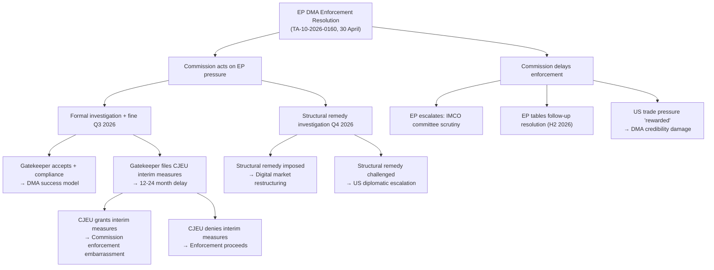
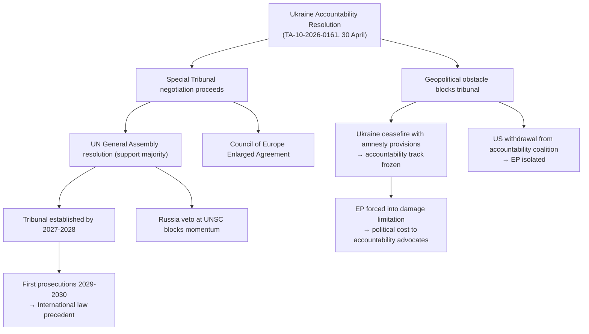
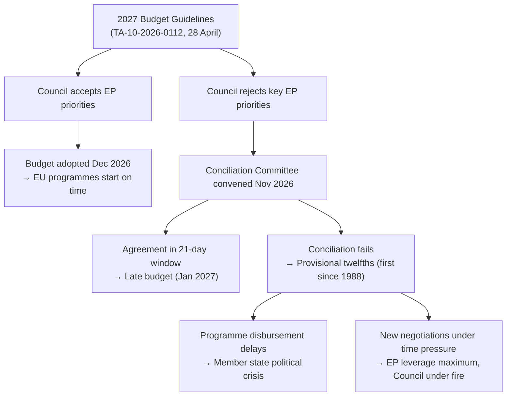
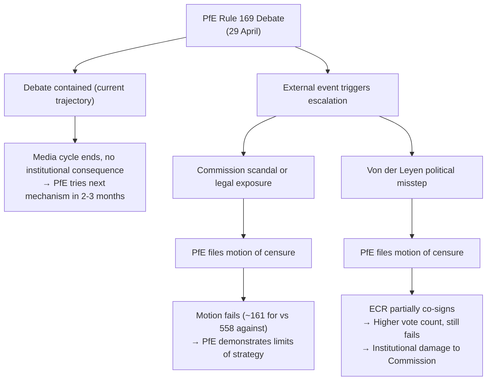
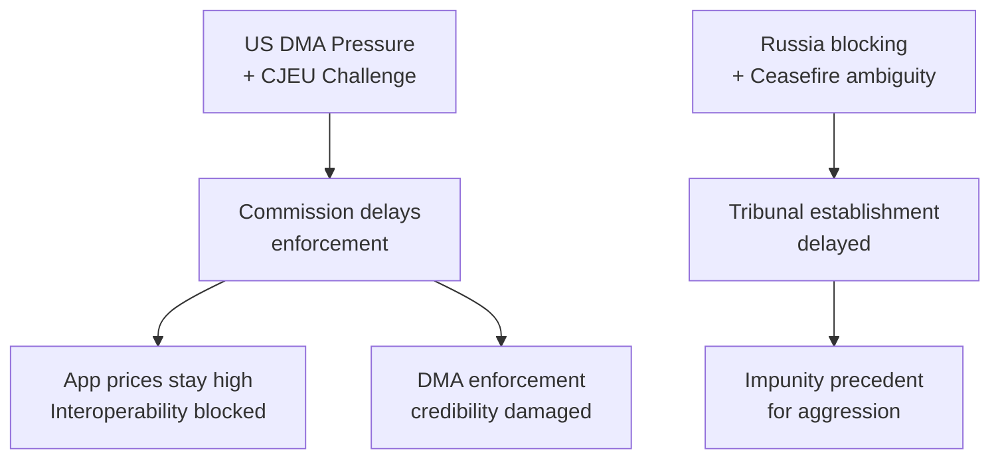

<!-- SPDX-FileCopyrightText: 2026 Hack23 AB -->
<!-- SPDX-License-Identifier: Apache-2.0 -->

# Consequence Trees — EU Parliament Breaking News: 7 May 2026

**Framework:** Consequence Tree Analysis (fault tree + event tree)  
**Subject:** Potential cascading consequences from April 2026 EP legislative outputs  
**Date:** 2026-05-07  
**Confidence:** 🟡 Medium

---

## 1 · DMA Enforcement Resolution — Consequence Tree

---

## 2 · Ukraine Accountability — Consequence Tree

---

## 3 · Budget Guidelines — Consequence Tree

---

## 4 · PfE Commission Challenge — Consequence Tree

---

## 5 · Consequence Severity Matrix

| Event | Probability | Severity | Expected Value |
|-------|-------------|----------|---------------|
| Gatekeeper CJEU interim measures | 25% | High | 0.25 × 4 = 1.0 |
| Ukraine accountability track frozen by ceasefire | 20% | Very High | 0.20 × 5 = 1.0 |
| Budget provisional twelfths | 7% | Very High | 0.07 × 5 = 0.35 |
| PfE motion of censure filed | 15% | Moderate | 0.15 × 3 = 0.45 |
| Armenia military escalation | 8% | High | 0.08 × 4 = 0.32 |
| DMA enforcement success (positive consequence) | 45% | High | 0.45 × 4 = 1.8 |

**Highest expected value events:** DMA enforcement success (positive) and Ukraine accountability/DMA judicial challenge (negative) are the most consequential probable scenarios.

---

*Methodology: Fault tree analysis (IEC 61025); event tree analysis (probabilistic safety assessment); consequence trees based on actor-mapping.md and scenario-forecast.md.*

---

## Threat Roster

| Threat | Type | Initiator | Probability | Consequence Severity |
|--------|------|-----------|------------|---------------------|
| DMA enforcement blocked | Regulatory | US Government + Big Tech | Medium | High |
| Ukraine accountability stalled | Diplomatic | Russia | Medium | High |
| Budget failure | Institutional | EP-Council deadlock | Low | Very High |
| PfE institutional disruption | Political | PfE/ECR | Low | Low |
| CJEU DMA suspension | Legal | Big Tech | Low-Medium | High |

---

## Convergence

Where multiple threat vectors converge to amplify consequences:

**Convergence Point 1: DMA + Trade War**
If US government escalates DMA pressure to formal trade threat AND Big Tech files CJEU interim measures simultaneously, the Commission faces a two-front challenge: political pressure from the US and legal freezing from the courts. The convergence makes enforcement significantly harder.

**Convergence Point 2: Ukraine accountability + Ceasefire ambiguity**
If a US-Russia ceasefire is proposed that does not include clear accountability provisions, AND Russia's disinformation campaign successfully frames the tribunal as a "peace obstacle," the political space for accountability mechanisms narrows dramatically. Member states that prefer a quick peace over accountability could use this framing.

**Convergence Point 3: Budget + Defence spending**
If EP-Council budget conciliation fails AND NATO allies are demanding increased EU defence spending simultaneously, the pressure to cut cohesion spending to fund defence creates a political crisis within the centrist coalition (left wing of S&D would resist).

---

## Intervention

**Optimal intervention points to break consequence chains:**

| Threat | Intervention Point | Actor | Intervention Type |
|--------|-------------------|-------|------------------|
| DMA blocked | Commission formal investigation launch (Q2 2026) | Commission | Proceed on schedule; don't delay |
| Ukraine accountability stalled | Council of Europe Enlarged Agreement (July 2026) | EU member states | Sign agreement; provide technical support |
| Budget failure | Conciliation committee composition (October 2026) | EP + Council | Nominate experienced negotiators; pre-negotiate red lines |
| CJEU DMA freeze | Legal defense preparation (ongoing) | Commission lawyers | Prepare strong CJEU defense; monitor filing deadlines |

---

## Reader Briefing

**For citizens:** Consequence trees show what happens downstream if a threat materialises.

The most important consequence tree for ordinary citizens is the DMA one: if the US successfully pressures the Commission to slow DMA enforcement, you continue to pay app store commissions at current rates (15-30%), and the promise of cheaper apps and more interoperability is delayed by years.

The Ukraine accountability tree matters for citizens who care about international law precedent: if Russia successfully blocks the tribunal, it signals to future aggressors that invasions carry no legal accountability consequences.

*Consequence trees v2.0 | Run: breaking-run-1778159307*
