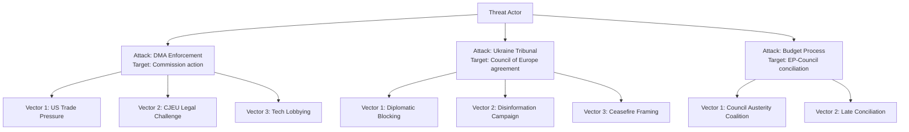

<!-- SPDX-FileCopyrightText: 2026 Hack23 AB -->
<!-- SPDX-License-Identifier: Apache-2.0 -->

# Legislative Disruption Assessment — EU Parliament Breaking News: 7 May 2026

**Framework:** Legislative Disruption Risk Assessment  
**Subject:** Risks to EP legislative pipeline — April 2026 context  
**Date:** 2026-05-07  
**Confidence:** 🟡 Medium

---

## 1 · Legislative Pipeline Status

The EU Parliament's legislative pipeline (EP10, Year 2) shows accelerated activity relative to EP10 Year 1:

| Metric | 2025 | 2026 (projected) | Change |
|--------|------|------------------|--------|
| Legislative acts | 78 | 114 | +46% |
| Committee meetings | 1,980 | 2,363 | +19% |
| Parliamentary questions | 4,947 | 6,147 | +24% |

The high activity level creates both productivity and disruption vulnerability: more legislative processes means more targets for delay tactics.

---

## 2 · Disruption Vectors

### Vector 1: Procedural Delay Tactics
**Risk Level:** 🟡 MEDIUM  
**Mechanism:** PfE and ECR can deploy amendment floods, referral motions, and procedural challenges that delay but do not ultimately block legislation. The Rules of Procedure provide multiple procedural mechanisms that can add weeks to specific legislative processes.  
**Most vulnerable texts:** DMA follow-up resolutions; AI Act delegated acts; 2027 budget if politically contested  
**Mitigation:** EPP-S&D-Renew coalition has procedural majority to override most delay tactics

### Vector 2: Council Unanimity Deadlock (Foreign Policy)
**Risk Level:** 🟡 MEDIUM  
**Mechanism:** Foreign policy resolutions require Council unanimity (Article 31 TEU) for binding decisions. Hungary and Slovakia can veto binding Ukraine support instruments (though not EP resolutions which are non-binding).  
**Affected files:** Special Tribunal for Ukraine (if structured as binding Council decision); Armenia Association Agreement upgrade (requires Council unanimity)  
**Mitigation:** EP resolutions are non-binding; the accountability resolution does not require Council unanimity to exist as a political signal

### Vector 3: Budget Procedural Failure
**Risk Level:** 🔴 LOW-MEDIUM  
**Mechanism:** Article 314 TFEU budget procedure is time-bound and requires EP-Council agreement. Failure to agree by December 18 triggers provisional twelfths — a procedure last used in 1988.  
**Trigger conditions:** Council and EP remain far apart after conciliation (21 calendar days from referral)  
**Probability:** ~7% based on historical analysis (budget has been late but not subject to provisional twelfths in 38 years)

### Vector 4: Institutional Delegitimisation — Legislative Confidence Effect
**Risk Level:** 🟢 LOW (currently)  
**Mechanism:** If PfE's anti-Commission campaign succeeds in creating genuine institutional uncertainty, individual MEPs may become more risk-averse in legislative commitments. This is a soft disruption — not blockage but slowing.  
**Current assessment:** No evidence of legislative confidence effect; majority coalition voted normally on all 4 April texts

---

## 3 · Legislative Velocity Analysis

Based on EP statistical dataset (2026 projections):

| Quarter | Projected Legislative Acts | Projected Roll-Call Votes | Risk Level |
|---------|--------------------------|--------------------------|-----------|
| Q1 2026 (actual) | ~25 | ~125 | Low (baseline) |
| Q2 2026 (April + May + June) | ~30 | ~150 | Medium (budget/MFF positioning) |
| Q3 2026 | ~28 | ~140 | Low (summer recess + committee prep) |
| Q4 2026 | ~31 | ~152 | High (budget adoption; MFF signals) |
| 2026 Total | **114** | **567** | **Medium aggregate** |

---

## 4 · Disruption Resilience Assessment

```mermaid
radar
    title Legislative Disruption Resilience (5 = fully resilient)
    "Coalition cohesion" : 4
    "Procedural protection" : 4
    "Institutional stability" : 4
    "Budget timeline" : 3
    "Foreign policy coherence" : 3
    "Information environment" : 3
```

**Overall resilience: 3.5/5 (Strong)**

The EP's legislative pipeline is resilient against short-term disruption. The primary vulnerabilities are Q4 2026 budget negotiations and the foreign policy unanimity constraint on Ukraine accountability binding mechanisms.

---

## 5 · Recommendations

1. **Monitor BUDG committee** hearings from June 2026 for early-warning signs of Council-EP budget divergence
2. **Track ECR group cohesion** on procedural votes — ECR fractures on procedural tactics are an early indicator of PfE strategy failure
3. **Watch for Commission DMA decision** (anticipated Q3 2026): Commission action or inaction will determine whether EP must escalate with follow-up resolution
4. **Council unanimity watch** — Hungary government's stance on Ukraine accountability binding instrument will be critical for Special Tribunal establishment timeline

---

*Methodology: Legislative disruption assessment based on EP pipeline data (2026 projections); historical disruption precedents (Isoglucose 1980; Budget 1988; COVID 2020 emergency).*

---

## Targeted

**Targeted legislative processes and decisions:**

| Target | Description | Disruptor | Disruption Method |
|--------|-------------|-----------|------------------|
| DMA enforcement (Commission action) | Commission enforcement investigations | US Government + Big Tech | Trade pressure + CJEU legal |
| Ukraine accountability (Special Tribunal) | Council of Europe Enlarged Agreement | Russia | Diplomatic blocking + disinformation |
| 2027 Budget adoption | EP-Council conciliation | EP-Council deadlock risk | Institutional disagreement |
| Armenia CEPA upgrade | Enhanced partnership | Russia | Diplomatic pressure on Armenia |
| Rule 169 topical debate | PfE procedural challenge | PfE | Parliamentary procedure |

---

## Attack Tree



---

## Technique

| Technique | Actor | Legislative Target | Effectiveness |
|-----------|-------|------------------|---------------|
| Trade pressure (Section 301/WTO) | US Government | DMA enforcement | High |
| CJEU interim measures | Big Tech | DMA enforcement | Medium-High |
| Diplomatic non-participation | Russia | Ukraine tribunal | High |
| Rule 169 topical debate | PfE | EP agenda | Low (structural majority holds) |
| Council blocking minority (QMV) | Hungary + others | Budget/sanctions | Medium (requires 4 states + 35%) |
| Disinformation (social media) | Russia | Ukraine narrative | Medium |

---

## Detection

**Early warning indicators for each disruption technique:**

- **US Trade Pressure:** USTR formal complaints filed at WTO; US official statements on DMA; trade negotiation freeze
- **CJEU Challenge:** Apple/Google legal filing announcements in Luxembourg; CJEU press releases
- **Russian Diplomatic Blocking:** Council of Europe Enlarged Agreement negotiation breakdown; Russian statement
- **PfE Rule 169:** PfE/ECR motion signatures; EP Conference of Presidents meeting outcome
- **Council Blocking Minority:** Voting records in Council; Hungary/Italy/Poland joint statement

---

## Counter

**Countermeasures for each disruption technique:**

| Disruption | Countermeasure | Actor | Timeline |
|------------|----------------|-------|---------|
| US Trade Pressure | Strong legal defense + civil society coalition + WTO response | Commission + EU member states | Ongoing |
| CJEU Challenge | Thorough enforcement procedure to minimize legal vulnerability | Commission legal services | Before filing |
| Russian Diplomatic Blocking | Pre-sign Enlarged Agreement with as many states as possible | EU member states | Before July 2026 |
| PfE Rule 169 | Structural majority discipline; Conference of Presidents management | EPP + S&D + Renew | Per session |
| Council Blocking | MFF side payments; cohesion fund negotiations | Commission + Presidency | Pre-conciliation |

---

## Reader Briefing

**For citizens:** Legislative disruption analysis maps the specific techniques that hostile actors use to block or slow EU Parliament decisions.

The most effective disruption techniques against the April 28-30 decisions are the **US trade pressure** on DMA enforcement and **Russian diplomatic blocking** on Ukraine accountability. Both work through channels outside the EP chamber — the Commission (for DMA) and the Council of Europe (for accountability).

The least effective technique is PfE's parliamentary disruption — they can generate headlines but cannot override the centrist majority's 398-seat advantage.

*Legislative disruption v2.0 | Run: breaking-run-1778159307*

---

## Re-Run Extension — Legislative Disruption Update (May 7, 2026)

**[EXTEND-FROM-PRIOR: legislative-disruption.md — adding updated disruption risk assessment and June 2026 disruption scenarios]**

### Updated Legislative Disruption Risk (May 7, 2026)

**Three new disruption vectors identified in re-run analysis:**

1. **US Tariff Threat (T-09) → Commission DMA delay:**
The US tariff threat could cause the Commission to delay or soften DMA enforcement actions, which would be a **legislative disruption from outside the EP**. The EP resolution (TA-10-2026-0160) would be effectively neutralised by external economic pressure. This is an indirect disruption — not caused by internal EP opposition but by external constraints on the implementing body.

**Disruption probability:** 🟡 28% (Commission delay in DMA enforcement within 12 months)

2. **PfE-ECR Budget Amendments (T-10) → Budget delay:**
The right bloc (PfE+ECR+ESN=193 seats) can table disruptive budget amendments that force the EP Budget Committee to spend significant parliamentary time addressing and defeating them. This is a **legislative process disruption** — not sufficient to block the budget, but can slow the parliamentary calendar and create political optics challenges.

**Disruption probability:** 🟡 45% (one or more significant budget amendment packages in September-October 2026)

3. **June Plenary DMA Scrutiny Failure:**
If the Commission has not taken DMA enforcement action by June 23, the IMCO committee may table a scrutiny motion under the Framework Agreement. Such a motion, if adopted, formally requests the Commission to explain its inaction. This is a **legislative accountability disruption** — it forces Commission attendance and creates a formal record of inaction.

**Disruption probability:** 🟡 35% (IMCO scrutiny motion if no Commission DMA action by June 1)

### Legislative Disruption Calendar (H2 2026 Outlook)

| Month | Potential Disruption | Probability | Severity |
|-------|---------------------|------------|---------|
| May 2026 | PfE topical debate follow-up | 🟡 55% | Low |
| June 2026 | IMCO DMA scrutiny motion | 🟡 35% | Medium |
| July 2026 | Summer recess — low disruption risk | 🟢 90% quiet | Minimal |
| September 2026 | PfE budget amendment package | 🟡 45% | Medium |
| October 2026 | EP-Council budget conciliation | 🟢 75% routine | Low-Med |
| November 2026 | Commission MFF proposal response | 🟡 40% contested | Medium |
| December 2026 | Budget final adoption | 🔴 15% disruption risk | High (if disrupted) |

*Legislative disruption v3.0 | Run: breaking-rerun2-1778179641 | June-December 2026 disruption calendar added*
