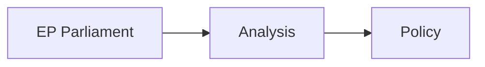

<!-- SPDX-FileCopyrightText: 2026 Hack23 AB -->
<!-- SPDX-License-Identifier: Apache-2.0 -->

# Actor Mapping — EP Motions April 28–30, 2026
**Date:** 2026-05-07 | **Article Type:** motions | **Confidence:** 🟡 Medium

## Methodology

Actors are mapped using a 5-layer model:
1. **EP Internal Actors** — Groups, committees, leadership
2. **EU Institutional Actors** — Commission, Council, EEAS, agencies
3. **Member State Actors** — National governments with specific stake
4. **External State Actors** — Non-EU governments affected
5. **Non-State Actors** — Civil society, industry, international organizations

Each actor is assigned:
- **Role**: Protagonist / Antagonist / Supporter / Affected / Observer
- **Policy domain stake**: Primary policy area(s) of engagement
- **Influence vector**: How they exert influence on EP outcomes

---

## Layer 1: EP Internal Actors

| Actor | Role | Primary Stake | Influence Vector |
|-------|------|---------------|-----------------|
| **EPP Group (188 seats)** | Protagonist (all domains) | Budget, agriculture, digital balance | Floor votes, rapporteurs, committee chairs |
| **S&D Group (136 seats)** | Coalition partner | Social policy, Ukraine accountability | Amendment authorship, progressive-centrist alliance |
| **Renew Europe (77 seats)** | Swing vote | Digital regulation, Ukraine, rule of law | IMCO/LIBE committee expertise, liberal ideology |
| **Greens/EFA (53 seats)** | Antagonist (agriculture) | Climate, digital rights | Minority amendments, media amplification |
| **ECR (78 seats)** | Antagonist (digital, Ukraine) | Sovereignty, agricultural policy | Conservative bloc amplification, amendment flood |
| **PfE (85 seats)** | Disruptor | Anti-institutional narrative, agricultural support | Rule 169 topical debates, procedural motions |
| **The Left/GUE-NGL (46 seats)** | Peripheral coalition | Social rights, anti-Big Tech | Left-progressive amendments |
| **ESN (25 seats)** | Far-right fringe | EU skepticism | Low influence, procedural disruption |
| **EP President (Metsola)** | Procedural authority | All domains | Agenda management, Rule 169 rulings |
| **CONT Committee** | Oversight body | EIB, OLAF oversight | Discharge recommendations |
| **IMCO Committee** | Legislative authority | DMA enforcement | Rapporteur positions, Commission scrutiny |
| **AGRI Committee** | Legislative authority | Livestock, CAP | Agricultural motion drafting |
| **AFET Committee** | Legislative authority | Ukraine tribunal, external affairs | Foreign policy mandate |

---

## Layer 2: EU Institutional Actors

| Actor | Role | Primary Stake | Influence Vector |
|-------|------|---------------|-----------------|
| **European Commission (von der Leyen)** | Recipient of EP mandates | Budget (proposal), DMA enforcement, Farm to Fork | Legislative initiative, enforcement decisions |
| **DG COMP + DG CNECT** | Enforcement body | DMA gatekeeper enforcement | Formal investigation decisions (6-9 months) |
| **DG AGRI** | Policy implementation | CAP, livestock disease fund | Commission proposal for legislation |
| **DG NEAR / EEAS** | External policy | Ukraine tribunal support | Council working group positions |
| **EIB Group** | Oversight subject | Financial activities, climate lending | Annual report compliance, lending decisions |
| **OLAF** | Oversight subject | Fraud investigations | Investigation transparency |
| **EU Council (rotating presidency — Poland)** | Co-legislator | Budget negotiation, CFSP on Ukraine | Unanimous CFSP decisions; majority on budget |
| **European Court of Justice** | Legal arbiter | DMA litigation, CFSP challenges | Judicial review of enforcement decisions |

---

## Layer 3: Member State Actors

| Actor | Role | Primary Stake | Influence Vector |
|-------|------|---------------|-----------------|
| **Germany** | Key coalition builder | Budget, DMA (German auto/tech), Ukraine | Council voting weight (27 votes QMV); finance ministry positions |
| **France** | Agricultural + digital balance | Farm to Fork, digital sovereignty | Council leverage; DMA has Franco-German dynamic |
| **Poland (Council Presidency)** | Agenda manager + Ukraine priority | Ukraine accountability, EU enlargement | Presidency scheduling; pro-Ukraine position |
| **Hungary (Orbán)** | Veto actor | Ukraine (anti-tribunal), rule-of-law conditionality | CFSP unanimity veto; EP-adjacent via Fidesz/PfE |
| **Netherlands** | Ukraine accountability + digital | Tribunal support (ICC/ICJ host state), platform regulation | AFET working group influence; legal expertise |
| **Italy (Meloni)** | ECR anchor | Agricultural, migration, sovereignty | EPP-adjacent positioning; ECR leadership |
| **Baltic states (EST/LAT/LIT)** | Ukraine support bloc | Security, Ukraine, EU unity | Strong public advocacy; NATO coordination |
| **Spain/Portugal** | S&D-aligned | Social policy, agriculture (livestock) | Southern European agricultural interest coalition |

---

## Layer 4: External State Actors

| Actor | Role | Primary Stake | Influence Vector |
|-------|------|---------------|-----------------|
| **Ukraine** | Beneficiary | Special tribunal, sanctions, reconstruction | Zelenskyy political communications; diplomatic pressure on member states |
| **Russia** | Adversarial external | Oppose tribunal, maintain sanctions ambiguity | Indirect (information operations, Hungarian alignment) |
| **United States** | Observer + commercial interest | DMA enforcement (US platforms), Ukraine accountability | USTR trade pressure on DMA; Biden/Trump-era Ukraine alignment shift |
| **Armenia** | Beneficiary | EP advocacy on security situation | Armenian diaspora lobbying; AFET committee engagement |
| **Haiti** | Beneficiary | EP humanitarian resolution | International organizations (UN MINUSTAH successor) as interlocutors |

---

## Layer 5: Non-State Actors

| Actor | Role | Primary Stake | Influence Vector |
|-------|------|---------------|-----------------|
| **Alphabet (Google)** | DMA enforcement target | Compliance, market access | Lobbying (EP transparency register); CJEU litigation |
| **Meta Platforms** | DMA enforcement target | Political advertising, DMA compliance | Lobbying; DSA content moderation conflict |
| **Apple** | DMA enforcement target | App Store, DMA gatekeeper status | CJEU litigation ongoing (App Store interoperability) |
| **Copa-Cogeca** | Agriculture lobby | Livestock CAP support | AGRI committee relationships; MEP constituent pressure |
| **Environmental NGOs (WWF, BirdLife, ClientEarth)** | Climate watchdogs | Farm to Fork, livestock emissions | Legal challenges to CAP decisions; EP Greens partnership |
| **Human Rights Watch / Amnesty International** | Ukraine accountability | Tribunal establishment, evidence preservation | EP delegations; civil society hearings |
| **ICJ / ICC** | Legal framework | Ukraine tribunal jurisdiction | Technical legal authority; precedent-setting |
| **UNHCR / UNDOC** | Haiti issue** | Trafficking, displacement | UN reporting used in EP resolutions |

---

## Power Dynamics Visualization

**Dominant actors by policy domain:**

```
DIGITAL REGULATION (DMA)
  Pro-enforcement:  [Commission DG CNECT] + [EPP] + [S&D] + [Renew] + [Greens] → ~430 votes
  Anti/slow:        [PfE] + [ECR] + [Big Tech lobbying] + [US diplomatic pressure] → ~163 votes
  VERDICT: Pro-enforcement EP majority, but institutional (Commission + CJEU) pace uncertain

AGRICULTURAL POLICY (Livestock)
  Pro-farmer:       [EPP] + [ECR] + [S&D rural wing] + [PfE] + [Copa-Cogeca] → ~450+ votes
  Pro-climate:      [Greens] + [Left] + [S&D urban wing partial] → ~150 votes
  VERDICT: Agricultural coalition commands overwhelming EP majority

UKRAINE ACCOUNTABILITY
  Pro-tribunal:     [EPP] + [S&D] + [Renew] + [Greens] + [Left] → ~490 votes
  Anti/obstruct:    [PfE] + [ECR partial] + [Hungary veto] → ~80-90 EP votes + Council veto
  VERDICT: Strong EP majority for accountability; Council unanimity rule is the blocking point

EU 2027 BUDGET
  Pro-adoption:     [EPP] + [S&D] + [Renew] → ~400 votes (simple majority needed)
  Complicators:     [PfE abstention/rejection] + [Greens demands] → ~140 votes pressure
  VERDICT: Budget coalition stable but narrow on contentious line items
```

---

## Actor Evolution — Changes Since EP10 Baseline (July 2024)

| Actor | Change | Significance |
|-------|--------|--------------|
| PfE (85 seats) | NEW group — formed July 2024 | Reshuffled right-populist bloc; displaced previous group arrangements |
| ECR (78 seats) | Slight growth vs EP9 | Meloni's European posture shapes ECR's "responsible right" positioning |
| EPP (188 seats) | Strengthened vs EP9 | Largest group; controls President, multiple committee chairs |
| S&D (136 seats) | Reduced vs EP9 | Still essential coalition partner; progressive priorities under pressure |
| Greens/EFA (53 seats) | SIGNIFICANT REDUCTION from 72 (EP9) | Reduced leverage; no longer coalition kingmaker in most votes |
| The Left (46 seats) | Stable | Peripheral but vocal |

**Key dynamic:** Greens' decline from 72 to 53 seats between EP9 and EP10 is the structural change driving the agricultural policy reversal trend. The climate coalition has fewer seats, reducing its veto/amendment capability.

---

## Sources

1. EP Political Landscape API (2026-05-07)
2. EP MEP database (current group membership, 2026-05-07)
3. EU Treaty on Functioning (TFEU — voting rules, committee structure)
4. EP transparency register (lobbyist registrations — public)
5. Historical group composition EP9 vs EP10 comparison (public EP data)



