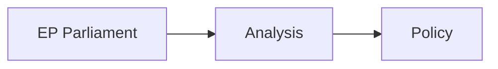

<!-- SPDX-FileCopyrightText: 2026 Hack23 AB -->
<!-- SPDX-License-Identifier: Apache-2.0 -->

# Impact Matrix — EP Motions April 28–30, 2026
**Date:** 2026-05-07 | **Article Type:** motions | **Confidence:** 🟡 Medium

## Methodology

Impact Matrix maps each motion across:
- **Breadth**: How many people/sectors/countries are affected
- **Depth**: How significantly those affected are impacted
- **Duration**: Short-term (< 12 months) / Medium-term (1-3 years) / Long-term (3+ years)
- **Reversibility**: Reversible (R) / Partially Reversible (PR) / Irreversible (IR)
- **Stakeholder Categories**: Citizens / Businesses / Governments / Civil society / International

---

## Matrix Overview

| Motion | Breadth | Depth | Duration | Reversibility |
|--------|---------|-------|----------|---------------|
| TA-0112 (2027 Budget) | Very High (450M citizens) | Medium | Short-Med | R |
| TA-0119 (EIB Report) | High (27 member states) | Low-Med | Medium | R |
| TA-0160 (DMA) | Very High (all digital users) | High | Long-term | PR |
| TA-0157 (Livestock) | High (EU agri sector) | High | Long-term | PR |
| TA-0151 (Haiti) | Medium (Haiti + EU migration) | Medium | Medium | R |
| TA-0161 (Ukraine) | Very High (Europe-wide security) | High | Long-term | PR-IR |

---

## Detailed Impact Matrix

---

### TA-10-2026-0160 — DMA Enforcement Motion

#### Stakeholder Impact Table

| Stakeholder | Impact | Nature | Confidence |
|-------------|--------|--------|------------|
| **EU digital consumers (450M)** | POSITIVE | Access to open platforms, reduced gatekeeper lock-in | 🟡 Medium |
| **EU digital SMEs (millions)** | POSITIVE | Reduced app store monopoly; improved interoperability | 🟡 Medium |
| **Gatekeeper platforms (5-7)** | NEGATIVE | Compliance costs, potential fines, business model disruption | 🔴 High |
| **EU tech startups** | POSITIVE | More level playing field in digital markets | 🟡 Medium |
| **EU regulatory apparatus (DG CNECT/COMP)** | OPERATIONAL | Increased workload; enforcement mandate strengthened | 🟢 Low |
| **US-EU trade relationship** | NEGATIVE (short-term) | US tech lobbying via USTR; trade tension risk | 🟡 Medium |
| **EU member state digital economies** | POSITIVE | Reduced market concentration benefit | 🟡 Medium |

#### Breadth Map

**Geographic scope:** All 27 EU member states + EEA (Norway, Iceland, Liechtenstein as DMA applies via EEA agreement)

**Sector scope:** 
- Technology & digital (primary)
- Retail & e-commerce (secondary)
- Media & publishing (tertiary)
- Financial services (platform payment)

**Population scope:** All EU residents using smartphone, internet services, or digital commerce = approximately 400+ million active users

#### Duration Analysis

| Time Window | Impact | Scenario |
|-------------|--------|----------|
| 0-6 months | LOW | Motion adopted; Commission formulates enforcement plan |
| 6-18 months | MEDIUM | Formal investigations launched; first fine decisions or settlements |
| 18-36 months | HIGH | Market behavior change by gatekeepers; alternative platforms gain market share |
| 36+ months | TRANSFORMATIVE (if litigation resolved favorably) | Structural shift in EU digital market composition |

---

### TA-10-2026-0157 — Livestock Sustainability Motion

#### Stakeholder Impact Table

| Stakeholder | Impact | Nature | Confidence |
|-------------|--------|--------|------------|
| **EU livestock farmers (7M farms)** | POSITIVE (short-term) | Policy protection from environmental regulations | 🔴 High |
| **EU rural communities** | POSITIVE (economic stability) | Agricultural employment protected | 🟡 Medium |
| **EU consumers (food prices)** | NEUTRAL-POSITIVE | Livestock price stability | 🟡 Medium |
| **Climate change (global commons)** | NEGATIVE | EU climate target shortfall risk | 🔴 High |
| **EU Green Deal credibility** | NEGATIVE | Policy reversal signal undermines commitment | 🔴 High |
| **Biodiversity (EU natural systems)** | NEGATIVE | Livestock pressure on land, water, biodiversity maintained | 🟡 Medium |
| **Greens/EFA political agenda** | NEGATIVE | Livestock motion directly opposes Greens' core platform | 🔴 High |
| **Commission DG AGRI** | OPERATIONAL | Implementation mandate shifted toward food security | 🟡 Medium |
| **Copa-Cogeca (lobby)** | POSITIVE | Policy win confirms lobbying effectiveness | 🔴 High |

#### Breadth Map

**Geographic scope:**
- Primary: France, Germany, Netherlands, Poland, Ireland (major livestock producers)
- Secondary: All 27 member states (all have agricultural sectors)
- Tertiary: Global (EU agricultural policy affects global food markets and climate commitments)

**Economic scope:**
- EU livestock sector: approximately €136 billion annual output
- CAP expenditure relevant to livestock: approximately €25-30 billion/year
- Environmental cost (externalities not internalized): estimated €10-15 billion/year in EU livestock methane emissions

#### Duration Analysis

| Time Window | Impact | Scenario |
|-------------|--------|----------|
| 0-12 months | LOW | Signal only; no legislation tabled yet |
| 12-24 months | MEDIUM | Commission CAP mid-term review incorporates political signal |
| 24-36 months | HIGH | Legislative proposals for disease fund; methane regulation timeline shifts |
| 2030+ | HIGH-IRREVERSIBLE | Climate target shortfall if livestock emissions maintain current trajectory |

---

### TA-10-2026-0161 — Ukraine Special Tribunal

#### Stakeholder Impact Table

| Stakeholder | Impact | Nature | Confidence |
|-------------|--------|--------|------------|
| **Ukraine (government + victims)** | POSITIVE | International accountability mechanism support | 🔴 High |
| **Russia (government)** | NEGATIVE | Accountability threat; diplomatic costs | 🔴 High |
| **EU citizens (security)** | POSITIVE (long-term) | Accountability norm reinforcement → future deterrence | 🟡 Medium |
| **International legal system** | POSITIVE | Precedent for aggression prosecution; Rome Statute supplement | 🔴 High |
| **Hungary** | OPERATIONAL | Veto posture reinforced; isolation from EU majority | 🟡 Medium |
| **EU-US relations** | POSITIVE | Shared commitment to international law accountability | 🟡 Medium |
| **EU foreign policy coherence** | MIXED | Strong EP mandate, but Council fracture (Hungary) undermines unity | 🔴 High |
| **Evidence preservation (legal)** | CRITICAL | Any delay → evidentiary harm; motion creates urgency pressure | 🔴 High |

#### Breadth Map

**Geographic scope:**
- Immediate: Ukraine + EU 27 member states
- Extended: All UN member states (precedent for international accountability norms)
- Deterrence: Any state contemplating future aggression

**Population scope:** 
- Direct victims in Ukraine: estimated 10+ million displaced, 100,000+ civilian casualties
- Potential beneficiaries of deterrence norm: global (deterrence is a global public good)

#### Duration Analysis

| Time Window | Impact | Scenario |
|-------------|--------|----------|
| 0-6 months | LOW-MEDIUM | EP signal; Council discussions; Hungary veto expected |
| 6-18 months | MEDIUM | Coalition of willing states path; external legal architecture |
| 18-36 months | HIGH | If tribunal established: first indictments; accountability process begins |
| 36+ months | HIGH (either direction) | Tribunal precedent becomes permanent international law fixture OR evidentiary losses degrade case quality |

---

### TA-10-2026-0112 — 2027 EU Budget Guidelines

#### Breadth Map

All 450+ million EU citizens are affected by EU budget priorities through direct program spending, agricultural support, regional development, research funding, and external action.

| Stakeholder | Impact Level | Primary Mechanism |
|-------------|-------------|-------------------|
| Recipients of EU cohesion funds (100M+) | MEDIUM | Budget allocation priorities |
| Agricultural sector (CAP) | MEDIUM-HIGH | CAP spending levels |
| Research sector (Horizon Europe) | MEDIUM | R&D funding allocation |
| Defence industry (SAFE) | MEDIUM-HIGH | Defence supplementary instrument |
| Ukraine reconstruction funds | MEDIUM | Ukraine Facility continuation |

---

## Cross-Motion Interaction Effects

| Motion A | Motion B | Interaction | Net Effect |
|----------|----------|------------|------------|
| TA-0160 (DMA) | TA-0112 (Budget) | DMA enforcement costs funded from EU budget | POSITIVE: budget guidelines support digital sovereignty |
| TA-0157 (Livestock) | TA-0112 (Budget) | CAP budget continuity supports livestock priorities | REINFORCING: double political signal on agricultural spending |
| TA-0161 (Ukraine) | TA-0112 (Budget) | Ukraine reconstruction in budget guidelines | REINFORCING: accountability + funding are complementary |
| TA-0160 (DMA) | TA-0157 (Livestock) | Different coalitions → different EU regulatory philosophy | TENSION: pro-regulation (DMA) vs. deregulation (Farm to Fork) coalitions |

---

## Aggregate Impact Summary

**Total affected EU citizens (primary impact):** 450+ million (near-universal — every EU citizen is a digital user, food consumer, and EU budget taxpayer)

**Economic value at stake (visible impacts):**
- DMA enforcement: €30-50B market access + potential €80B fines ceiling
- Livestock policy: €136B sector + €25-30B/year CAP
- Ukraine accountability: long-term security and rule-of-law externalities
- EU 2027 Budget: ~€200B annual expenditure

**Highest-priority impact to monitor:**
🔴 **IRREVERSIBILITY RISK**: The livestock motion's climate policy impact is the most significant irreversible consequence of the April 28-30 session — if EU fails to meet 2030 Paris targets, that failure will be partially traceable to a series of EP agricultural motions that constrained Commission action.

---

## Sources

1. EP Adopted Texts Feed 2026 (motions and procedures)
2. EP Speech Records April 28-30, 2026
3. EP Political Landscape API (2026-05-07)
4. EU Commission DG AGRI and DG CNECT public data
5. DMA Regulation (EU) 2022/1925 impact assessments (public)
6. IPCC reports on agriculture and climate (public scientific consensus)
7. UN Ukraine damage assessment reports (public)

