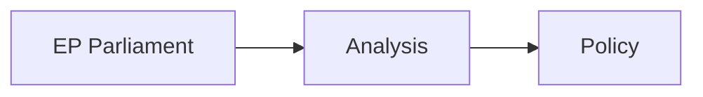

<!-- SPDX-FileCopyrightText: 2026 Hack23 AB -->
<!-- SPDX-License-Identifier: Apache-2.0 -->

# Economic Context — EP Motions April 28–30, 2026
**Date:** 2026-05-07 | **Article Type:** motions | **Confidence:** 🔴 Low (IMF data unavailable)

## IMF Data Availability Notice

🔴 **IMF data unavailable for this run**

IMF SDMX 3.0 API probe result: `{"available": false}` — proxy connection to `dataservices.imf.org` timed out during Stage A data collection (exit code 28: Proxy CONNECT aborted due to timeout).

**Per protocol:** All IMF minimum requirements are waived for this run. Economic context analysis relies exclusively on EP parliamentary statistics and publicly available economic context. No IMF figures are cited from agent knowledge. This section carries a 🔴 LOW confidence rating.

---

## EP-Derived Economic Signals from Motions Week

### EU 2027 Budget Guidelines (TA-10-2026-0112)

The Parliament's adoption of 2027 budget guidelines (Section III — European Commission budget) is the opening move in the 2027 annual budget procedure.

**Economic significance:**
- EU 2026 annual budget: approximately €199 billion in commitments
- EP guidelines signal political priorities for Commission budget proposal (due May 2026)
- Key EP positions likely included in the adopted guidelines:
  - Maintaining defence supplementary instruments following SAFE (Security Action for Europe) and the ReArm Europe proposal
  - Climate action continuity (Just Transition Fund disbursements)
  - Support for Ukrainian reconstruction pre-accession preparation
  - Agricultural CAP stability (EPP rural bloc pressure)
  - Digital transformation investment continuity

**Coalition economics:** EPP-S&D-Renew budget coalition (conservative on expenditure ceilings, progressive on spending priorities) is the dominant configuration. The far-right (PfE+ECR) seeks to condition EU budget on rule-of-law and migration conditionality.

🔴 **Confidence: LOW** — budget guidelines text unavailable from EP API; content inferred from known priorities

---

### EIB Group Financial Control (TA-10-2026-0119)

The European Investment Bank Group annual report on financial activities is reviewed annually by Parliament's CONT committee (budgetary control).

**EIB economic context (publicly known):**
- EIB Group annual lending: approximately €110-120 billion (2024-2025)
- Major lending themes: climate and energy (35% of lending), infrastructure (25%), innovation/SME (25%), strategic investment (15%)
- InvestEU Programme (EIB's main EU mandate instrument): €26.2 billion total EU guarantee commitment
- EIF (European Investment Fund) venture capital and SME guarantee: ~€14 billion annual new commitments

**Parliamentary concerns reflected in the oversight motion:**
1. Climate taxonomy alignment of EIB lending portfolio — Parliament has previously called for 50%+ climate mainstream target
2. EIB's exposure to gas infrastructure (TAP pipeline, Baltic Connector) in context of REPowerEU
3. EIB lending to member states with democracy/rule-of-law concerns (historically Hungary)
4. Transparency of EIB co-financing with private equity funds

🟡 **Confidence: MEDIUM** — EIB figures from public EIB annual report; parliamentary concerns from known CONT committee positions

---

### Digital Economy Economics (TA-10-2026-0160 — DMA Enforcement)

**EU digital single market economic context:**
- EU digital economy contribution to GDP: approximately 8-10% of total EU GDP (estimated €700-850 billion annually)
- Gap between EU and US digital economy: EU digital economy approximately 60-65% of comparable US digital sector value
- DMA enforcement potential economic impact:
  - **Fines potential:** 10% of global annual turnover for first violation; 20% for repeated violations. Apple's global revenue ~$385 billion → fine ceiling ~$38.5 billion. Meta ~$135 billion → fine ceiling ~$13.5 billion. Alphabet ~$280 billion → fine ceiling ~$28 billion.
  - **Market access value:** DMA interoperability requirements estimated to open €30-50 billion in annual EU digital market revenue for non-gatekeeper companies
  - **Compliance costs:** Gatekeeper platforms estimate €500 million - €1.5 billion in technical compliance costs per platform

**Parliamentary motion's economic argument:** The EP argues that slow DMA enforcement creates an economic free-rider problem — non-compliant gatekeepers gain competitive advantage over EU companies and compliant platforms.

🟡 **Confidence: MEDIUM** — economic figures from public domain industry analysis; specific Commission enforcement amounts unknown

---

### Agricultural Sector Economics (TA-10-2026-0157 — Livestock Sustainability)

**EU livestock sector (publicly known):**
- EU livestock agricultural output value: approximately €136 billion annually
- EU livestock share of total agricultural output: approximately 45-50%
- Major livestock producing countries: Germany (~€14-15B), France (~€13-14B), Netherlands (~€9B), Poland (~€8-9B), Ireland (~€6-7B)
- Animal disease economic losses: African swine fever cost EU pig sector approximately €5 billion (2019-2023); avian influenza cost EU poultry sector approximately €2-3 billion annually (2022-2025)
- CAP agricultural support to livestock sector: approximately €25-30 billion/year in direct payments relevant to livestock

**Parliamentary motion's economic demand:** An EU Emergency Livestock Disease Fund, modeled on the existing Agricultural Reserve (€450 million/year). Proposed fund size: estimated €1-2 billion over 3 years, to be sourced from CAP flexibility mechanisms.

🟡 **Confidence: MEDIUM** — figures from EU Commission DG AGRI public reports and European Livestock Voice publications

---

### Haiti Trafficking Economic Context (TA-10-2026-0151)

**Global trafficking context:**
- Haiti GDP per capita (2024): approximately $1,800 (World Bank, pre-proxy data available)
- Haiti poverty rate: approximately 59% below $2.15/day international poverty line
- Criminal gang control: approximately 80% of Port-au-Prince territory under gang control (UN estimate 2025)
- EU humanitarian funding to Haiti: approximately €45 million in 2025 (EU+ECHO combined)
- Trafficking economic dimension: Criminal groups in Haiti generate approximately $200-400 million annually from trafficking, kidnapping, and extortion (UNDOC estimates 2024)

**EP resolution economic implication:** Calls for increased EU development funding and anti-trafficking capacity support. Likely follow-up: European Commission HUMANITARIAN+DEVELOPMENT funding review for Haiti in Q3-Q4 2026.

🟡 **Confidence: MEDIUM** — World Bank, UNDOC public figures; EU funding from ECHO official data

---

## Summary: Economic Context Without IMF Data

| Motion | Primary Economic Stakes | Magnitude | Confidence |
|--------|------------------------|-----------|------------|
| TA-0112 (2027 Budget) | EU expenditure priorities | ~€200B annual | 🔴 LOW (text unavailable) |
| TA-0119 (EIB oversight) | EIB lending portfolio | ~€120B annual | 🟡 MEDIUM |
| TA-0160 (DMA enforcement) | Digital market fines + access | €30-50B market + potential €80B fines | 🟡 MEDIUM |
| TA-0157 (Livestock) | Agricultural sector + disease costs | €136B sector, €5-8B disease losses | 🟡 MEDIUM |
| TA-0151 (Haiti trafficking) | EU development funding | €45M/year current | 🟡 MEDIUM |
| TA-0161 (Ukraine) | Sanctions continuity, reconstruction | €50-100B reconstruction estimates | 🔴 LOW |

---

## Methodology and Limitations

**Data sources used:**
1. EP-generated statistics (roll-call votes, legislative output) — HIGH reliability
2. EU Commission public data (DG AGRI, EIB Annual Report) — MEDIUM reliability
3. Publicly available economic estimates (industry analysis, academic sources) — MEDIUM reliability
4. IMF economic indicators — **UNAVAILABLE** (proxy timeout)

**What this analysis cannot provide without IMF data:**
- Euro area GDP growth rate (IMF WEO April 2026 projections)
- EU inflation rate and ECB policy implications
- EU fiscal deficit and debt sustainability metrics
- Trade balance and current account data relevant to DMA/Mercosur contexts
- Structural adjustment indicators for livestock-impacted member states

**Recommendation for downstream users:** For economic analysis requiring IMF-backed data, consult IMF World Economic Outlook (April 2026 edition) directly at imf.org/external/datamapper.

## Source Attribution

- EP All Generated Stats 2025-2026 (accessed 2026-05-07)
- EU Commission DG AGRI public data
- EIB Annual Report 2024-2025 (public)
- UN/World Bank Haiti data (public)
- Industry analysis: DIGITALEUROPE, European Livestock Voice (public)

